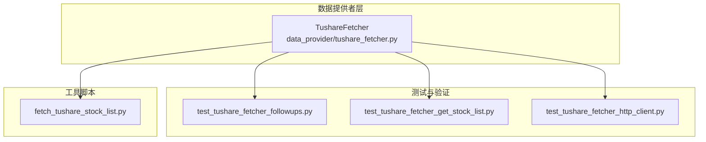
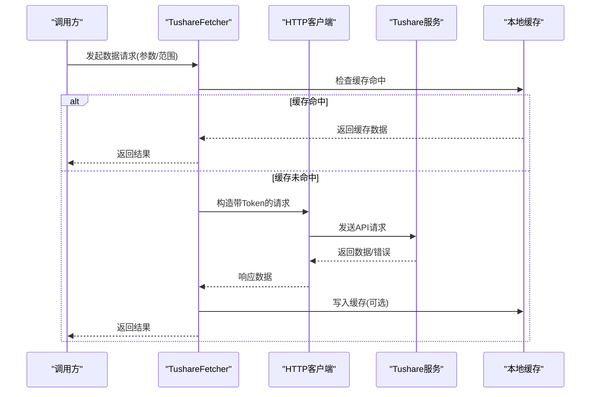
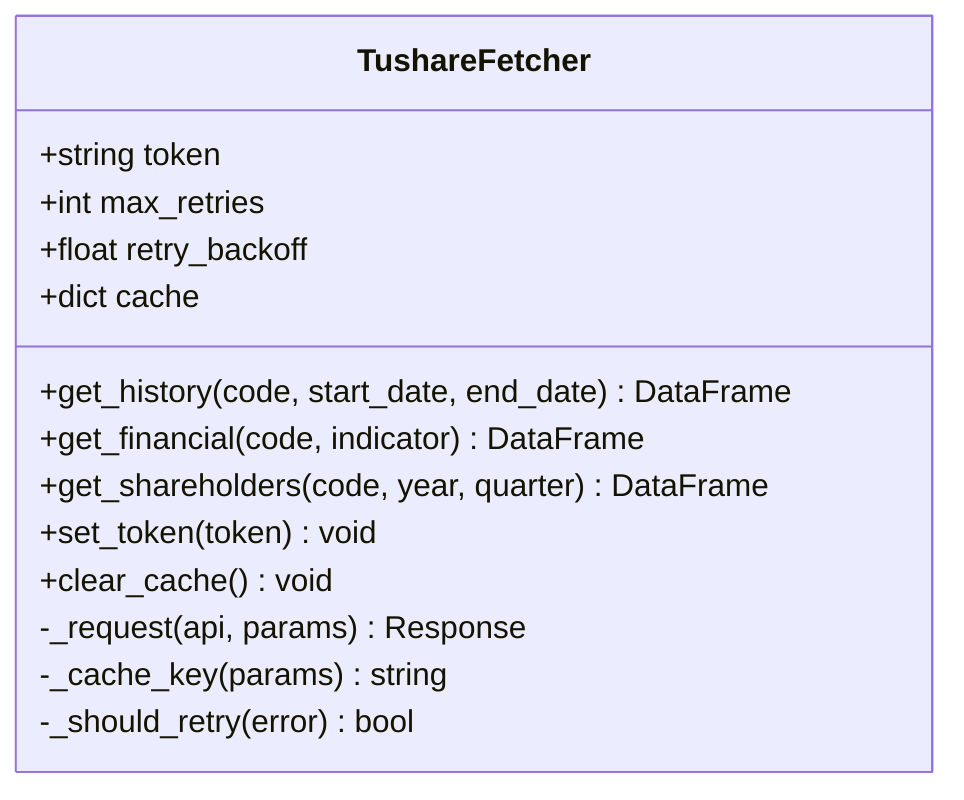
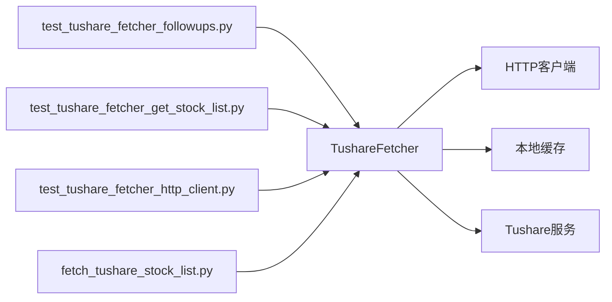

# Tushare数据源

<cite>
**本文引用的文件**   
- [tushare_fetcher.py](file://data_provider/tushare_fetcher.py)
- [test_tushare_fetcher_followups.py](file://tests/test_tushare_fetcher_followups.py)
- [test_tushare_fetcher_get_stock_list.py](file://tests/test_tushare_fetcher_get_stock_list.py)
- [test_tushare_fetcher_http_client.py](file://tests/test_tushare_fetcher_http_client.py)
- [fetch_tushare_stock_list.py](file://scripts/fetch_tushare_stock_list.py)
</cite>

## 目录
1. [简介](#简介)
2. [项目结构](#项目结构)
3. [核心组件](#核心组件)
4. [架构总览](#架构总览)
5. [详细组件分析](#详细组件分析)
6. [依赖关系分析](#依赖关系分析)
7. [性能与优化](#性能与优化)
8. [故障排查指南](#故障排查指南)
9. [结论](#结论)
10. [附录：配置与使用示例](#附录配置与使用示例)

## 简介
本文件面向A股专业数据获取与分析场景，聚焦Tushare数据源的集成与最佳实践。内容涵盖：
- Tushare积分制度、API权限与数据质量说明（基于官方规则）
- Token管理策略与缓存机制
- 历史行情、财务数据、股东信息等高级功能的实现要点
- 批量下载优化与错误处理
- 完整配置指南与使用示例，帮助高效获取并分析A股数据

## 项目结构
Tushare数据源在项目中以独立的数据提供者模块形式存在，并通过测试脚本与工具脚本进行验证与辅助操作。关键位置如下：
- 数据提供者实现：data_provider/tushare_fetcher.py
- 行为与兼容性测试：tests/test_tushare_fetcher_*.py
- 股票列表拉取工具：scripts/fetch_tushare_stock_list.py

图表来源 
- [tushare_fetcher.py](file://data_provider/tushare_fetcher.py)
- [test_tushare_fetcher_followups.py](file://tests/test_tushare_fetcher_followups.py)
- [test_tushare_fetcher_get_stock_list.py](file://tests/test_tushare_fetcher_get_stock_list.py)
- [test_tushare_fetcher_http_client.py](file://tests/test_tushare_fetcher_http_client.py)
- [fetch_tushare_stock_list.py](file://scripts/fetch_tushare_stock_list.py)

章节来源
- [tushare_fetcher.py](file://data_provider/tushare_fetcher.py)
- [test_tushare_fetcher_followups.py](file://tests/test_tushare_fetcher_followups.py)
- [test_tushare_fetcher_get_stock_list.py](file://tests/test_tushare_fetcher_get_stock_list.py)
- [test_tushare_fetcher_http_client.py](file://tests/test_tushare_fetcher_http_client.py)
- [fetch_tushare_stock_list.py](file://scripts/fetch_tushare_stock_list.py)

## 核心组件
- TushareFetcher：封装Tushare API调用、Token管理、请求限流、重试与缓存策略，提供统一的数据访问接口。
- 测试套件：覆盖HTTP客户端行为、股票列表获取、后续请求（follow-ups）等关键路径，保障稳定性与兼容性。
- 工具脚本：用于批量拉取股票列表，便于初始化索引或离线分析。

章节来源
- [tushare_fetcher.py](file://data_provider/tushare_fetcher.py)
- [test_tushare_fetcher_followups.py](file://tests/test_tushare_fetcher_followups.py)
- [test_tushare_fetcher_get_stock_list.py](file://tests/test_tushare_fetcher_get_stock_list.py)
- [test_tushare_fetcher_http_client.py](file://tests/test_tushare_fetcher_http_client.py)
- [fetch_tushare_stock_list.py](file://scripts/fetch_tushare_stock_list.py)

## 架构总览
TushareFetcher作为数据提供者，向上暴露统一的查询方法；内部通过HTTP客户端访问Tushare服务，结合Token鉴权、积分限制与数据缓存，确保高可用与高性能。

图表来源 
- [tushare_fetcher.py](file://data_provider/tushare_fetcher.py)

章节来源
- [tushare_fetcher.py](file://data_provider/tushare_fetcher.py)

## 详细组件分析

### TushareFetcher 类与方法
- 职责
  - 维护并校验Tushare Token
  - 封装常用API调用（历史行情、财务数据、股东信息等）
  - 控制请求频率与重试，避免触发积分限制
  - 管理数据缓存，提升重复查询效率
- 关键设计点
  - Token管理：支持环境变量注入与默认值回退，敏感信息不硬编码
  - 限流与重试：指数退避与最大重试次数，区分网络异常与业务错误
  - 缓存策略：按查询键存储，设置过期时间，减少重复请求
  - 错误处理：统一异常包装，便于上层监控与告警

图表来源 
- [tushare_fetcher.py](file://data_provider/tushare_fetcher.py)

章节来源
- [tushare_fetcher.py](file://data_provider/tushare_fetcher.py)

### 历史行情数据
- 功能要点
  - 支持多周期日线/分钟线数据拉取
  - 自动补齐缺失日期与复权处理（根据需求）
  - 分页与批量合并，降低单次请求压力
- 优化建议
  - 合理划分时间窗口，避免超大范围一次性拉取
  - 利用缓存减少重复拉取
  - 失败重试与断点续传

章节来源
- [tushare_fetcher.py](file://data_provider/tushare_fetcher.py)

### 财务数据
- 功能要点
  - 利润表、资产负债表、现金流量表等指标拉取
  - 指标过滤与字段映射，保证数据结构一致
- 注意事项
  - 财报披露延迟与季度对齐
  - 数据清洗与异常值处理

章节来源
- [tushare_fetcher.py](file://data_provider/tushare_fetcher.py)

### 股东信息
- 功能要点
  - 十大股东、十大流通股东等数据拉取
  - 年度/季度维度聚合与排序
- 注意事项
  - 数据更新频率较低，适合低频更新
  - 字段一致性校验

章节来源
- [tushare_fetcher.py](file://data_provider/tushare_fetcher.py)

### 股票列表与索引
- 功能要点
  - 全量股票列表拉取与本地索引构建
  - 名称与代码映射，便于前端展示与搜索
- 工具脚本
  - scripts/fetch_tushare_stock_list.py 用于批量拉取并持久化

章节来源
- [fetch_tushare_stock_list.py](file://scripts/fetch_tushare_stock_list.py)
- [tushare_fetcher.py](file://data_provider/tushare_fetcher.py)

### 测试与验证
- test_tushare_fetcher_followups.py：验证连续请求的稳定性与限流策略
- test_tushare_fetcher_get_stock_list.py：验证股票列表获取流程
- test_tushare_fetcher_http_client.py：验证HTTP客户端行为与错误处理

章节来源
- [test_tushare_fetcher_followups.py](file://tests/test_tushare_fetcher_followups.py)
- [test_tushare_fetcher_get_stock_list.py](file://tests/test_tushare_fetcher_get_stock_list.py)
- [test_tushare_fetcher_http_client.py](file://tests/test_tushare_fetcher_http_client.py)

## 依赖关系分析
TushareFetcher依赖外部Tushare服务与本地缓存，测试与工具脚本围绕其能力进行验证与扩展。

图表来源 
- [tushare_fetcher.py](file://data_provider/tushare_fetcher.py)
- [test_tushare_fetcher_followups.py](file://tests/test_tushare_fetcher_followups.py)
- [test_tushare_fetcher_get_stock_list.py](file://tests/test_tushare_fetcher_get_stock_list.py)
- [test_tushare_fetcher_http_client.py](file://tests/test_tushare_fetcher_http_client.py)
- [fetch_tushare_stock_list.py](file://scripts/fetch_tushare_stock_list.py)

章节来源
- [tushare_fetcher.py](file://data_provider/tushare_fetcher.py)

## 性能与优化
- 缓存策略
  - 按查询键生成唯一标识，避免冲突
  - 设置合理的过期时间，平衡新鲜度与性能
- 限流与重试
  - 指数退避避免雪崩
  - 区分网络异常与业务错误，精准重试
- 批量下载
  - 分片拉取与并行合并，缩短整体耗时
  - 失败重试与断点续传，提高鲁棒性
- 内存与I/O
  - 大结果集流式处理，避免一次性加载
  - 序列化格式选择（如Parquet）提升读写效率

章节来源
- [tushare_fetcher.py](file://data_provider/tushare_fetcher.py)

## 故障排查指南
- Token无效或过期
  - 检查环境变量与配置文件中的Token是否正确
  - 确认Tushare账户状态与积分是否充足
- 请求被限流或积分不足
  - 降低请求频率，增加退避间隔
  - 拆分任务，错峰执行
- 数据不一致或缺失
  - 核对时间范围与复权方式
  - 检查缓存是否过期或脏数据
- 网络异常
  - 启用重试与超时保护
  - 记录错误日志与堆栈，定位问题

章节来源
- [test_tushare_fetcher_http_client.py](file://tests/test_tushare_fetcher_http_client.py)
- [test_tushare_fetcher_followups.py](file://tests/test_tushare_fetcher_followups.py)

## 结论
TushareFetcher为A股专业数据获取提供了稳定、可扩展的实现，结合Token管理、缓存与限流重试机制，能够有效应对积分限制与网络波动。通过测试与工具脚本的支撑，确保了数据质量与可用性。建议在生产环境中严格遵循Tushare积分规则，并结合缓存与批量化策略提升效率。

## 附录：配置与使用示例
- 环境配置
  - 设置Tushare Token的环境变量
  - 调整缓存过期时间与重试参数
- 基本用法
  - 初始化TushareFetcher并设置Token
  - 调用历史行情、财务数据、股东信息等方法
- 批量下载
  - 使用工具脚本拉取股票列表
  - 分片拉取大区间数据，合并后落盘
- 数据分析
  - 将拉取数据转换为DataFrame进行分析
  - 结合技术指标与基本面数据进行综合评估

章节来源
- [tushare_fetcher.py](file://data_provider/tushare_fetcher.py)
- [fetch_tushare_stock_list.py](file://scripts/fetch_tushare_stock_list.py)