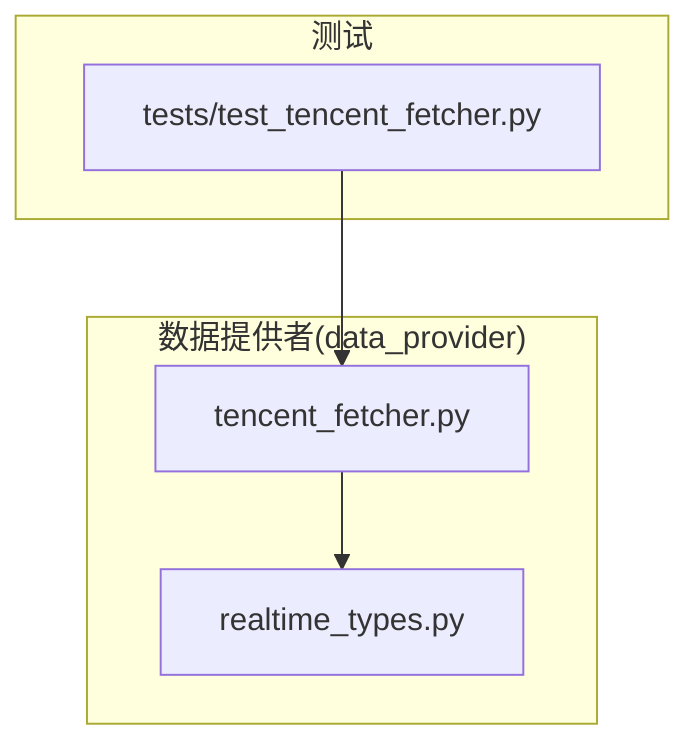
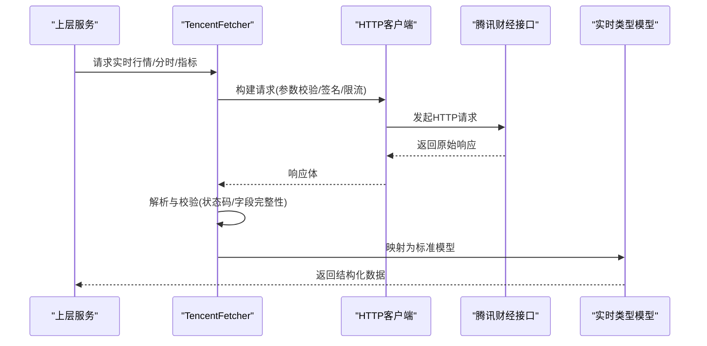
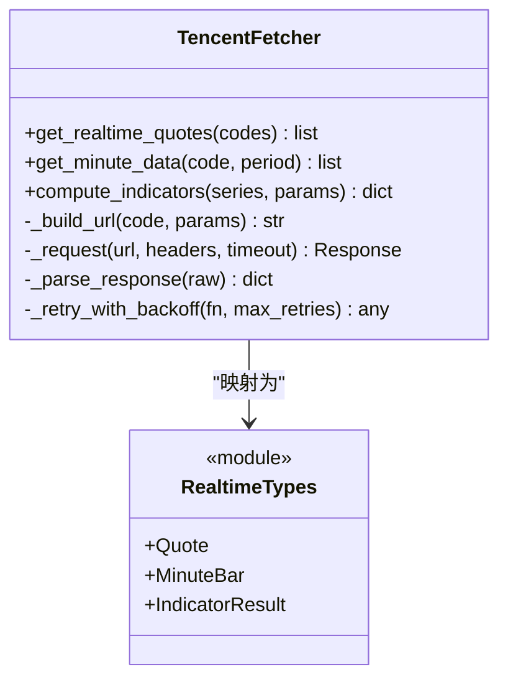
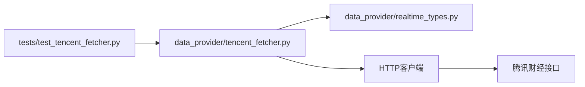

# 腾讯财经数据源

<cite>
**本文引用的文件**   
- [tencent_fetcher.py](file://data_provider/tencent_fetcher.py)
- [realtime_types.py](file://data_provider/realtime_types.py)
- [test_tencent_fetcher.py](file://tests/test_tencent_fetcher.py)
</cite>

## 目录
1. [简介](#简介)
2. [项目结构](#项目结构)
3. [核心组件](#核心组件)
4. [架构总览](#架构总览)
5. [详细组件分析](#详细组件分析)
6. [依赖关系分析](#依赖关系分析)
7. [性能与限制](#性能与限制)
8. [故障排查指南](#故障排查指南)
9. [结论](#结论)
10. [附录：使用案例](#附录使用案例)

## 简介
本文件面向“腾讯财经”数据源的实现与使用，聚焦以下目标：
- 说明腾讯财经接口的特点、数据更新频率与访问限制
- 文档化实时行情、分时数据、技术指标等功能的实现方式
- 明确请求频率控制、数据解析与错误恢复策略
- 提供实际使用案例，展示如何快速获取A股实时行情及相关市场数据

该数据源通过统一的Fetcher接口接入，内部封装对腾讯财经公开接口的HTTP调用、响应解析、字段映射与异常处理，向上层服务暴露稳定、一致的数据模型。

## 项目结构
围绕腾讯财经数据源的关键代码位于 data_provider 模块中，主要包括：
- tencent_fetcher.py：腾讯财经数据获取器，负责HTTP请求、重试、限流、解析与类型转换
- realtime_types.py：实时行情相关的数据模型定义（如股票报价、指数、板块等）
- tests/test_tencent_fetcher.py：针对腾讯财经获取器的测试用例，覆盖正常路径与异常场景

图表来源
- [tencent_fetcher.py](file://data_provider/tencent_fetcher.py)
- [realtime_types.py](file://data_provider/realtime_types.py)
- [test_tencent_fetcher.py](file://tests/test_tencent_fetcher.py)

章节来源
- [tencent_fetcher.py](file://data_provider/tencent_fetcher.py)
- [realtime_types.py](file://data_provider/realtime_types.py)
- [test_tencent_fetcher.py](file://tests/test_tencent_fetcher.py)

## 核心组件
- 腾讯财经获取器（TencentFetcher）
  - 职责：构造并发送HTTP请求、统一错误处理、重试与退避、响应解析、字段标准化、返回强类型对象
  - 关键能力：
    - 实时行情：支持单只或多只股票、指数、ETF等的最新报价
    - 分时数据：按分钟粒度获取历史或当日分时序列
    - 技术指标：基于原始价格序列计算常用指标（如MA、RSI、MACD等），由上层服务组合调用
- 实时数据类型（Realtime Types）
  - 职责：定义统一的报价、时间戳、涨跌幅、成交量等字段结构，屏蔽不同数据源的差异
  - 典型字段：代码、名称、最新价、涨跌额、涨跌幅、成交量、成交额、开盘价、最高价、最低价、昨收价等

章节来源
- [tencent_fetcher.py](file://data_provider/tencent_fetcher.py)
- [realtime_types.py](file://data_provider/realtime_types.py)

## 架构总览
腾讯财经数据源在系统中的位置与交互如下：
- 上层服务（如行情服务、分析服务、告警服务等）通过统一的Fetcher接口调用
- TencentFetcher负责与腾讯财经接口通信，完成数据拉取与解析
- 解析后的数据映射到realtime_types中的标准模型，供上层消费

图表来源
- [tencent_fetcher.py](file://data_provider/tencent_fetcher.py)
- [realtime_types.py](file://data_provider/realtime_types.py)

## 详细组件分析

### 腾讯财经获取器（TencentFetcher）
- 设计要点
  - 请求构造：根据股票代码前缀（沪/深/港/指数等）拼接对应URL与参数
  - 频率控制：内置请求间隔与并发限制，避免触发对方限流
  - 重试与退避：对网络抖动、临时性错误进行指数退避重试
  - 数据解析：对JSON/文本响应进行健壮解析，缺失字段提供默认值或回退逻辑
  - 错误恢复：区分可重试与不可重试错误，记录日志并向上抛出明确异常
- 主要方法（概念性描述）
  - 获取实时行情：输入单只或多只标的，输出标准化报价列表
  - 获取分时数据：输入标的与时间范围，输出分钟级时间序列
  - 计算技术指标：输入价格序列与周期参数，输出指标结果（由上层服务组合）

图表来源
- [tencent_fetcher.py](file://data_provider/tencent_fetcher.py)
- [realtime_types.py](file://data_provider/realtime_types.py)

章节来源
- [tencent_fetcher.py](file://data_provider/tencent_fetcher.py)
- [realtime_types.py](file://data_provider/realtime_types.py)

### 实时数据类型（realtime_types）
- 设计要点
  - 以Pydantic或等价强类型定义字段，确保序列化/反序列化一致性
  - 字段命名统一，便于跨数据源聚合
  - 包含基础校验规则（非空、范围、枚举等）
- 典型模型
  - Quote：最新报价信息
  - MinuteBar：分时K线（时间、开、高、低、收、量）
  - IndicatorResult：技术指标结果（如MA、RSI、MACD等）

章节来源
- [realtime_types.py](file://data_provider/realtime_types.py)

### 测试与验证（test_tencent_fetcher）
- 覆盖范围
  - 正常路径：成功拉取实时行情、分时数据
  - 异常路径：网络超时、HTTP错误、解析失败、字段缺失
  - 边界条件：空输入、非法代码、超长列表分批处理
- 断言要点
  - 返回数据结构符合预期
  - 错误类型与消息清晰可定位
  - 重试与退避行为符合配置

章节来源
- [test_tencent_fetcher.py](file://tests/test_tencent_fetcher.py)

## 依赖关系分析
- 内部依赖
  - TencentFetcher 依赖 realtime_types 提供的数据模型
  - 测试模块依赖 TencentFetcher 的公共方法
- 外部依赖
  - HTTP客户端（如requests/httpx）用于网络请求
  - 腾讯财经公开接口（URL与参数约定）
- 耦合与内聚
  - 获取器与数据模型解耦，便于替换或扩展其他数据源
  - 错误处理与重试逻辑集中在获取器内，提升内聚性

图表来源
- [test_tencent_fetcher.py](file://tests/test_tencent_fetcher.py)
- [tencent_fetcher.py](file://data_provider/tencent_fetcher.py)
- [realtime_types.py](file://data_provider/realtime_types.py)

章节来源
- [test_tencent_fetcher.py](file://tests/test_tencent_fetcher.py)
- [tencent_fetcher.py](file://data_provider/tencent_fetcher.py)
- [realtime_types.py](file://data_provider/realtime_types.py)

## 性能与限制
- 数据更新频率
  - 实时行情：通常秒级更新，受交易所与接口提供方限制
  - 分时数据：分钟级，适合盘中监控与短期策略
  - 技术指标：由价格序列计算，延迟取决于上游数据新鲜度
- 访问限制
  - 腾讯财经接口存在并发与频率限制，需遵循合理请求间隔
  - 建议采用令牌桶或滑动窗口限流，避免突发流量
- 性能优化建议
  - 批量请求：合并多只标的的请求，减少握手开销
  - 缓存热点数据：对不频繁变动的静态数据（如代码映射）做本地缓存
  - 异步IO：在高并发场景下使用异步HTTP客户端提升吞吐
  - 降级策略：当主数据源不可用时，自动切换备用数据源或返回部分字段

[本节为通用指导，不直接分析具体文件]

## 故障排查指南
- 常见问题
  - 请求被限流：检查请求频率与并发设置，增加退避时间
  - 解析失败：核对接口返回结构变化，补充字段容错与默认值
  - 网络超时：调整超时阈值与重试次数，必要时切换网络出口
  - 数据不完整：检查标的代码前缀是否正确，确认是否属于该数据源覆盖范围
- 调试步骤
  - 开启详细日志，记录请求URL、参数、响应体与耗时
  - 使用测试用例复现问题，逐步缩小范围
  - 对比官方接口文档，确认参数与字段含义
- 恢复策略
  - 自动重试与指数退避
  - 熔断与快速失败，避免雪崩
  - 降级到备用数据源或返回缓存数据

章节来源
- [test_tencent_fetcher.py](file://tests/test_tencent_fetcher.py)
- [tencent_fetcher.py](file://data_provider/tencent_fetcher.py)

## 结论
腾讯财经数据源在本项目中通过统一的Fetcher抽象与强类型数据模型，提供了稳定、可扩展的实时行情与分时数据获取能力。其核心优势在于：
- 清晰的职责划分与良好的模块化设计
- 完善的错误处理与重试机制
- 易于扩展与替换的数据源适配层
在实际使用中，建议结合业务场景合理设置请求频率、并发与缓存策略，以获得更好的性能与稳定性。

[本节为总结性内容，不直接分析具体文件]

## 附录：使用案例
以下为快速开始A股实时行情的示例流程（概念性步骤，不包含具体代码）：
- 准备阶段
  - 安装依赖与初始化环境
  - 配置必要的网络代理或环境变量（如需）
- 获取实时行情
  - 构造标的代码列表（如沪深A股代码）
  - 调用获取器方法，传入代码列表
  - 解析返回的结构化数据，提取所需字段（最新价、涨跌幅、成交量等）
- 获取分时数据
  - 指定标的与时间范围（如当日或最近N分钟）
  - 调用分时数据接口，得到分钟级序列
- 计算技术指标
  - 基于分时或日线序列，调用指标计算函数
  - 将结果与行情数据一起展示或用于策略判断
- 错误处理与重试
  - 捕获网络与解析异常，记录日志
  - 根据错误类型决定是否重试或降级

章节来源
- [tencent_fetcher.py](file://data_provider/tencent_fetcher.py)
- [realtime_types.py](file://data_provider/realtime_types.py)
- [test_tencent_fetcher.py](file://tests/test_tencent_fetcher.py)