# 加密货币数据提供商

<cite>
**本文引用的文件**   
- [data_provider/crypto_fetcher.py](file://data_provider/crypto_fetcher.py)
- [data_provider/crypto_derivatives_fetcher.py](file://data_provider/crypto_derivatives_fetcher.py)
- [data_provider/crypto_macro_fetcher.py](file://data_provider/crypto_macro_fetcher.py)
- [data_provider/crypto_ws_quote.py](file://data_provider/crypto_ws_quote.py)
- [data_provider/base.py](file://data_provider/base.py)
- [data_provider/realtime_types.py](file://data_provider/realtime_types.py)
- [src/services/crypto_market_data_service.py](file://src/services/crypto_market_data_service.py)
- [src/storage.py](file://src/storage.py)
- [scripts/backfill_btc_history.py](file://scripts/backfill_btc_history.py)
- [tests/test_crypto_market_data_service.py](file://tests/test_crypto_market_data_service.py)
- [src/crypto_technical.py](file://src/crypto_technical.py)
- [api/v1/endpoints/crypto_trading.py](file://api/v1/endpoints/crypto_trading.py)
- [api/v1/schemas/crypto_trading.py](file://api/v1/schemas/crypto_trading.py)
- [apps/dsa-web/src/api/cryptoTrading.ts](file://apps/dsa-web/src/api/cryptoTrading.ts)
- [apps/dsa-web/src/types/cryptoTrading.ts](file://apps/dsa-web/src/types/cryptoTrading.ts)
- [tests/test_crypto_derivatives_fetcher.py](file://tests/test_crypto_derivatives_fetcher.py)
- [src/analyzer.py](file://src/analyzer.py)
- [src/services/crypto_backtest_service.py](file://src/services/crypto_backtest_service.py)
</cite>

## 更新摘要
**变更内容**   
- 增强了CryptoMarketDataService的本地优先数据访问能力，新增永续合约历史数据回填、覆盖率分析和CSV导出功能
- 改进了数据持久化机制，支持断点续传和增量更新
- 增强了数据完整性验证，包括执行价格和标记价格字段的缺失检测
- 新增了命令行工具用于批量历史数据回填和训练数据导出
- 完善了错误处理和进度回调机制

## 目录
1. [简介](#简介)
2. [项目结构](#项目结构)
3. [核心组件](#核心组件)
4. [架构总览](#架构总览)
5. [详细组件分析](#详细组件分析)
6. [依赖关系分析](#依赖关系分析)
7. [性能考量](#性能考量)
8. [故障排查指南](#故障排查指南)
9. [结论](#结论)
10. [附录](#附录)

## 简介
本文件面向"加密货币数据提供商"子系统，系统性说明现货、衍生品与宏观经济数据的获取实现，以及WebSocket实时行情推送、价格聚合与数据处理逻辑。文档覆盖交易所API集成、订单簿与成交量处理、加密货币技术指标计算与市场分析工具使用指南，帮助开发者快速理解并扩展该模块。

**最新更新**：增强了CryptoMarketDataService的本地优先数据访问能力，新增永续合约历史数据回填、覆盖率分析和CSV导出功能，为模型训练和历史回测提供了更完善的数据基础设施。

## 项目结构
围绕加密货币数据能力，代码主要分布在以下位置：
- data_provider：数据抓取与实时行情（现货、衍生品、宏观、WebSocket）
- src/services：市场数据服务层（本地缓存、数据回填、覆盖率分析）
- src/storage：数据存储层（SQLite ORM、数据模型定义）
- scripts：命令行工具（历史数据回填脚本）
- src/crypto_technical.py：加密货币技术指标计算与分析工具
- api/v1：REST API端点与Pydantic模型定义
- apps/dsa-web：前端API调用与类型定义

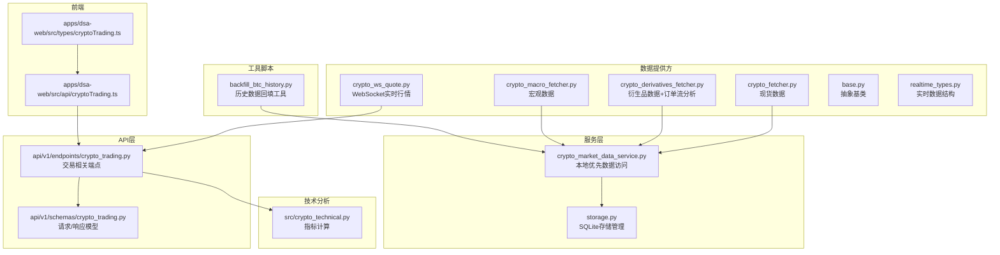

**图表来源**
- [data_provider/crypto_fetcher.py](file://data_provider/crypto_fetcher.py)
- [data_provider/crypto_derivatives_fetcher.py](file://data_provider/crypto_derivatives_fetcher.py)
- [data_provider/crypto_macro_fetcher.py](file://data_provider/crypto_macro_fetcher.py)
- [data_provider/crypto_ws_quote.py](file://data_provider/crypto_ws_quote.py)
- [data_provider/base.py](file://data_provider/base.py)
- [data_provider/realtime_types.py](file://data_provider/realtime_types.py)
- [src/services/crypto_market_data_service.py](file://src/services/crypto_market_data_service.py)
- [src/storage.py](file://src/storage.py)
- [scripts/backfill_btc_history.py](file://scripts/backfill_btc_history.py)
- [src/crypto_technical.py](file://src/crypto_technical.py)
- [api/v1/endpoints/crypto_trading.py](file://api/v1/endpoints/crypto_trading.py)
- [api/v1/schemas/crypto_trading.py](file://api/v1/schemas/crypto_trading.py)
- [apps/dsa-web/src/api/cryptoTrading.ts](file://apps/dsa-web/src/api/cryptoTrading.ts)
- [apps/dsa-web/src/types/cryptoTrading.ts](file://apps/dsa-web/src/types/cryptoTrading.ts)

章节来源
- [data_provider/crypto_fetcher.py](file://data_provider/crypto_fetcher.py)
- [data_provider/crypto_derivatives_fetcher.py](file://data_provider/crypto_derivatives_fetcher.py)
- [data_provider/crypto_macro_fetcher.py](file://data_provider/crypto_macro_fetcher.py)
- [data_provider/crypto_ws_quote.py](file://data_provider/crypto_ws_quote.py)
- [data_provider/base.py](file://data_provider/base.py)
- [data_provider/realtime_types.py](file://data_provider/realtime_types.py)
- [src/services/crypto_market_data_service.py](file://src/services/crypto_market_data_service.py)
- [src/storage.py](file://src/storage.py)
- [scripts/backfill_btc_history.py](file://scripts/backfill_btc_history.py)
- [src/crypto_technical.py](file://src/crypto_technical.py)
- [api/v1/endpoints/crypto_trading.py](file://api/v1/endpoints/crypto_trading.py)
- [api/v1/schemas/crypto_trading.py](file://api/v1/schemas/crypto_trading.py)
- [apps/dsa-web/src/api/cryptoTrading.ts](file://apps/dsa-web/src/api/cryptoTrading.ts)
- [apps/dsa-web/src/types/cryptoTrading.ts](file://apps/dsa-web/src/types/cryptoTrading.ts)

## 核心组件
- 现货数据抓取器：封装主流交易所现货K线、深度、成交等历史与实时数据接口，统一返回格式，支持多源切换与降级。
- 衍生品数据抓取器：提供合约/期权等衍生品市场数据（如资金费率、持仓量、爆仓数据等），适配不同交易所字段映射，**新增订单流分析功能**。
- 宏观经济数据抓取器：拉取影响加密市场的宏观指标（如美元指数、利率决议、通胀数据等），用于策略上下文构建。
- WebSocket实时行情：维护长连接，订阅多频道，进行消息解析、去重、时间戳对齐与价格聚合。
- **本地优先数据服务**：**新增** CryptoMarketDataService，提供本地SQLite缓存优先的数据访问，自动补全缺失数据。
- **历史数据回填工具**：**新增** 支持分块回填永续合约历史数据，支持断点续传和进度回调。
- **数据覆盖率分析**：**新增** 提供历史数据连续性统计和字段完整性检查。
- **CSV导出功能**：**新增** 将缓存的历史数据导出为标准CSV格式，便于机器学习训练。
- 实时数据类型：标准化订单簿、逐笔成交、K线等数据结构，确保跨源一致性。
- 技术分析工具：提供加密货币常用技术指标计算（趋势、动量、波动率、量能等）。

章节来源
- [data_provider/crypto_fetcher.py](file://data_provider/crypto_fetcher.py)
- [data_provider/crypto_derivatives_fetcher.py](file://data_provider/crypto_derivatives_fetcher.py)
- [data_provider/crypto_macro_fetcher.py](file://data_provider/crypto_macro_fetcher.py)
- [data_provider/crypto_ws_quote.py](file://data_provider/crypto_ws_quote.py)
- [src/services/crypto_market_data_service.py](file://src/services/crypto_market_data_service.py)
- [src/storage.py](file://src/storage.py)
- [scripts/backfill_btc_history.py](file://scripts/backfill_btc_history.py)
- [data_provider/realtime_types.py](file://data_provider/realtime_types.py)
- [src/crypto_technical.py](file://src/crypto_technical.py)

## 架构总览
整体数据流从前端或后端服务发起请求，经API路由到对应抓取器或WebSocket处理器，再回传标准化结果；技术分析在需要时介入计算指标。**新增的本地优先数据服务层**通过SQLite缓存减少远程API调用，提高响应速度和系统稳定性。

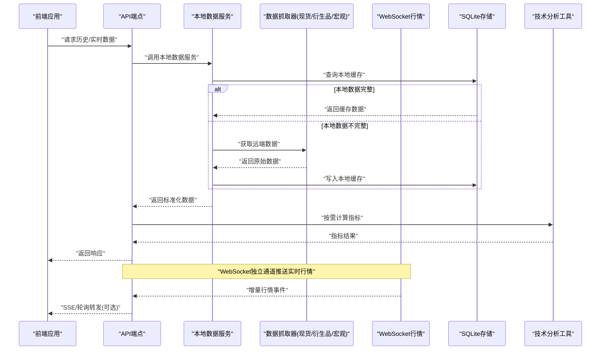

**图表来源**
- [api/v1/endpoints/crypto_trading.py](file://api/v1/endpoints/crypto_trading.py)
- [src/services/crypto_market_data_service.py](file://src/services/crypto_market_data_service.py)
- [src/storage.py](file://src/storage.py)
- [data_provider/crypto_fetcher.py](file://data_provider/crypto_fetcher.py)
- [data_provider/crypto_derivatives_fetcher.py](file://data_provider/crypto_derivatives_fetcher.py)
- [data_provider/crypto_macro_fetcher.py](file://data_provider/crypto_macro_fetcher.py)
- [data_provider/crypto_ws_quote.py](file://data_provider/crypto_ws_quote.py)
- [src/crypto_technical.py](file://src/crypto_technical.py)

## 详细组件分析

### 现货数据抓取器
- 职责：对接多个交易所现货API，统一K线、深度、成交等数据格式；支持分页、限流、重试与错误降级。
- 关键流程：参数校验→选择数据源→并发/串行请求→数据清洗→标准化输出。
- 典型方法：历史K线查询、最新价获取、深度快照、近N笔成交。

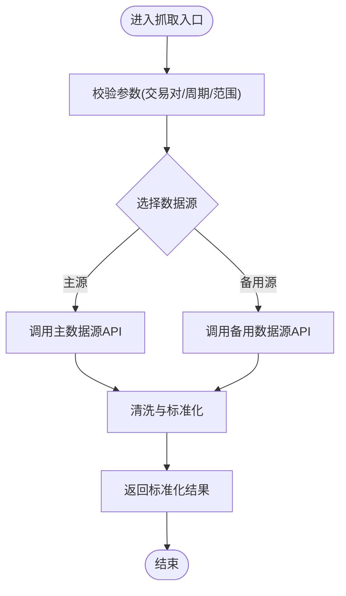

**图表来源**
- [data_provider/crypto_fetcher.py](file://data_provider/crypto_fetcher.py)
- [data_provider/base.py](file://data_provider/base.py)

章节来源
- [data_provider/crypto_fetcher.py](file://data_provider/crypto_fetcher.py)
- [data_provider/base.py](file://data_provider/base.py)

### 衍生品数据抓取器
- 职责：聚合合约/期权的资金费率、持仓量、标记价格、爆仓等数据，适配各交易所差异字段，**新增订单流分析功能**。
- 关键流程：标的映射→多源拉取→字段归一→质量校验→输出。
- 典型方法：资金费率历史、持仓量变化、标记价格、强平事件、**订单流分析**。

**更新**：新增了完整的订单流分析功能，包括实时taker买卖量跟踪、累计成交量差(CVD)计算和价格/CVD背离检测。

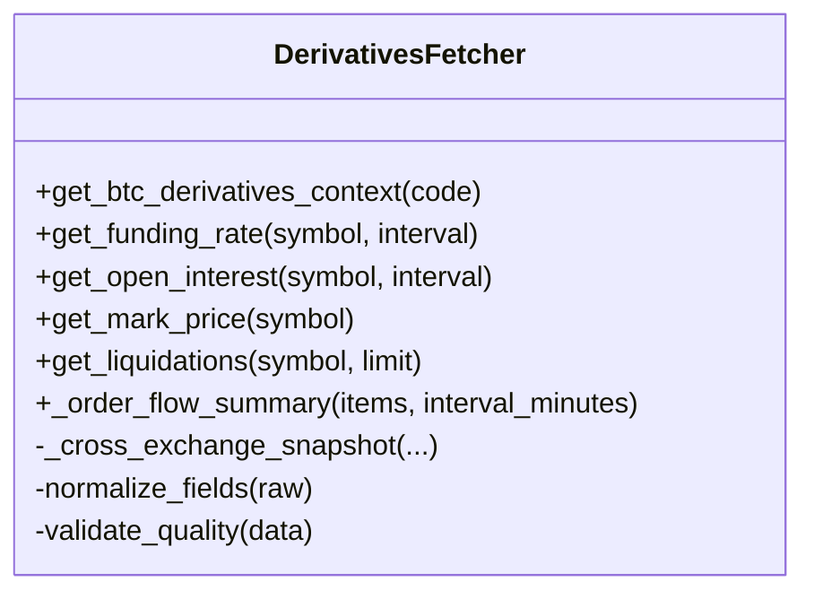

**订单流分析功能详解**：
- **实时taker买卖量跟踪**：从Binance期货K线数据中提取主动买入量(taker_buy_volume)，计算买卖比例
- **CVD计算**：累计成交量差 = 总买入量 - 总卖出量，反映资金流向强度
- **价格/CVD背离检测**：识别价格上涨但CVD下降（看跌背离）或价格下跌但CVD上升（看涨背离）的反转信号
- **数据质量评估**：根据可用数据条数判断数据质量状态（available/partial/unavailable）

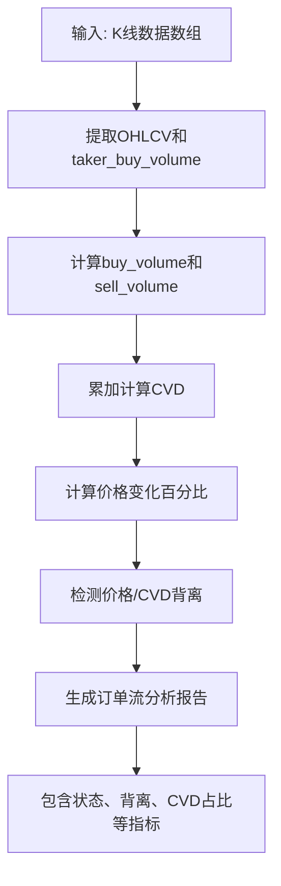

**图表来源**
- [data_provider/crypto_derivatives_fetcher.py:319-406](file://data_provider/crypto_derivatives_fetcher.py#L319-L406)

章节来源
- [data_provider/crypto_derivatives_fetcher.py](file://data_provider/crypto_derivatives_fetcher.py)

### 本地优先数据服务（新增）
- 职责：提供本地SQLite缓存优先的数据访问，自动检测并补全缺失数据，支持历史数据回填和覆盖率分析。
- 关键特性：
  - **智能缓存策略**：优先使用本地数据，仅在缺失时调用远端API
  - **断点续传回填**：支持分块回填历史数据，支持中断后继续执行
  - **数据完整性验证**：检查执行价格和标记价格字段的完整性
  - **进度回调机制**：提供详细的回填进度和状态信息
  - **CSV导出功能**：将缓存数据导出为标准CSV格式

**更新**：新增了三个核心方法：

#### backfill_perpetual_history 方法
- 功能：分块回填永续合约历史K线数据，支持断点续传
- 参数：code、start_at、end_at、period、venue、margin_mode、chunk_days、force、progress_callback
- 特性：自动跳过已存在数据，支持强制重新抓取，提供进度回调

#### get_history_coverage 方法  
- 功能：分析历史数据的覆盖率和完整性
- 返回：expected_bars、actual_bars、missing_bars、execution_missing_bars、mark_missing_bars等统计信息
- 用途：监控数据质量，指导回填任务

#### export_history_csv 方法
- 功能：将缓存的历史数据导出为CSV文件
- 用途：为机器学习模型训练准备标准格式的训练数据

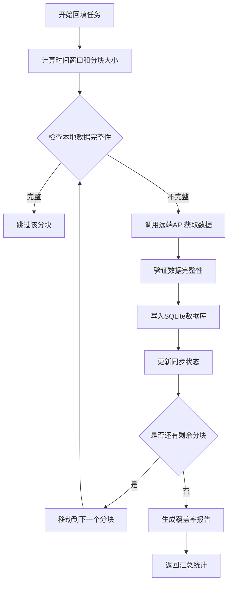

**图表来源**
- [src/services/crypto_market_data_service.py:82-207](file://src/services/crypto_market_data_service.py#L82-L207)

章节来源
- [src/services/crypto_market_data_service.py](file://src/services/crypto_market_data_service.py)

### 数据存储层（增强）
- 职责：管理SQLite数据库连接，定义ORM数据模型，提供数据存取接口，实现智能更新逻辑。
- **更新**：增强了CryptoOhlcvBar数据模型，支持永续合约的执行价格和标记价格字段。
- 关键特性：
  - **唯一约束**：防止重复数据插入
  - **索引优化**：提高查询性能
  - **事务支持**：保证数据一致性
  - **断点续传**：记录同步状态，支持中断恢复

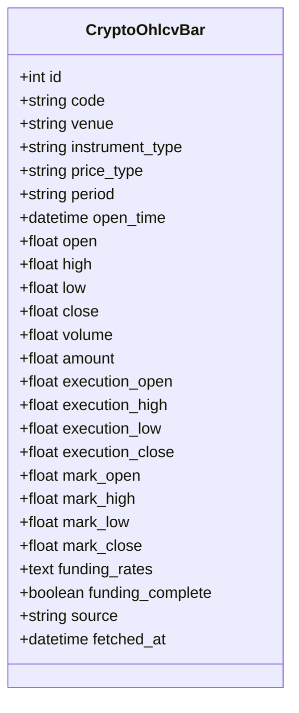

**图表来源**
- [src/storage.py:165-200](file://src/storage.py#L165-L200)

章节来源
- [src/storage.py](file://src/storage.py)

### 历史数据回填工具（新增）
- 职责：提供命令行工具用于批量回填OKX BTC永续合约历史数据。
- 功能特性：
  - **参数化配置**：支持起始时间、结束时间、周期、分块大小等参数
  - **进度显示**：实时显示回填进度和状态
  - **CSV导出**：回填完成后自动导出训练数据
  - **错误处理**：完善的异常捕获和错误提示

**使用方法**：
```bash
python scripts/backfill_btc_history.py \
    --start 2020-02-01T00:00:00Z \
    --end 2024-12-31T23:00:00Z \
    --period hourly \
    --chunk-days 30 \
    --export-csv data/btc_training.csv
```

章节来源
- [scripts/backfill_btc_history.py](file://scripts/backfill_btc_history.py)

### 宏观经济数据抓取器
- 职责：拉取影响加密市场的宏观指标（如美元指数、美债收益率、CPI、非农等），为策略上下文提供外部因子。
- 关键流程：指标定义→数据源选择→时间对齐→缺失值处理→输出。
- 典型方法：指数序列获取、事件日历解析、同比/环比计算。

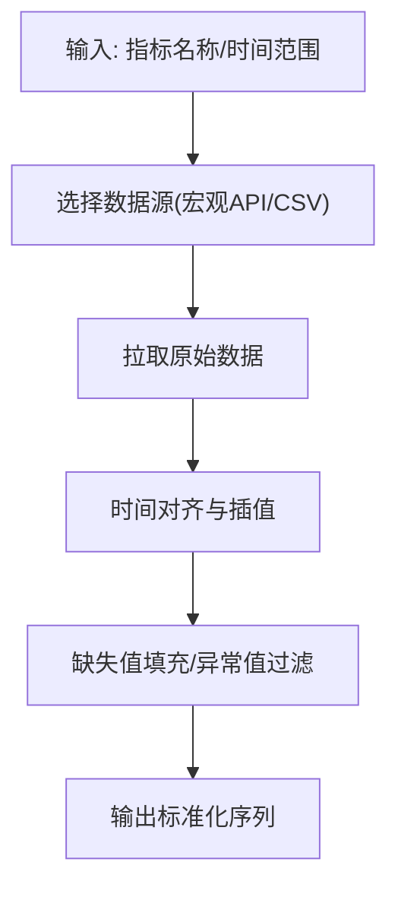

**图表来源**
- [data_provider/crypto_macro_fetcher.py](file://data_provider/crypto_macro_fetcher.py)

章节来源
- [data_provider/crypto_macro_fetcher.py](file://data_provider/crypto_macro_fetcher.py)

### WebSocket实时行情与价格聚合
- 职责：维护交易所WebSocket连接，订阅交易对、订单簿、逐笔成交等频道；对高频数据进行去重、排序、时间戳对齐与聚合（如1s/5s/1m K线）。
- 关键流程：连接建立→鉴权→订阅→消息解析→队列缓冲→聚合计算→事件分发。
- 容错机制：断线重连、心跳检测、消息超时丢弃、降级到HTTP快照。

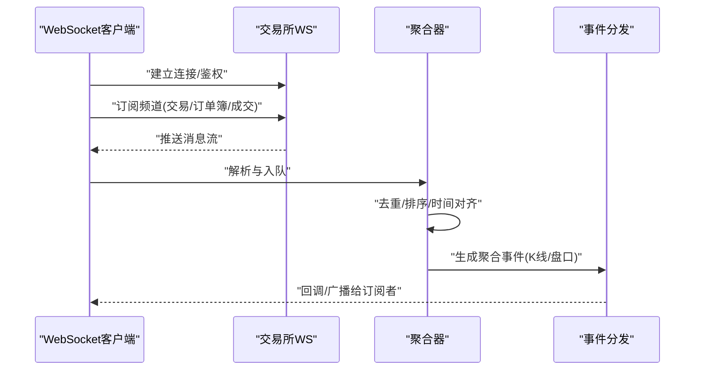

**图表来源**
- [data_provider/crypto_ws_quote.py](file://data_provider/crypto_ws_quote.py)
- [data_provider/realtime_types.py](file://data_provider/realtime_types.py)

章节来源
- [data_provider/crypto_ws_quote.py](file://data_provider/crypto_ws_quote.py)
- [data_provider/realtime_types.py](file://data_provider/realtime_types.py)

### 实时数据类型与标准化
- 目标：统一订单簿、逐笔成交、K线等数据结构，屏蔽交易所差异。
- 关键点：字段命名规范、精度控制、时间戳统一、空值处理。

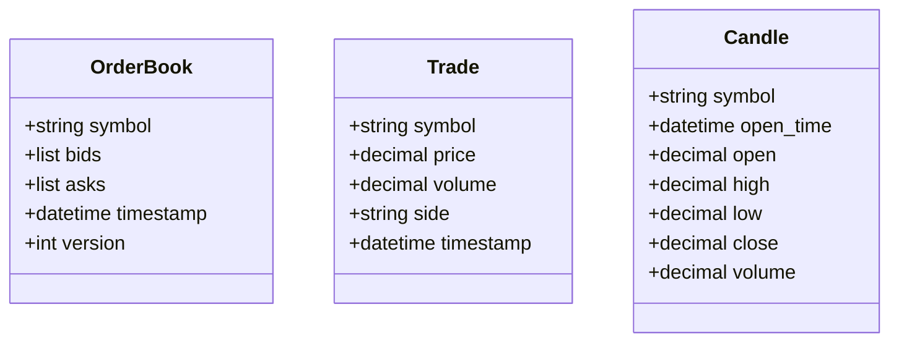

**图表来源**
- [data_provider/realtime_types.py](file://data_provider/realtime_types.py)

章节来源
- [data_provider/realtime_types.py](file://data_provider/realtime_types.py)

### 加密货币技术指标计算
- 功能：提供趋势（MA/EMA）、动量（RSI/MACD）、波动率（ATR/Bollinger Bands）、量能（OBV/Volume Profile）等指标计算。
- 设计：面向DataFrame/Series的向量化计算，支持多周期与滚动窗口，便于回测与实盘。
- 使用：按交易对与时间序列输入，输出指标列或信号。

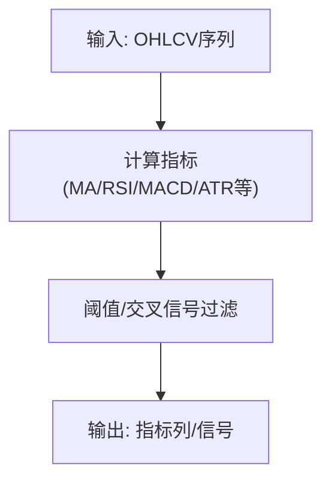

**图表来源**
- [src/crypto_technical.py](file://src/crypto_technical.py)

章节来源
- [src/crypto_technical.py](file://src/crypto_technical.py)

### API端点与前后端交互
- 后端端点：暴露历史数据、实时快照、衍生品指标、宏观数据等接口，统一入参出参校验。
- 前端调用：通过TypeScript API封装，绑定类型定义，保证类型安全与可维护性。

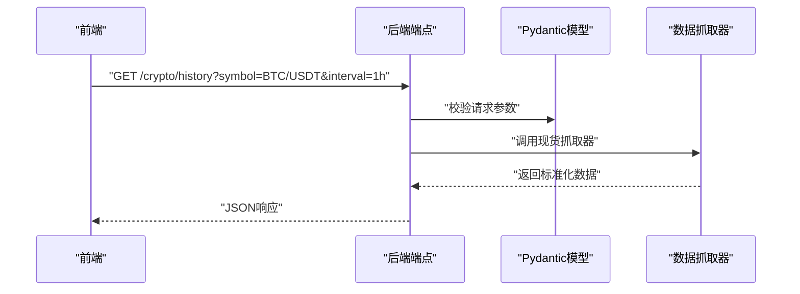

**图表来源**
- [api/v1/endpoints/crypto_trading.py](file://api/v1/endpoints/crypto_trading.py)
- [api/v1/schemas/crypto_trading.py](file://api/v1/schemas/crypto_trading.py)
- [apps/dsa-web/src/api/cryptoTrading.ts](file://apps/dsa-web/src/api/cryptoTrading.ts)
- [apps/dsa-web/src/types/cryptoTrading.ts](file://apps/dsa-web/src/types/cryptoTrading.ts)

章节来源
- [api/v1/endpoints/crypto_trading.py](file://api/v1/endpoints/crypto_trading.py)
- [api/v1/schemas/crypto_trading.py](file://api/v1/schemas/crypto_trading.py)
- [apps/dsa-web/src/api/cryptoTrading.ts](file://apps/dsa-web/src/api/cryptoTrading.ts)
- [apps/dsa-web/src/types/cryptoTrading.ts](file://apps/dsa-web/src/types/cryptoTrading.ts)

### 订单流分析在系统中的使用
**更新**：订单流分析功能已集成到系统的多个关键组件中：

#### 回测服务集成
- 订单流背离作为损失指标维度之一，用于分析亏损交易的订单流特征
- 支持追踪不同的背离类型（看涨背离、看跌背离、同步买卖等）

#### 分析师集成  
- 将订单流数据作为影子因子注入分析提示词
- 约束：仅用于降低置信度、要求更强价格确认或解释假突破风险
- 不得因单个订单流窗口直接反转日线/小时线方向

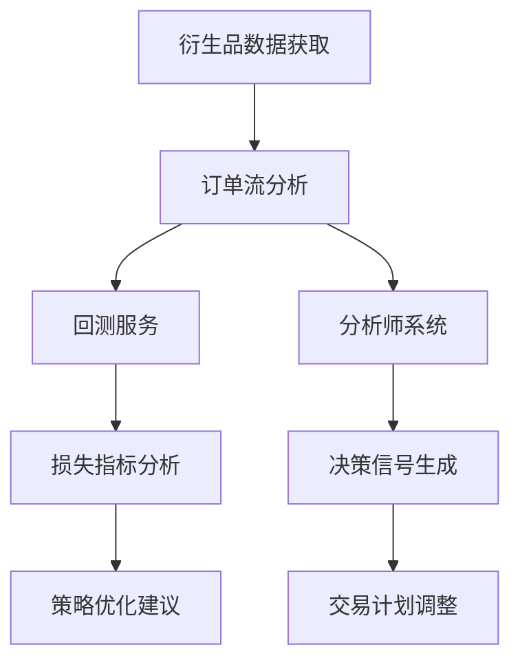

**图表来源**
- [src/services/crypto_backtest_service.py:520-538](file://src/services/crypto_backtest_service.py#L520-L538)
- [src/analyzer.py:4075-4086](file://src/analyzer.py#L4075-L4086)

章节来源
- [src/services/crypto_backtest_service.py](file://src/services/crypto_backtest_service.py)
- [src/analyzer.py](file://src/analyzer.py)

## 依赖关系分析
- 低耦合：各抓取器遵循抽象基类，便于替换与扩展。
- 高内聚：实时类型集中管理，减少重复定义。
- **新增依赖**：本地数据服务依赖于SQLite存储层，提供数据持久化能力。
- 外部依赖：交易所API、宏观数据源、WebSocket服务。
- 潜在风险：第三方限频、网络抖动、字段变更导致解析失败。

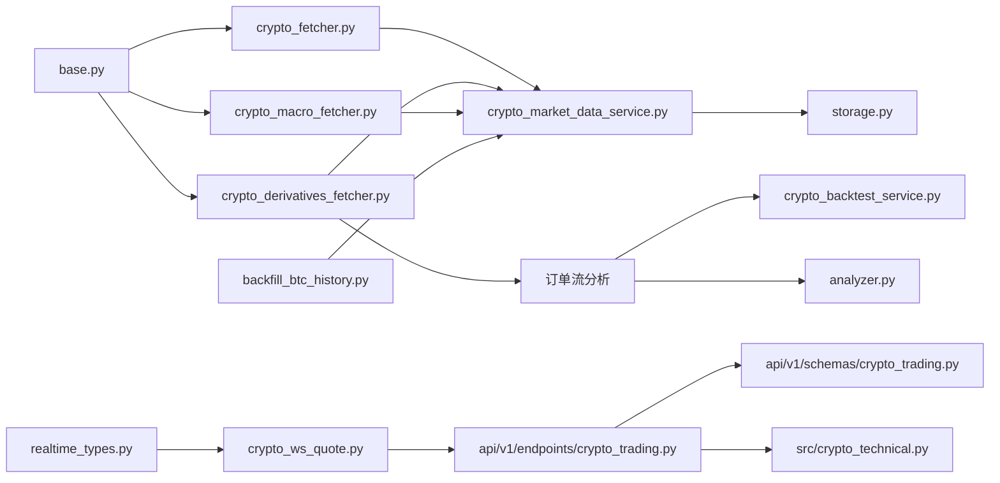

**图表来源**
- [data_provider/base.py](file://data_provider/base.py)
- [data_provider/crypto_fetcher.py](file://data_provider/crypto_fetcher.py)
- [data_provider/crypto_derivatives_fetcher.py](file://data_provider/crypto_derivatives_fetcher.py)
- [data_provider/crypto_macro_fetcher.py](file://data_provider/crypto_macro_fetcher.py)
- [data_provider/crypto_ws_quote.py](file://data_provider/crypto_ws_quote.py)
- [data_provider/realtime_types.py](file://data_provider/realtime_types.py)
- [src/services/crypto_market_data_service.py](file://src/services/crypto_market_data_service.py)
- [src/storage.py](file://src/storage.py)
- [scripts/backfill_btc_history.py](file://scripts/backfill_btc_history.py)
- [api/v1/endpoints/crypto_trading.py](file://api/v1/endpoints/crypto_trading.py)
- [api/v1/schemas/crypto_trading.py](file://api/v1/schemas/crypto_trading.py)
- [src/crypto_technical.py](file://src/crypto_technical.py)
- [src/services/crypto_backtest_service.py](file://src/services/crypto_backtest_service.py)
- [src/analyzer.py](file://src/analyzer.py)

章节来源
- [data_provider/base.py](file://data_provider/base.py)
- [data_provider/crypto_fetcher.py](file://data_provider/crypto_fetcher.py)
- [data_provider/crypto_derivatives_fetcher.py](file://data_provider/crypto_derivatives_fetcher.py)
- [data_provider/crypto_macro_fetcher.py](file://data_provider/crypto_macro_fetcher.py)
- [data_provider/crypto_ws_quote.py](file://data_provider/crypto_ws_quote.py)
- [data_provider/realtime_types.py](file://data_provider/realtime_types.py)
- [src/services/crypto_market_data_service.py](file://src/services/crypto_market_data_service.py)
- [src/storage.py](file://src/storage.py)
- [scripts/backfill_btc_history.py](file://scripts/backfill_btc_history.py)
- [api/v1/endpoints/crypto_trading.py](file://api/v1/endpoints/crypto_trading.py)
- [api/v1/schemas/crypto_trading.py](file://api/v1/schemas/crypto_trading.py)
- [src/crypto_technical.py](file://src/crypto_technical.py)
- [src/services/crypto_backtest_service.py](file://src/services/crypto_backtest_service.py)
- [src/analyzer.py](file://src/analyzer.py)

## 性能考量
- 并发与限流：批量请求采用并发控制与令牌桶限流，避免触发交易所限制。
- 内存与缓存：订单簿与K线数据采用环形缓冲与LRU缓存，降低内存占用。
- 时间对齐：统一毫秒级时间戳，减少聚合时的排序开销。
- 降级策略：WebSocket不可用时自动切换到HTTP快照，保障可用性。
- 指标计算：优先向量化计算，避免Python循环瓶颈。
- **本地缓存优化**：**新增** SQLite缓存减少远程API调用，提高响应速度。
- **分块处理优化**：**新增** 历史数据回填采用分块处理，避免单次请求过大。
- **断点续传优化**：**新增** 支持中断恢复，避免重复下载已完成的数据。
- **订单流分析优化**：使用滑动窗口计算CVD，避免全量数据重新计算。

[本节为通用指导，不直接分析具体文件]

## 故障排查指南
- 连接问题：检查WebSocket握手、鉴权参数、订阅频道权限；查看心跳与重连日志。
- 数据异常：核对字段映射、精度与单位；对缺失值与异常值进行告警与回填。
- 限频与封禁：调整请求间隔与并发度；启用备用数据源。
- 指标偏差：确认输入序列完整性、时间戳顺序与复权方式；对比基准库验证。
- **本地缓存问题**：**新增** 检查SQLite数据库连接、表结构完整性、索引状态。
- **回填任务失败**：**新增** 检查网络连接、API配额、数据完整性验证结果。
- **CSV导出失败**：**新增** 检查磁盘空间、文件权限、路径有效性。
- **订单流数据问题**：检查taker_buy_volume字段有效性，确认K线数据完整性，验证CVD计算逻辑。

章节来源
- [data_provider/crypto_ws_quote.py](file://data_provider/crypto_ws_quote.py)
- [data_provider/crypto_fetcher.py](file://data_provider/crypto_fetcher.py)
- [data_provider/crypto_derivatives_fetcher.py](file://data_provider/crypto_derivatives_fetcher.py)
- [data_provider/crypto_macro_fetcher.py](file://data_provider/crypto_macro_fetcher.py)
- [src/services/crypto_market_data_service.py](file://src/services/crypto_market_data_service.py)
- [src/storage.py](file://src/storage.py)
- [scripts/backfill_btc_history.py](file://scripts/backfill_btc_history.py)

## 结论
本数据提供商以模块化设计整合现货、衍生品与宏观数据，并通过WebSocket实现低延迟实时行情推送与聚合。**最新的本地优先数据服务增强了系统的数据管理能力，提供了永续合约历史数据回填、覆盖率分析和CSV导出功能，为模型训练和历史回测提供了完善的基础设施。**配合标准化的数据类型、订单流分析和技术指标工具，可为策略研发与实盘交易提供稳定可靠的数据基础。建议在生产环境完善监控、告警与降级策略，持续优化性能与稳定性。

[本节为总结性内容，不直接分析具体文件]

## 附录
- 使用示例（路径参考）
  - 现货历史K线：[data_provider/crypto_fetcher.py](file://data_provider/crypto_fetcher.py)
  - 衍生品资金费率：[data_provider/crypto_derivatives_fetcher.py](file://data_provider/crypto_derivatives_fetcher.py)
  - 宏观指标序列：[data_provider/crypto_macro_fetcher.py](file://data_provider/crypto_macro_fetcher.py)
  - WebSocket订阅与聚合：[data_provider/crypto_ws_quote.py](file://data_provider/crypto_ws_quote.py)
  - **本地优先数据服务**：[src/services/crypto_market_data_service.py](file://src/services/crypto_market_data_service.py)
  - **历史数据回填工具**：[scripts/backfill_btc_history.py](file://scripts/backfill_btc_history.py)
  - **数据存储层**：[src/storage.py](file://src/storage.py)
  - 技术指标计算：[src/crypto_technical.py](file://src/crypto_technical.py)
  - API端点调用：[api/v1/endpoints/crypto_trading.py](file://api/v1/endpoints/crypto_trading.py)
  - 前端API封装：[apps/dsa-web/src/api/cryptoTrading.ts](file://apps/dsa-web/src/api/cryptoTrading.ts)
  - **本地数据服务测试**：[tests/test_crypto_market_data_service.py](file://tests/test_crypto_market_data_service.py)
  - **订单流分析测试**：[tests/test_crypto_derivatives_fetcher.py](file://tests/test_crypto_derivatives_fetcher.py)
  - **订单流分析在回测中的应用**：[src/services/crypto_backtest_service.py](file://src/services/crypto_backtest_service.py)
  - **订单流分析在分析师中的使用**：[src/analyzer.py](file://src/analyzer.py)

[本节为参考信息，不直接分析具体文件]