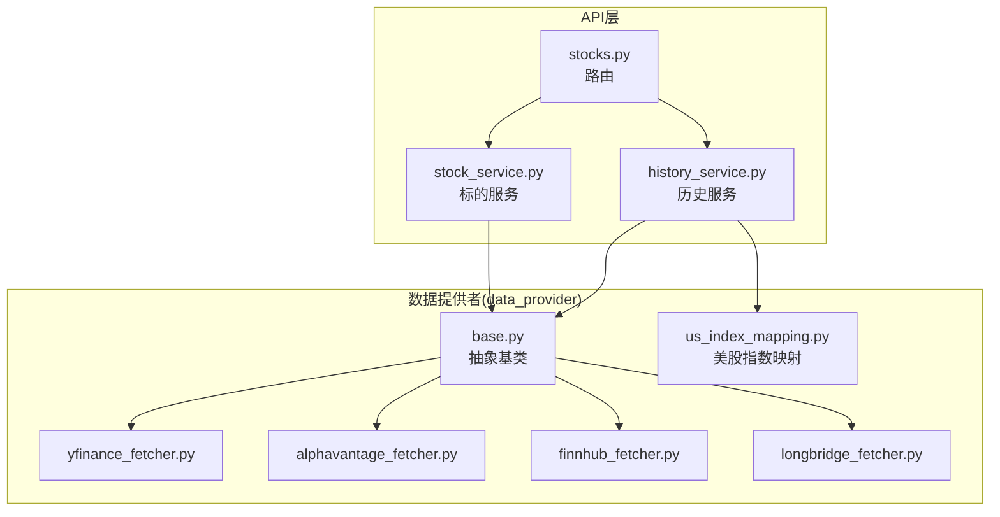
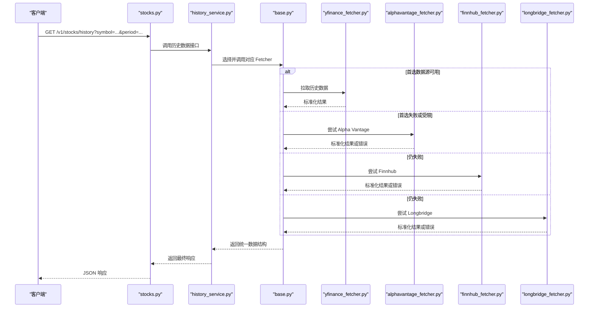
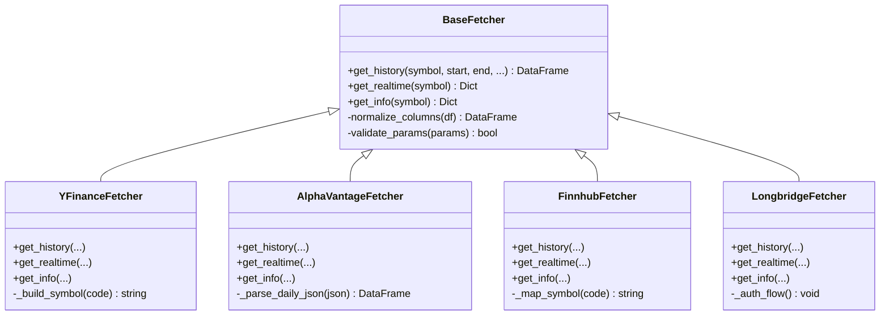
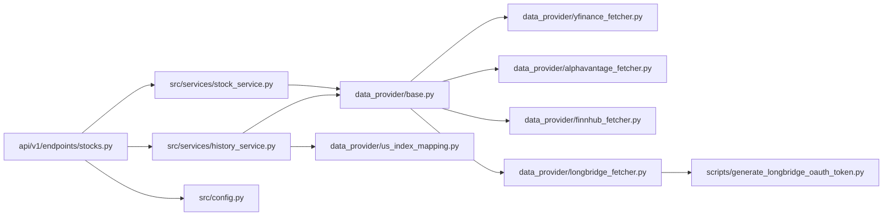

# 国际股票数据提供商

<cite>
**本文引用的文件**   
- [data_provider/base.py](file://data_provider/base.py)
- [data_provider/yfinance_fetcher.py](file://data_provider/yfinance_fetcher.py)
- [data_provider/alphavantage_fetcher.py](file://data_provider/alphavantage_fetcher.py)
- [data_provider/finnhub_fetcher.py](file://data_provider/finnhub_fetcher.py)
- [data_provider/longbridge_fetcher.py](file://data_provider/longbridge_fetcher.py)
- [data_provider/us_index_mapping.py](file://data_provider/us_index_mapping.py)
- [src/services/history_service.py](file://src/services/history_service.py)
- [src/services/stock_service.py](file://src/services/stock_service.py)
- [api/v1/endpoints/stocks.py](file://api/v1/endpoints/stocks.py)
- [api/v1/schemas/stocks.py](file://api/v1/schemas/stocks.py)
- [src/config.py](file://src/config.py)
- [scripts/generate_longbridge_oauth_token.py](file://scripts/generate_longbridge_oauth_token.py)
</cite>

## 目录
1. [简介](#简介)
2. [项目结构](#项目结构)
3. [核心组件](#核心组件)
4. [架构总览](#架构总览)
5. [详细组件分析](#详细组件分析)
6. [依赖关系分析](#依赖关系分析)
7. [性能与限流](#性能与限流)
8. [故障排查指南](#故障排查指南)
9. [结论](#结论)
10. [附录](#附录)

## 简介
本文件面向“国际股票数据提供商”的接入与使用，覆盖 Yahoo Finance、Alpha Vantage、Finnhub、Longbridge 等数据源。文档说明：
- 各数据源的接入方式与配置参数
- 美股、港股、指数等市场数据的获取方法
- API 密钥配置、请求频率限制与数据格式转换
- 网络异常处理与降级策略

## 项目结构
本项目将多数据源统一抽象为 Fetcher 接口，并通过服务层进行编排与缓存，API 层对外暴露统一接口。关键目录与职责：
- data_provider：各数据源 Fetcher 实现与基础抽象
- src/services：历史行情、标的服务等业务编排
- api/v1：REST API 路由、Schema 定义
- scripts：辅助脚本（如 Longbridge OAuth Token 生成）

**图表来源**
- [api/v1/endpoints/stocks.py](file://api/v1/endpoints/stocks.py)
- [src/services/history_service.py](file://src/services/history_service.py)
- [src/services/stock_service.py](file://src/services/stock_service.py)
- [data_provider/base.py](file://data_provider/base.py)
- [data_provider/yfinance_fetcher.py](file://data_provider/yfinance_fetcher.py)
- [data_provider/alphavantage_fetcher.py](file://data_provider/alphavantage_fetcher.py)
- [data_provider/finnhub_fetcher.py](file://data_provider/finnhub_fetcher.py)
- [data_provider/longbridge_fetcher.py](file://data_provider/longbridge_fetcher.py)
- [data_provider/us_index_mapping.py](file://data_provider/us_index_mapping.py)

**章节来源**
- [data_provider/base.py](file://data_provider/base.py)
- [src/services/history_service.py](file://src/services/history_service.py)
- [src/services/stock_service.py](file://src/services/stock_service.py)
- [api/v1/endpoints/stocks.py](file://api/v1/endpoints/stocks.py)

## 核心组件
- 抽象基类 base.py：定义统一的 fetcher 接口（如 get_history、get_realtime、get_info），屏蔽不同数据源差异
- 具体 Fetcher：
  - yfinance_fetcher.py：Yahoo Finance 数据源
  - alphavantage_fetcher.py：Alpha Vantage 数据源
  - finnhub_fetcher.py：Finnhub 数据源
  - longbridge_fetcher.py：Longbridge 数据源
- 美股指数映射 us_index_mapping.py：美股指数代码到内部标识的映射
- 服务层：
  - history_service.py：历史数据聚合、缓存、重试与降级
  - stock_service.py：标的信息、搜索与标准化
- API 层：
  - stocks.py：对外 REST 接口
  - schemas/stocks.py：请求/响应模型

**章节来源**
- [data_provider/base.py](file://data_provider/base.py)
- [data_provider/yfinance_fetcher.py](file://data_provider/yfinance_fetcher.py)
- [data_provider/alphavantage_fetcher.py](file://data_provider/alphavantage_fetcher.py)
- [data_provider/finnhub_fetcher.py](file://data_provider/finnhub_fetcher.py)
- [data_provider/longbridge_fetcher.py](file://data_provider/longbridge_fetcher.py)
- [data_provider/us_index_mapping.py](file://data_provider/us_index_mapping.py)
- [src/services/history_service.py](file://src/services/history_service.py)
- [src/services/stock_service.py](file://src/services/stock_service.py)
- [api/v1/endpoints/stocks.py](file://api/v1/endpoints/stocks.py)
- [api/v1/schemas/stocks.py](file://api/v1/schemas/stocks.py)

## 架构总览
整体采用“抽象接口 + 多实现 + 服务编排 + API 暴露”的分层架构。Fetcher 负责与外部数据源通信，服务层负责数据标准化、缓存、重试与降级，API 层提供统一 HTTP 接口。

**图表来源**
- [api/v1/endpoints/stocks.py](file://api/v1/endpoints/stocks.py)
- [src/services/history_service.py](file://src/services/history_service.py)
- [data_provider/base.py](file://data_provider/base.py)
- [data_provider/yfinance_fetcher.py](file://data_provider/yfinance_fetcher.py)
- [data_provider/alphavantage_fetcher.py](file://data_provider/alphavantage_fetcher.py)
- [data_provider/finnhub_fetcher.py](file://data_provider/finnhub_fetcher.py)
- [data_provider/longbridge_fetcher.py](file://data_provider/longbridge_fetcher.py)

## 详细组件分析

### 抽象基类与数据源适配
- base.py 定义了统一的 Fetcher 抽象，包括：
  - 历史数据获取接口
  - 实时报价接口
  - 标的信息接口
  - 标准化输出字段与类型约定
- 各具体 Fetcher 需实现上述接口，并在内部完成：
  - 认证与鉴权（API Key、OAuth、会话）
  - 请求构造与参数映射（交易代码、时间范围、复权方式）
  - 响应解析与字段标准化（日期、开盘、收盘、最高、最低、成交量）
  - 限流与重试（退避策略、错误码处理）

**图表来源**
- [data_provider/base.py](file://data_provider/base.py)
- [data_provider/yfinance_fetcher.py](file://data_provider/yfinance_fetcher.py)
- [data_provider/alphavantage_fetcher.py](file://data_provider/alphavantage_fetcher.py)
- [data_provider/finnhub_fetcher.py](file://data_provider/finnhub_fetcher.py)
- [data_provider/longbridge_fetcher.py](file://data_provider/longbridge_fetcher.py)

**章节来源**
- [data_provider/base.py](file://data_provider/base.py)
- [data_provider/yfinance_fetcher.py](file://data_provider/yfinance_fetcher.py)
- [data_provider/alphavantage_fetcher.py](file://data_provider/alphavantage_fetcher.py)
- [data_provider/finnhub_fetcher.py](file://data_provider/finnhub_fetcher.py)
- [data_provider/longbridge_fetcher.py](file://data_provider/longbridge_fetcher.py)

### Yahoo Finance 数据源
- 接入要点：
  - 无需 API Key，适合免费场景
  - 支持美股、港股、部分指数
  - 注意反爬与速率限制，建议加缓存与重试
- 数据格式：
  - 返回标准 OHLCV 字段，日期与时区需统一
- 适用场景：
  - 历史日线、周线、月线
  - 实时报价（受限于平台稳定性）

**章节来源**
- [data_provider/yfinance_fetcher.py](file://data_provider/yfinance_fetcher.py)

### Alpha Vantage 数据源
- 接入要点：
  - 需要 API Key，通过环境变量或配置文件注入
  - 免费额度有限，需控制请求频率
- 数据格式：
  - JSON 响应，需转换为统一 DataFrame
- 适用场景：
  - 美股日线、分钟线（取决于订阅）
  - 技术指标与基本面数据（视订阅）

**章节来源**
- [data_provider/alphavantage_fetcher.py](file://data_provider/alphavantage_fetcher.py)

### Finnhub 数据源
- 接入要点：
  - 需要 API Key，支持美股、港股、加密货币等
  - 实时与历史数据分离，注意端点权限
- 数据格式：
  - 结构化 JSON，需映射为标准字段
- 适用场景：
  - 美股实时与历史
  - 新闻与事件（可选）

**章节来源**
- [data_provider/finnhub_fetcher.py](file://data_provider/finnhub_fetcher.py)

### Longbridge 数据源
- 接入要点：
  - 需要 App Key、App Secret、Device ID 等
  - 支持 OAuth 流程生成访问令牌
  - 适用于港股、美股、期货等
- 数据格式：
  - 标准化 OHLCV、买卖盘口、成交明细等
- 适用场景：
  - 港股与美股的高质量实时与历史数据
  - 机构级数据需求

**章节来源**
- [data_provider/longbridge_fetcher.py](file://data_provider/longbridge_fetcher.py)
- [scripts/generate_longbridge_oauth_token.py](file://scripts/generate_longbridge_oauth_token.py)

### 美股指数映射
- us_index_mapping.py 提供美股指数代码到内部标识的映射，便于统一查询与展示
- 常见指数：标普500、纳斯达克100、道琼斯工业平均指数等

**章节来源**
- [data_provider/us_index_mapping.py](file://data_provider/us_index_mapping.py)

### 服务层：历史数据与标的服务
- history_service.py：
  - 聚合多个 Fetcher，按优先级尝试
  - 内置缓存、重试与降级逻辑
  - 统一返回格式，便于上层消费
- stock_service.py：
  - 标的信息查询、搜索与标准化
  - 支持多市场代码映射与别名

**章节来源**
- [src/services/history_service.py](file://src/services/history_service.py)
- [src/services/stock_service.py](file://src/services/stock_service.py)

### API 层：统一接口
- stocks.py：
  - 暴露历史数据、实时报价、标的信息等 REST 接口
  - 参数校验、分页、排序等
- schemas/stocks.py：
  - 定义请求与响应的 Pydantic 模型，确保契约稳定

**章节来源**
- [api/v1/endpoints/stocks.py](file://api/v1/endpoints/stocks.py)
- [api/v1/schemas/stocks.py](file://api/v1/schemas/stocks.py)

## 依赖关系分析
- 抽象与实现：
  - base.py 作为抽象基类，被各 Fetcher 继承
- 服务与数据源：
  - history_service.py 依赖 base.py 与各 Fetcher
  - stock_service.py 依赖 base.py 与映射表
- API 与服务：
  - stocks.py 调用 history_service.py 与 stock_service.py
- 配置与环境：
  - config.py 管理环境变量与默认值
  - Longbridge OAuth 脚本用于生成令牌

**图表来源**
- [api/v1/endpoints/stocks.py](file://api/v1/endpoints/stocks.py)
- [src/services/history_service.py](file://src/services/history_service.py)
- [src/services/stock_service.py](file://src/services/stock_service.py)
- [data_provider/base.py](file://data_provider/base.py)
- [data_provider/yfinance_fetcher.py](file://data_provider/yfinance_fetcher.py)
- [data_provider/alphavantage_fetcher.py](file://data_provider/alphavantage_fetcher.py)
- [data_provider/finnhub_fetcher.py](file://data_provider/finnhub_fetcher.py)
- [data_provider/longbridge_fetcher.py](file://data_provider/longbridge_fetcher.py)
- [data_provider/us_index_mapping.py](file://data_provider/us_index_mapping.py)
- [src/config.py](file://src/config.py)
- [scripts/generate_longbridge_oauth_token.py](file://scripts/generate_longbridge_oauth_token.py)

**章节来源**
- [api/v1/endpoints/stocks.py](file://api/v1/endpoints/stocks.py)
- [src/services/history_service.py](file://src/services/history_service.py)
- [src/services/stock_service.py](file://src/services/stock_service.py)
- [data_provider/base.py](file://data_provider/base.py)
- [data_provider/us_index_mapping.py](file://data_provider/us_index_mapping.py)
- [src/config.py](file://src/config.py)
- [scripts/generate_longbridge_oauth_token.py](file://scripts/generate_longbridge_oauth_token.py)

## 性能与限流
- 请求频率限制：
  - Alpha Vantage 与 Finnhub 有明确的免费额度与速率限制，需在 Fetcher 中实现退避与队列控制
  - Yahoo Finance 无官方配额但存在反爬风险，建议增加随机延迟与并发控制
  - Longbridge 根据订阅等级限制，需遵循其 SDK 的限流策略
- 缓存策略：
  - 在 history_service.py 中实现内存/磁盘缓存，减少重复请求
  - 对实时报价设置较短过期时间，对历史数据设置较长过期时间
- 重试与降级：
  - 网络异常（超时、连接失败）自动重试，指数退避
  - 数据源不可用时自动切换到备用数据源
  - 返回部分数据时标注数据来源与置信度

[本节为通用指导，不直接分析具体文件]

## 故障排查指南
- 常见问题定位：
  - API Key 无效或过期：检查环境变量与配置文件
  - 请求频率超限：查看日志中的 429 错误，调整间隔与重试策略
  - 数据缺失或字段不一致：核对标准化逻辑与字段映射
  - Longbridge 登录失败：确认 App Key、Secret、Device ID 与 OAuth 流程
- 调试建议：
  - 启用详细日志，记录请求 URL、参数与响应体
  - 使用独立脚本验证各数据源连通性
  - 逐步切换数据源以定位问题

**章节来源**
- [src/config.py](file://src/config.py)
- [scripts/generate_longbridge_oauth_token.py](file://scripts/generate_longbridge_oauth_token.py)

## 结论
通过抽象基类与多数据源实现，系统实现了统一的数据接入与标准化。服务层提供了缓存、重试与降级能力，API 层对外暴露稳定接口。针对不同数据源的配额与限制，建议在部署时合理配置并发、缓存与监控，以确保高可用与低延迟。

[本节为总结，不直接分析具体文件]

## 附录
- 配置示例与环境变量：
  - Alpha Vantage：ALPHAVANTAGE_API_KEY
  - Finnhub：FINNHUB_API_KEY
  - Longbridge：LONGBRIDGE_APP_KEY、LONGBRIDGE_APP_SECRET、LONGBRIDGE_DEVICE_ID
- 常用市场代码：
  - 美股：AAPL、MSFT、TSLA
  - 港股：0700.HK、9988.HK
  - 指数：SPX、NDX、DJI（通过 us_index_mapping.py 映射）

[本节为补充信息，不直接分析具体文件]