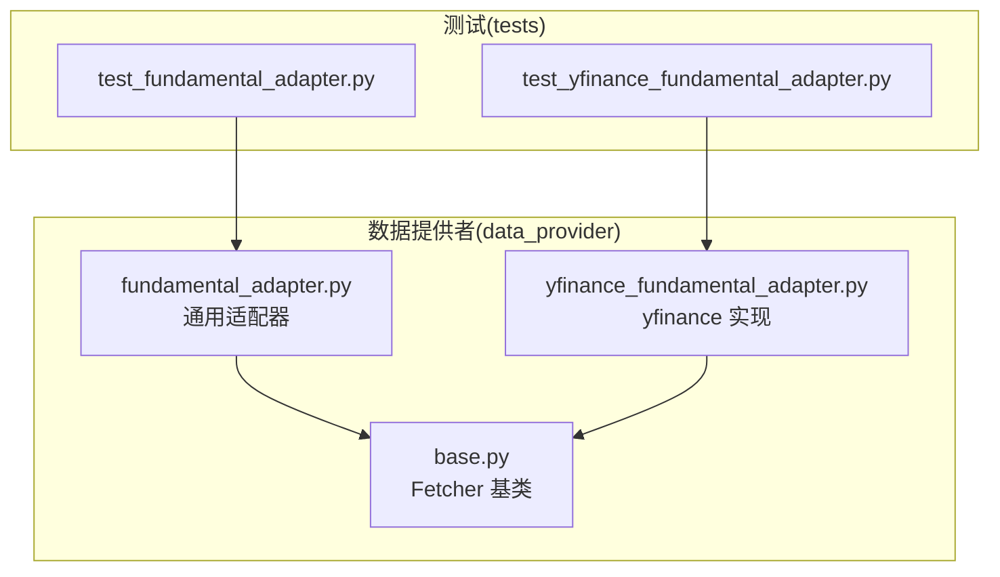
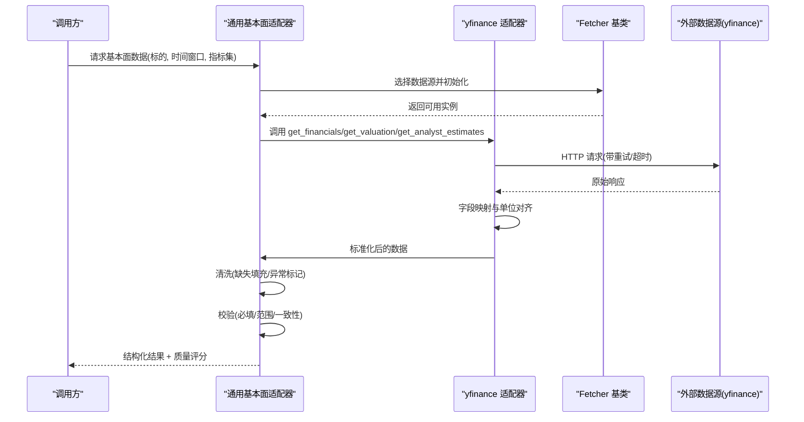
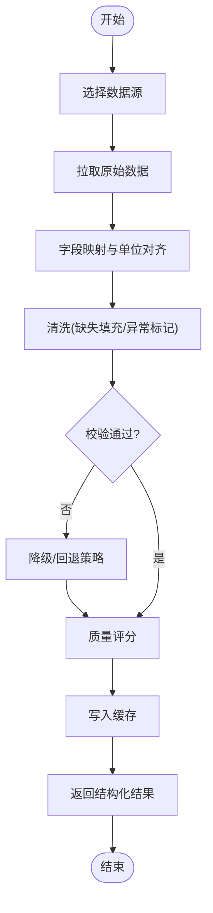
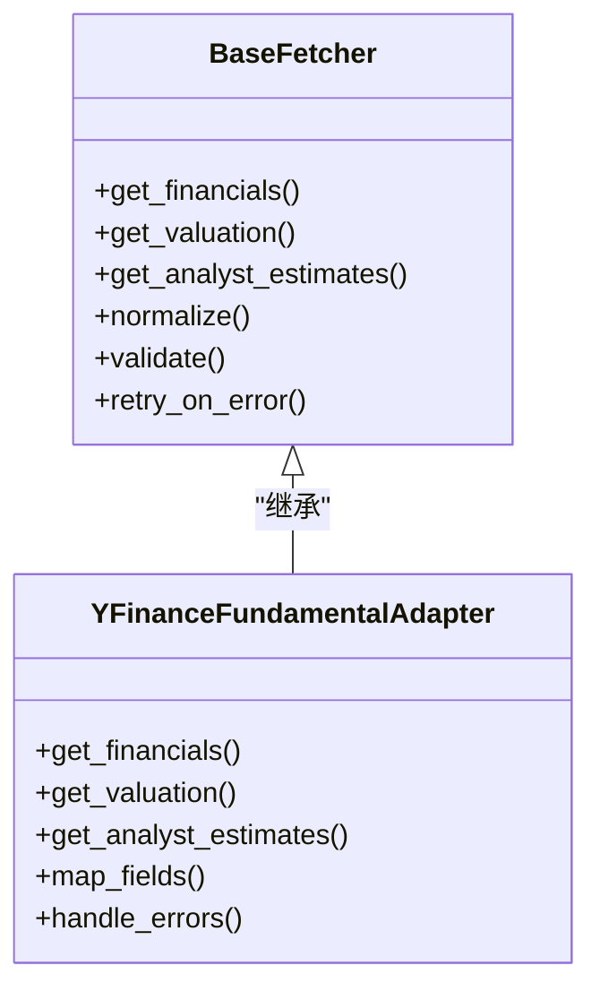
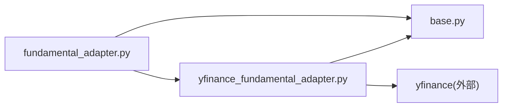

# 基本面数据适配器

<cite>
**本文引用的文件**   
- [fundamental_adapter.py](file://data_provider/fundamental_adapter.py)
- [yfinance_fundamental_adapter.py](file://data_provider/yfinance_fundamental_adapter.py)
- [base.py](file://data_provider/base.py)
- [test_fundamental_adapter.py](file://tests/test_fundamental_adapter.py)
- [test_yfinance_fundamental_adapter.py](file://tests/test_yfinance_fundamental_adapter.py)
</cite>

## 目录
1. [简介](#简介)
2. [项目结构](#项目结构)
3. [核心组件](#核心组件)
4. [架构总览](#架构总览)
5. [详细组件分析](#详细组件分析)
6. [依赖关系分析](#依赖关系分析)
7. [性能考量](#性能考量)
8. [故障排查指南](#故障排查指南)
9. [结论](#结论)
10. [附录](#附录)

## 简介
本文件面向“基本面数据适配器”模块，系统化说明财务报表数据、估值指标、分析师预测等基本面信息的获取与处理流程。文档覆盖多数据源的标准化、清洗与整合逻辑，包含财务比率计算、趋势分析与异常检测的实现要点，并提供基本面数据质量评估与投资决策支持工具的使用建议。读者无需深入代码即可理解整体设计和使用方式。

## 项目结构
与基本面数据适配相关的关键文件位于 data_provider 与 tests 目录：
- data_provider/fundamental_adapter.py：通用基本面适配器抽象与调度实现
- data_provider/yfinance_fundamental_adapter.py：基于 yfinance 的具体实现
- data_provider/base.py：基础 Fetcher 基类（定义统一接口）
- tests/test_fundamental_adapter.py：适配器行为与边界用例测试
- tests/test_yfinance_fundamental_adapter.py：具体实现的单元测试

图表来源
- [fundamental_adapter.py](file://data_provider/fundamental_adapter.py)
- [yfinance_fundamental_adapter.py](file://data_provider/yfinance_fundamental_adapter.py)
- [base.py](file://data_provider/base.py)
- [test_fundamental_adapter.py](file://tests/test_fundamental_adapter.py)
- [test_yfinance_fundamental_adapter.py](file://tests/test_yfinance_fundamental_adapter.py)

章节来源
- [fundamental_adapter.py](file://data_provider/fundamental_adapter.py)
- [yfinance_fundamental_adapter.py](file://data_provider/yfinance_fundamental_adapter.py)
- [base.py](file://data_provider/base.py)
- [test_fundamental_adapter.py](file://tests/test_fundamental_adapter.py)
- [test_yfinance_fundamental_adapter.py](file://tests/test_yfinance_fundamental_adapter.py)

## 核心组件
- 通用基本面适配器（fundamental_adapter.py）
  - 职责：统一对外暴露基本面数据获取接口；协调不同数据源；对返回结果进行标准化、清洗与校验；提供缓存与重试策略；输出结构化对象供上层使用。
  - 关键能力：
    - 多源路由：根据标的类型/市场选择合适的数据源实现
    - 标准化：将不同来源的字段映射到统一 Schema
    - 清洗：缺失值填充、单位对齐、异常值标记
    - 校验：必填字段检查、范围校验、一致性校验
    - 缓存：按标的+时间窗口的结果缓存，减少重复请求
    - 重试与降级：网络异常时重试，失败时回退到次优数据源或返回空结果并记录告警
- yfinance 基本面适配器（yfinance_fundamental_adapter.py）
  - 职责：封装 yfinance 的基本面数据拉取逻辑，包括财报三表、估值指标、分析师预期等
  - 关键能力：
    - 数据拉取：调用 yfinance API 获取历史与最新基本面数据
    - 字段映射：将 yfinance 字段映射为统一 Schema
    - 错误处理：捕获网络/解析异常，转换为标准错误码
    - 性能优化：批量请求、分页与并发控制
- 基础 Fetcher 基类（base.py）
  - 职责：定义统一的 Fetcher 接口（如 get_*、normalize、validate），提供公共的重试、超时、日志、限流等横切能力
  - 关键能力：
    - 统一接口：get_financials、get_valuation、get_analyst_estimates 等
    - 公共逻辑：重试、超时、限流、日志、错误分类
    - 扩展点：子类只需实现具体数据源拉取与映射

章节来源
- [fundamental_adapter.py](file://data_provider/fundamental_adapter.py)
- [yfinance_fundamental_adapter.py](file://data_provider/yfinance_fundamental_adapter.py)
- [base.py](file://data_provider/base.py)

## 架构总览
下图展示从调用方到数据源的整体流程，强调标准化、清洗与整合环节。

图表来源
- [fundamental_adapter.py](file://data_provider/fundamental_adapter.py)
- [yfinance_fundamental_adapter.py](file://data_provider/yfinance_fundamental_adapter.py)
- [base.py](file://data_provider/base.py)

## 详细组件分析

### 通用基本面适配器（fundamental_adapter.py）
- 设计要点
  - 以“适配器模式”屏蔽底层数据源差异，向上暴露一致接口
  - 通过配置驱动选择数据源（如 A 股/美股/港股）
  - 内置标准化管道：映射→清洗→校验→评分
- 关键流程
  - 输入：标的代码、时间范围、指标列表、是否强制刷新
  - 处理：选择数据源→拉取→映射→清洗→校验→评分→缓存
  - 输出：标准化对象、质量评分、元数据（来源、时间戳、版本）
- 错误处理
  - 网络异常：指数退避重试，超过阈值降级
  - 数据异常：缺失/越界/不一致→标记并保留部分可用字段
  - 鉴权/配额：记录错误码，提示用户配置或升级
- 性能优化
  - 请求合并与去重
  - 结果缓存（按标的+时间窗口+指标集）
  - 懒加载与按需字段拉取

图表来源
- [fundamental_adapter.py](file://data_provider/fundamental_adapter.py)

章节来源
- [fundamental_adapter.py](file://data_provider/fundamental_adapter.py)

### yfinance 基本面适配器（yfinance_fundamental_adapter.py）
- 设计要点
  - 专注 yfinance 的数据结构与限制，封装其特有字段与边界条件
  - 提供稳健的错误分类与重试策略
- 关键流程
  - 拉取：财报三表、估值指标、分析师预期、股息与拆分等
  - 映射：将 yfinance 字段映射为统一 Schema（如 EPS、PE、PB、ROE、营收增速等）
  - 清洗：处理 NaN/Inf、负值语义、单位换算（百万/十亿）
  - 校验：跨期一致性（如资产负债表平衡）、同比环比合理性
- 性能优化
  - 批量拉取与并发控制
  - 失败隔离：单个指标失败不影响其他指标
  - 缓存命中优先

图表来源
- [base.py](file://data_provider/base.py)
- [yfinance_fundamental_adapter.py](file://data_provider/yfinance_fundamental_adapter.py)

章节来源
- [yfinance_fundamental_adapter.py](file://data_provider/yfinance_fundamental_adapter.py)
- [base.py](file://data_provider/base.py)

### 数据标准化与清洗
- 标准化目标
  - 统一字段名、单位、频率（季度/年度）
  - 统一时间轴（对齐财报发布日期与实际报告期）
- 清洗规则
  - 缺失值：前向填充、均值填充、插值、标记不可用
  - 异常值：IQR/Z-Score/业务阈值检测，标记并可选剔除
  - 一致性：资产负债表平衡、现金流勾稽关系、同比环比合理区间
- 质量评分
  - 维度：完整性、时效性、一致性、稳定性
  - 输出：综合分数与分项分数，用于下游筛选与排序

章节来源
- [fundamental_adapter.py](file://data_provider/fundamental_adapter.py)
- [yfinance_fundamental_adapter.py](file://data_provider/yfinance_fundamental_adapter.py)

### 财务比率计算
- 常见比率
  - 盈利能力：ROE、ROA、毛利率、净利率
  - 偿债能力：资产负债率、流动比率、速动比率
  - 营运能力：存货周转率、应收周转率、总资产周转率
  - 成长能力：营收增速、净利润增速、EPS 增速
  - 估值指标：PE、PB、PS、EV/EBITDA、股息率
- 计算原则
  - 口径一致：TTM vs 单季 vs 年度
  - 分母保护：避免除零、负利润场景的特殊处理
  - 可比性：同口径跨期对比，必要时做会计政策调整

章节来源
- [fundamental_adapter.py](file://data_provider/fundamental_adapter.py)
- [yfinance_fundamental_adapter.py](file://data_provider/yfinance_fundamental_adapter.py)

### 趋势分析与异常检测
- 趋势分析
  - 移动平均/指数平滑：识别短期波动与长期趋势
  - 斜率与拐点：一阶导数与二阶导数判断加速/减速
  - 季节性：季度/年度周期分解
- 异常检测
  - 统计方法：Z-Score、IQR、Grubbs
  - 业务规则：利润率突增/骤降、负债率异常、EPS 跳变
  - 组合策略：统计+规则双通道，降低误报

章节来源
- [fundamental_adapter.py](file://data_provider/fundamental_adapter.py)
- [yfinance_fundamental_adapter.py](file://data_provider/yfinance_fundamental_adapter.py)

### 多数据源整合
- 整合策略
  - 主从源：选择一个主数据源，其他作为补充
  - 投票法：多个源对同一指标打分，取多数或加权平均
  - 置信度融合：按数据源历史准确率动态权重
- 冲突解决
  - 优先级：交易所官方 > 权威第三方 > 社区聚合
  - 时间优先：更近的财报发布日优先
  - 可追溯：保留各源原始值与差异原因

章节来源
- [fundamental_adapter.py](file://data_provider/fundamental_adapter.py)

## 依赖关系分析
- 内部依赖
  - fundamental_adapter.py 依赖 base.py 的统一接口
  - yfinance_fundamental_adapter.py 继承 base.py 并实现具体逻辑
- 外部依赖
  - yfinance：美股/港股等市场的基本面数据
  - 网络库：HTTP 客户端（含重试/超时/限流）
  - 数值库：pandas/numpy（清洗、计算、统计）
- 耦合与内聚
  - 高内聚：适配器聚焦数据拉取与标准化
  - 低耦合：通过基类接口解耦具体数据源
- 循环依赖
  - 无直接循环依赖，适配器与实现单向依赖基类

图表来源
- [fundamental_adapter.py](file://data_provider/fundamental_adapter.py)
- [yfinance_fundamental_adapter.py](file://data_provider/yfinance_fundamental_adapter.py)
- [base.py](file://data_provider/base.py)

章节来源
- [fundamental_adapter.py](file://data_provider/fundamental_adapter.py)
- [yfinance_fundamental_adapter.py](file://data_provider/yfinance_fundamental_adapter.py)
- [base.py](file://data_provider/base.py)

## 性能考量
- 请求优化
  - 并发与限流：控制并发度，避免触发供应商限频
  - 批量拉取：合并相同标的的请求，减少往返次数
  - 增量更新：仅拉取新增时间段数据
- 计算优化
  - 惰性计算：按需计算比率，避免全量预计算
  - 缓存策略：多级缓存（内存/磁盘），按标的+时间窗口+指标集键
- 资源管理
  - 连接池：复用 HTTP 连接
  - 内存占用：流式处理大报表，避免一次性加载

[本节为通用指导，不直接分析具体文件]

## 故障排查指南
- 常见问题
  - 数据缺失：检查财报发布日、停牌、退市、数据源可用性
  - 异常值：查看清洗与异常检测日志，确认是否为真实事件
  - 速率限制：降低并发、增加退避间隔、切换备用数据源
  - 字段映射错误：核对 yfinance 字段变更与映射表
- 定位步骤
  - 启用详细日志：记录请求/响应、错误码、重试次数
  - 最小化复现：缩小时间窗口与指标集
  - 对比多源：交叉验证不同数据源的结果
- 恢复策略
  - 自动重试与降级
  - 缓存回滚：回退到最近一次成功快照
  - 告警通知：关键指标缺失或异常时及时提醒

章节来源
- [test_fundamental_adapter.py](file://tests/test_fundamental_adapter.py)
- [test_yfinance_fundamental_adapter.py](file://tests/test_yfinance_fundamental_adapter.py)

## 结论
基本面数据适配器通过统一接口、标准化管道与稳健的错误处理，有效整合多数据源的基本面信息。结合财务比率计算、趋势分析与异常检测，可为投资决策提供高质量数据支撑。建议在部署中完善监控与告警，持续优化数据源质量与性能。

[本节为总结性内容，不直接分析具体文件]

## 附录
- 使用建议
  - 明确投资框架：价值/成长/质量因子，选择对应指标集
  - 设定质量门槛：完整性≥阈值、异常比例≤阈值
  - 定期复核：财报季后重新评估数据质量与模型有效性
- 扩展方向
  - 接入更多数据源（如 Wind、Bloomberg、本地数据库）
  - 增强异常检测（机器学习方法）
  - 可视化与报告自动化

[本节为概念性内容，不直接分析具体文件]