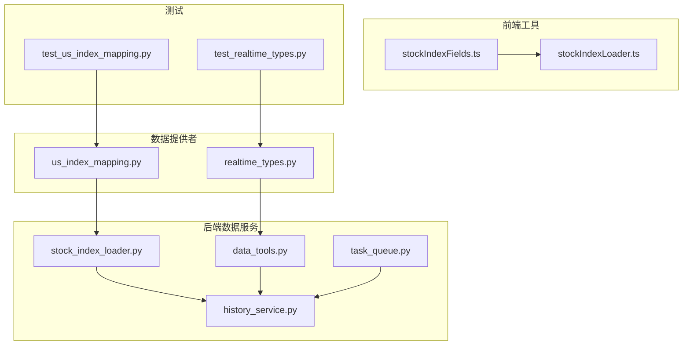
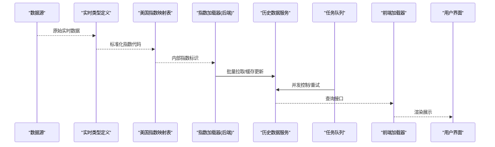
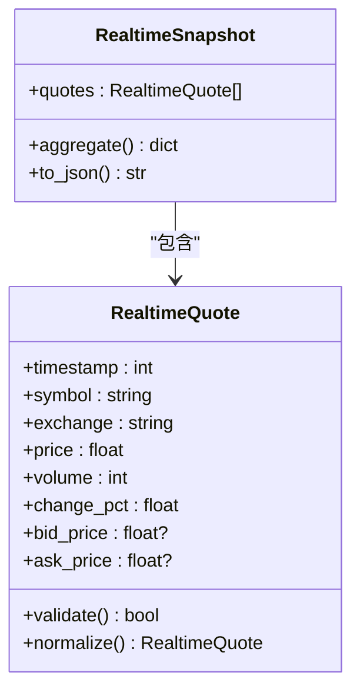
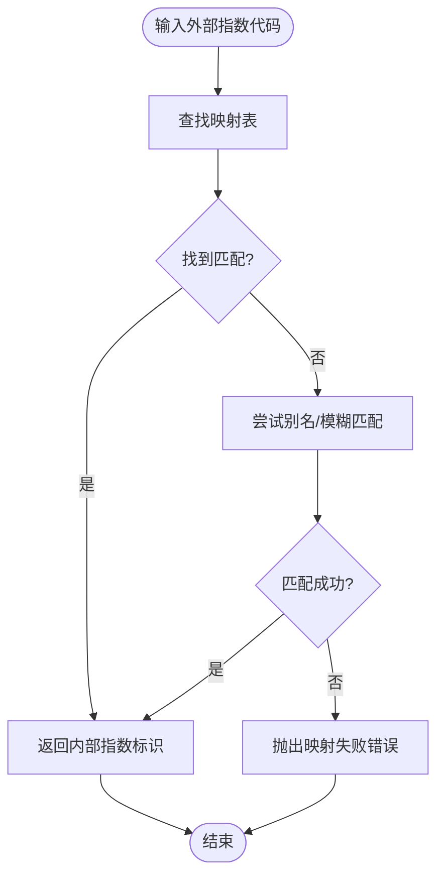
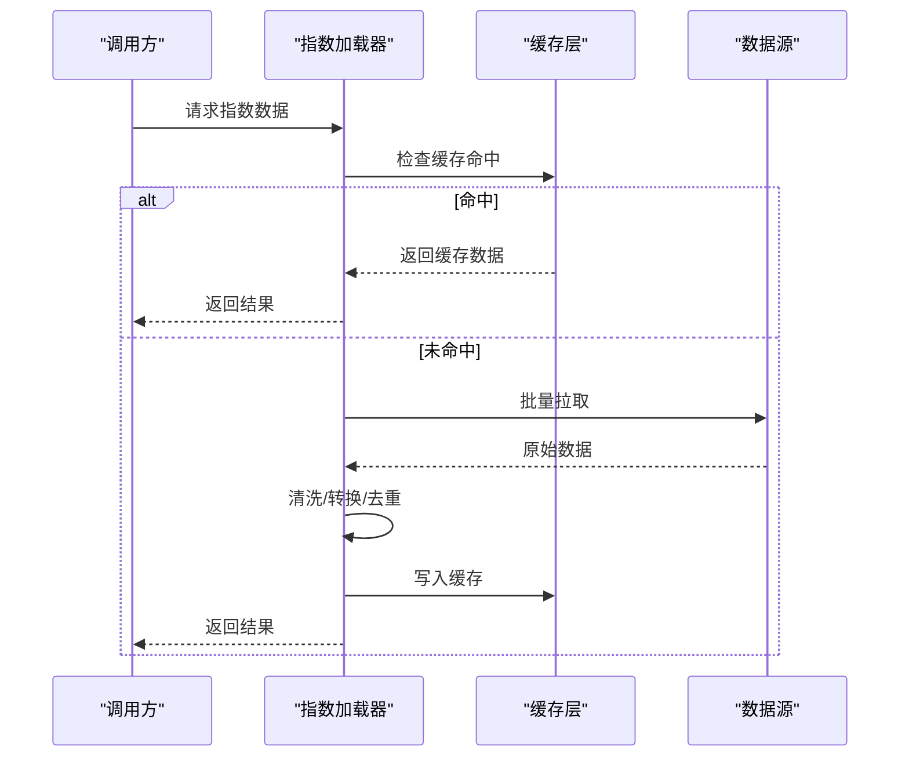
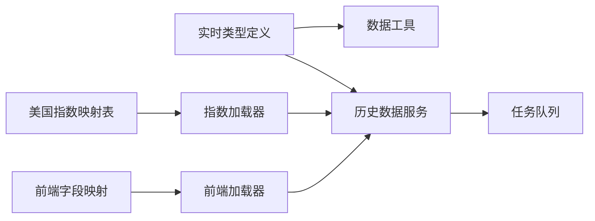

# 数据工具与类型定义

<cite>
**本文引用的文件**   
- [realtime_types.py](file://data_provider/realtime_types.py)
- [us_index_mapping.py](file://data_provider/us_index_mapping.py)
- [stock_index_loader.py](file://src/data/stock_index_loader.py)
- [stock_index_fields.ts](file://apps/dsa-web/src/utils/stockIndexFields.ts)
- [stockIndexLoader.ts](file://apps/dsa-web/src/utils/stockIndexLoader.ts)
- [data_tools.py](file://src/agent/tools/data_tools.py)
- [history_service.py](file://src/services/history_service.py)
- [task_queue.py](file://src/services/task_queue.py)
- [logging_config.py](file://src/logging_config.py)
- [test_realtime_types.py](file://tests/test_realtime_types.py)
- [test_us_index_mapping.py](file://tests/test_us_index_mapping.py)
</cite>

## 目录
1. [简介](#简介)
2. [项目结构](#项目结构)
3. [核心组件](#核心组件)
4. [架构总览](#架构总览)
5. [详细组件分析](#详细组件分析)
6. [依赖关系分析](#依赖关系分析)
7. [性能考虑](#性能考虑)
8. [故障排查指南](#故障排查指南)
9. [结论](#结论)
10. [附录](#附录)

## 简介
本文件面向数据工具与类型定义，聚焦以下目标：
- 实时数据类型定义：统一前后端与数据源之间的实时行情数据结构。
- 美国指数映射表：提供美股指数代码到内部标识的映射，便于跨市场统一处理。
- 通用数据工具：历史数据加载、缓存策略、批量处理优化与内存管理最佳实践。
- 数据结构规范与验证规则：明确字段含义、必填项、取值范围与校验流程。
- 格式转换工具：在数据源、服务层与前端之间进行标准化转换。
- 数据调试与性能监控：日志、指标与诊断配置建议。

## 项目结构
围绕数据工具与类型定义的关键位置如下：
- data_provider/realtime_types.py：实时数据类型定义（Pydantic 模型）。
- data_provider/us_index_mapping.py：美国指数映射表。
- src/data/stock_index_loader.py：股票指数加载器（后端）。
- apps/dsa-web/src/utils/stockIndexFields.ts：前端指数字段映射。
- apps/dsa-web/src/utils/stockIndexLoader.ts：前端指数加载器。
- src/agent/tools/data_tools.py：Agent 侧数据工具（历史、快照、资金流等）。
- src/services/history_service.py：历史数据服务（缓存、批处理、错误恢复）。
- src/services/task_queue.py：任务队列（并发、限流、重试）。
- src/logging_config.py：日志与监控配置。
- tests/test_realtime_types.py、tests/test_us_index_mapping.py：类型与映射表的测试用例。

图表来源
- [realtime_types.py](file://data_provider/realtime_types.py)
- [us_index_mapping.py](file://data_provider/us_index_mapping.py)
- [stock_index_loader.py](file://src/data/stock_index_loader.py)
- [stockIndexFields.ts](file://apps/dsa-web/src/utils/stockIndexFields.ts)
- [stockIndexLoader.ts](file://apps/dsa-web/src/utils/stockIndexLoader.ts)
- [data_tools.py](file://src/agent/tools/data_tools.py)
- [history_service.py](file://src/services/history_service.py)
- [task_queue.py](file://src/services/task_queue.py)
- [test_realtime_types.py](file://tests/test_realtime_types.py)
- [test_us_index_mapping.py](file://tests/test_us_index_mapping.py)

章节来源
- [realtime_types.py](file://data_provider/realtime_types.py)
- [us_index_mapping.py](file://data_provider/us_index_mapping.py)
- [stock_index_loader.py](file://src/data/stock_index_loader.py)
- [stockIndexFields.ts](file://apps/dsa-web/src/utils/stockIndexFields.ts)
- [stockIndexLoader.ts](file://apps/dsa-web/src/utils/stockIndexLoader.ts)
- [data_tools.py](file://src/agent/tools/data_tools.py)
- [history_service.py](file://src/services/history_service.py)
- [task_queue.py](file://src/services/task_queue.py)
- [test_realtime_types.py](file://tests/test_realtime_types.py)
- [test_us_index_mapping.py](file://tests/test_us_index_mapping.py)

## 核心组件
- 实时数据类型定义（Pydantic）
  - 用于统一不同数据源的实时报价字段，确保序列化/反序列化的健壮性。
  - 典型字段包括：时间戳、代码、交易所、价格、成交量、涨跌幅、盘口等。
  - 通过 Pydantic 的严格模式与默认值，减少脏数据进入下游。
- 美国指数映射表
  - 将外部指数代码（如 ^SPX、^NDX、^DJI）映射为内部统一标识。
  - 支持别名与回退逻辑，保证在不同数据源间的一致性。
- 股票指数加载器（后端）
  - 负责从本地或远程索引获取指数元数据与字段映射。
  - 与历史数据服务协作，完成批量拉取与缓存更新。
- 前端指数字段映射与加载器
  - 前端维护指数字段展示映射，确保 UI 显示一致。
  - 调用后端接口获取指数数据，并进行本地缓存与增量更新。
- Agent 数据工具
  - 封装常用数据能力：历史K线、资金流向、个股信息、组合快照等。
  - 对外暴露统一函数签名，屏蔽底层数据源差异。
- 历史数据服务
  - 实现缓存策略（内存/磁盘）、批处理、去重、失败重试与降级。
  - 提供查询接口，供 Agent 与 API 使用。
- 任务队列
  - 控制并发度、限流与重试，避免对上游数据源造成压力。
  - 支持优先级与超时，保障关键任务优先执行。

章节来源
- [realtime_types.py](file://data_provider/realtime_types.py)
- [us_index_mapping.py](file://data_provider/us_index_mapping.py)
- [stock_index_loader.py](file://src/data/stock_index_loader.py)
- [stockIndexFields.ts](file://apps/dsa-web/src/utils/stockIndexFields.ts)
- [stockIndexLoader.ts](file://apps/dsa-web/src/utils/stockIndexLoader.ts)
- [data_tools.py](file://src/agent/tools/data_tools.py)
- [history_service.py](file://src/services/history_service.py)
- [task_queue.py](file://src/services/task_queue.py)

## 架构总览
数据工具与类型定义的端到端流程如下：
- 数据源（交易所/第三方API）返回原始数据。
- 实时类型定义对数据进行解析与校验。
- 美国指数映射表将外部指数代码标准化。
- 后端加载器与服务层进行缓存、批处理与聚合。
- 前端加载器与字段映射确保UI一致性。
- 任务队列协调并发与重试，保障稳定性。

图表来源
- [realtime_types.py](file://data_provider/realtime_types.py)
- [us_index_mapping.py](file://data_provider/us_index_mapping.py)
- [stock_index_loader.py](file://src/data/stock_index_loader.py)
- [history_service.py](file://src/services/history_service.py)
- [task_queue.py](file://src/services/task_queue.py)
- [stockIndexLoader.ts](file://apps/dsa-web/src/utils/stockIndexLoader.ts)

## 详细组件分析

### 实时数据类型定义（Pydantic）
- 设计要点
  - 使用强类型与默认值，确保字段完整性与可空性明确。
  - 内置校验规则（范围、枚举、正则），减少异常数据流入。
  - 提供序列化/反序列化钩子，适配多数据源差异。
- 数据结构规范
  - 时间戳统一为UTC毫秒级；代码采用“市场+代码”复合键。
  - 价格与成交量保留精度，避免浮点误差。
  - 盘口字段可选，缺失时回退为None并记录警告。
- 数据验证规则
  - 必填字段缺失直接拒绝；非必填字段缺失使用默认值。
  - 数值范围越界触发修正或拒绝策略（可配置）。
- 格式转换工具
  - 提供标准化函数，将不同数据源字段名映射到统一结构。
  - 支持批量转换，提升吞吐。

图表来源
- [realtime_types.py](file://data_provider/realtime_types.py)

章节来源
- [realtime_types.py](file://data_provider/realtime_types.py)
- [test_realtime_types.py](file://tests/test_realtime_types.py)

### 美国指数映射表
- 设计要点
  - 集中管理指数别名与回退逻辑，避免硬编码分散。
  - 支持动态扩展，新增指数无需修改核心逻辑。
- 映射规则
  - 主键为内部指数标识，值为外部代码集合与显示名称。
  - 当外部代码不匹配时，尝试别名匹配与模糊匹配。
- 数据验证规则
  - 映射表完整性检查，缺失条目抛出明确错误。
  - 重复映射检测，防止覆盖导致歧义。

图表来源
- [us_index_mapping.py](file://data_provider/us_index_mapping.py)

章节来源
- [us_index_mapping.py](file://data_provider/us_index_mapping.py)
- [test_us_index_mapping.py](file://tests/test_us_index_mapping.py)

### 股票指数加载器（后端）
- 职责
  - 从本地或远程索引获取指数元数据与字段映射。
  - 与历史数据服务协作，完成批量拉取与缓存更新。
- 数据处理流程
  - 预检索引有效性，必要时触发刷新。
  - 分批拉取历史数据，合并去重后写入缓存。
  - 失败重试与降级策略，保证可用性。

图表来源
- [stock_index_loader.py](file://src/data/stock_index_loader.py)
- [history_service.py](file://src/services/history_service.py)

章节来源
- [stock_index_loader.py](file://src/data/stock_index_loader.py)
- [history_service.py](file://src/services/history_service.py)

### 前端指数字段映射与加载器
- 字段映射
  - 维护指数字段到UI展示的映射，确保一致性。
  - 支持国际化与主题切换时的字段显示调整。
- 加载器
  - 调用后端接口获取指数数据，进行本地缓存与增量更新。
  - 错误处理与重试机制，提升用户体验。

章节来源
- [stockIndexFields.ts](file://apps/dsa-web/src/utils/stockIndexFields.ts)
- [stockIndexLoader.ts](file://apps/dsa-web/src/utils/stockIndexLoader.ts)

### Agent 数据工具
- 功能模块
  - 历史K线：按周期与范围拉取，支持复权与除权处理。
  - 资金流向：北向/南向资金、主力净流入等。
  - 个股信息：基本面摘要、财务指标、公告等。
  - 组合快照：持仓、盈亏、风险指标等。
- 调用约定
  - 统一函数签名与错误码，便于上层编排。
  - 支持异步调用与并发控制。

章节来源
- [data_tools.py](file://src/agent/tools/data_tools.py)

### 历史数据服务
- 缓存策略
  - 多级缓存：内存（热点）、磁盘（持久化）、远端（备份）。
  - 缓存失效策略：TTL、LRU、按业务维度清理。
- 批处理优化
  - 批量拉取与合并，减少网络往返。
  - 增量更新，仅拉取变化部分。
- 内存管理
  - 对象池与引用计数，避免内存泄漏。
  - 大对象分块处理，降低峰值内存占用。
- 错误恢复
  - 重试与退避策略，应对临时故障。
  - 降级路径，保证基本功能可用。

章节来源
- [history_service.py](file://src/services/history_service.py)
- [task_queue.py](file://src/services/task_queue.py)

## 依赖关系分析
- 组件耦合
  - 实时类型定义被数据工具与服务层共同依赖，形成稳定契约。
  - 美国指数映射表被加载器与前端共享，确保一致性。
- 外部依赖
  - 数据源适配器（如 yfinance、akshare 等）通过抽象接口解耦。
  - 缓存与存储后端可插拔，支持多种实现。
- 潜在循环依赖
  - 通过分层与接口隔离，避免循环导入。
  - 使用事件总线或消息队列解耦异步流程。

图表来源
- [realtime_types.py](file://data_provider/realtime_types.py)
- [us_index_mapping.py](file://data_provider/us_index_mapping.py)
- [stock_index_loader.py](file://src/data/stock_index_loader.py)
- [data_tools.py](file://src/agent/tools/data_tools.py)
- [history_service.py](file://src/services/history_service.py)
- [task_queue.py](file://src/services/task_queue.py)
- [stockIndexFields.ts](file://apps/dsa-web/src/utils/stockIndexFields.ts)
- [stockIndexLoader.ts](file://apps/dsa-web/src/utils/stockIndexLoader.ts)

章节来源
- [realtime_types.py](file://data_provider/realtime_types.py)
- [us_index_mapping.py](file://data_provider/us_index_mapping.py)
- [stock_index_loader.py](file://src/data/stock_index_loader.py)
- [data_tools.py](file://src/agent/tools/data_tools.py)
- [history_service.py](file://src/services/history_service.py)
- [task_queue.py](file://src/services/task_queue.py)
- [stockIndexFields.ts](file://apps/dsa-web/src/utils/stockIndexFields.ts)
- [stockIndexLoader.ts](file://apps/dsa-web/src/utils/stockIndexLoader.ts)

## 性能考虑
- 缓存策略
  - 热点数据内存缓存，冷数据落盘，远端备份。
  - 合理设置TTL与淘汰策略，平衡新鲜度与性能。
- 批处理优化
  - 合并请求，减少网络开销。
  - 增量更新，避免全量拉取。
- 内存管理
  - 使用生成器与流式处理，降低内存峰值。
  - 及时释放不再使用的对象，避免泄漏。
- 并发与限流
  - 任务队列控制并发度，避免过载。
  - 对上游数据源实施速率限制，防止被封禁。

[本节为通用指导，不直接分析具体文件]

## 故障排查指南
- 日志与监控
  - 启用结构化日志，记录关键路径与错误上下文。
  - 采集性能指标（延迟、吞吐、错误率），设置告警阈值。
- 常见问题
  - 实时数据解析失败：检查字段映射与类型定义是否一致。
  - 指数映射缺失：确认映射表是否最新，是否存在别名冲突。
  - 缓存不一致：清理过期缓存，重新拉取数据。
  - 任务队列堆积：检查并发配置与上游限流。
- 调试工具
  - 启用详细日志级别，捕获完整请求链路。
  - 使用模拟数据源进行单元测试与集成测试。

章节来源
- [logging_config.py](file://src/logging_config.py)

## 结论
本文件系统梳理了数据工具与类型定义的核心组件与实践要点：
- 实时类型定义与指数映射表为数据一致性奠定基础。
- 加载器与服务层实现高效的数据处理与缓存策略。
- 前端工具确保UI展示的一致性与用户体验。
- 任务队列与日志监控保障系统的稳定性与可观测性。
建议在生产环境中结合业务需求调优缓存、并发与监控配置，持续优化性能与可靠性。

[本节为总结，不直接分析具体文件]

## 附录
- 数据结构规范清单
  - 字段命名：小写下划线，语义清晰。
  - 数据类型：优先使用强类型，避免任意字符串。
  - 必填项：明确标注，缺失时给出默认值或错误。
- 数据验证规则清单
  - 范围校验：价格、成交量等数值范围。
  - 枚举校验：状态、类型等有限集合。
  - 正则校验：代码、邮箱等格式。
- 格式转换工具清单
  - 标准化函数：统一字段名与单位。
  - 批量转换：提升吞吐，减少CPU占用。
- 缓存策略配置清单
  - TTL：根据数据新鲜度要求设置。
  - LRU：限制缓存大小，淘汰冷数据。
  - 分区：按业务维度隔离缓存。
- 批处理优化清单
  - 批量大小：平衡内存与网络开销。
  - 重试策略：指数退避与最大重试次数。
  - 降级路径：失败时返回部分数据或缓存。
- 内存管理清单
  - 对象池：复用频繁创建的对象。
  - 流式处理：避免一次性加载大数据集。
  - 垃圾回收：及时释放不再使用的资源。
- 调试与监控清单
  - 日志级别：开发环境详细，生产环境精简。
  - 指标采集：延迟、吞吐、错误率、资源使用。
  - 告警规则：阈值与通知渠道配置。

[本节为补充说明，不直接分析具体文件]