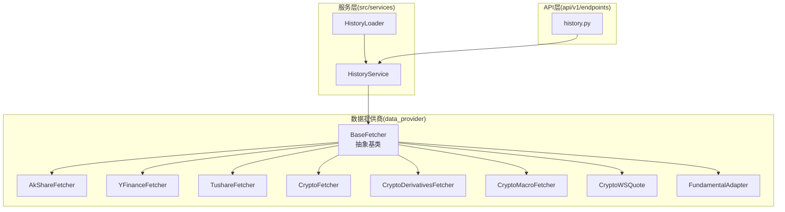
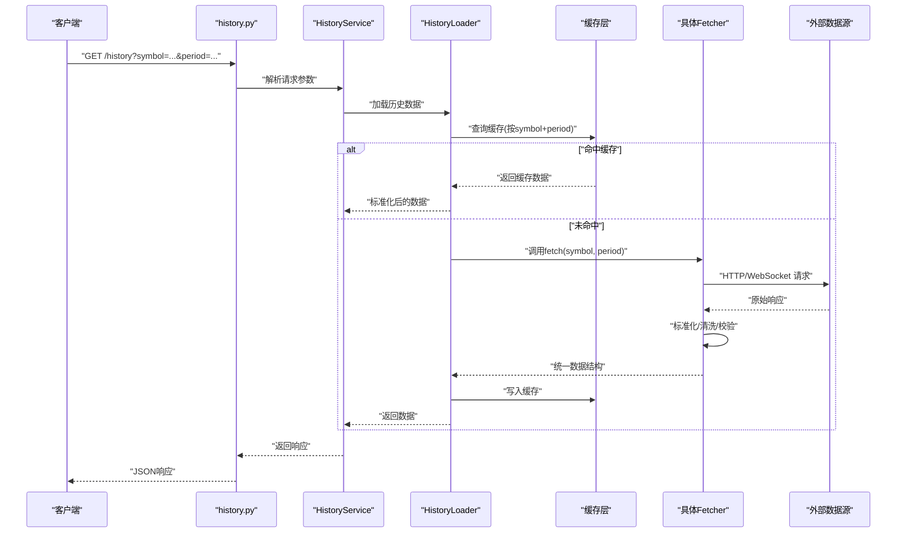
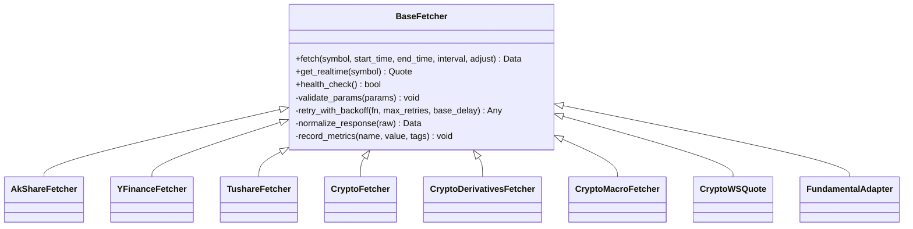
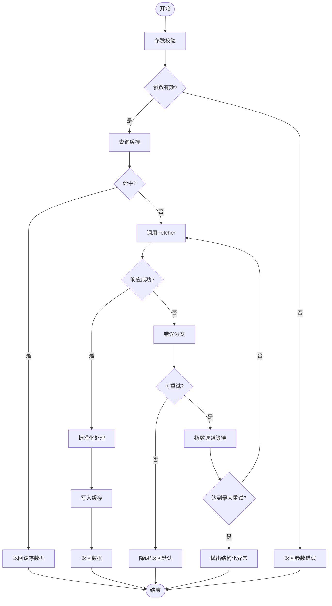
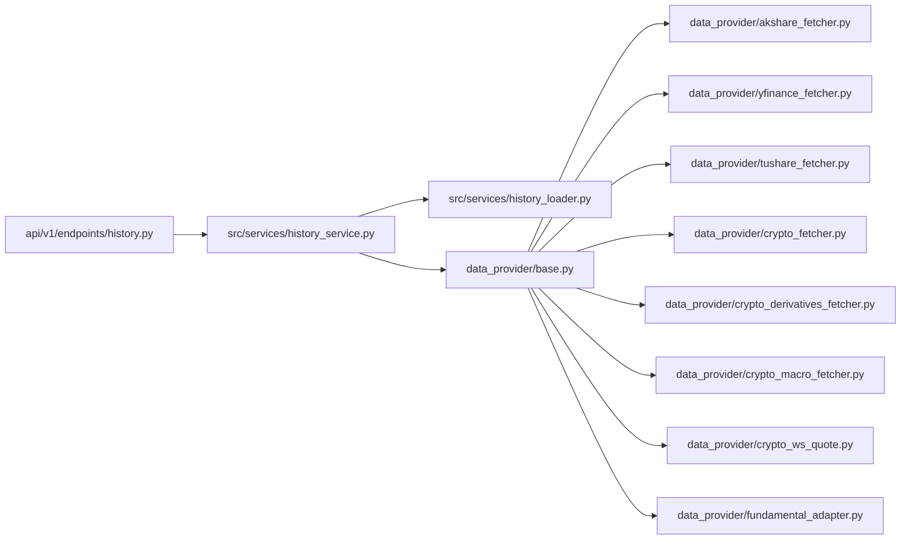

# 数据提供商基础架构

<cite>
**本文引用的文件**   
- [data_provider/base.py](file://data_provider/base.py)
- [data_provider/akshare_fetcher.py](file://data_provider/akshare_fetcher.py)
- [data_provider/yfinance_fetcher.py](file://data_provider/yfinance_fetcher.py)
- [data_provider/tushare_fetcher.py](file://data_provider/tushare_fetcher.py)
- [data_provider/fundamental_adapter.py](file://data_provider/fundamental_adapter.py)
- [data_provider/crypto_fetcher.py](file://data_provider/crypto_fetcher.py)
- [data_provider/crypto_derivatives_fetcher.py](file://data_provider/crypto_derivatives_fetcher.py)
- [data_provider/crypto_macro_fetcher.py](file://data_provider/crypto_macro_fetcher.py)
- [data_provider/crypto_ws_quote.py](file://data_provider/crypto_ws_quote.py)
- [src/services/history_service.py](file://src/services/history_service.py)
- [src/services/history_loader.py](file://src/services/history_loader.py)
- [src/utils/data_processing.py](file://src/utils/data_processing.py)
- [api/v1/endpoints/history.py](file://api/v1/endpoints/history.py)
- [tests/test_data_tools_daily_history_cache.py](file://tests/test_data_tools_daily_history_cache.py)
</cite>

## 目录
1. [简介](#简介)
2. [项目结构](#项目结构)
3. [核心组件](#核心组件)
4. [架构总览](#架构总览)
5. [详细组件分析](#详细组件分析)
6. [依赖关系分析](#依赖关系分析)
7. [性能考量](#性能考量)
8. [故障排查指南](#故障排查指南)
9. [结论](#结论)
10. [附录：自定义数据提供商开发指南与最佳实践](#附录自定义数据提供商开发指南与最佳实践)

## 简介
本文件系统化梳理数据提供商基础架构，重点围绕 BaseFetcher 抽象类的设计模式、接口规范与继承关系，统一数据获取接口定义、错误处理机制与重试策略，并深入说明数据标准化处理、缓存策略与性能监控的实现细节。同时提供扩展自定义数据提供商的开发指南与最佳实践，帮助开发者快速接入新的数据源并保持系统一致性与可维护性。

## 项目结构
数据提供商模块位于 data_provider 包内，采用“抽象基类 + 多实现”的分层设计：
- 抽象基类：定义统一的获取接口、错误处理、重试与日志埋点等通用能力
- 具体 Fetcher：针对不同数据源（A股、美股、加密货币、宏观指标等）实现差异化拉取逻辑
- 适配器：对非行情数据（如基本面）进行统一封装与标准化
- 服务层：在 history_service/history_loader 中编排调用、缓存与监控
- API 层：对外暴露历史数据查询接口，屏蔽底层差异

图表来源
- [data_provider/base.py](file://data_provider/base.py)
- [data_provider/akshare_fetcher.py](file://data_provider/akshare_fetcher.py)
- [data_provider/yfinance_fetcher.py](file://data_provider/yfinance_fetcher.py)
- [data_provider/tushare_fetcher.py](file://data_provider/tushare_fetcher.py)
- [data_provider/crypto_fetcher.py](file://data_provider/crypto_fetcher.py)
- [data_provider/crypto_derivatives_fetcher.py](file://data_provider/crypto_derivatives_fetcher.py)
- [data_provider/crypto_macro_fetcher.py](file://data_provider/crypto_macro_fetcher.py)
- [data_provider/crypto_ws_quote.py](file://data_provider/crypto_ws_quote.py)
- [data_provider/fundamental_adapter.py](file://data_provider/fundamental_adapter.py)
- [src/services/history_service.py](file://src/services/history_service.py)
- [src/services/history_loader.py](file://src/services/history_loader.py)
- [api/v1/endpoints/history.py](file://api/v1/endpoints/history.py)

章节来源
- [data_provider/base.py](file://data_provider/base.py)
- [src/services/history_service.py](file://src/services/history_service.py)
- [api/v1/endpoints/history.py](file://api/v1/endpoints/history.py)

## 核心组件
- BaseFetcher 抽象基类
  - 职责：定义统一的数据获取接口、参数校验、异常分类、重试策略、超时控制、日志与度量埋点、缓存键生成规则
  - 关键方法：获取历史K线、实时报价、财务/基本面数据、批量拉取、健康检查
  - 错误处理：区分网络错误、认证失败、限流、业务异常；支持指数退避与熔断降级
  - 重试策略：基于状态码/异常类型触发重试，限制最大次数与间隔，支持幂等键去重
- 具体 Fetcher 实现
  - AkShareFetcher/YFinanceFetcher/TushareFetcher：面向股票/指数历史与实时行情
  - CryptoFetcher/CryptoDerivativesFetcher/CryptoMacroFetcher：面向加密货币行情、衍生品与宏观数据
  - CryptoWSQuote：WebSocket 实时推送订阅与断线重连
  - FundamentalAdapter：将不同来源的基本面数据标准化为统一结构
- 服务层 HistoryService/HistoryLoader
  - 职责：路由到具体 Fetcher、组合缓存（内存/持久化）、聚合结果、监控与告警
  - 缓存策略：按时间窗口与标的维度缓存，支持失效与预热
  - 监控：耗时、成功率、错误率、QPS、缓存命中率

章节来源
- [data_provider/base.py](file://data_provider/base.py)
- [data_provider/akshare_fetcher.py](file://data_provider/akshare_fetcher.py)
- [data_provider/yfinance_fetcher.py](file://data_provider/yfinance_fetcher.py)
- [data_provider/tushare_fetcher.py](file://data_provider/tushare_fetcher.py)
- [data_provider/crypto_fetcher.py](file://data_provider/crypto_fetcher.py)
- [data_provider/crypto_derivatives_fetcher.py](file://data_provider/crypto_derivatives_fetcher.py)
- [data_provider/crypto_macro_fetcher.py](file://data_provider/crypto_macro_fetcher.py)
- [data_provider/crypto_ws_quote.py](file://data_provider/crypto_ws_quote.py)
- [data_provider/fundamental_adapter.py](file://data_provider/fundamental_adapter.py)
- [src/services/history_service.py](file://src/services/history_service.py)
- [src/services/history_loader.py](file://src/services/history_loader.py)

## 架构总览
整体采用分层解耦：API 层仅感知 HistoryService，HistoryService 通过工厂或注册表选择具体 Fetcher，Fetcher 负责与外部数据源交互，返回统一数据结构。错误与重试在 Fetcher 层收敛，缓存与监控在服务层集中管理。

图表来源
- [api/v1/endpoints/history.py](file://api/v1/endpoints/history.py)
- [src/services/history_service.py](file://src/services/history_service.py)
- [src/services/history_loader.py](file://src/services/history_loader.py)
- [data_provider/base.py](file://data_provider/base.py)

## 详细组件分析

### BaseFetcher 抽象类与设计模式
- 设计模式
  - 模板方法：定义获取流程骨架（校验→缓存→请求→标准化→监控），子类仅实现差异步骤
  - 策略模式：不同数据源以策略形式注入，便于替换与扩展
  - 观察者/事件：在关键节点记录日志与指标，供上层监控消费
- 接口规范
  - 统一输入：symbol、start_time、end_time、interval、adjust 等
  - 统一输出：标准化字段（时间戳、开高低收、成交量、复权标记等）
  - 错误契约：抛出结构化异常，包含错误码、消息、是否可重试
- 继承关系
  - 所有具体 Fetcher 均继承自 BaseFetcher，复用通用能力
  - FundamentalAdapter 作为适配器，将非行情数据适配为统一结构

图表来源
- [data_provider/base.py](file://data_provider/base.py)
- [data_provider/akshare_fetcher.py](file://data_provider/akshare_fetcher.py)
- [data_provider/yfinance_fetcher.py](file://data_provider/yfinance_fetcher.py)
- [data_provider/tushare_fetcher.py](file://data_provider/tushare_fetcher.py)
- [data_provider/crypto_fetcher.py](file://data_provider/crypto_fetcher.py)
- [data_provider/crypto_derivatives_fetcher.py](file://data_provider/crypto_derivatives_fetcher.py)
- [data_provider/crypto_macro_fetcher.py](file://data_provider/crypto_macro_fetcher.py)
- [data_provider/crypto_ws_quote.py](file://data_provider/crypto_ws_quote.py)
- [data_provider/fundamental_adapter.py](file://data_provider/fundamental_adapter.py)

章节来源
- [data_provider/base.py](file://data_provider/base.py)

### 数据标准化处理
- 目标：将不同来源的原始数据转换为统一结构，确保上游无需关心数据源差异
- 关键点
  - 字段映射：时间、价格、成交量、复权因子等字段的统一命名与类型
  - 缺失值处理：填充、插值或剔除策略
  - 时区与格式：统一为 UTC 时间戳与标准日期格式
  - 校验：范围校验、重复行去重、排序保证
- 实现位置
  - 各 Fetcher 内部 normalize_response 方法
  - FundamentalAdapter 对基本面数据的统一封装

章节来源
- [data_provider/base.py](file://data_provider/base.py)
- [data_provider/fundamental_adapter.py](file://data_provider/fundamental_adapter.py)
- [src/utils/data_processing.py](file://src/utils/data_processing.py)

### 缓存策略
- 层级
  - 内存缓存：短时效、进程内共享，适合热点标的与高频读取
  - 持久化缓存：落盘或数据库，用于冷数据与跨进程共享
- 键策略
  - 基于 symbol + period + interval + adjust 生成稳定键
  - 支持版本前缀，避免结构变更导致脏读
- 失效与预热
  - 定时刷新与按需失效
  - 启动预热常用标的，降低首访延迟
- 监控
  - 命中率、平均大小、淘汰率、过期数

章节来源
- [src/services/history_service.py](file://src/services/history_service.py)
- [src/services/history_loader.py](file://src/services/history_loader.py)
- [tests/test_data_tools_daily_history_cache.py](file://tests/test_data_tools_daily_history_cache.py)

### 错误处理与重试策略
- 错误分类
  - 网络错误（超时、连接失败）
  - 认证错误（Token 过期、权限不足）
  - 限流（429/速率限制）
  - 业务异常（数据为空、字段缺失）
- 重试策略
  - 指数退避：base_delay * (factor ^ attempt)
  - 最大重试次数与最大等待时间上限
  - 幂等键：避免重复提交造成副作用
- 熔断与降级
  - 连续失败阈值触发熔断，短期拒绝请求
  - 降级策略：返回最近一次成功数据或默认值

图表来源
- [data_provider/base.py](file://data_provider/base.py)
- [src/services/history_service.py](file://src/services/history_service.py)

章节来源
- [data_provider/base.py](file://data_provider/base.py)
- [src/services/history_service.py](file://src/services/history_service.py)

### 性能监控与度量
- 指标
  - 请求耗时（P50/P90/P99）
  - 成功率与错误率（按错误类型）
  - QPS、并发度、队列长度
  - 缓存命中率、平均大小、淘汰率
- 埋点位置
  - Fetcher 层：请求前后、重试、标准化耗时
  - 服务层：缓存命中/未命中、聚合耗时
  - API 层：端到端耗时与状态码分布
- 可视化与告警
  - 指标上报至监控系统（Prometheus/Grafana）
  - 阈值告警（错误率飙升、延迟突增）

章节来源
- [data_provider/base.py](file://data_provider/base.py)
- [src/services/history_service.py](file://src/services/history_service.py)
- [api/v1/endpoints/history.py](file://api/v1/endpoints/history.py)

## 依赖关系分析
- 耦合与内聚
  - BaseFetcher 高内聚：封装通用能力，低耦合于具体数据源
  - HistoryService/HistoryLoader 中内聚：缓存、监控、路由逻辑集中
- 直接依赖
  - HistoryService → BaseFetcher（通过具体实现）
  - HistoryLoader → HistoryService
  - API → HistoryService
- 间接依赖
  - 具体 Fetcher → 第三方库（HTTP/WebSocket/SDK）
  - FundamentalAdapter → 数据源 SDK
- 潜在循环依赖
  - 通过接口与注册表解耦，避免循环导入

图表来源
- [api/v1/endpoints/history.py](file://api/v1/endpoints/history.py)
- [src/services/history_service.py](file://src/services/history_service.py)
- [src/services/history_loader.py](file://src/services/history_loader.py)
- [data_provider/base.py](file://data_provider/base.py)
- [data_provider/akshare_fetcher.py](file://data_provider/akshare_fetcher.py)
- [data_provider/yfinance_fetcher.py](file://data_provider/yfinance_fetcher.py)
- [data_provider/tushare_fetcher.py](file://data_provider/tushare_fetcher.py)
- [data_provider/crypto_fetcher.py](file://data_provider/crypto_fetcher.py)
- [data_provider/crypto_derivatives_fetcher.py](file://data_provider/crypto_derivatives_fetcher.py)
- [data_provider/crypto_macro_fetcher.py](file://data_provider/crypto_macro_fetcher.py)
- [data_provider/crypto_ws_quote.py](file://data_provider/crypto_ws_quote.py)
- [data_provider/fundamental_adapter.py](file://data_provider/fundamental_adapter.py)

章节来源
- [data_provider/base.py](file://data_provider/base.py)
- [src/services/history_service.py](file://src/services/history_service.py)
- [api/v1/endpoints/history.py](file://api/v1/endpoints/history.py)

## 性能考量
- 批量化与分页
  - 合理分片请求，避免单次过大导致超时
  - 合并相邻时间窗口的请求，减少往返
- 并发与限流
  - 控制并发度，避免压垮下游
  - 遵循数据源的速率限制，必要时排队
- 缓存优化
  - 热点标的优先缓存，设置合理 TTL
  - 冷热分离，冷数据走持久化存储
- 序列化与传输
  - 使用高效序列化（如 Protobuf/MessagePack）替代 JSON
  - 压缩大体积响应
- 监控与调优
  - 基于指标定位瓶颈（CPU/IO/网络）
  - A/B 测试不同策略效果

[本节为通用指导，不直接分析具体文件]

## 故障排查指南
- 常见问题
  - 数据缺失：检查时间窗口、复权设置、字段映射
  - 频繁超时：调整超时阈值、增加重试次数、启用降级
  - 限流报错：降低请求频率、错峰拉取、申请更高配额
  - 缓存不一致：清理脏缓存、升级缓存键版本
- 诊断步骤
  - 查看错误分类与堆栈，确认错误类型
  - 检查缓存命中情况与键生成逻辑
  - 核对标准化字段与下游期望
  - 观察监控指标，定位延迟与错误峰值
- 恢复措施
  - 临时降级：返回最近成功数据或默认值
  - 熔断保护：关闭不稳定数据源，自动恢复
  - 回滚配置：回退到上一稳定版本

章节来源
- [data_provider/base.py](file://data_provider/base.py)
- [src/services/history_service.py](file://src/services/history_service.py)

## 结论
数据提供商基础架构通过 BaseFetcher 抽象统一了数据获取接口，结合服务层的缓存与监控，实现了高可用、可扩展、易维护的数据拉取体系。标准化的数据处理与完善的错误重试机制保障了系统的稳定性与一致性。未来可通过更细粒度的指标采集与智能调度进一步提升性能与可靠性。

[本节为总结性内容，不直接分析具体文件]

## 附录：自定义数据提供商开发指南与最佳实践
- 开发步骤
  - 继承 BaseFetcher，实现 fetch/get_realtime/health_check 等方法
  - 实现 normalize_response，将原始数据转为统一结构
  - 实现 validate_params，确保输入合法性
  - 集成重试与错误分类，遵循统一异常契约
- 最佳实践
  - 幂等性：确保相同请求多次执行结果一致
  - 超时与重试：合理设置超时与退避策略，避免雪崩
  - 缓存键设计：稳定且唯一，考虑版本与参数变化
  - 监控埋点：覆盖关键路径，便于问题定位
  - 单元测试：覆盖正常、异常、边界场景
- 示例参考
  - 参考现有 Fetcher 实现（AkShare/YFinance/Tushare/Crypto*）
  - 参考 FundamentalAdapter 的适配模式

章节来源
- [data_provider/base.py](file://data_provider/base.py)
- [data_provider/akshare_fetcher.py](file://data_provider/akshare_fetcher.py)
- [data_provider/yfinance_fetcher.py](file://data_provider/yfinance_fetcher.py)
- [data_provider/tushare_fetcher.py](file://data_provider/tushare_fetcher.py)
- [data_provider/crypto_fetcher.py](file://data_provider/crypto_fetcher.py)
- [data_provider/crypto_derivatives_fetcher.py](file://data_provider/crypto_derivatives_fetcher.py)
- [data_provider/crypto_macro_fetcher.py](file://data_provider/crypto_macro_fetcher.py)
- [data_provider/crypto_ws_quote.py](file://data_provider/crypto_ws_quote.py)
- [data_provider/fundamental_adapter.py](file://data_provider/fundamental_adapter.py)