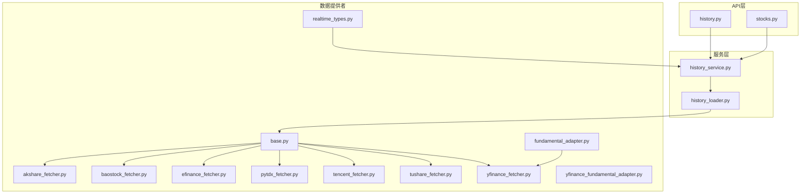
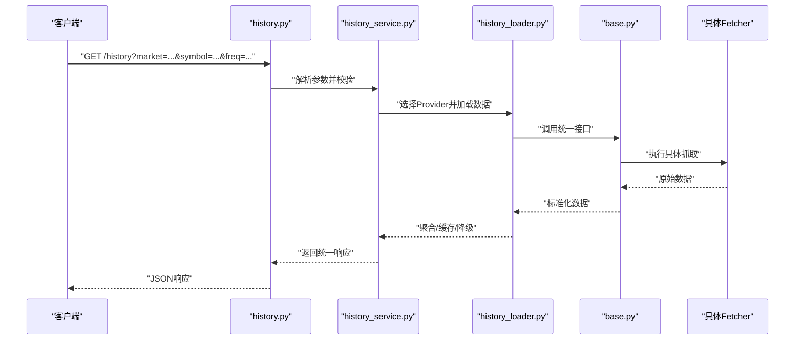
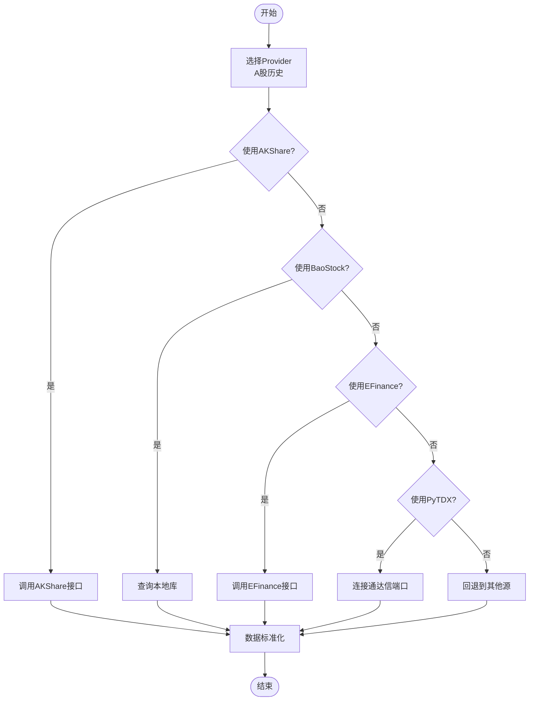
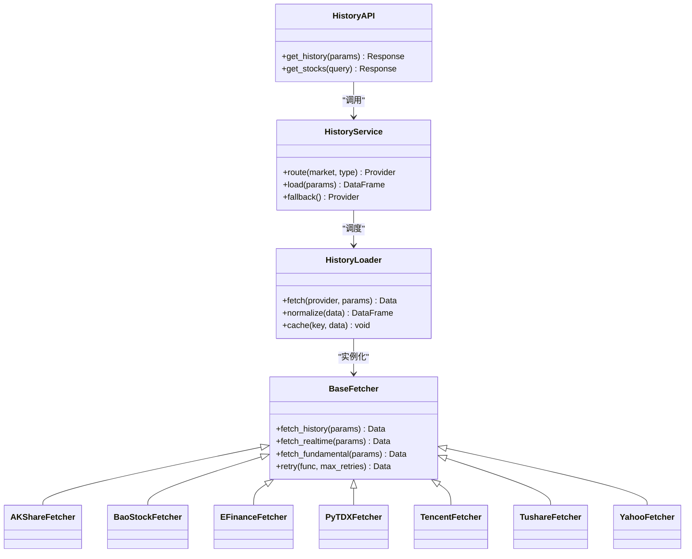
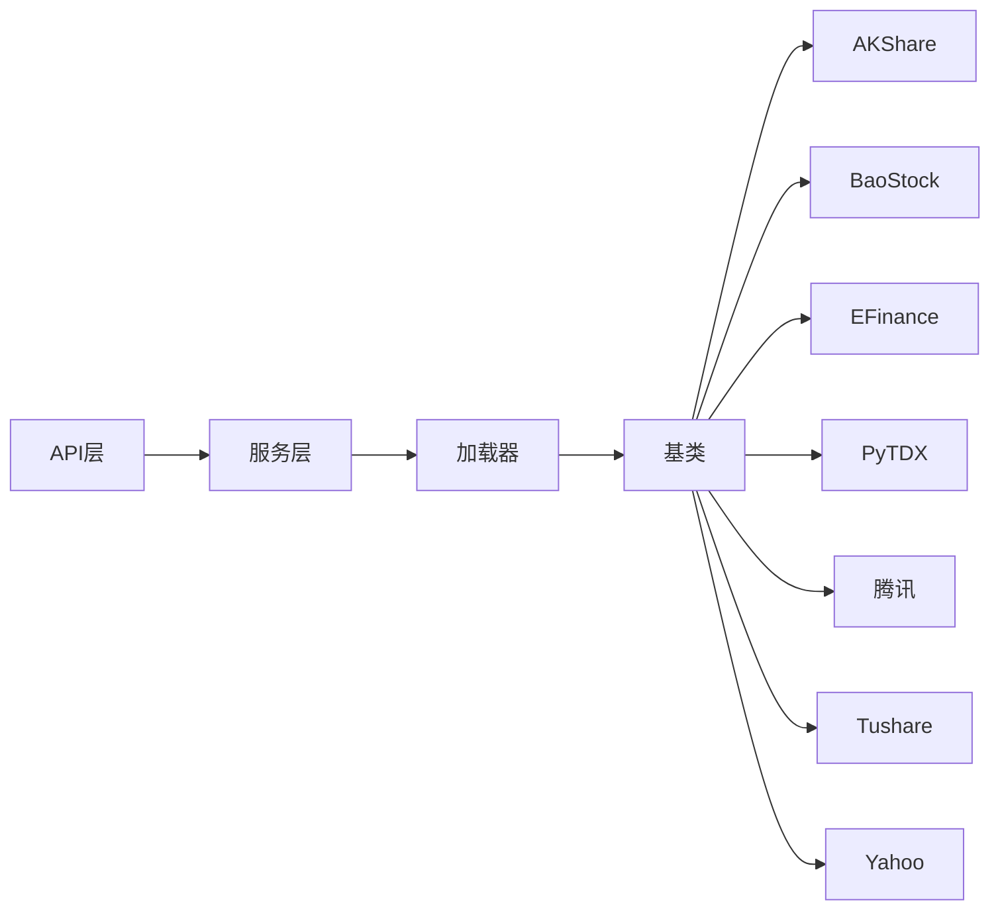

# 股票数据源

<cite>
**本文引用的文件**   
- [data_provider/base.py](file://data_provider/base.py)
- [data_provider/akshare_fetcher.py](file://data_provider/akshare_fetcher.py)
- [data_provider/baostock_fetcher.py](file://data_provider/baostock_fetcher.py)
- [data_provider/efinance_fetcher.py](file://data_provider/efinance_fetcher.py)
- [data_provider/pytdx_fetcher.py](file://data_provider/pytdx_fetcher.py)
- [data_provider/tencent_fetcher.py](file://data_provider/tencent_fetcher.py)
- [data_provider/tushare_fetcher.py](file://data_provider/tushare_fetcher.py)
- [data_provider/yfinance_fetcher.py](file://data_provider/yfinance_fetcher.py)
- [data_provider/fundamental_adapter.py](file://data_provider/fundamental_adapter.py)
- [data_provider/yfinance_fundamental_adapter.py](file://data_provider/yfinance_fundamental_adapter.py)
- [data_provider/realtime_types.py](file://data_provider/realtime_types.py)
- [api/v1/endpoints/history.py](file://api/v1/endpoints/history.py)
- [api/v1/endpoints/stocks.py](file://api/v1/endpoints/stocks.py)
- [services/history_service.py](file://services/history_service.py)
- [services/history_loader.py](file://services/history_loader.py)
- [src/services/stock_code_utils.py](file://src/services/stock_code_utils.py)
- [scripts/generate_stock_index.py](file://scripts/generate_stock_index.py)
</cite>

## 目录
1. [简介](#简介)
2. [项目结构](#项目结构)
3. [核心组件](#核心组件)
4. [架构总览](#架构总览)
5. [详细组件分析](#详细组件分析)
6. [依赖关系分析](#依赖关系分析)
7. [性能考量](#性能考量)
8. [故障排查指南](#故障排查指南)
9. [结论](#结论)
10. [附录](#附录)

## 简介
本文件面向“股票数据源”模块，系统性梳理A股、港股、美股等市场的数据获取实现。覆盖主流数据提供商（AKShare、BaoStock、EFinance、PyTDX、腾讯财经、Tushare、Yahoo Finance）的接入方式、API限制与配置参数；文档化历史数据、实时行情、基本面与财务指标的获取方法；并给出数据质量校验、异常处理与重试机制的实现要点，以及性能优化建议与最佳实践。

## 项目结构
数据源相关代码集中在 data_provider 目录，采用“统一抽象 + 多实现”的设计：
- base.py：定义统一的Fetcher接口与通用能力（如标准化输出、错误封装、重试策略）。
- 各provider实现：akshare_fetcher.py、baostock_fetcher.py、efinance_fetcher.py、pytdx_fetcher.py、tencent_fetcher.py、tushare_fetcher.py、yfinance_fetcher.py。
- 适配层：fundamental_adapter.py、yfinance_fundamental_adapter.py 用于将不同来源的基本面数据统一为内部模型。
- 类型定义：realtime_types.py 统一实时行情数据结构。
- API层：history.py、stocks.py 暴露历史与实时接口，调用服务层进行调度。
- 服务层：history_service.py、history_loader.py 负责数据路由、缓存、聚合与降级。
- 工具与脚本：stock_code_utils.py、generate_stock_index.py 提供代码映射与索引生成。

图表来源
- [api/v1/endpoints/history.py](file://api/v1/endpoints/history.py)
- [api/v1/endpoints/stocks.py](file://api/v1/endpoints/stocks.py)
- [services/history_service.py](file://services/history_service.py)
- [services/history_loader.py](file://services/history_loader.py)
- [data_provider/base.py](file://data_provider/base.py)
- [data_provider/akshare_fetcher.py](file://data_provider/akshare_fetcher.py)
- [data_provider/baostock_fetcher.py](file://data_provider/baostock_fetcher.py)
- [data_provider/efinance_fetcher.py](file://data_provider/efinance_fetcher.py)
- [data_provider/pytdx_fetcher.py](file://data_provider/pytdx_fetcher.py)
- [data_provider/tencent_fetcher.py](file://data_provider/tencent_fetcher.py)
- [data_provider/tushare_fetcher.py](file://data_provider/tushare_fetcher.py)
- [data_provider/yfinance_fetcher.py](file://data_provider/yfinance_fetcher.py)
- [data_provider/fundamental_adapter.py](file://data_provider/fundamental_adapter.py)
- [data_provider/yfinance_fundamental_adapter.py](file://data_provider/yfinance_fundamental_adapter.py)
- [data_provider/realtime_types.py](file://data_provider/realtime_types.py)

章节来源
- [data_provider/base.py](file://data_provider/base.py)
- [data_provider/akshare_fetcher.py](file://data_provider/akshare_fetcher.py)
- [data_provider/baostock_fetcher.py](file://data_provider/baostock_fetcher.py)
- [data_provider/efinance_fetcher.py](file://data_provider/efinance_fetcher.py)
- [data_provider/pytdx_fetcher.py](file://data_provider/pytdx_fetcher.py)
- [data_provider/tencent_fetcher.py](file://data_provider/tencent_fetcher.py)
- [data_provider/tushare_fetcher.py](file://data_provider/tushare_fetcher.py)
- [data_provider/yfinance_fetcher.py](file://data_provider/yfinance_fetcher.py)
- [data_provider/fundamental_adapter.py](file://data_provider/fundamental_adapter.py)
- [data_provider/yfinance_fundamental_adapter.py](file://data_provider/yfinance_fundamental_adapter.py)
- [data_provider/realtime_types.py](file://data_provider/realtime_types.py)
- [api/v1/endpoints/history.py](file://api/v1/endpoints/history.py)
- [api/v1/endpoints/stocks.py](file://api/v1/endpoints/stocks.py)
- [services/history_service.py](file://services/history_service.py)
- [services/history_loader.py](file://services/history_loader.py)

## 核心组件
- 统一抽象基类（base.py）
  - 定义统一的 fetch_history、fetch_realtime、fetch_fundamental 等方法签名与返回结构。
  - 提供通用错误封装、日志记录、重试装饰器/上下文管理器、限流控制。
  - 支持按市场（A股/港股/美股）与数据类型（日线/分钟线/基本面）的路由选择。
- 具体Provider实现
  - AKShare：适合A股历史与部分实时数据，注意请求频率与反爬限制。
  - BaoStock：A股历史数据稳定，免费但需安装本地库，更新频率有限。
  - EFinance：A股实时与历史，关注接口稳定性与字段一致性。
  - PyTDX：通过通达信协议拉取A股实时与历史，需要本地客户端或端口。
  - 腾讯财经：A股/港股实时行情，适合盘中快照，注意并发与封盘时间。
  - Tushare：A股/港股/美股基础数据，需Token与配额，注意积分与速率限制。
  - Yahoo Finance：美股/港股/指数广泛覆盖，注意网络与反爬策略。
- 基本面适配器
  - fundamental_adapter.py：统一多源财务指标到标准模型。
  - yfinance_fundamental_adapter.py：针对Yahoo财务数据的字段映射与清洗。
- 实时类型定义
  - realtime_types.py：统一实时报价、盘口、成交明细等数据结构。

章节来源
- [data_provider/base.py](file://data_provider/base.py)
- [data_provider/fundamental_adapter.py](file://data_provider/fundamental_adapter.py)
- [data_provider/yfinance_fundamental_adapter.py](file://data_provider/yfinance_fundamental_adapter.py)
- [data_provider/realtime_types.py](file://data_provider/realtime_types.py)

## 架构总览
整体采用分层解耦：API层接收请求，服务层根据市场与数据类型选择合适Provider，底层Fetcher执行网络请求与数据清洗，最终返回统一格式。

图表来源
- [api/v1/endpoints/history.py](file://api/v1/endpoints/history.py)
- [services/history_service.py](file://services/history_service.py)
- [services/history_loader.py](file://services/history_loader.py)
- [data_provider/base.py](file://data_provider/base.py)

## 详细组件分析

### 统一抽象与重试/限流（base.py）
- 设计要点
  - 统一接口：所有Fetcher继承基类，保证返回结构一致。
  - 重试机制：对网络抖动、临时限频进行指数退避重试。
  - 限流控制：按Provider设置QPS上限，避免触发反爬。
  - 错误分类：区分超时、认证失败、数据缺失、格式异常等，便于上层降级。
- 复杂度与性能
  - 重试默认最多3次，退避间隔随次数递增，避免雪崩。
  - 批量历史数据分片读取，减少单次内存占用。

章节来源
- [data_provider/base.py](file://data_provider/base.py)

### A股历史数据（AKShare、BaoStock、EFinance、PyTDX）
- AKShare
  - 适用场景：A股日线/周线/月线历史，部分分钟线。
  - 限制：请求频率受限，需合理休眠；部分接口需登录或Token。
  - 配置：网络超时、重试次数、代理设置。
- BaoStock
  - 适用场景：A股历史日K、复权因子、除权除息。
  - 限制：本地库依赖，更新延迟约T+1。
  - 配置：数据库连接、缓存路径。
- EFinance
  - 适用场景：A股历史与实时，资金流向。
  - 限制：接口变动频繁，需兼容字段差异。
  - 配置：请求头、Cookie、UA伪装。
- PyTDX
  - 适用场景：A股实时逐笔、分时、历史分钟线。
  - 限制：需本地通达信服务或端口开放。
  - 配置：服务器地址、端口、鉴权。

图表来源
- [data_provider/akshare_fetcher.py](file://data_provider/akshare_fetcher.py)
- [data_provider/baostock_fetcher.py](file://data_provider/baostock_fetcher.py)
- [data_provider/efinance_fetcher.py](file://data_provider/efinance_fetcher.py)
- [data_provider/pytdx_fetcher.py](file://data_provider/pytdx_fetcher.py)

章节来源
- [data_provider/akshare_fetcher.py](file://data_provider/akshare_fetcher.py)
- [data_provider/baostock_fetcher.py](file://data_provider/baostock_fetcher.py)
- [data_provider/efinance_fetcher.py](file://data_provider/efinance_fetcher.py)
- [data_provider/pytdx_fetcher.py](file://data_provider/pytdx_fetcher.py)

### 港股与美股（Yahoo Finance、Tushare、腾讯财经）
- Yahoo Finance
  - 适用场景：美股/港股历史与实时，财报摘要。
  - 限制：网络波动、反爬策略严格，需代理与重试。
  - 配置：地区、时区、货币单位转换。
- Tushare
  - 适用场景：A股/港股/美股基础数据，财务指标。
  - 限制：Token配额、积分限制、频率控制。
  - 配置：Token、Pro接口开关、缓存策略。
- 腾讯财经
  - 适用场景：A股/港股实时行情快照。
  - 限制：盘中高频访问易被封，需限流与轮询间隔。
  - 配置：URL模板、字段映射、超时。

章节来源
- [data_provider/yfinance_fetcher.py](file://data_provider/yfinance_fetcher.py)
- [data_provider/tushare_fetcher.py](file://data_provider/tushare_fetcher.py)
- [data_provider/tencent_fetcher.py](file://data_provider/tencent_fetcher.py)

### 实时行情与类型定义（realtime_types.py）
- 统一结构
  - 报价：最新价、涨跌幅、成交量、成交额。
  - 盘口：买卖五档、委托队列。
  - 成交明细：逐笔成交、方向标记。
- 数据来源
  - 腾讯财经：盘中快照，低延迟。
  - PyTDX：逐笔与分时，高吞吐。
  - Yahoo/Tushare：延时或收盘后汇总。

章节来源
- [data_provider/realtime_types.py](file://data_provider/realtime_types.py)
- [data_provider/tencent_fetcher.py](file://data_provider/tencent_fetcher.py)
- [data_provider/pytdx_fetcher.py](file://data_provider/pytdx_fetcher.py)

### 基本面与财务指标（fundamental_adapter.py、yfinance_fundamental_adapter.py）
- 统一模型
  - 公司基本信息：名称、行业、上市日期。
  - 财务报表：利润表、资产负债表、现金流量表关键项。
  - 估值指标：PE、PB、ROE、股息率。
- 适配逻辑
  - 字段映射：不同Provider字段名不一致，统一映射为标准键。
  - 数据清洗：缺失值填充、单位换算、币种转换。
  - 版本兼容：接口变更时的向后兼容处理。

章节来源
- [data_provider/fundamental_adapter.py](file://data_provider/fundamental_adapter.py)
- [data_provider/yfinance_fundamental_adapter.py](file://data_provider/yfinance_fundamental_adapter.py)

### API与服务层集成（history.py、stocks.py、history_service.py、history_loader.py）
- API层
  - history.py：历史数据查询，支持多市场、多频率、多字段。
  - stocks.py：股票列表、搜索、基本信息。
- 服务层
  - history_service.py：参数校验、Provider路由、缓存命中、降级策略。
  - history_loader.py：实际数据加载、合并、去重、排序。

图表来源
- [api/v1/endpoints/history.py](file://api/v1/endpoints/history.py)
- [api/v1/endpoints/stocks.py](file://api/v1/endpoints/stocks.py)
- [services/history_service.py](file://services/history_service.py)
- [services/history_loader.py](file://services/history_loader.py)
- [data_provider/base.py](file://data_provider/base.py)

章节来源
- [api/v1/endpoints/history.py](file://api/v1/endpoints/history.py)
- [api/v1/endpoints/stocks.py](file://api/v1/endpoints/stocks.py)
- [services/history_service.py](file://services/history_service.py)
- [services/history_loader.py](file://services/history_loader.py)

## 依赖关系分析
- Provider间耦合度低，通过基类抽象隔离变化。
- 服务层集中管理Provider选择与降级，避免硬编码。
- 外部依赖：网络库、本地库（BaoStock）、第三方SDK（Tushare/Yahoo）。
- 潜在循环依赖：无直接循环，通过接口解耦。

图表来源
- [api/v1/endpoints/history.py](file://api/v1/endpoints/history.py)
- [services/history_service.py](file://services/history_service.py)
- [services/history_loader.py](file://services/history_loader.py)
- [data_provider/base.py](file://data_provider/base.py)

章节来源
- [data_provider/base.py](file://data_provider/base.py)
- [services/history_service.py](file://services/history_service.py)
- [services/history_loader.py](file://services/history_loader.py)

## 性能考量
- 缓存策略
  - 历史数据按“市场+标的+频率+时间范围”作为键，短期缓存提升命中率。
  - 实时行情短TTL缓存，避免重复请求。
- 并发与限流
  - 批量历史数据分片并行请求，单Provider内串行避免触发限频。
  - 全局QPS限制，动态调整重试间隔。
- 数据分片与增量更新
  - 大区间历史拆分为多个小段，降低内存峰值。
  - 增量更新仅拉取新增交易日数据。
- 连接池与复用
  - HTTP连接池复用，减少握手开销。
  - 本地库连接池（BaoStock）避免频繁建连。

[本节为通用指导，不直接分析具体文件]

## 故障排查指南
- 常见问题
  - 网络超时：检查代理、DNS、防火墙；增加超时与重试。
  - 限频封禁：降低请求频率，启用指数退避；切换备用Provider。
  - 数据缺失：校验时间范围、交易日历、复权状态；检查字段映射。
  - 认证失败：确认Token有效期、权限等级；刷新凭证。
- 诊断步骤
  - 开启详细日志，记录请求URL、参数、响应码、耗时。
  - 使用健康检查接口验证Provider可用性。
  - 对比多Provider结果，定位数据一致性。
- 恢复策略
  - 自动降级：主Provider失败时切换到备用源。
  - 熔断保护：连续失败后暂停请求，等待恢复。
  - 告警通知：关键错误上报监控平台。

章节来源
- [data_provider/base.py](file://data_provider/base.py)
- [services/history_service.py](file://services/history_service.py)

## 结论
本项目通过统一抽象与多Provider实现，构建了灵活、健壮的股票数据获取体系。覆盖A股、港股、美股的历史、实时、基本面数据，具备完善的错误处理、重试与降级机制。通过缓存、并发、分片等优化手段，保障在高并发场景下的性能与稳定性。建议在生产环境中结合监控与告警，持续优化Provider选择策略与数据质量校验流程。

[本节为总结性内容，不直接分析具体文件]

## 附录
- 配置示例与环境变量
  - Token与密钥：Tushare、Yahoo等需配置认证信息。
  - 网络设置：代理、超时、重试次数、QPS限制。
  - 本地依赖：BaoStock数据库路径、PyTDX端口。
- 数据质量校验
  - 完整性：必填字段非空、时间序列连续。
  - 合理性：价格非负、成交量非负、涨跌幅范围。
  - 一致性：多Provider交叉验证，偏差阈值告警。
- 最佳实践
  - 优先使用本地缓存，减少外部依赖。
  - 合理拆分请求，避免单点过载。
  - 定期更新字段映射，适配接口变更。
  - 建立Provider健康度评分，动态路由。

[本节为补充说明，不直接分析具体文件]