# 前端架构设计

<cite>
**本文引用的文件**   
- [apps/dsa-web/src/App.tsx](file://apps/dsa-web/src/App.tsx)
- [apps/dsa-web/src/main.tsx](file://apps/dsa-web/src/main.tsx)
- [apps/dsa-web/vite.config.ts](file://apps/dsa-web/vite.config.ts)
- [apps/dsa-web/package.json](file://apps/dsa-web/package.json)
- [apps/dsa-web/tailwind.config.js](file://apps/dsa-web/tailwind.config.js)
- [apps/dsa-web/tsconfig.app.json](file://apps/dsa-web/tsconfig.app.json)
- [apps/dsa-web/index.html](file://apps/dsa-web/index.html)
- [apps/dsa-desktop/main.js](file://apps/dsa-desktop/main.js)
- [apps/dsa-desktop/preload.js](file://apps/dsa-desktop/preload.js)
- [apps/dsa-desktop/package.json](file://apps/dsa-desktop/package.json)
- [apps/dsa-web/src/components/layout/Shell.tsx](file://apps/dsa-web/src/components/layout/Shell.tsx)
- [apps/dsa-web/src/components/layout/RouteBoundary.tsx](file://apps/dsa-web/src/components/layout/RouteBoundary.tsx)
- [apps/dsa-web/src/components/theme/ThemeProvider.tsx](file://apps/dsa-web/src/components/theme/ThemeProvider.tsx)
- [apps/dsa-web/src/components/i18n/UiLanguageToggle.tsx](file://apps/dsa-web/src/components/i18n/UiLanguageToggle.tsx)
- [apps/dsa-web/src/contexts/AuthContext.tsx](file://apps/dsa-web/src/contexts/AuthContext.tsx)
- [apps/dsa-web/src/contexts/UiLanguageContext.tsx](file://apps/dsa-web/src/contexts/UiLanguageContext.tsx)
- [apps/dsa-web/src/hooks/useAuth.ts](file://apps/dsa-web/src/hooks/useAuth.ts)
- [apps/dsa-web/src/api/index.ts](file://apps/dsa-web/src/api/index.ts)
- [apps/dsa-web/src/api/auth.ts](file://apps/dsa-web/src/api/auth.ts)
- [apps/dsa-web/src/api/utils.ts](file://apps/dsa-web/src/api/utils.ts)
- [apps/dsa-web/src/stores/index.ts](file://apps/dsa-web/src/stores/index.ts)
- [apps/dsa-web/src/stores/analysisStore.ts](file://apps/dsa-web/src/stores/analysisStore.ts)
- [apps/dsa-web/src/pages/HomePage.tsx](file://apps/dsa-web/src/pages/HomePage.tsx)
- [apps/dsa-web/src/pages/LoginPage.tsx](file://apps/dsa-web/src/pages/LoginPage.tsx)
- [apps/dsa-web/src/pages/SettingsPage.tsx](file://apps/dsa-web/src/pages/SettingsPage.tsx)
</cite>

## 目录
1. [简介](#简介)
2. [项目结构](#项目结构)
3. [核心组件](#核心组件)
4. [架构总览](#架构总览)
5. [详细组件分析](#详细组件分析)
6. [依赖关系分析](#依赖关系分析)
7. [性能考虑](#性能考虑)
8. [故障排查指南](#故障排查指南)
9. [结论](#结论)
10. [附录](#附录)

## 简介
本文件面向基于 React + TypeScript 的前端应用，系统化阐述 Web 与桌面（Electron）双端架构、组件化设计、状态管理、路由组织、API 集成层、主题系统、国际化与响应式实现，并给出构建配置、开发环境设置与性能优化策略。文档同时提供架构图、组件关系图与部署流程说明，帮助读者快速理解并高效扩展该前端工程。

## 项目结构
前端代码位于 apps 目录下，包含两个子应用：
- dsa-web：Web 应用，使用 Vite + React + TypeScript + Tailwind CSS，模块化组织页面、组件、上下文、Hooks、API 层与状态存储。
- dsa-desktop：Electron 桌面应用，通过 main 进程加载 Web 资源，使用 preload 脚本暴露安全 API 给渲染进程。

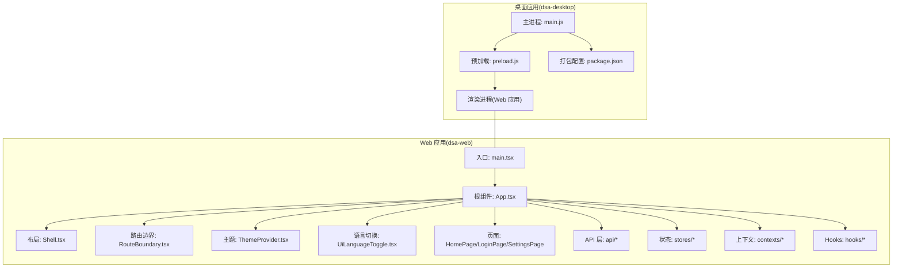

图表来源
- [apps/dsa-web/src/main.tsx](file://apps/dsa-web/src/main.tsx)
- [apps/dsa-web/src/App.tsx](file://apps/dsa-web/src/App.tsx)
- [apps/dsa-web/src/components/layout/Shell.tsx](file://apps/dsa-web/src/components/layout/Shell.tsx)
- [apps/dsa-web/src/components/layout/RouteBoundary.tsx](file://apps/dsa-web/src/components/layout/RouteBoundary.tsx)
- [apps/dsa-web/src/components/theme/ThemeProvider.tsx](file://apps/dsa-web/src/components/theme/ThemeProvider.tsx)
- [apps/dsa-web/src/components/i18n/UiLanguageToggle.tsx](file://apps/dsa-web/src/components/i18n/UiLanguageToggle.tsx)
- [apps/dsa-web/src/pages/HomePage.tsx](file://apps/dsa-web/src/pages/HomePage.tsx)
- [apps/dsa-web/src/pages/LoginPage.tsx](file://apps/dsa-web/src/pages/LoginPage.tsx)
- [apps/dsa-web/src/pages/SettingsPage.tsx](file://apps/dsa-web/src/pages/SettingsPage.tsx)
- [apps/dsa-web/src/api/index.ts](file://apps/dsa-web/src/api/index.ts)
- [apps/dsa-web/src/stores/index.ts](file://apps/dsa-web/src/stores/index.ts)
- [apps/dsa-web/src/contexts/AuthContext.tsx](file://apps/dsa-web/src/contexts/AuthContext.tsx)
- [apps/dsa-web/src/hooks/useAuth.ts](file://apps/dsa-web/src/hooks/useAuth.ts)
- [apps/dsa-desktop/main.js](file://apps/dsa-desktop/main.js)
- [apps/dsa-desktop/preload.js](file://apps/dsa-desktop/preload.js)
- [apps/dsa-desktop/package.json](file://apps/dsa-desktop/package.json)

章节来源
- [apps/dsa-web/package.json](file://apps/dsa-web/package.json)
- [apps/dsa-web/vite.config.ts](file://apps/dsa-web/vite.config.ts)
- [apps/dsa-web/index.html](file://apps/dsa-web/index.html)
- [apps/dsa-web/tailwind.config.js](file://apps/dsa-web/tailwind.config.js)
- [apps/dsa-web/tsconfig.app.json](file://apps/dsa-web/tsconfig.app.json)

## 核心组件
- 应用入口与根组件
  - main.tsx：初始化 React 应用、挂载到 DOM、注册全局样式与插件。
  - App.tsx：组合布局、路由、主题、国际化等顶层能力，作为应用装配中心。
- 布局与导航
  - Shell.tsx：应用外壳，承载头部、侧边栏与内容区域，统一页面容器行为。
  - RouteBoundary.tsx：路由边界封装，处理加载态、错误态与权限守卫。
- 主题与国际化
  - ThemeProvider.tsx：主题上下文提供者，集中管理明暗主题与样式变量。
  - UiLanguageToggle.tsx：UI 语言切换入口，结合上下文切换文案。
- 上下文与 Hooks
  - AuthContext.tsx：认证上下文，维护登录态与用户信息。
  - useAuth.ts：认证 Hook，封装鉴权逻辑与状态访问。
  - UiLanguageContext.tsx：语言上下文，管理当前 UI 语言与切换方法。
- API 集成层
  - api/index.ts：聚合导出各模块 API 客户端。
  - api/auth.ts：认证相关接口封装。
  - api/utils.ts：请求工具（如拦截器、错误处理、序列化）。
- 状态管理
  - stores/index.ts：状态模块聚合导出。
  - analysisStore.ts：分析相关状态（示例），展示按功能域拆分状态的模式。
- 页面
  - HomePage.tsx、LoginPage.tsx、SettingsPage.tsx：典型页面示例，体现页面级职责与数据流。

章节来源
- [apps/dsa-web/src/main.tsx](file://apps/dsa-web/src/main.tsx)
- [apps/dsa-web/src/App.tsx](file://apps/dsa-web/src/App.tsx)
- [apps/dsa-web/src/components/layout/Shell.tsx](file://apps/dsa-web/src/components/layout/Shell.tsx)
- [apps/dsa-web/src/components/layout/RouteBoundary.tsx](file://apps/dsa-web/src/components/layout/RouteBoundary.tsx)
- [apps/dsa-web/src/components/theme/ThemeProvider.tsx](file://apps/dsa-web/src/components/theme/ThemeProvider.tsx)
- [apps/dsa-web/src/components/i18n/UiLanguageToggle.tsx](file://apps/dsa-web/src/components/i18n/UiLanguageToggle.tsx)
- [apps/dsa-web/src/contexts/AuthContext.tsx](file://apps/dsa-web/src/contexts/AuthContext.tsx)
- [apps/dsa-web/src/hooks/useAuth.ts](file://apps/dsa-web/src/hooks/useAuth.ts)
- [apps/dsa-web/src/contexts/UiLanguageContext.tsx](file://apps/dsa-web/src/contexts/UiLanguageContext.tsx)
- [apps/dsa-web/src/api/index.ts](file://apps/dsa-web/src/api/index.ts)
- [apps/dsa-web/src/api/auth.ts](file://apps/dsa-web/src/api/auth.ts)
- [apps/dsa-web/src/api/utils.ts](file://apps/dsa-web/src/api/utils.ts)
- [apps/dsa-web/src/stores/index.ts](file://apps/dsa-web/src/stores/index.ts)
- [apps/dsa-web/src/stores/analysisStore.ts](file://apps/dsa-web/src/stores/analysisStore.ts)
- [apps/dsa-web/src/pages/HomePage.tsx](file://apps/dsa-web/src/pages/HomePage.tsx)
- [apps/dsa-web/src/pages/LoginPage.tsx](file://apps/dsa-web/src/pages/LoginPage.tsx)
- [apps/dsa-web/src/pages/SettingsPage.tsx](file://apps/dsa-web/src/pages/SettingsPage.tsx)

## 架构总览
整体采用“分层 + 领域”的混合组织方式：
- 表现层：页面与通用组件，遵循单一职责与可复用原则。
- 交互层：Hooks 与上下文，封装业务交互与跨组件共享状态。
- 数据层：API 客户端与状态存储，负责网络请求与持久化/缓存。
- 平台层：Web 与 Electron 双端适配，统一渲染与能力暴露。

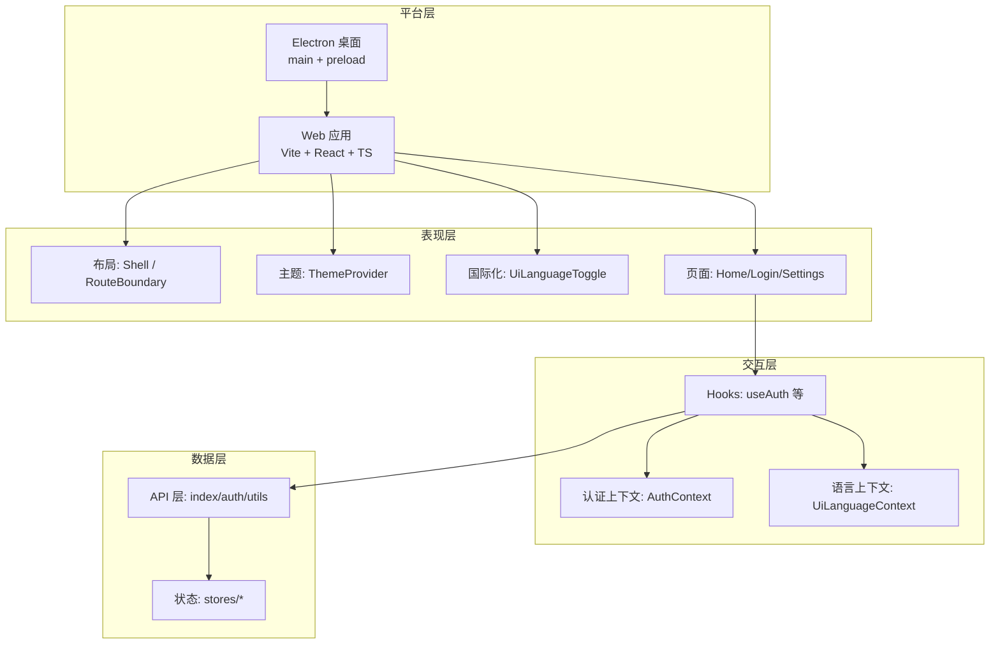

图表来源
- [apps/dsa-web/src/App.tsx](file://apps/dsa-web/src/App.tsx)
- [apps/dsa-web/src/components/layout/Shell.tsx](file://apps/dsa-web/src/components/layout/Shell.tsx)
- [apps/dsa-web/src/components/layout/RouteBoundary.tsx](file://apps/dsa-web/src/components/layout/RouteBoundary.tsx)
- [apps/dsa-web/src/components/theme/ThemeProvider.tsx](file://apps/dsa-web/src/components/theme/ThemeProvider.tsx)
- [apps/dsa-web/src/components/i18n/UiLanguageToggle.tsx](file://apps/dsa-web/src/components/i18n/UiLanguageToggle.tsx)
- [apps/dsa-web/src/contexts/AuthContext.tsx](file://apps/dsa-web/src/contexts/AuthContext.tsx)
- [apps/dsa-web/src/contexts/UiLanguageContext.tsx](file://apps/dsa-web/src/contexts/UiLanguageContext.tsx)
- [apps/dsa-web/src/hooks/useAuth.ts](file://apps/dsa-web/src/hooks/useAuth.ts)
- [apps/dsa-web/src/api/index.ts](file://apps/dsa-web/src/api/index.ts)
- [apps/dsa-web/src/stores/index.ts](file://apps/dsa-web/src/stores/index.ts)
- [apps/dsa-desktop/main.js](file://apps/dsa-desktop/main.js)
- [apps/dsa-desktop/preload.js](file://apps/dsa-desktop/preload.js)

## 详细组件分析

### 应用入口与根组件
- main.tsx：创建 React 根节点、注入全局样式与插件、启动应用生命周期。
- App.tsx：组合路由、布局、主题、国际化与错误边界；作为装配中心协调各子系统。

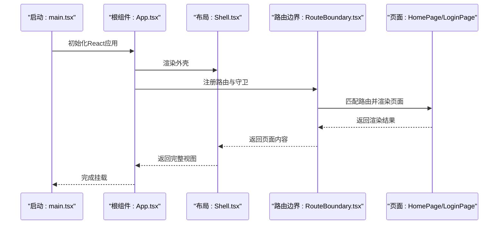

图表来源
- [apps/dsa-web/src/main.tsx](file://apps/dsa-web/src/main.tsx)
- [apps/dsa-web/src/App.tsx](file://apps/dsa-web/src/App.tsx)
- [apps/dsa-web/src/components/layout/Shell.tsx](file://apps/dsa-web/src/components/layout/Shell.tsx)
- [apps/dsa-web/src/components/layout/RouteBoundary.tsx](file://apps/dsa-web/src/components/layout/RouteBoundary.tsx)
- [apps/dsa-web/src/pages/HomePage.tsx](file://apps/dsa-web/src/pages/HomePage.tsx)
- [apps/dsa-web/src/pages/LoginPage.tsx](file://apps/dsa-web/src/pages/LoginPage.tsx)

章节来源
- [apps/dsa-web/src/main.tsx](file://apps/dsa-web/src/main.tsx)
- [apps/dsa-web/src/App.tsx](file://apps/dsa-web/src/App.tsx)

### 布局与路由边界
- Shell.tsx：定义应用骨架（头部、侧边栏、内容区），统一管理页面容器行为与响应式布局。
- RouteBoundary.tsx：封装路由加载、错误捕获与权限校验，确保页面级健壮性。

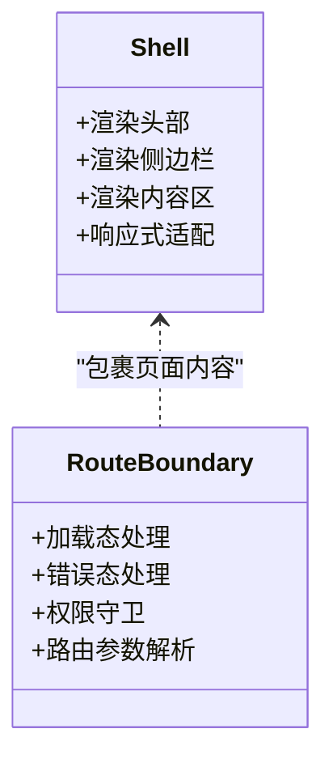

图表来源
- [apps/dsa-web/src/components/layout/Shell.tsx](file://apps/dsa-web/src/components/layout/Shell.tsx)
- [apps/dsa-web/src/components/layout/RouteBoundary.tsx](file://apps/dsa-web/src/components/layout/RouteBoundary.tsx)

章节来源
- [apps/dsa-web/src/components/layout/Shell.tsx](file://apps/dsa-web/src/components/layout/Shell.tsx)
- [apps/dsa-web/src/components/layout/RouteBoundary.tsx](file://apps/dsa-web/src/components/layout/RouteBoundary.tsx)

### 主题系统与国际化
- ThemeProvider.tsx：提供主题上下文，支持明暗主题切换与样式变量注入。
- UiLanguageToggle.tsx：提供语言切换入口，结合 UiLanguageContext 动态更新界面文案。

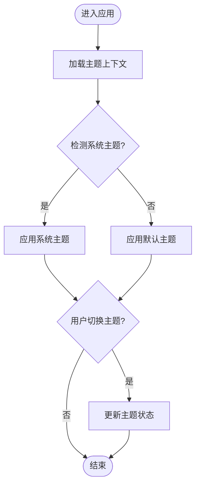

图表来源
- [apps/dsa-web/src/components/theme/ThemeProvider.tsx](file://apps/dsa-web/src/components/theme/ThemeProvider.tsx)
- [apps/dsa-web/src/components/i18n/UiLanguageToggle.tsx](file://apps/dsa-web/src/components/i18n/UiLanguageToggle.tsx)
- [apps/dsa-web/src/contexts/UiLanguageContext.tsx](file://apps/dsa-web/src/contexts/UiLanguageContext.tsx)

章节来源
- [apps/dsa-web/src/components/theme/ThemeProvider.tsx](file://apps/dsa-web/src/components/theme/ThemeProvider.tsx)
- [apps/dsa-web/src/components/i18n/UiLanguageToggle.tsx](file://apps/dsa-web/src/components/i18n/UiLanguageToggle.tsx)
- [apps/dsa-web/src/contexts/UiLanguageContext.tsx](file://apps/dsa-web/src/contexts/UiLanguageContext.tsx)

### 认证上下文与 Hooks
- AuthContext.tsx：维护登录态、用户信息与鉴权方法，供全应用订阅。
- useAuth.ts：封装认证逻辑，提供便捷的状态读取与操作钩子。

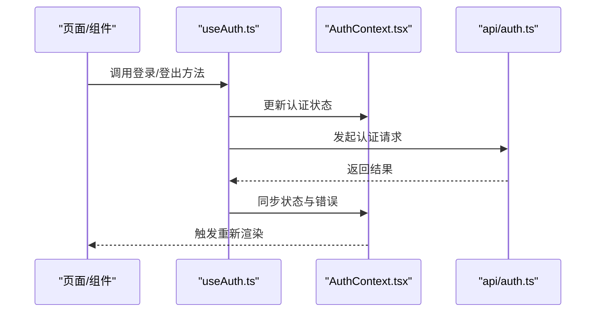

图表来源
- [apps/dsa-web/src/hooks/useAuth.ts](file://apps/dsa-web/src/hooks/useAuth.ts)
- [apps/dsa-web/src/contexts/AuthContext.tsx](file://apps/dsa-web/src/contexts/AuthContext.tsx)
- [apps/dsa-web/src/api/auth.ts](file://apps/dsa-web/src/api/auth.ts)

章节来源
- [apps/dsa-web/src/hooks/useAuth.ts](file://apps/dsa-web/src/hooks/useAuth.ts)
- [apps/dsa-web/src/contexts/AuthContext.tsx](file://apps/dsa-web/src/contexts/AuthContext.tsx)
- [apps/dsa-web/src/api/auth.ts](file://apps/dsa-web/src/api/auth.ts)

### API 集成层
- api/index.ts：统一导出各模块 API 客户端，便于页面与 Hooks 引用。
- api/auth.ts：认证相关接口封装，包括登录、登出、刷新令牌等。
- api/utils.ts：请求工具（如基础 URL、拦截器、错误处理、序列化）。

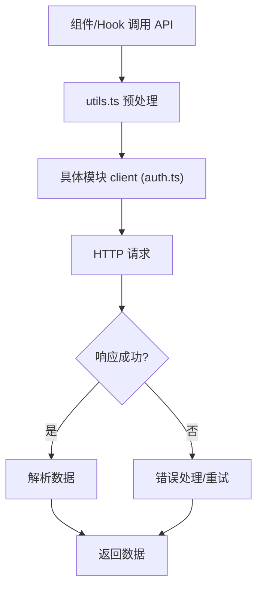

图表来源
- [apps/dsa-web/src/api/index.ts](file://apps/dsa-web/src/api/index.ts)
- [apps/dsa-web/src/api/auth.ts](file://apps/dsa-web/src/api/auth.ts)
- [apps/dsa-web/src/api/utils.ts](file://apps/dsa-web/src/api/utils.ts)

章节来源
- [apps/dsa-web/src/api/index.ts](file://apps/dsa-web/src/api/index.ts)
- [apps/dsa-web/src/api/auth.ts](file://apps/dsa-web/src/api/auth.ts)
- [apps/dsa-web/src/api/utils.ts](file://apps/dsa-web/src/api/utils.ts)

### 状态管理
- stores/index.ts：聚合导出状态模块，保持清晰的模块边界。
- analysisStore.ts：以分析功能为例，展示按领域拆分状态的组织方式。

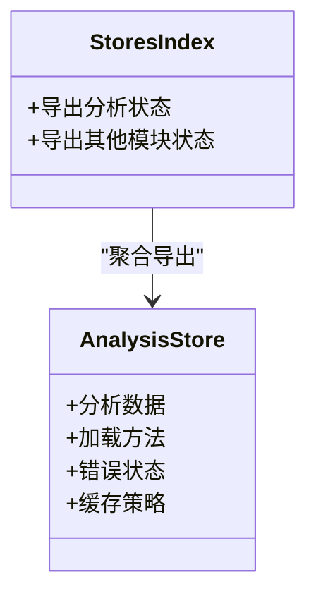

图表来源
- [apps/dsa-web/src/stores/index.ts](file://apps/dsa-web/src/stores/index.ts)
- [apps/dsa-web/src/stores/analysisStore.ts](file://apps/dsa-web/src/stores/analysisStore.ts)

章节来源
- [apps/dsa-web/src/stores/index.ts](file://apps/dsa-web/src/stores/index.ts)
- [apps/dsa-web/src/stores/analysisStore.ts](file://apps/dsa-web/src/stores/analysisStore.ts)

### 页面组件
- HomePage.tsx：首页示例，展示数据获取、状态展示与交互。
- LoginPage.tsx：登录页示例，体现认证流程与表单处理。
- SettingsPage.tsx：设置页示例，展示配置管理与变更反馈。

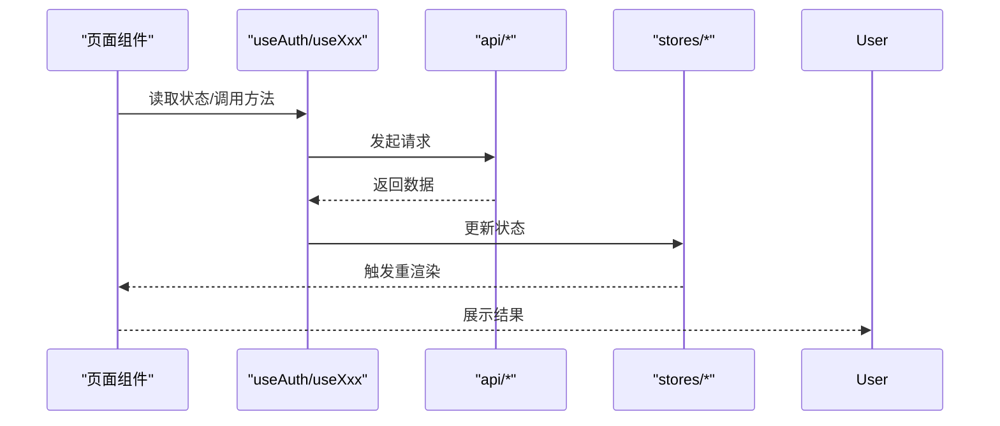

图表来源
- [apps/dsa-web/src/pages/HomePage.tsx](file://apps/dsa-web/src/pages/HomePage.tsx)
- [apps/dsa-web/src/pages/LoginPage.tsx](file://apps/dsa-web/src/pages/LoginPage.tsx)
- [apps/dsa-web/src/pages/SettingsPage.tsx](file://apps/dsa-web/src/pages/SettingsPage.tsx)
- [apps/dsa-web/src/hooks/useAuth.ts](file://apps/dsa-web/src/hooks/useAuth.ts)
- [apps/dsa-web/src/api/index.ts](file://apps/dsa-web/src/api/index.ts)
- [apps/dsa-web/src/stores/index.ts](file://apps/dsa-web/src/stores/index.ts)

章节来源
- [apps/dsa-web/src/pages/HomePage.tsx](file://apps/dsa-web/src/pages/HomePage.tsx)
- [apps/dsa-web/src/pages/LoginPage.tsx](file://apps/dsa-web/src/pages/LoginPage.tsx)
- [apps/dsa-web/src/pages/SettingsPage.tsx](file://apps/dsa-web/src/pages/SettingsPage.tsx)

### Web 与桌面应用差异与 Electron 集成
- Web 应用：由 Vite 构建静态资源，浏览器直接运行。
- 桌面应用：Electron 主进程加载 Web 资源，preload 脚本桥接 Node 能力，保证安全隔离。

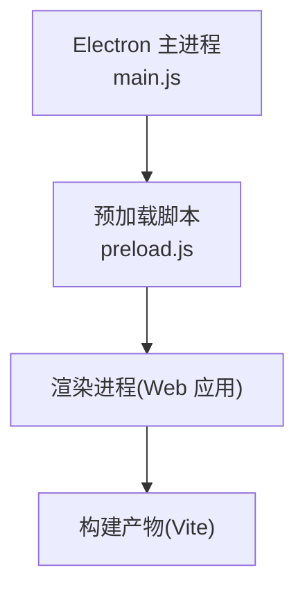

图表来源
- [apps/dsa-desktop/main.js](file://apps/dsa-desktop/main.js)
- [apps/dsa-desktop/preload.js](file://apps/dsa-desktop/preload.js)
- [apps/dsa-web/vite.config.ts](file://apps/dsa-web/vite.config.ts)

章节来源
- [apps/dsa-desktop/main.js](file://apps/dsa-desktop/main.js)
- [apps/dsa-desktop/preload.js](file://apps/dsa-desktop/preload.js)
- [apps/dsa-desktop/package.json](file://apps/dsa-desktop/package.json)
- [apps/dsa-web/vite.config.ts](file://apps/dsa-web/vite.config.ts)

## 依赖关系分析
- 构建与工具链：Vite、TypeScript、Tailwind CSS、测试框架（Vitest/Playwright）。
- 运行时依赖：React、React Router（若使用）、状态库（按需引入）。
- 桌面依赖：Electron、打包工具（electron-builder）。

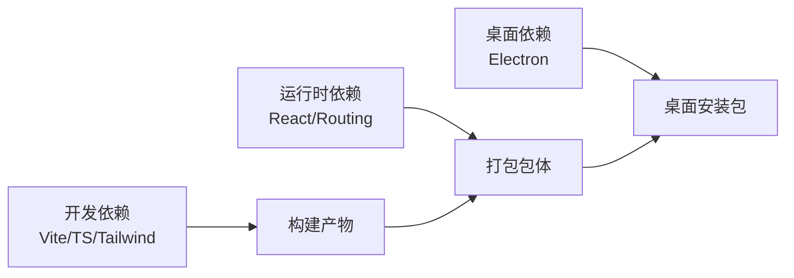

图表来源
- [apps/dsa-web/package.json](file://apps/dsa-web/package.json)
- [apps/dsa-web/vite.config.ts](file://apps/dsa-web/vite.config.ts)
- [apps/dsa-web/tailwind.config.js](file://apps/dsa-web/tailwind.config.js)
- [apps/dsa-web/tsconfig.app.json](file://apps/dsa-web/tsconfig.app.json)
- [apps/dsa-desktop/package.json](file://apps/dsa-desktop/package.json)

章节来源
- [apps/dsa-web/package.json](file://apps/dsa-web/package.json)
- [apps/dsa-web/vite.config.ts](file://apps/dsa-web/vite.config.ts)
- [apps/dsa-web/tailwind.config.js](file://apps/dsa-web/tailwind.config.js)
- [apps/dsa-web/tsconfig.app.json](file://apps/dsa-web/tsconfig.app.json)
- [apps/dsa-desktop/package.json](file://apps/dsa-desktop/package.json)

## 性能考虑
- 构建优化
  - 使用 Vite 的分块与懒加载，减少首屏体积。
  - 启用 Tree Shaking 与压缩，剔除未使用代码。
  - 静态资源 CDN 与缓存策略，提升加载速度。
- 运行时优化
  - 组件级懒加载与路由级代码分割。
  - 列表虚拟化与分页加载，避免大列表卡顿。
  - 请求去抖/节流与缓存策略，降低重复请求。
- 主题与国际化
  - 主题变量按需注入，避免全局样式膨胀。
  - 多语言文件按需加载，减少初始包体。
- 桌面端优化
  - 主进程与渲染进程职责分离，避免阻塞渲染。
  - 合理暴露 Node API，限制敏感能力访问。

[本节为通用指导，不直接分析具体文件]

## 故障排查指南
- 常见问题定位
  - 路由跳转失败：检查 RouteBoundary 的错误捕获与权限守卫逻辑。
  - 认证失败：核对 AuthContext 状态与 api/auth.ts 的请求链路。
  - 主题/语言异常：确认 ThemeProvider 与 UiLanguageContext 的上下文传递。
  - 构建报错：检查 vite.config.ts 与 tsconfig.app.json 的配置一致性。
- 调试建议
  - 使用浏览器开发者工具与 React DevTools 定位渲染问题。
  - 在 Electron 中启用主/渲染进程日志，区分平台差异。
  - 对 API 层增加请求/响应日志，辅助网络问题排查。

章节来源
- [apps/dsa-web/src/components/layout/RouteBoundary.tsx](file://apps/dsa-web/src/components/layout/RouteBoundary.tsx)
- [apps/dsa-web/src/contexts/AuthContext.tsx](file://apps/dsa-web/src/contexts/AuthContext.tsx)
- [apps/dsa-web/src/api/auth.ts](file://apps/dsa-web/src/api/auth.ts)
- [apps/dsa-web/src/components/theme/ThemeProvider.tsx](file://apps/dsa-web/src/components/theme/ThemeProvider.tsx)
- [apps/dsa-web/src/contexts/UiLanguageContext.tsx](file://apps/dsa-web/src/contexts/UiLanguageContext.tsx)
- [apps/dsa-web/vite.config.ts](file://apps/dsa-web/vite.config.ts)
- [apps/dsa-web/tsconfig.app.json](file://apps/dsa-web/tsconfig.app.json)

## 结论
本前端架构以 React + TypeScript 为核心，结合 Vite 构建与 Tailwind 样式体系，形成清晰的分层与模块化组织。通过上下文与 Hooks 实现跨组件状态共享，API 层与状态存储解耦，保障可维护性与可扩展性。Web 与桌面双端通过 Electron 集成，统一渲染体验并兼顾平台能力。配合完善的主题、国际化与响应式设计，满足复杂业务场景需求。建议在持续迭代中强化性能监控、错误上报与自动化测试，进一步提升稳定性与交付效率。

[本节为总结性内容，不直接分析具体文件]

## 附录
- 构建与开发环境
  - 安装依赖：参考 package.json 中的脚本命令。
  - 本地开发：启动 Vite 开发服务器，热重载与调试。
  - 构建产物：生成静态资源，用于 Web 部署或 Electron 打包。
- 部署流程
  - Web：将构建产物部署至静态托管服务或后端静态目录。
  - 桌面：使用 electron-builder 打包各平台安装包，分发与自动更新。
- 规范与约定
  - 组件命名与目录结构遵循功能域划分。
  - API 与状态按模块组织，保持高内聚低耦合。
  - 类型定义集中在 types 目录，确保类型安全。

[本节为补充信息，不直接分析具体文件]