# 后端架构设计

<cite>
**本文引用的文件**   
- [main.py](file://main.py)
- [server.py](file://server.py)
- [api/app.py](file://api/app.py)
- [api/v1/router.py](file://api/v1/router.py)
- [api/deps.py](file://api/deps.py)
- [api/middlewares/error_handler.py](file://api/middlewares/error_handler.py)
- [api/middlewares/auth.py](file://api/middlewares/auth.py)
- [src/config.py](file://src/config.py)
- [src/core/config_manager.py](file://src/core/config_manager.py)
- [src/core/config_registry.py](file://src/core/config_registry.py)
- [src/services/task_queue.py](file://src/services/task_queue.py)
- [src/services/run_flow.py](file://src/services/run_flow.py)
- [src/agent/orchestrator.py](file://src/agent/orchestrator.py)
- [src/core/pipeline.py](file://src/core/pipeline.py)
- [src/repositories/analysis_repo.py](file://src/repositories/analysis_repo.py)
- [src/repositories/alert_repo.py](file://src/repositories/alert_repo.py)
- [src/repositories/backtest_repo.py](file://src/repositories/backtest_repo.py)
- [src/repositories/crypto_backtest_repo.py](file://src/repositories/crypto_backtest_repo.py)
- [src/repositories/decision_signal_repo.py](file://src/repositories/decision_signal_repo.py)
- [src/repositories/portfolio_repo.py](file://src/repositories/portfolio_repo.py)
- [src/repositories/stock_repo.py](file://src/repositories/stock_repo.py)
- [data_provider/base.py](file://data_provider/base.py)
- [data_provider/yfinance_fetcher.py](file://data_provider/yfinance_fetcher.py)
- [docker/docker-compose.yml](file://docker/docker-compose.yml)
- [docker/Dockerfile](file://docker/Dockerfile)
</cite>

## 目录
1. [简介](#简介)
2. [项目结构](#项目结构)
3. [核心组件](#核心组件)
4. [架构总览](#架构总览)
5. [详细组件分析](#详细组件分析)
6. [依赖关系分析](#依赖关系分析)
7. [性能考虑](#性能考虑)
8. [故障排查指南](#故障排查指南)
9. [结论](#结论)
10. [附录](#附录)

## 简介
本文件面向基于 FastAPI 的后端服务，系统化阐述微服务组件划分、依赖注入模式、中间件机制与错误处理策略；并对智能体编排器、数据处理管道、配置管理、服务发现等核心模块进行深度解析。文档同时覆盖异步处理、任务队列、缓存策略与数据库访问层设计，给出 API 路由组织、请求生命周期管理与性能优化方案，并配套架构图、模块依赖图与部署拓扑图，帮助读者快速理解与落地。

## 项目结构
后端采用“应用入口 + API 分层 + 领域服务 + 数据访问”的分层架构：
- 应用入口：FastAPI 应用实例化、全局中间件注册、生命周期钩子
- API 层：按 v1 版本组织路由，使用 Pydantic Schema 校验输入输出
- 服务层：业务编排（如运行流、任务队列）、领域服务（分析、回测、通知）
- 数据访问层：仓库抽象与具体实现（SQLite/PostgreSQL/Redis）
- 数据提供者：多源行情与基本面数据接入（yfinance、Tushare、AkShare 等）
- 配置中心：集中式配置加载、校验与热更新
- 基础设施：Docker 容器化与编排

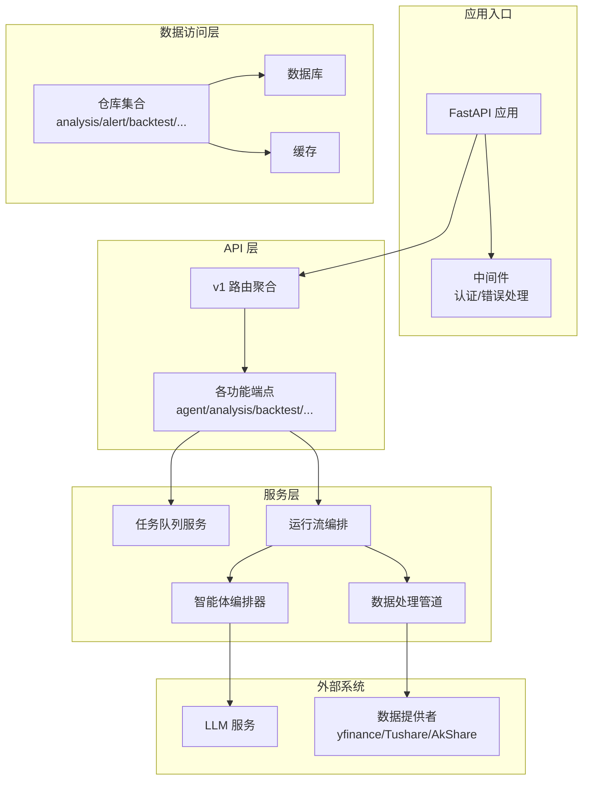

**图示来源** 
- [api/app.py](file://api/app.py)
- [api/v1/router.py](file://api/v1/router.py)
- [src/services/task_queue.py](file://src/services/task_queue.py)
- [src/services/run_flow.py](file://src/services/run_flow.py)
- [src/agent/orchestrator.py](file://src/agent/orchestrator.py)
- [src/core/pipeline.py](file://src/core/pipeline.py)
- [src/repositories/analysis_repo.py](file://src/repositories/analysis_repo.py)
- [data_provider/base.py](file://data_provider/base.py)

**章节来源**
- [main.py](file://main.py)
- [server.py](file://server.py)
- [api/app.py](file://api/app.py)
- [api/v1/router.py](file://api/v1/router.py)

## 核心组件
- 应用与路由
  - FastAPI 应用初始化、全局异常处理器、CORS、鉴权中间件挂载
  - v1 路由聚合，按功能域拆分端点（agent、analysis、backtest、alerts、portfolio、system_config 等）
- 依赖注入
  - 通过 FastAPI Depends 提供统一的服务实例（仓库、配置、任务队列、缓存）
  - 生命周期管理（启动时加载配置、连接池预热；关闭时释放资源）
- 中间件与错误处理
  - 统一错误码与响应格式，结构化日志与追踪 ID
  - 认证与权限控制中间件，限流与审计扩展点
- 配置管理
  - 集中式配置加载、环境变量映射、运行时校验与热更新
  - 配置注册表支持模块化配置项声明与默认值
- 任务队列与异步处理
  - 后台任务调度、重试与幂等性保障
  - SSE/WS 实时事件推送（运行流进度、告警触发）
- 数据处理管道
  - 拉取 -> 清洗 -> 特征工程 -> 指标计算 -> 报告渲染的流水线
  - 可插拔的数据源适配器与缓存层
- 智能体编排器
  - 多智能体协作（技术面、基本面、风险、决策）
  - 工具注册、技能路由、上下文记忆与追踪
- 数据访问层
  - 仓库模式封装 SQL/NoSQL 操作，事务与并发安全
  - 读写分离与缓存穿透保护

**章节来源**
- [api/deps.py](file://api/deps.py)
- [api/middlewares/error_handler.py](file://api/middlewares/error_handler.py)
- [api/middlewares/auth.py](file://api/middlewares/auth.py)
- [src/config.py](file://src/config.py)
- [src/core/config_manager.py](file://src/core/config_manager.py)
- [src/core/config_registry.py](file://src/core/config_registry.py)
- [src/services/task_queue.py](file://src/services/task_queue.py)
- [src/services/run_flow.py](file://src/services/run_flow.py)
- [src/core/pipeline.py](file://src/core/pipeline.py)
- [src/agent/orchestrator.py](file://src/agent/orchestrator.py)

## 架构总览
下图展示从 HTTP 请求到数据落库与外部调用的完整链路，以及关键组件间的职责边界。

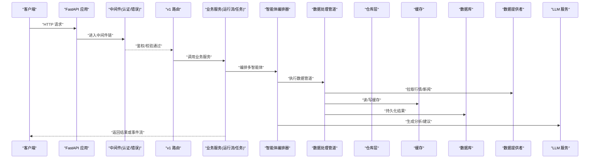

**图示来源** 
- [api/app.py](file://api/app.py)
- [api/v1/router.py](file://api/v1/router.py)
- [src/services/run_flow.py](file://src/services/run_flow.py)
- [src/agent/orchestrator.py](file://src/agent/orchestrator.py)
- [src/core/pipeline.py](file://src/core/pipeline.py)
- [src/repositories/analysis_repo.py](file://src/repositories/analysis_repo.py)
- [data_provider/base.py](file://data_provider/base.py)

## 详细组件分析

### 应用与路由组织
- 应用初始化
  - 挂载全局异常处理器、CORS、鉴权中间件
  - 设置静态资源与前端页面托管
- 路由组织
  - v1 路由聚合，按功能域拆分端点
  - 统一请求模型与响应模型（Pydantic），自动文档生成

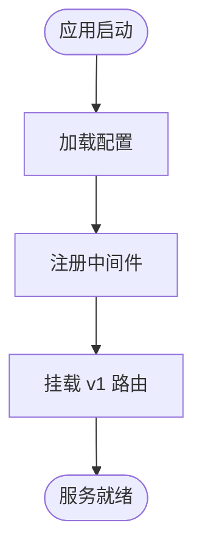

**图示来源** 
- [api/app.py](file://api/app.py)
- [api/v1/router.py](file://api/v1/router.py)

**章节来源**
- [api/app.py](file://api/app.py)
- [api/v1/router.py](file://api/v1/router.py)

### 依赖注入模式
- 使用 FastAPI Depends 提供共享服务实例（仓库、配置、任务队列、缓存）
- 生命周期钩子在应用启动/关闭时完成资源初始化与清理
- 测试友好：可通过 TestClient 替换依赖以进行单元测试

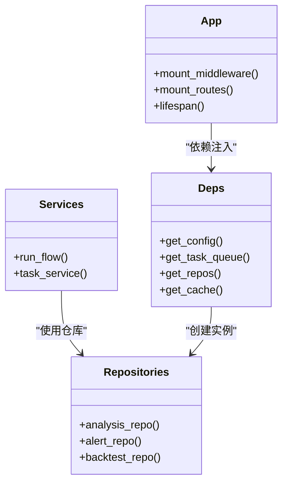

**图示来源** 
- [api/deps.py](file://api/deps.py)

**章节来源**
- [api/deps.py](file://api/deps.py)

### 中间件机制与错误处理
- 中间件链
  - 认证中间件：校验 Token、权限、IP 白名单
  - 错误处理中间件：捕获未处理异常，统一错误码与消息
- 错误策略
  - 结构化错误响应（code、message、trace_id）
  - 分级日志记录与监控埋点

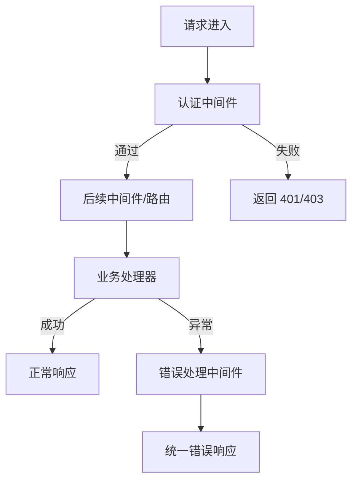

**图示来源** 
- [api/middlewares/auth.py](file://api/middlewares/auth.py)
- [api/middlewares/error_handler.py](file://api/middlewares/error_handler.py)

**章节来源**
- [api/middlewares/auth.py](file://api/middlewares/auth.py)
- [api/middlewares/error_handler.py](file://api/middlewares/error_handler.py)

### 配置管理
- 配置加载
  - 环境变量与配置文件合并，类型校验与默认值
- 配置注册表
  - 模块化配置项声明、分组与文档化
- 热更新
  - 运行时刷新配置，避免重启

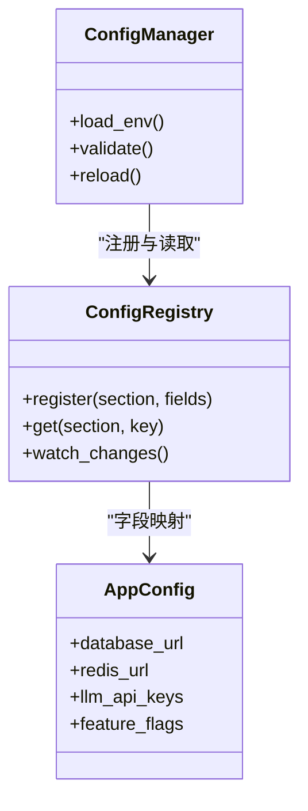

**图示来源** 
- [src/core/config_manager.py](file://src/core/config_manager.py)
- [src/core/config_registry.py](file://src/core/config_registry.py)
- [src/config.py](file://src/config.py)

**章节来源**
- [src/config.py](file://src/config.py)
- [src/core/config_manager.py](file://src/core/config_manager.py)
- [src/core/config_registry.py](file://src/core/config_registry.py)

### 任务队列与异步处理
- 任务模型
  - 任务定义、优先级、重试策略、幂等键
- 调度与执行
  - 后台任务调度、消费者池、超时与熔断
- 事件推送
  - SSE/WS 推送任务进度与结果

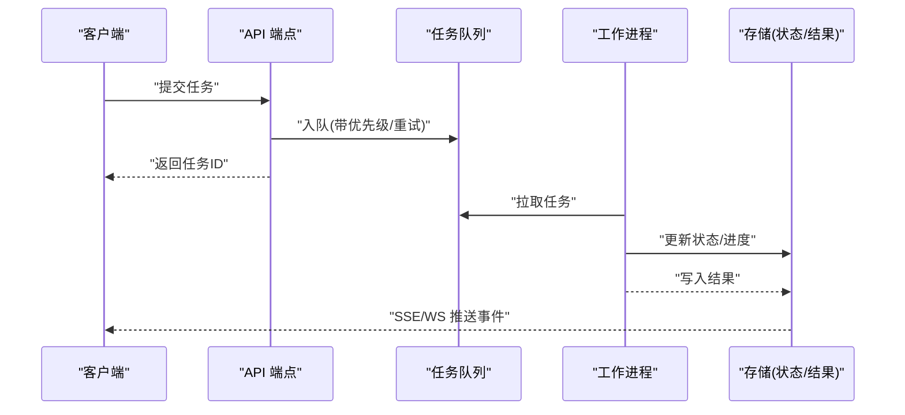

**图示来源** 
- [src/services/task_queue.py](file://src/services/task_queue.py)

**章节来源**
- [src/services/task_queue.py](file://src/services/task_queue.py)

### 数据处理管道
- 阶段划分
  - 数据拉取、清洗、特征工程、指标计算、报告渲染
- 可插拔
  - 数据源适配器、缓存层、指标插件
- 容错与重试
  - 单阶段失败隔离、降级与补偿

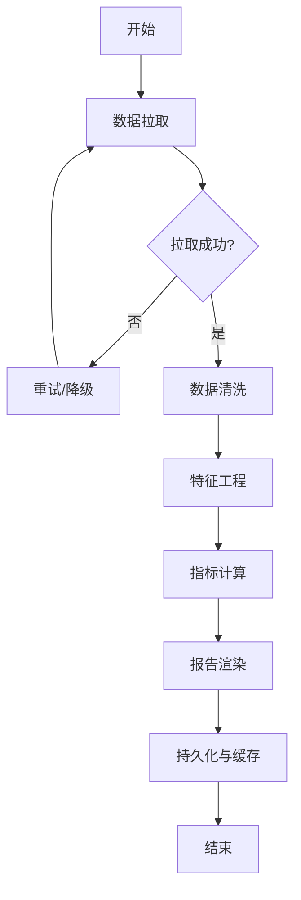

**图示来源** 
- [src/core/pipeline.py](file://src/core/pipeline.py)

**章节来源**
- [src/core/pipeline.py](file://src/core/pipeline.py)

### 智能体编排器
- 多智能体协作
  - 技术面、基本面、风险、决策智能体协同
- 工具与技能
  - 工具注册、技能路由、上下文记忆
- 追踪与可观测性
  - 调用链追踪、耗时统计、错误归因

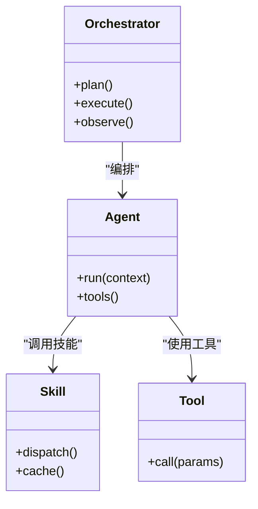

**图示来源** 
- [src/agent/orchestrator.py](file://src/agent/orchestrator.py)

**章节来源**
- [src/agent/orchestrator.py](file://src/agent/orchestrator.py)

### 运行流与服务编排
- 运行流
  - 将多个步骤组合为可重复执行的流程，支持参数化与快照
- 服务编排
  - 跨服务协调（分析、回测、通知、搜索）

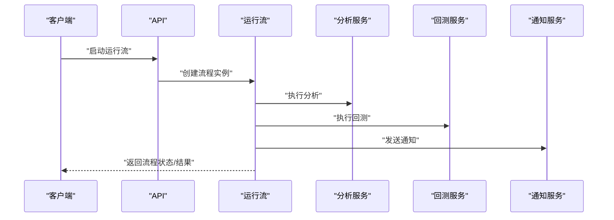

**图示来源** 
- [src/services/run_flow.py](file://src/services/run_flow.py)

**章节来源**
- [src/services/run_flow.py](file://src/services/run_flow.py)

### 数据访问层与缓存策略
- 仓库模式
  - 统一接口封装 CRUD、分页、过滤、事务
- 缓存策略
  - 多级缓存（内存/Redis）、过期与失效策略
- 数据库访问
  - 连接池、读写分离、慢查询监控

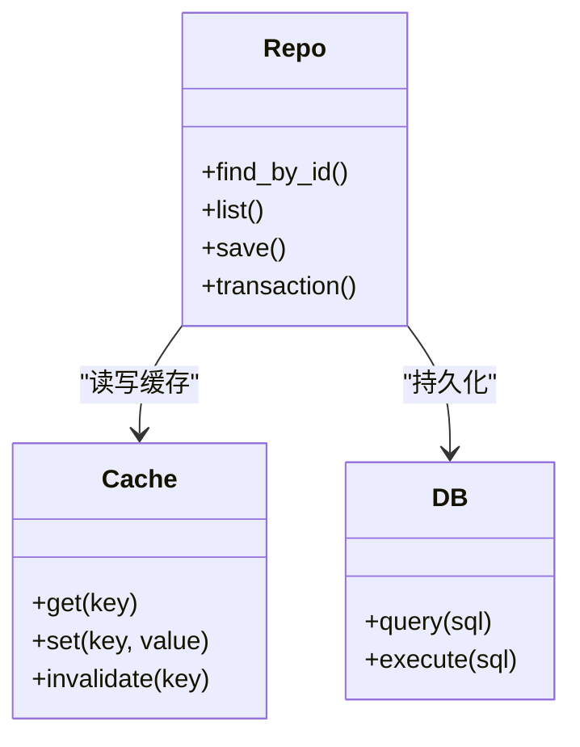

**图示来源** 
- [src/repositories/analysis_repo.py](file://src/repositories/analysis_repo.py)
- [src/repositories/alert_repo.py](file://src/repositories/alert_repo.py)
- [src/repositories/backtest_repo.py](file://src/repositories/backtest_repo.py)
- [src/repositories/crypto_backtest_repo.py](file://src/repositories/crypto_backtest_repo.py)
- [src/repositories/decision_signal_repo.py](file://src/repositories/decision_signal_repo.py)
- [src/repositories/portfolio_repo.py](file://src/repositories/portfolio_repo.py)
- [src/repositories/stock_repo.py](file://src/repositories/stock_repo.py)

**章节来源**
- [src/repositories/analysis_repo.py](file://src/repositories/analysis_repo.py)
- [src/repositories/alert_repo.py](file://src/repositories/alert_repo.py)
- [src/repositories/backtest_repo.py](file://src/repositories/backtest_repo.py)
- [src/repositories/crypto_backtest_repo.py](file://src/repositories/crypto_backtest_repo.py)
- [src/repositories/decision_signal_repo.py](file://src/repositories/decision_signal_repo.py)
- [src/repositories/portfolio_repo.py](file://src/repositories/portfolio_repo.py)
- [src/repositories/stock_repo.py](file://src/repositories/stock_repo.py)

### 数据提供者与外部集成
- 数据提供者
  - 统一接口抽象，多源适配（yfinance、Tushare、AkShare、Finnhub 等）
- 外部服务
  - LLM 调用、搜索服务、通知通道

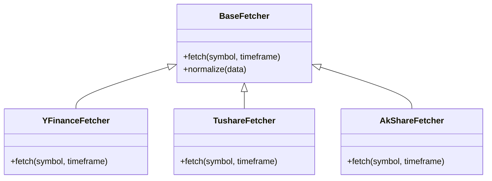

**图示来源** 
- [data_provider/base.py](file://data_provider/base.py)
- [data_provider/yfinance_fetcher.py](file://data_provider/yfinance_fetcher.py)

**章节来源**
- [data_provider/base.py](file://data_provider/base.py)
- [data_provider/yfinance_fetcher.py](file://data_provider/yfinance_fetcher.py)

## 依赖关系分析
- 组件耦合
  - API 层依赖服务层，服务层依赖仓库与外部数据提供者
  - 配置与中间件贯穿全链路
- 循环依赖
  - 通过接口与依赖注入解耦，避免直接导入
- 外部依赖
  - LLM、数据库、缓存、消息队列、第三方数据源

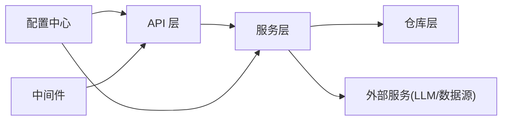

**图示来源** 
- [api/app.py](file://api/app.py)
- [src/services/run_flow.py](file://src/services/run_flow.py)
- [src/core/config_manager.py](file://src/core/config_manager.py)

**章节来源**
- [api/app.py](file://api/app.py)
- [src/services/run_flow.py](file://src/services/run_flow.py)
- [src/core/config_manager.py](file://src/core/config_manager.py)

## 性能考虑
- 异步与并发
  - 使用 FastAPI 异步端点与非阻塞 I/O，合理设置线程池与连接池大小
- 缓存策略
  - 热点数据多级缓存，合理 TTL 与失效策略，防止雪崩
- 数据库优化
  - 索引设计、分页与投影、慢查询监控与优化
- 任务队列
  - 背压与限流、重试退避、死信队列与监控
- 外部调用
  - 超时、熔断、降级与重试，批量与并行拉取
- 资源管理
  - 连接池复用、对象池、GC 调优与内存泄漏检测

[本节为通用指导，不直接分析具体文件]

## 故障排查指南
- 常见问题
  - 认证失败：检查 Token 与权限配置
  - 数据拉取失败：检查数据源可用性、限流与重试
  - 任务堆积：检查队列容量与工作进程数
  - 缓存穿透：检查空值缓存与布隆过滤器
- 定位手段
  - 结构化日志与 Trace ID
  - 健康检查端点与指标采集
  - 错误堆栈与上下文快照

**章节来源**
- [api/middlewares/error_handler.py](file://api/middlewares/error_handler.py)

## 结论
本架构以 FastAPI 为核心，结合依赖注入、中间件与统一错误处理，构建了高内聚、低耦合的微服务组件体系。通过任务队列与数据处理管道实现异步与可扩展的数据处理流程，配合智能体编排器与多数据源适配器，满足复杂分析场景。配置中心与仓库模式提升了系统的可维护性与稳定性。建议在上线前完善监控与告警，持续优化缓存与数据库访问路径，确保在高并发与外部不稳定条件下的鲁棒性。

[本节为总结性内容，不直接分析具体文件]

## 附录

### 部署拓扑图
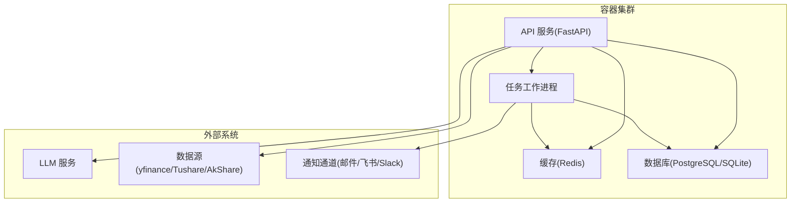

**图示来源** 
- [docker/docker-compose.yml](file://docker/docker-compose.yml)
- [docker/Dockerfile](file://docker/Dockerfile)

**章节来源**
- [docker/docker-compose.yml](file://docker/docker-compose.yml)
- [docker/Dockerfile](file://docker/Dockerfile)