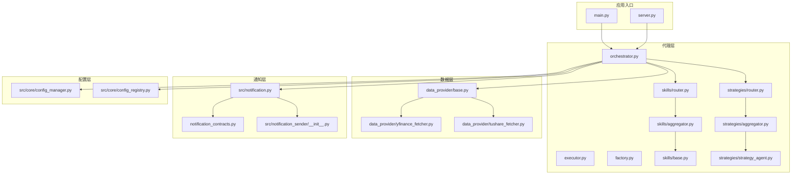
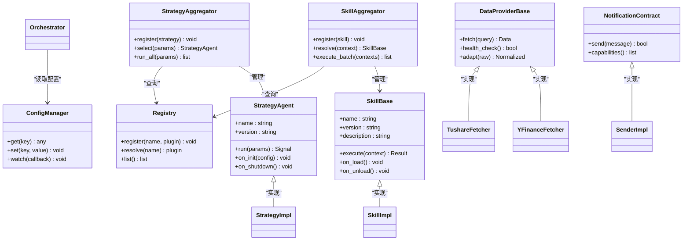
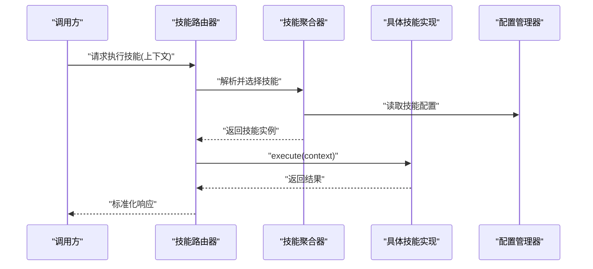
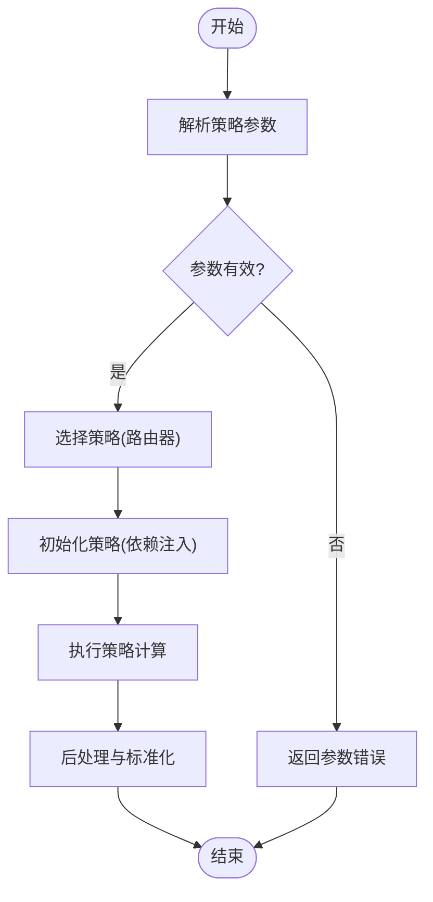
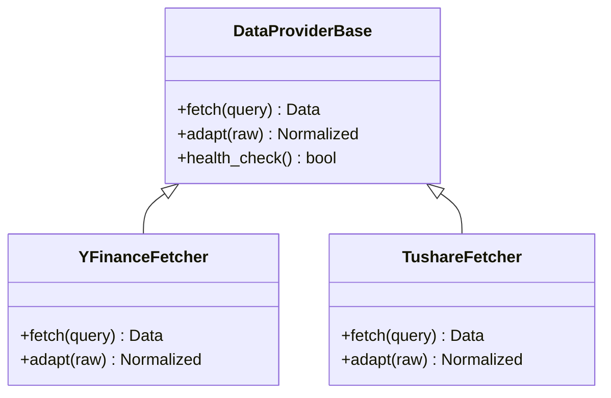
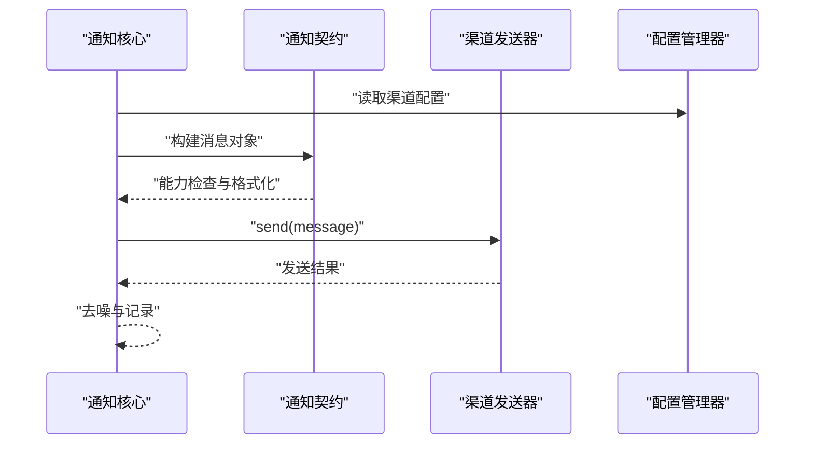
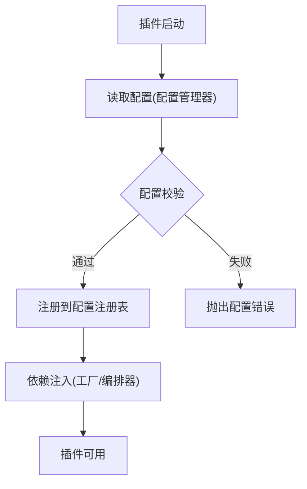

# 插件系统设计

<cite>
**本文引用的文件**   
- [src/agent/skills/base.py](file://src/agent/skills/base.py)
- [src/agent/skills/aggregator.py](file://src/agent/skills/aggregator.py)
- [src/agent/skills/router.py](file://src/agent/skills/router.py)
- [src/agent/skills/skill_agent.py](file://src/agent/skills/skill_agent.py)
- [src/agent/strategies/strategy_agent.py](file://src/agent/strategies/strategy_agent.py)
- [src/agent/strategies/aggregator.py](file://src/agent/strategies/aggregator.py)
- [src/agent/strategies/router.py](file://src/agent/strategies/router.py)
- [data_provider/base.py](file://data_provider/base.py)
- [data_provider/yfinance_fetcher.py](file://data_provider/yfinance_fetcher.py)
- [data_provider/tushare_fetcher.py](file://data_provider/tushare_fetcher.py)
- [notification_contracts.py](file://notification_contracts.py)
- [notification_sender/__init__.py](file://src/notification_sender/__init__.py)
- [src/notification.py](file://src/notification.py)
- [src/config_manager.py](file://src/core/config_manager.py)
- [src/config_registry.py](file://src/core/config_registry.py)
- [src/agent/orchestrator.py](file://src/agent/orchestrator.py)
- [src/agent/executor.py](file://src/agent/executor.py)
- [src/agent/factory.py](file://src/agent/factory.py)
- [src/agent/tools/registry.py](file://src/agent/tools/registry.py)
- [main.py](file://main.py)
- [server.py](file://server.py)
</cite>

## 目录
1. [简介](#简介)
2. [项目结构](#项目结构)
3. [核心组件](#核心组件)
4. [架构总览](#架构总览)
5. [详细组件分析](#详细组件分析)
6. [依赖关系分析](#依赖关系分析)
7. [性能考量](#性能考量)
8. [故障排查指南](#故障排查指南)
9. [结论](#结论)
10. [附录](#附录)

## 简介
本设计文档面向“股票分析系统”的插件化扩展机制，围绕技能插件、策略插件、通知插件和数据源插件四类扩展点展开。文档系统化阐述接口规范、生命周期管理、依赖注入与配置管理、注册机制、版本兼容性与热重载支持，并提供自定义插件开发指南、调试工具与最佳实践。通过架构图、流程图与序列图，帮助读者快速理解并安全地扩展系统能力。

## 项目结构
系统采用分层与模块化组织：
- 代理层（Agent）：技能与策略插件的编排、路由与执行
- 数据层（Data Provider）：统一的数据获取抽象与多实现
- 通知层（Notification）：多渠道通知的统一契约与发送器
- 配置层（Config）：集中式配置管理与注册表
- 应用入口（Main/Server）：启动、装配与生命周期管理



图表来源
- [main.py](file://main.py)
- [server.py](file://server.py)
- [src/agent/orchestrator.py](file://src/agent/orchestrator.py)
- [src/agent/executor.py](file://src/agent/executor.py)
- [src/agent/factory.py](file://src/agent/factory.py)
- [src/agent/skills/base.py](file://src/agent/skills/base.py)
- [src/agent/skills/aggregator.py](file://src/agent/skills/aggregator.py)
- [src/agent/skills/router.py](file://src/agent/skills/router.py)
- [src/agent/strategies/strategy_agent.py](file://src/agent/strategies/strategy_agent.py)
- [src/agent/strategies/aggregator.py](file://src/agent/strategies/aggregator.py)
- [src/agent/strategies/router.py](file://src/agent/strategies/router.py)
- [data_provider/base.py](file://data_provider/base.py)
- [data_provider/yfinance_fetcher.py](file://data_provider/yfinance_fetcher.py)
- [data_provider/tushare_fetcher.py](file://data_provider/tushare_fetcher.py)
- [notification_contracts.py](file://notification_contracts.py)
- [src/notification_sender/__init__.py](file://src/notification_sender/__init__.py)
- [src/notification.py](file://src/notification.py)
- [src/core/config_manager.py](file://src/core/config_manager.py)
- [src/core/config_registry.py](file://src/core/config_registry.py)

章节来源
- [main.py](file://main.py)
- [server.py](file://server.py)
- [src/agent/orchestrator.py](file://src/agent/orchestrator.py)

## 核心组件
- 技能插件（Skill Plugin）
  - 基类定义技能接口与生命周期钩子
  - 聚合器负责批量加载与组合多个技能
  - 路由器根据上下文选择具体技能执行
  - 技能代理封装调用细节与错误处理
- 策略插件（Strategy Plugin）
  - 策略代理提供统一的策略执行入口
  - 策略聚合器加载与管理策略实例
  - 策略路由器依据市场状态或信号选择策略
- 数据源插件（Data Source Plugin）
  - 数据提供者基类定义拉取、适配与错误语义
  - 具体实现对接不同数据服务（如 yfinance、tushare）
- 通知插件（Notification Plugin）
  - 通知契约定义消息结构与通道能力
  - 发送器集合按渠道分发通知
  - 通知核心协调路由、去噪与模板渲染

章节来源
- [src/agent/skills/base.py](file://src/agent/skills/base.py)
- [src/agent/skills/aggregator.py](file://src/agent/skills/aggregator.py)
- [src/agent/skills/router.py](file://src/agent/skills/router.py)
- [src/agent/skills/skill_agent.py](file://src/agent/skills/skill_agent.py)
- [src/agent/strategies/strategy_agent.py](file://src/agent/strategies/strategy_agent.py)
- [src/agent/strategies/aggregator.py](file://src/agent/strategies/aggregator.py)
- [src/agent/strategies/router.py](file://src/agent/strategies/router.py)
- [data_provider/base.py](file://data_provider/base.py)
- [data_provider/yfinance_fetcher.py](file://data_provider/yfinance_fetcher.py)
- [data_provider/tushare_fetcher.py](file://data_provider/tushare_fetcher.py)
- [notification_contracts.py](file://notification_contracts.py)
- [src/notification_sender/__init__.py](file://src/notification_sender/__init__.py)
- [src/notification.py](file://src/notification.py)

## 架构总览
插件体系以“统一接口 + 注册中心 + 运行时编排”为核心思想：
- 所有插件均实现对应基类或契约，确保可插拔
- 注册中心维护插件元数据、版本与依赖
- 编排器在运行期根据上下文动态选择与组合插件
- 配置中心为插件提供声明式参数与环境隔离



图表来源
- [src/agent/skills/base.py](file://src/agent/skills/base.py)
- [src/agent/skills/aggregator.py](file://src/agent/skills/aggregator.py)
- [src/agent/strategies/strategy_agent.py](file://src/agent/strategies/strategy_agent.py)
- [src/agent/strategies/aggregator.py](file://src/agent/strategies/aggregator.py)
- [data_provider/base.py](file://data_provider/base.py)
- [data_provider/yfinance_fetcher.py](file://data_provider/yfinance_fetcher.py)
- [data_provider/tushare_fetcher.py](file://data_provider/tushare_fetcher.py)
- [notification_contracts.py](file://notification_contracts.py)
- [src/core/config_manager.py](file://src/core/config_manager.py)
- [src/core/config_registry.py](file://src/core/config_registry.py)

## 详细组件分析

### 技能插件子系统
- 接口与生命周期
  - 基类定义名称、版本、描述与执行方法
  - 提供 on_load/on_unload 钩子用于资源初始化与清理
- 聚合器与路由器
  - 聚合器负责扫描、注册与批量执行
  - 路由器基于输入上下文（如任务类型、关键词）选择最匹配的技能
- 技能代理
  - 封装调用、异常捕获与结果标准化



图表来源
- [src/agent/skills/router.py](file://src/agent/skills/router.py)
- [src/agent/skills/aggregator.py](file://src/agent/skills/aggregator.py)
- [src/agent/skills/base.py](file://src/agent/skills/base.py)
- [src/core/config_manager.py](file://src/core/config_manager.py)

章节来源
- [src/agent/skills/base.py](file://src/agent/skills/base.py)
- [src/agent/skills/aggregator.py](file://src/agent/skills/aggregator.py)
- [src/agent/skills/router.py](file://src/agent/skills/router.py)
- [src/agent/skills/skill_agent.py](file://src/agent/skills/skill_agent.py)

### 策略插件子系统
- 策略代理
  - 统一 run(params) 接口，支持参数校验与结果结构化
  - 提供 on_init/on_shutdown 生命周期钩子
- 策略聚合器与路由器
  - 聚合器维护策略实例池与版本信息
  - 路由器依据市场阶段、指标阈值或信号规则选择策略



图表来源
- [src/agent/strategies/strategy_agent.py](file://src/agent/strategies/strategy_agent.py)
- [src/agent/strategies/aggregator.py](file://src/agent/strategies/aggregator.py)
- [src/agent/strategies/router.py](file://src/agent/strategies/router.py)

章节来源
- [src/agent/strategies/strategy_agent.py](file://src/agent/strategies/strategy_agent.py)
- [src/agent/strategies/aggregator.py](file://src/agent/strategies/aggregator.py)
- [src/agent/strategies/router.py](file://src/agent/strategies/router.py)

### 数据源插件子系统
- 数据提供者基类
  - 定义 fetch/adapt/health_check 等标准方法
  - 约定错误码与重试语义，便于上层统一处理
- 具体实现
  - 针对不同数据源进行适配与数据规范化



图表来源
- [data_provider/base.py](file://data_provider/base.py)
- [data_provider/yfinance_fetcher.py](file://data_provider/yfinance_fetcher.py)
- [data_provider/tushare_fetcher.py](file://data_provider/tushare_fetcher.py)

章节来源
- [data_provider/base.py](file://data_provider/base.py)
- [data_provider/yfinance_fetcher.py](file://data_provider/yfinance_fetcher.py)
- [data_provider/tushare_fetcher.py](file://data_provider/tushare_fetcher.py)

### 通知插件子系统
- 通知契约
  - 定义 send/capabilities 等方法，约束消息结构与通道能力
- 发送器集合
  - 按渠道（邮件、飞书、Discord 等）实现具体发送逻辑
- 通知核心
  - 负责路由、去噪、模板渲染与失败重试



图表来源
- [notification_contracts.py](file://notification_contracts.py)
- [src/notification_sender/__init__.py](file://src/notification_sender/__init__.py)
- [src/notification.py](file://src/notification.py)
- [src/core/config_manager.py](file://src/core/config_manager.py)

章节来源
- [notification_contracts.py](file://notification_contracts.py)
- [src/notification_sender/__init__.py](file://src/notification_sender/__init__.py)
- [src/notification.py](file://src/notification.py)

### 配置与依赖注入
- 配置管理器
  - 提供 get/set/watch 能力，支持热更新监听
- 配置注册表
  - 集中管理插件配置项、默认值与校验规则
- 依赖注入
  - 工厂与编排器在构造时注入配置、日志与外部服务



图表来源
- [src/core/config_manager.py](file://src/core/config_manager.py)
- [src/core/config_registry.py](file://src/core/config_registry.py)
- [src/agent/factory.py](file://src/agent/factory.py)
- [src/agent/orchestrator.py](file://src/agent/orchestrator.py)

章节来源
- [src/core/config_manager.py](file://src/core/config_manager.py)
- [src/core/config_registry.py](file://src/core/config_registry.py)
- [src/agent/factory.py](file://src/agent/factory.py)
- [src/agent/orchestrator.py](file://src/agent/orchestrator.py)

## 依赖关系分析
- 耦合与内聚
  - 插件间通过基类/契约解耦，聚合器与路由器承担编排职责
  - 配置与依赖注入将外部依赖从业务逻辑中剥离
- 直接/间接依赖
  - 编排器依赖配置管理器、注册表与各类聚合器
  - 数据源插件仅依赖基类与网络库
- 循环依赖
  - 通过接口与延迟导入避免循环引用
- 外部集成点
  - 数据源、通知渠道与 LLM 适配器均为外部依赖

```mermaid
graph LR
Orchestrator["编排器"] --> SkillRouter["技能路由器"]
Orchestrator --> StratRouter["策略路由器"]
Orchestrator --> ConfigMgr["配置管理器"]
Orchestrator --> NotiCore["通知核心"]
SkillRouter --> SkillAgg["技能聚合器"]
StratRouter --> StratAgg["策略聚合器"]
SkillAgg --> SkillBase["技能基类"]
StratAgg --> StratAgent["策略代理"]
Not iCore --> NotContract["通知契约"]
Orchestrator --> DataProv["数据提供者基类"]
```

图表来源
- [src/agent/orchestrator.py](file://src/agent/orchestrator.py)
- [src/agent/skills/router.py](file://src/agent/skills/router.py)
- [src/agent/strategies/router.py](file://src/agent/strategies/router.py)
- [src/core/config_manager.py](file://src/core/config_manager.py)
- [notification_contracts.py](file://notification_contracts.py)
- [data_provider/base.py](file://data_provider/base.py)

章节来源
- [src/agent/orchestrator.py](file://src/agent/orchestrator.py)
- [src/agent/skills/router.py](file://src/agent/skills/router.py)
- [src/agent/strategies/router.py](file://src/agent/strategies/router.py)
- [src/core/config_manager.py](file://src/core/config_manager.py)
- [notification_contracts.py](file://notification_contracts.py)
- [data_provider/base.py](file://data_provider/base.py)

## 性能考量
- 并发与异步
  - 数据拉取与通知发送应使用异步 IO，减少阻塞
- 缓存与批处理
  - 对热点数据与重复查询做缓存；技能/策略批量执行降低开销
- 超时与重试
  - 设置合理的超时与退避重试策略，避免雪崩
- 资源管理
  - 连接池、线程池与内存限制需显式配置

[本节为通用指导，不直接分析具体文件]

## 故障排查指南
- 常见问题定位
  - 插件未注册：检查注册表与启动顺序
  - 配置缺失：核对配置键名与默认值
  - 数据源不可用：查看健康检查与错误码
  - 通知失败：确认渠道凭据与限流策略
- 调试建议
  - 启用详细日志与追踪
  - 使用最小化复现用例
  - 逐步禁用插件定位问题

章节来源
- [src/agent/orchestrator.py](file://src/agent/orchestrator.py)
- [src/core/config_manager.py](file://src/core/config_manager.py)
- [data_provider/base.py](file://data_provider/base.py)
- [src/notification.py](file://src/notification.py)

## 结论
本插件系统通过统一接口、注册中心与编排器实现了高内聚、低耦合的扩展架构。技能、策略、数据源与通知四类插件各司其职，配合配置管理与依赖注入，形成稳定可靠的运行时环境。遵循本文档的接口规范与最佳实践，可高效开发与集成自定义插件，保障系统的可扩展性与可维护性。

[本节为总结性内容，不直接分析具体文件]

## 附录

### 插件接口规范摘要
- 技能插件
  - 必需字段：名称、版本、描述
  - 必需方法：execute(context)
  - 可选钩子：on_load/on_unload
- 策略插件
  - 必需方法：run(params)
  - 可选钩子：on_init/on_shutdown
- 数据源插件
  - 必需方法：fetch/adapt/health_check
- 通知插件
  - 必需方法：send/capabilities

章节来源
- [src/agent/skills/base.py](file://src/agent/skills/base.py)
- [src/agent/strategies/strategy_agent.py](file://src/agent/strategies/strategy_agent.py)
- [data_provider/base.py](file://data_provider/base.py)
- [notification_contracts.py](file://notification_contracts.py)

### 生命周期管理
- 启动阶段：配置加载、依赖注入、插件注册
- 运行阶段：按需加载、动态选择、执行与监控
- 关闭阶段：资源释放、状态持久化、优雅退出

章节来源
- [src/agent/orchestrator.py](file://src/agent/orchestrator.py)
- [src/agent/factory.py](file://src/agent/factory.py)
- [src/core/config_manager.py](file://src/core/config_manager.py)

### 注册机制与版本兼容性
- 注册机制
  - 插件在启动时向注册表登记元数据与能力
  - 路由器/聚合器通过名称或能力匹配插件
- 版本兼容性
  - 插件声明版本范围，运行时进行兼容性校验
  - 提供降级路径与回滚策略

章节来源
- [src/core/config_registry.py](file://src/core/config_registry.py)
- [src/agent/skills/aggregator.py](file://src/agent/skills/aggregator.py)
- [src/agent/strategies/aggregator.py](file://src/agent/strategies/aggregator.py)

### 热重载支持
- 配置热更新
  - 监听配置文件变化，触发插件重新初始化
- 插件热替换
  - 在不中断服务的情况下替换插件实现
- 注意事项
  - 保证幂等与原子切换
  - 状态迁移与一致性校验

章节来源
- [src/core/config_manager.py](file://src/core/config_manager.py)
- [src/agent/orchestrator.py](file://src/agent/orchestrator.py)

### 自定义插件开发指南
- 步骤
  - 继承基类或实现契约
  - 实现必要方法与可选钩子
  - 注册插件并声明配置项
  - 编写单元测试与集成测试
- 示例参考
  - 数据源插件：参考现有实现的结构与错误处理
  - 通知插件：参考契约与发送器集合的组织方式

章节来源
- [data_provider/base.py](file://data_provider/base.py)
- [notification_contracts.py](file://notification_contracts.py)
- [src/notification_sender/__init__.py](file://src/notification_sender/__init__.py)

### 调试工具与最佳实践
- 调试工具
  - 启用详细日志与链路追踪
  - 使用最小化配置与断点调试
- 最佳实践
  - 单一职责与清晰边界
  - 防御性编程与健壮的错误处理
  - 可观测性与可测试性优先

章节来源
- [src/agent/orchestrator.py](file://src/agent/orchestrator.py)
- [src/core/config_manager.py](file://src/core/config_manager.py)
- [data_provider/base.py](file://data_provider/base.py)
- [src/notification.py](file://src/notification.py)