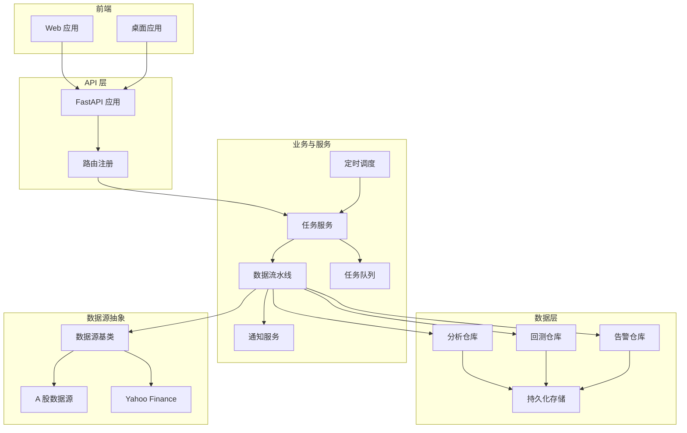
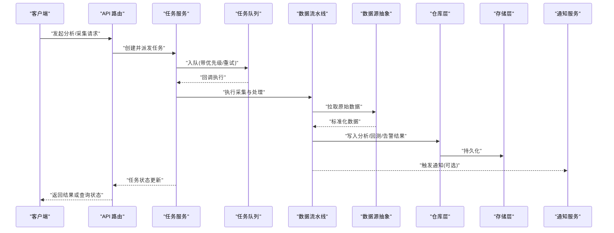
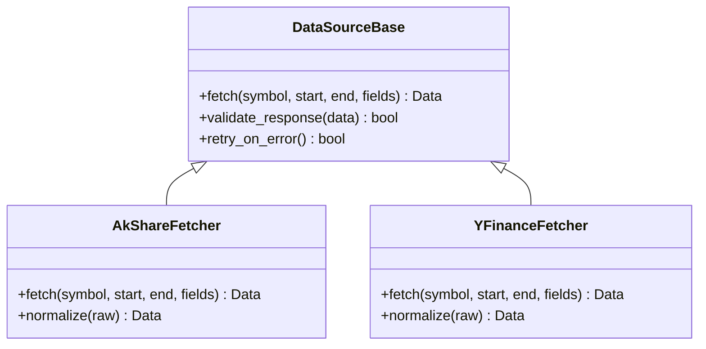
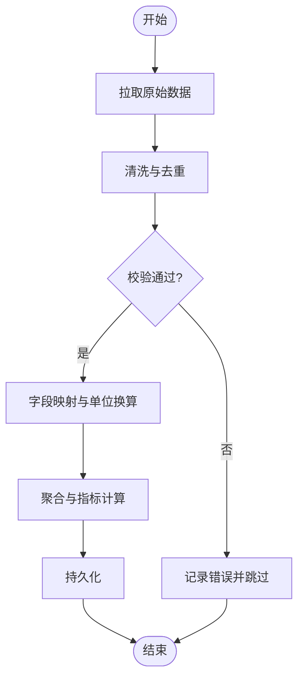
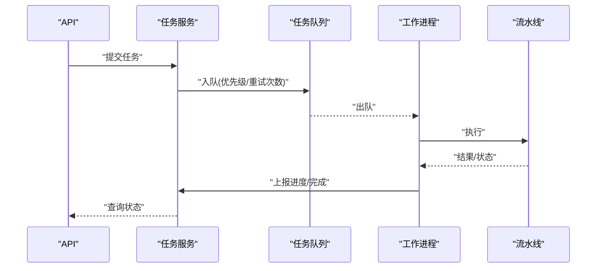
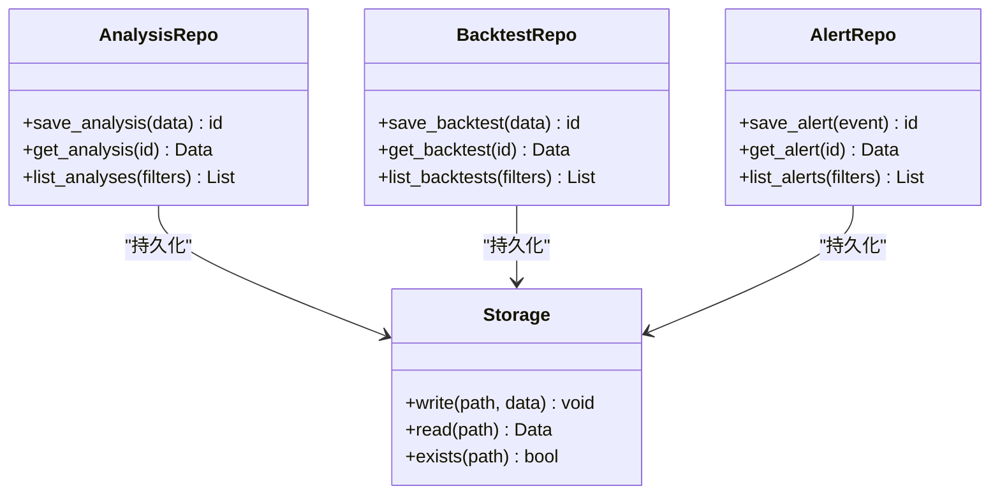
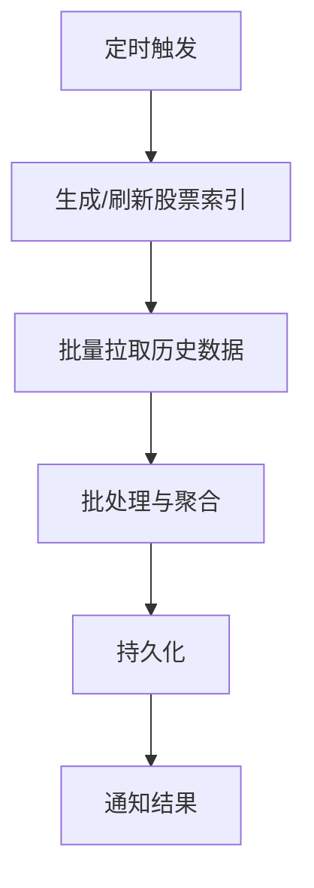
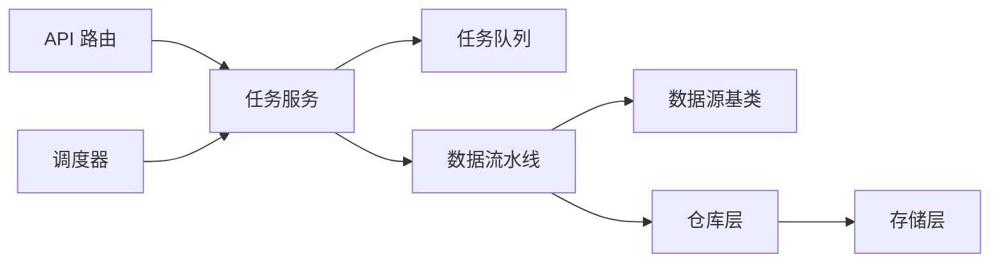
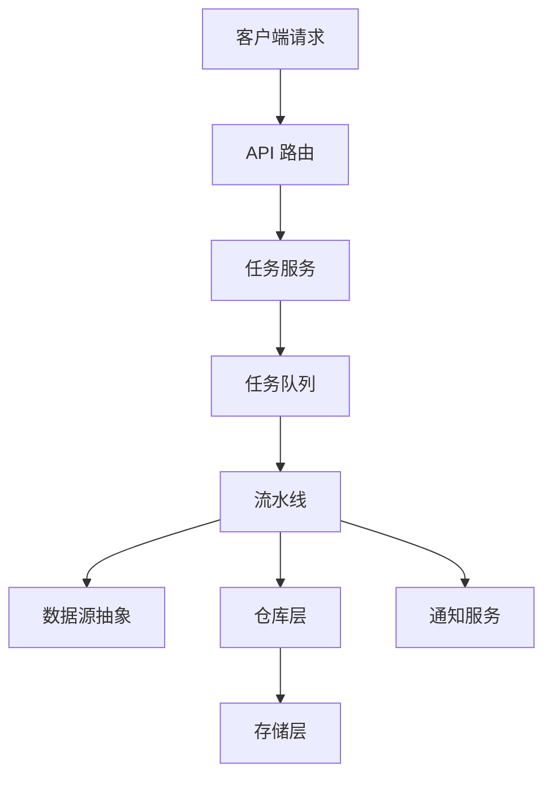
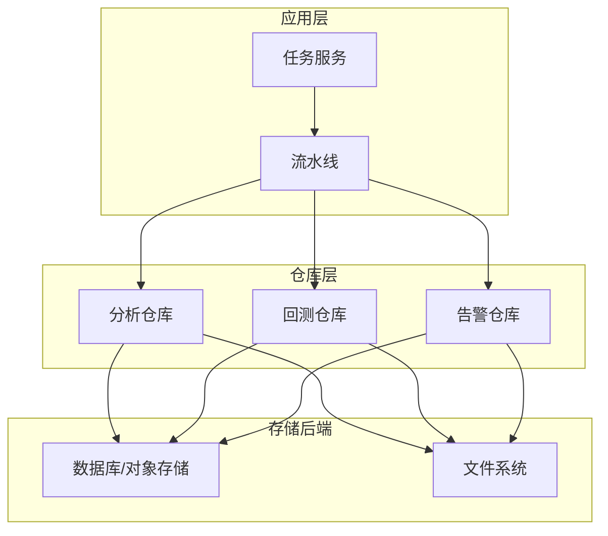

# 数据流架构

<cite>
**本文引用的文件**   
- [main.py](file://main.py)
- [server.py](file://server.py)
- [api/app.py](file://api/app.py)
- [api/v1/router.py](file://api/v1/router.py)
- [src/core/pipeline.py](file://src/core/pipeline.py)
- [src/services/task_service.py](file://src/services/task_service.py)
- [src/services/task_queue.py](file://src/services/task_queue.py)
- [data_provider/base.py](file://data_provider/base.py)
- [data_provider/akshare_fetcher.py](file://data_provider/akshare_fetcher.py)
- [data_provider/yfinance_fetcher.py](file://data_provider/yfinance_fetcher.py)
- [src/repositories/analysis_repo.py](file://src/repositories/analysis_repo.py)
- [src/repositories/alert_repo.py](file://src/repositories/alert_repo.py)
- [src/repositories/backtest_repo.py](file://src/repositories/backtest_repo.py)
- [src/storage.py](file://src/storage.py)
- [src/scheduler.py](file://src/scheduler.py)
- [src/notification.py](file://src/notification.py)
- [src/logging_config.py](file://src/logging_config.py)
- [src/config.py](file://src/config.py)
- [src/enums.py](file://src/enums.py)
- [scripts/generate_stock_index.py](file://scripts/generate_stock_index.py)
- [scripts/refresh_stock_index.py](file://scripts/refresh_stock_index.py)
</cite>

## 目录
1. [简介](#简介)
2. [项目结构](#项目结构)
3. [核心组件](#核心组件)
4. [架构总览](#架构总览)
5. [详细组件分析](#详细组件分析)
6. [依赖关系分析](#依赖关系分析)
7. [性能考量](#性能考量)
8. [故障排查指南](#故障排查指南)
9. [结论](#结论)
10. [附录](#附录)

## 简介
本文件面向“数据采集、处理、存储与分发”的数据流架构，覆盖以下关键主题：
- 数据采集管道（多源接入、统一抽象）
- 实时数据处理与批处理流程
- 缓存策略与索引优化
- 数据源抽象层、转换规则与验证机制
- 数据库设计、索引策略与一致性保证
- 数据血缘追踪、监控告警与故障恢复
- 数据流图、存储架构图与性能基准建议

## 项目结构
系统采用前后端分离与模块化后端组织方式。后端以 FastAPI 提供 API，核心数据流由 pipeline、任务调度、仓库层与存储层构成；数据获取通过 data_provider 抽象层对接多种外部数据源；前端通过 api 模块调用后端服务。

图表来源
- [api/app.py:1-200](file://api/app.py#L1-L200)
- [api/v1/router.py:1-200](file://api/v1/router.py#L1-L200)
- [src/core/pipeline.py:1-200](file://src/core/pipeline.py#L1-L200)
- [src/services/task_service.py:1-200](file://src/services/task_service.py#L1-L200)
- [src/services/task_queue.py:1-200](file://src/services/task_queue.py#L1-L200)
- [data_provider/base.py:1-200](file://data_provider/base.py#L1-L200)
- [data_provider/akshare_fetcher.py:1-200](file://data_provider/akshare_fetcher.py#L1-L200)
- [data_provider/yfinance_fetcher.py:1-200](file://data_provider/yfinance_fetcher.py#L1-L200)
- [src/repositories/analysis_repo.py:1-200](file://src/repositories/analysis_repo.py#L1-L200)
- [src/repositories/backtest_repo.py:1-200](file://src/repositories/backtest_repo.py#L1-L200)
- [src/repositories/alert_repo.py:1-200](file://src/repositories/alert_repo.py#L1-L200)
- [src/storage.py:1-200](file://src/storage.py#L1-L200)
- [src/scheduler.py:1-200](file://src/scheduler.py#L1-L200)
- [src/notification.py:1-200](file://src/notification.py#L1-L200)

章节来源
- [main.py:1-200](file://main.py#L1-L200)
- [server.py:1-200](file://server.py#L1-L200)
- [api/app.py:1-200](file://api/app.py#L1-L200)
- [api/v1/router.py:1-200](file://api/v1/router.py#L1-L200)

## 核心组件
- 数据源抽象层：定义统一的拉取接口与返回结构，屏蔽不同数据源的差异。
- 采集管道：将多个数据源聚合为标准化数据，进行清洗、校验与转换。
- 任务服务与队列：异步编排采集与分析任务，支持重试与限流。
- 仓库层：对分析结果、回测结果、告警事件等数据进行持久化访问。
- 存储层：统一读写接口，支持本地文件或数据库后端。
- 调度器：定时触发批量采集与分析任务。
- 通知服务：将关键事件与结果推送至多渠道。

章节来源
- [data_provider/base.py:1-200](file://data_provider/base.py#L1-L200)
- [src/core/pipeline.py:1-200](file://src/core/pipeline.py#L1-L200)
- [src/services/task_service.py:1-200](file://src/services/task_service.py#L1-L200)
- [src/services/task_queue.py:1-200](file://src/services/task_queue.py#L1-L200)
- [src/repositories/analysis_repo.py:1-200](file://src/repositories/analysis_repo.py#L1-L200)
- [src/repositories/backtest_repo.py:1-200](file://src/repositories/backtest_repo.py#L1-L200)
- [src/repositories/alert_repo.py:1-200](file://src/repositories/alert_repo.py#L1-L200)
- [src/storage.py:1-200](file://src/storage.py#L1-L200)
- [src/scheduler.py:1-200](file://src/scheduler.py#L1-L200)
- [src/notification.py:1-200](file://src/notification.py#L1-L200)

## 架构总览
下图展示从请求到数据落库与分发的端到端数据流，包括实时与批处理路径。

图表来源
- [api/v1/router.py:1-200](file://api/v1/router.py#L1-L200)
- [src/services/task_service.py:1-200](file://src/services/task_service.py#L1-L200)
- [src/services/task_queue.py:1-200](file://src/services/task_queue.py#L1-L200)
- [src/core/pipeline.py:1-200](file://src/core/pipeline.py#L1-L200)
- [data_provider/base.py:1-200](file://data_provider/base.py#L1-L200)
- [src/repositories/analysis_repo.py:1-200](file://src/repositories/analysis_repo.py#L1-L200)
- [src/repositories/backtest_repo.py:1-200](file://src/repositories/backtest_repo.py#L1-L200)
- [src/repositories/alert_repo.py:1-200](file://src/repositories/alert_repo.py#L1-L200)
- [src/storage.py:1-200](file://src/storage.py#L1-L200)
- [src/notification.py:1-200](file://src/notification.py#L1-L200)

## 详细组件分析

### 数据源抽象层与采集器
- 抽象基类定义统一的 fetch 接口、错误码与重试策略。
- 具体实现封装各数据源协议差异，输出标准化数据结构。
- 支持按标的、时间范围、字段选择进行过滤。

图表来源
- [data_provider/base.py:1-200](file://data_provider/base.py#L1-L200)
- [data_provider/akshare_fetcher.py:1-200](file://data_provider/akshare_fetcher.py#L1-L200)
- [data_provider/yfinance_fetcher.py:1-200](file://data_provider/yfinance_fetcher.py#L1-L200)

章节来源
- [data_provider/base.py:1-200](file://data_provider/base.py#L1-L200)
- [data_provider/akshare_fetcher.py:1-200](file://data_provider/akshare_fetcher.py#L1-L200)
- [data_provider/yfinance_fetcher.py:1-200](file://data_provider/yfinance_fetcher.py#L1-L200)

### 数据流水线与转换规则
- 流水线负责串联“拉取→清洗→校验→转换→聚合”步骤。
- 转换规则包含字段映射、单位换算、缺失值填充、异常值剔除。
- 校验机制确保数据类型、取值范围与完整性。

图表来源
- [src/core/pipeline.py:1-200](file://src/core/pipeline.py#L1-L200)

章节来源
- [src/core/pipeline.py:1-200](file://src/core/pipeline.py#L1-L200)

### 任务服务与队列
- 任务服务负责创建、派发与跟踪任务生命周期。
- 队列支持优先级、重试、退避与死信队列。
- 支持并发控制与背压，避免过载。

图表来源
- [src/services/task_service.py:1-200](file://src/services/task_service.py#L1-L200)
- [src/services/task_queue.py:1-200](file://src/services/task_queue.py#L1-L200)

章节来源
- [src/services/task_service.py:1-200](file://src/services/task_service.py#L1-L200)
- [src/services/task_queue.py:1-200](file://src/services/task_queue.py#L1-L200)

### 仓库层与存储层
- 仓库层按领域划分（分析、回测、告警），提供一致的 CRUD 接口。
- 存储层统一读写，支持本地文件与数据库后端切换。
- 事务与幂等写入保障数据一致性。

图表来源
- [src/repositories/analysis_repo.py:1-200](file://src/repositories/analysis_repo.py#L1-L200)
- [src/repositories/backtest_repo.py:1-200](file://src/repositories/backtest_repo.py#L1-L200)
- [src/repositories/alert_repo.py:1-200](file://src/repositories/alert_repo.py#L1-L200)
- [src/storage.py:1-200](file://src/storage.py#L1-L200)

章节来源
- [src/repositories/analysis_repo.py:1-200](file://src/repositories/analysis_repo.py#L1-L200)
- [src/repositories/backtest_repo.py:1-200](file://src/repositories/backtest_repo.py#L1-L200)
- [src/repositories/alert_repo.py:1-200](file://src/repositories/alert_repo.py#L1-L200)
- [src/storage.py:1-200](file://src/storage.py#L1-L200)

### 定时调度与批处理
- 调度器按配置周期触发批量采集与分析任务。
- 支持增量刷新与全量重建，结合索引脚本生成/更新股票索引。

图表来源
- [src/scheduler.py:1-200](file://src/scheduler.py#L1-L200)
- [scripts/generate_stock_index.py:1-200](file://scripts/generate_stock_index.py#L1-L200)
- [scripts/refresh_stock_index.py:1-200](file://scripts/refresh_stock_index.py#L1-L200)

章节来源
- [src/scheduler.py:1-200](file://src/scheduler.py#L1-L200)
- [scripts/generate_stock_index.py:1-200](file://scripts/generate_stock_index.py#L1-L200)
- [scripts/refresh_stock_index.py:1-200](file://scripts/refresh_stock_index.py#L1-L200)

### 通知与告警
- 通知服务统一封装多渠道发送能力。
- 支持告警规则匹配、降噪与路由。

章节来源
- [src/notification.py:1-200](file://src/notification.py#L1-L200)

## 依赖关系分析
- API 层依赖任务服务与路由注册。
- 任务服务依赖队列与流水线。
- 流水线依赖数据源抽象层与仓库层。
- 仓库层依赖存储层。
- 调度器驱动批处理任务。

图表来源
- [api/v1/router.py:1-200](file://api/v1/router.py#L1-L200)
- [src/services/task_service.py:1-200](file://src/services/task_service.py#L1-L200)
- [src/services/task_queue.py:1-200](file://src/services/task_queue.py#L1-L200)
- [src/core/pipeline.py:1-200](file://src/core/pipeline.py#L1-L200)
- [data_provider/base.py:1-200](file://data_provider/base.py#L1-L200)
- [src/repositories/analysis_repo.py:1-200](file://src/repositories/analysis_repo.py#L1-L200)
- [src/storage.py:1-200](file://src/storage.py#L1-L200)
- [src/scheduler.py:1-200](file://src/scheduler.py#L1-L200)

章节来源
- [api/v1/router.py:1-200](file://api/v1/router.py#L1-L200)
- [src/services/task_service.py:1-200](file://src/services/task_service.py#L1-L200)
- [src/services/task_queue.py:1-200](file://src/services/task_queue.py#L1-L200)
- [src/core/pipeline.py:1-200](file://src/core/pipeline.py#L1-L200)
- [data_provider/base.py:1-200](file://data_provider/base.py#L1-L200)
- [src/repositories/analysis_repo.py:1-200](file://src/repositories/analysis_repo.py#L1-L200)
- [src/storage.py:1-200](file://src/storage.py#L1-L200)
- [src/scheduler.py:1-200](file://src/scheduler.py#L1-L200)

## 性能考量
- 采集阶段
  - 并发拉取与限速：合理设置并发度与速率限制，避免被上游限流。
  - 增量拉取：基于时间戳或游标减少重复数据量。
- 处理阶段
  - 向量化计算与惰性求值，降低内存峰值。
  - 中间结果缓存与物化视图，加速热点查询。
- 存储阶段
  - 分区与索引：按时间/标的分区，建立复合索引提升查询效率。
  - 压缩与冷热分层：热数据内存/SSD，冷数据归档。
- 任务与队列
  - 背压与降级：队列长度阈值触发限流或丢弃低优先级任务。
  - 重试与退避：指数退避与最大重试次数，避免雪崩。
- 监控与可观测性
  - 指标埋点：吞吐、延迟、错误率、队列深度、存储 I/O。
  - 日志与链路追踪：关键节点打点，便于定位瓶颈。

[本节为通用指导，不直接分析具体文件]

## 故障排查指南
- 常见问题
  - 数据源超时/限流：检查网络、代理与速率限制；启用重试与退避。
  - 数据不一致：核对时间窗口、时区与字段映射；使用幂等写入。
  - 队列堆积：扩容消费者、调整优先级与批大小。
  - 存储写失败：检查磁盘空间、权限与事务锁。
- 诊断手段
  - 查看日志与指标：集中日志与监控面板。
  - 回放与复现：使用固定输入与种子，逐步定位。
  - 健康检查：API 与健康端点快速自检。

章节来源
- [src/logging_config.py:1-200](file://src/logging_config.py#L1-L200)
- [src/config.py:1-200](file://src/config.py#L1-L200)
- [src/enums.py:1-200](file://src/enums.py#L1-L200)

## 结论
本数据流架构通过统一的数据源抽象、可扩展的流水线、可靠的队列与仓库层，实现了采集、处理、存储与分发的闭环。配合调度器与通知服务，形成完整的批处理与实时处理能力。通过合理的索引、缓存与监控策略，系统在稳定性与性能上具备良好基础。

[本节为总结，不直接分析具体文件]

## 附录

### 数据流图（端到端）

图表来源
- [api/v1/router.py:1-200](file://api/v1/router.py#L1-L200)
- [src/services/task_service.py:1-200](file://src/services/task_service.py#L1-L200)
- [src/services/task_queue.py:1-200](file://src/services/task_queue.py#L1-L200)
- [src/core/pipeline.py:1-200](file://src/core/pipeline.py#L1-L200)
- [data_provider/base.py:1-200](file://data_provider/base.py#L1-L200)
- [src/repositories/analysis_repo.py:1-200](file://src/repositories/analysis_repo.py#L1-L200)
- [src/storage.py:1-200](file://src/storage.py#L1-L200)
- [src/notification.py:1-200](file://src/notification.py#L1-L200)

### 存储架构图

图表来源
- [src/repositories/analysis_repo.py:1-200](file://src/repositories/analysis_repo.py#L1-L200)
- [src/repositories/backtest_repo.py:1-200](file://src/repositories/backtest_repo.py#L1-L200)
- [src/repositories/alert_repo.py:1-200](file://src/repositories/alert_repo.py#L1-L200)
- [src/storage.py:1-200](file://src/storage.py#L1-L200)

### 性能基准测试建议
- 采集吞吐：每秒拉取条数、平均延迟、错误率
- 处理吞吐：每秒处理记录数、CPU/内存占用
- 存储 I/O：写入 QPS、读延迟、压缩比
- 队列深度：峰值深度、消费延迟、重试比例
- 建议方法：压测工具、采样统计、分时段对比

[本节为通用指导，不直接分析具体文件]