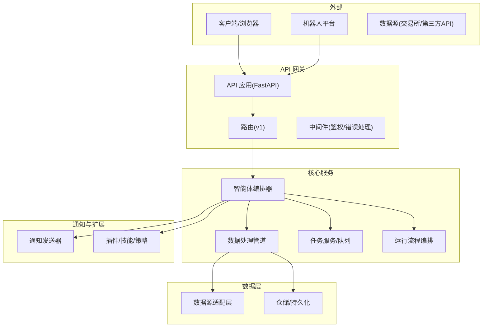
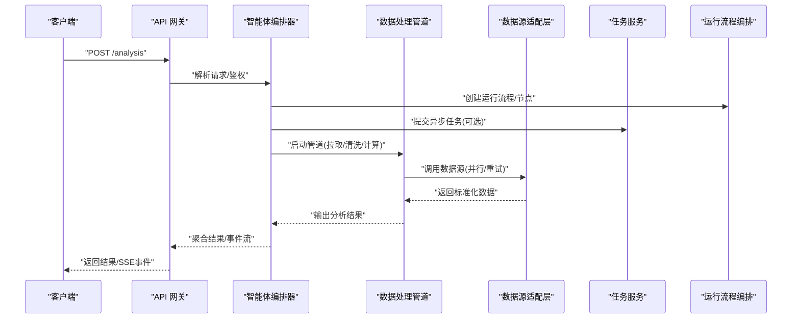
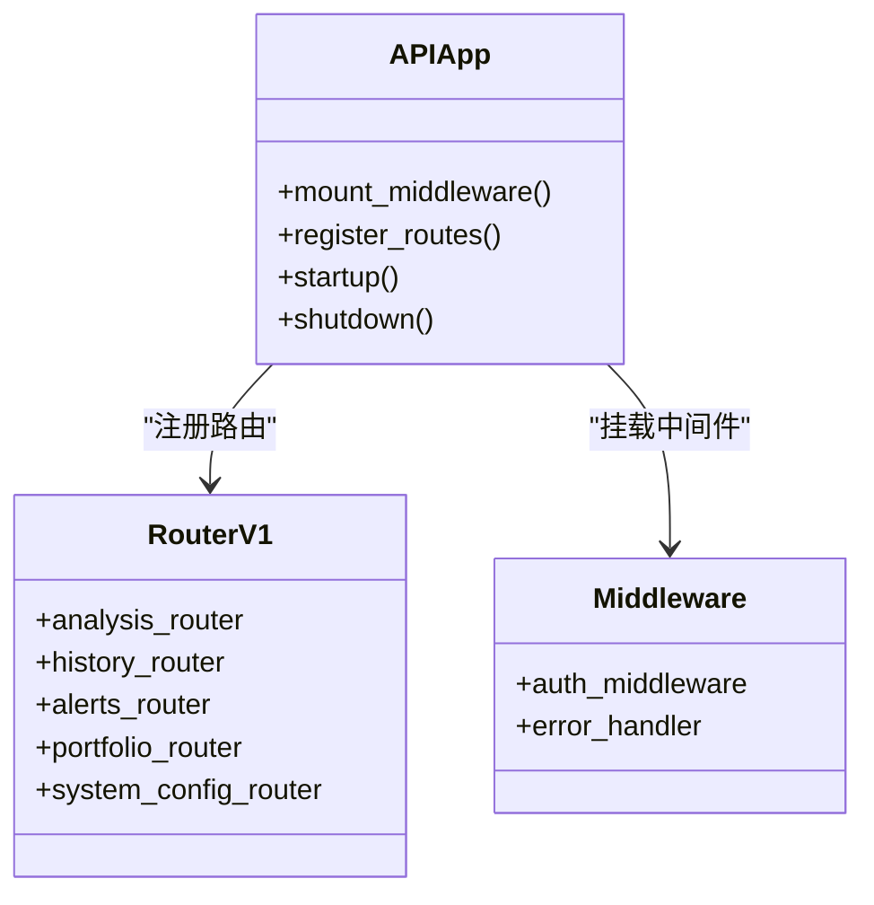
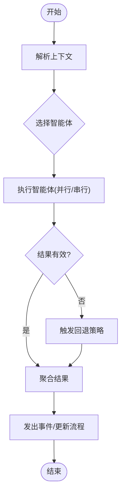
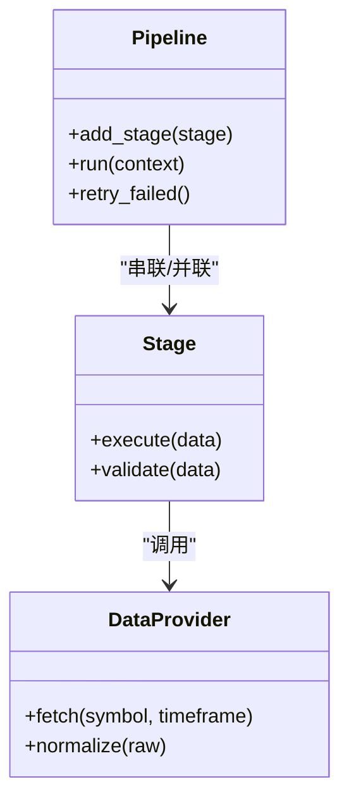
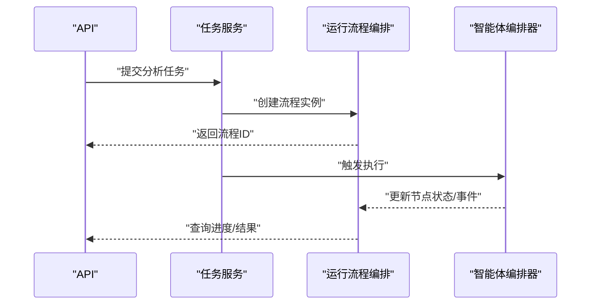
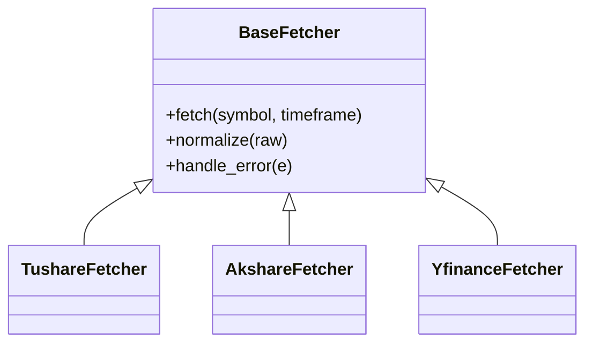
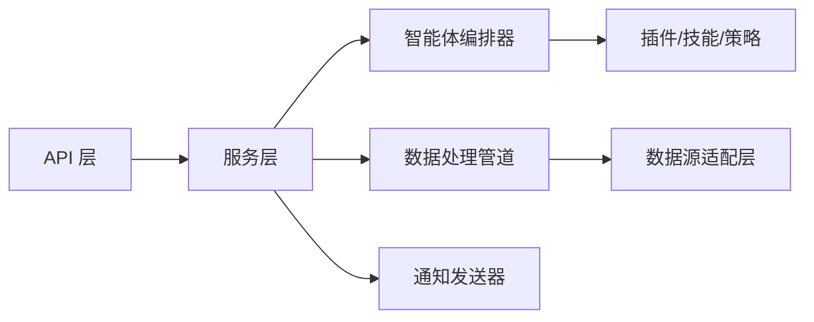
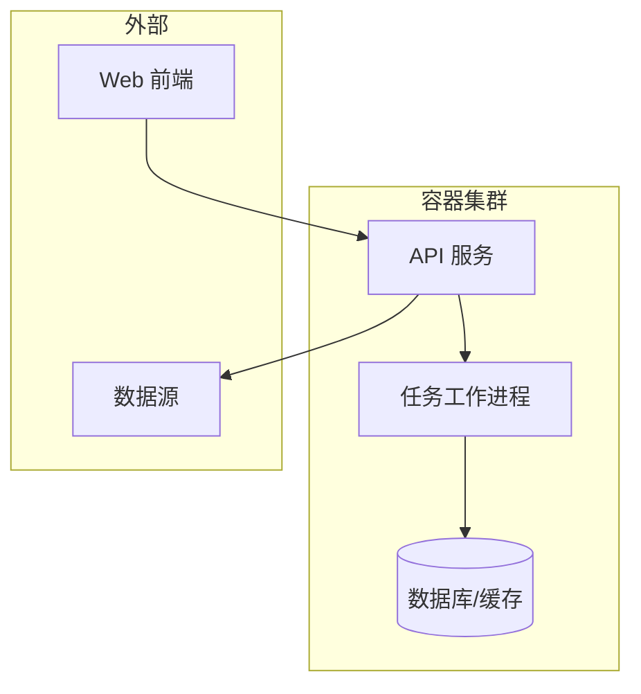

# 系统架构

<cite>
**本文引用的文件**   
- [main.py](file://main.py)
- [server.py](file://server.py)
- [webui.py](file://webui.py)
- [api/app.py](file://api/app.py)
- [api/v1/router.py](file://api/v1/router.py)
- [src/agent/orchestrator.py](file://src/agent/orchestrator.py)
- [src/core/pipeline.py](file://src/core/pipeline.py)
- [src/services/task_service.py](file://src/services/task_service.py)
- [src/services/run_flow.py](file://src/services/run_flow.py)
- [data_provider/base.py](file://data_provider/base.py)
- [docker/docker-compose.yml](file://docker/docker-compose.yml)
- [docker/Dockerfile](file://docker/Dockerfile)
- [pyproject.toml](file://pyproject.toml)
</cite>

## 目录
1. [简介](#简介)
2. [项目结构](#项目结构)
3. [核心组件](#核心组件)
4. [架构总览](#架构总览)
5. [详细组件分析](#详细组件分析)
6. [依赖关系分析](#依赖关系分析)
7. [性能考量](#性能考量)
8. [故障排查指南](#故障排查指南)
9. [结论](#结论)
10. [附录](#附录)

## 简介
本系统为“每日股票分析系统”，面向多市场、多数据源与多智能体的投资研究场景。系统采用微服务架构，结合事件驱动与插件化设计，提供：
- 智能体编排器：统一调度多种分析智能体（技术面、基本面、组合、风控等）
- 数据处理管道：从多数据源拉取行情与基本面数据，标准化后进入分析流水线
- API 网关：对外暴露 RESTful 接口，统一鉴权、限流与错误处理
- 服务注册与发现：通过配置与容器编排实现服务间通信与扩展

文档将详细说明各模块职责、通信协议、数据流转、扩展点与插件机制，并给出架构图、交互图与部署拓扑图。

## 项目结构
系统按功能域分层组织：
- api：HTTP 接口层（FastAPI），路由与中间件分离，v1 版本管理
- src：核心业务逻辑（智能体、管道、服务、存储、通知等）
- data_provider：多数据源适配器（A股、港股、美股、加密货币等）
- bot：多渠道机器人命令分发（钉钉、飞书、Discord 等）
- apps：Web 前端与桌面客户端
- docker：容器化与编排
- scripts：构建与运维脚本
- strategies：策略配置文件（YAML）
- templates：报告模板（Jinja2）

**图表来源** 
- [api/app.py](file://api/app.py)
- [api/v1/router.py](file://api/v1/router.py)
- [src/agent/orchestrator.py](file://src/agent/orchestrator.py)
- [src/core/pipeline.py](file://src/core/pipeline.py)
- [src/services/task_service.py](file://src/services/task_service.py)
- [src/services/run_flow.py](file://src/services/run_flow.py)
- [data_provider/base.py](file://data_provider/base.py)

**章节来源**
- [api/app.py](file://api/app.py)
- [api/v1/router.py](file://api/v1/router.py)
- [src/agent/orchestrator.py](file://src/agent/orchestrator.py)
- [src/core/pipeline.py](file://src/core/pipeline.py)
- [src/services/task_service.py](file://src/services/task_service.py)
- [src/services/run_flow.py](file://src/services/run_flow.py)
- [data_provider/base.py](file://data_provider/base.py)

## 核心组件
- 智能体编排器：负责解析请求上下文、选择智能体、编排执行顺序、聚合结果与回退策略
- 数据处理管道：定义阶段（拉取、清洗、特征工程、指标计算、信号生成），支持并行与容错
- API 网关：统一入口，承载鉴权、参数校验、错误码规范、SSE/异步响应
- 任务服务：后台任务队列，支撑长耗时分析与定时任务
- 运行流程编排：可视化/可追踪的执行拓扑，记录节点状态与事件
- 数据源适配层：抽象统一的获取接口，屏蔽不同数据源的差异
- 通知与插件：可扩展的通知渠道与技能/策略插件

**章节来源**
- [src/agent/orchestrator.py](file://src/agent/orchestrator.py)
- [src/core/pipeline.py](file://src/core/pipeline.py)
- [api/app.py](file://api/app.py)
- [src/services/task_service.py](file://src/services/task_service.py)
- [src/services/run_flow.py](file://src/services/run_flow.py)
- [data_provider/base.py](file://data_provider/base.py)

## 架构总览
系统采用“API 网关 + 微服务 + 事件驱动 + 插件化”的混合架构：
- API 网关作为唯一对外入口，路由到具体业务处理器
- 智能体编排器基于事件驱动协调多个智能体与服务
- 数据处理管道以阶段化方式组织，支持横向扩展
- 插件机制允许动态加载技能、策略与通知渠道

**图表来源** 
- [api/app.py](file://api/app.py)
- [src/agent/orchestrator.py](file://src/agent/orchestrator.py)
- [src/core/pipeline.py](file://src/core/pipeline.py)
- [data_provider/base.py](file://data_provider/base.py)
- [src/services/task_service.py](file://src/services/task_service.py)
- [src/services/run_flow.py](file://src/services/run_flow.py)

## 详细组件分析

### API 网关与路由
- FastAPI 应用初始化、中间件挂载（鉴权、错误处理）、路由注册
- v1 路由集中管理，按领域划分端点（分析、历史、警报、组合、系统等）
- 统一错误码与异常转换，便于前端一致处理

**图表来源** 
- [api/app.py](file://api/app.py)
- [api/v1/router.py](file://api/v1/router.py)

**章节来源**
- [api/app.py](file://api/app.py)
- [api/v1/router.py](file://api/v1/router.py)

### 智能体编排器
- 接收上下文（标的、时间范围、策略偏好），选择并编排智能体（技术面、基本面、组合、风控）
- 支持回退与降级（如某智能体失败时切换备选方案）
- 与运行流程编排集成，记录每个智能体的输入输出与耗时

**图表来源** 
- [src/agent/orchestrator.py](file://src/agent/orchestrator.py)
- [src/services/run_flow.py](file://src/services/run_flow.py)

**章节来源**
- [src/agent/orchestrator.py](file://src/agent/orchestrator.py)
- [src/services/run_flow.py](file://src/services/run_flow.py)

### 数据处理管道
- 阶段化流水线：数据拉取、清洗、特征工程、指标计算、信号生成
- 支持并行执行与失败隔离，关键阶段可重试
- 与数据源适配层解耦，新增数据源只需实现统一接口

**图表来源** 
- [src/core/pipeline.py](file://src/core/pipeline.py)
- [data_provider/base.py](file://data_provider/base.py)

**章节来源**
- [src/core/pipeline.py](file://src/core/pipeline.py)
- [data_provider/base.py](file://data_provider/base.py)

### 任务服务与运行流程编排
- 任务服务：封装后台任务队列，支持延迟、重试、优先级
- 运行流程编排：维护执行拓扑、节点状态、事件日志，便于可视化与回溯

**图表来源** 
- [src/services/task_service.py](file://src/services/task_service.py)
- [src/services/run_flow.py](file://src/services/run_flow.py)
- [src/agent/orchestrator.py](file://src/agent/orchestrator.py)

**章节来源**
- [src/services/task_service.py](file://src/services/task_service.py)
- [src/services/run_flow.py](file://src/services/run_flow.py)

### 数据源适配层
- 统一抽象：所有数据源实现相同接口，屏蔽差异
- 支持多市场（A股、港股、美股、加密货币）与多提供商（Tushare、AkShare、YFinance 等）
- 错误处理与重试策略，保证稳定性

**图表来源** 
- [data_provider/base.py](file://data_provider/base.py)

**章节来源**
- [data_provider/base.py](file://data_provider/base.py)

## 依赖关系分析
- 外部依赖：FastAPI、异步框架、消息队列（可选）、数据库（可选）
- 内部依赖：API 层依赖服务层，服务层依赖智能体与管道，管道依赖数据源适配层
- 插件依赖：技能、策略、通知渠道通过注册表动态加载

**图表来源** 
- [api/app.py](file://api/app.py)
- [src/agent/orchestrator.py](file://src/agent/orchestrator.py)
- [src/core/pipeline.py](file://src/core/pipeline.py)
- [data_provider/base.py](file://data_provider/base.py)

**章节来源**
- [api/app.py](file://api/app.py)
- [src/agent/orchestrator.py](file://src/agent/orchestrator.py)
- [src/core/pipeline.py](file://src/core/pipeline.py)
- [data_provider/base.py](file://data_provider/base.py)

## 性能考量
- 并发与并行：管道阶段并行执行，数据源拉取使用异步 I/O
- 缓存与预取：热点数据缓存，减少重复请求
- 重试与熔断：关键步骤可重试，失败快速失败避免级联
- 资源隔离：任务队列隔离长耗时任务，避免阻塞主线程
- 监控与追踪：运行流程记录节点耗时与错误，便于定位瓶颈

[本节为通用指导，不直接分析具体文件]

## 故障排查指南
- 常见问题
  - 数据源超时或限流：检查网络、代理与配额，启用重试与降级
  - 智能体执行失败：查看运行流程节点日志，确认输入上下文与依赖
  - API 鉴权失败：检查令牌与权限配置
  - 任务堆积：检查队列容量与消费者数量
- 诊断工具
  - 运行流程快照：导出执行拓扑与事件
  - 管道调试：逐阶段打印输入输出
  - 数据源健康检查：批量探测可用性与延迟

**章节来源**
- [src/services/run_flow.py](file://src/services/run_flow.py)
- [src/core/pipeline.py](file://src/core/pipeline.py)
- [api/app.py](file://api/app.py)

## 结论
本系统通过微服务、事件驱动与插件化设计，实现了高内聚、低耦合的分析能力。智能体编排器与数据处理管道为核心引擎，API 网关提供统一入口，数据源适配层屏蔽差异。未来可在插件机制上继续扩展更多智能体、策略与通知渠道，满足多样化分析需求。

[本节为总结性内容，不直接分析具体文件]

## 附录

### 部署拓扑
- 容器化部署：Docker 镜像与 Compose 编排
- 环境变量与配置：通过 pyproject.toml 与环境变量管理
- 前端与后端分离：WebUI 与 API 独立部署

**图表来源** 
- [docker/docker-compose.yml](file://docker/docker-compose.yml)
- [docker/Dockerfile](file://docker/Dockerfile)
- [pyproject.toml](file://pyproject.toml)

**章节来源**
- [docker/docker-compose.yml](file://docker/docker-compose.yml)
- [docker/Dockerfile](file://docker/Dockerfile)
- [pyproject.toml](file://pyproject.toml)

### 扩展点与插件开发指南
- 新增数据源：继承基础适配器，实现 fetch 与 normalize
- 新增智能体：实现统一接口，注册到编排器
- 新增策略：在策略目录添加 YAML 配置，并在管道中引用
- 新增通知渠道：实现发送接口，注册到通知中心

[本节为通用指导，不直接分析具体文件]