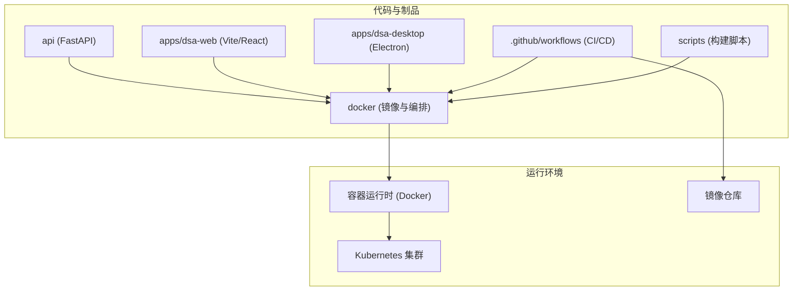
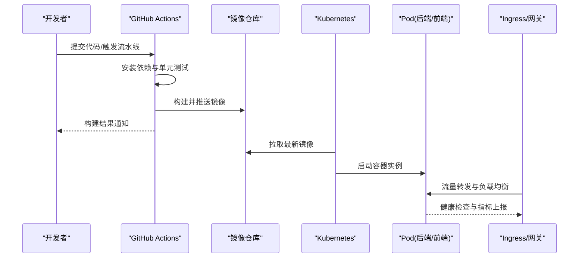
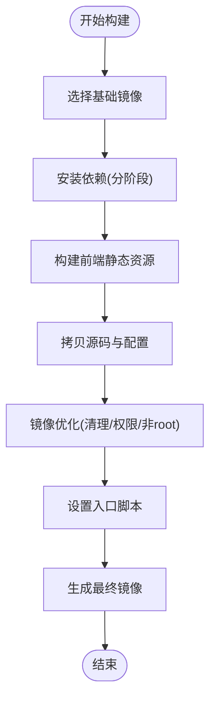
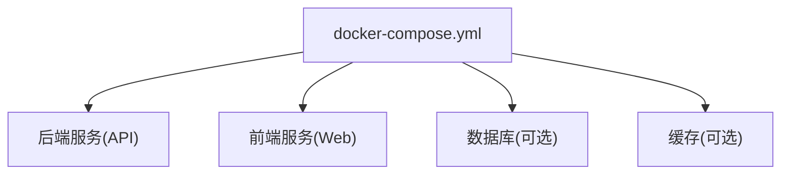
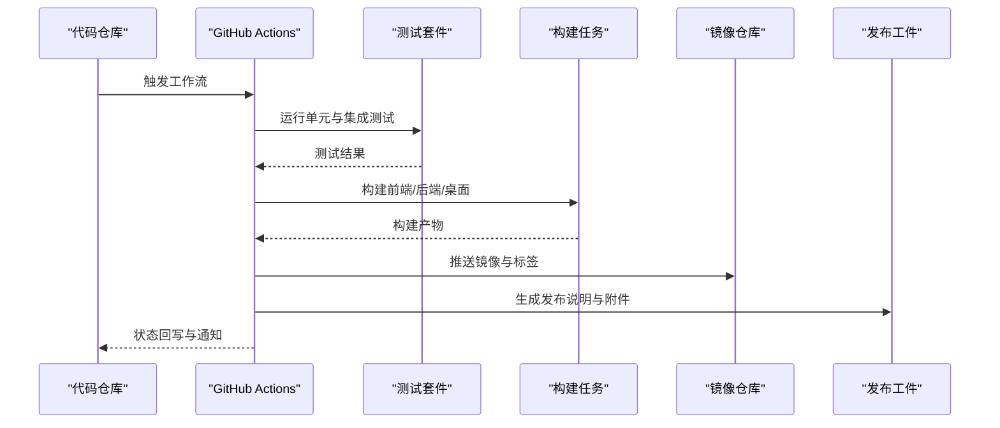
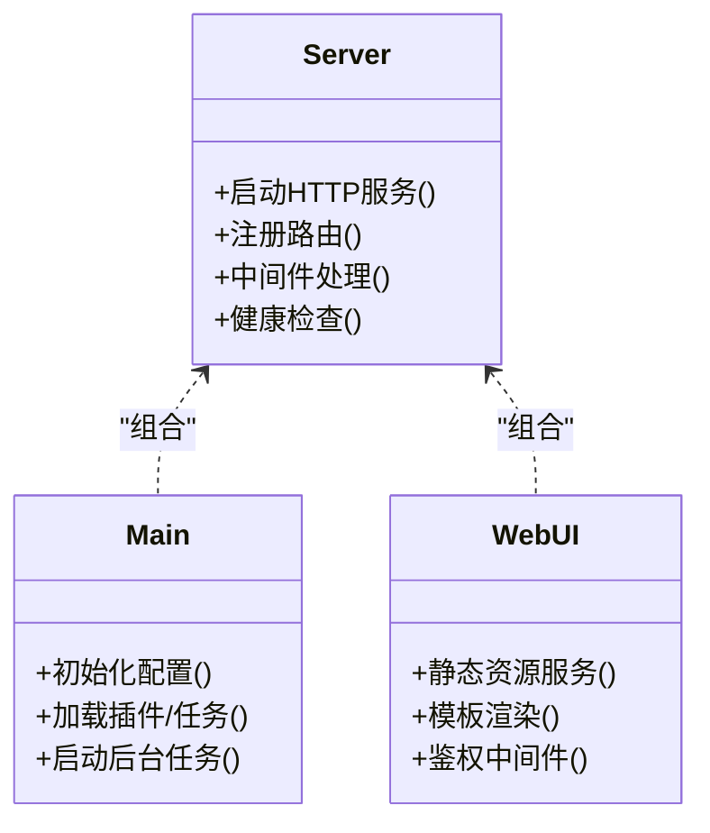
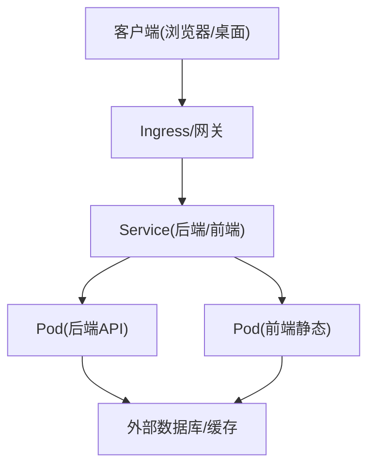
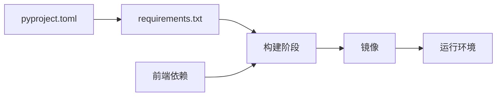

# 部署架构

<cite>
**本文档引用的文件**   
- [Dockerfile](file://docker/Dockerfile)
- [docker-compose.yml](file://docker/docker-compose.yml)
- [entrypoint.sh](file://docker/entrypoint.sh)
- [.github/workflows/ci.yml](file://.github/workflows/ci.yml)
- [.github/workflows/release.yml](file://.github/workflows/release.yml)
- [server.py](file://server.py)
- [main.py](file://main.py)
- [webui.py](file://webui.py)
- [pyproject.toml](file://pyproject.toml)
- [requirements.txt](file://requirements.txt)
- [DEPLOY_EN.md](file://docs/DEPLOY_EN.md)
- [.dockerignore](file://.dockerignore)
</cite>

## 目录
1. [简介](#简介)
2. [项目结构](#项目结构)
3. [核心组件](#核心组件)
4. [架构总览](#架构总览)
5. [详细组件分析](#详细组件分析)
6. [依赖关系分析](#依赖关系分析)
7. [性能考量](#性能考量)
8. [故障排查指南](#故障排查指南)
9. [结论](#结论)
10. [附录](#附录)

## 简介
本部署架构文档面向容器化与云原生环境，覆盖以下主题：
- 容器镜像构建（多阶段编译、镜像优化）
- CI/CD 流水线与环境管理
- Kubernetes 部署与服务编排
- 环境变量管理、配置集中与密钥安全
- 监控日志收集、健康检查与自动扩缩容
- 部署架构图、网络拓扑图与运维手册

该方案适用于后端 API、Web 前端与桌面客户端的打包与发布，支持本地开发、测试与生产环境的统一交付。

## 项目结构
仓库采用前后端分离与多应用组织方式：
- api: FastAPI 后端服务
- apps/dsa-web: Web 前端（Vite + React）
- apps/dsa-desktop: Electron 桌面客户端
- docker: Docker 镜像与编排定义
- .github/workflows: CI/CD 工作流
- scripts: 构建与辅助脚本
- docs: 部署与使用文档

图表来源
- [Dockerfile](file://docker/Dockerfile)
- [docker-compose.yml](file://docker/docker-compose.yml)
- [.github/workflows/ci.yml](file://.github/workflows/ci.yml)
- [.github/workflows/release.yml](file://.github/workflows/release.yml)

章节来源
- [Dockerfile](file://docker/Dockerfile)
- [docker-compose.yml](file://docker/docker-compose.yml)
- [server.py](file://server.py)
- [main.py](file://main.py)
- [webui.py](file://webui.py)

## 核心组件
- 后端服务（FastAPI）
  - 入口与路由由 server.py/main.py/webui.py 等模块提供，对外暴露 REST/SSE 接口与健康检查端点
- 前端静态资源（Vite）
  - 构建产物通过 Nginx 或内置静态服务分发
- 桌面客户端（Electron）
  - 独立打包流程，生成安装包与更新包
- 容器与编排
  - Dockerfile 定义镜像构建步骤；docker-compose.yml 用于本地开发与联调
- CI/CD
  - GitHub Actions 工作流负责构建、测试、镜像推送与发布

章节来源
- [server.py](file://server.py)
- [main.py](file://main.py)
- [webui.py](file://webui.py)
- [docker-compose.yml](file://docker/docker-compose.yml)

## 架构总览
下图展示从代码到运行环境的端到端流程，包括构建、镜像、编排与运行。

图表来源
- [.github/workflows/ci.yml](file://.github/workflows/ci.yml)
- [.github/workflows/release.yml](file://.github/workflows/release.yml)
- [Dockerfile](file://docker/Dockerfile)
- [docker-compose.yml](file://docker/docker-compose.yml)

## 详细组件分析

### 容器镜像构建与优化（Dockerfile）
- 多阶段构建
  - 构建阶段：安装 Python/Node 依赖，编译前端静态资源，准备后端可执行环境
  - 运行阶段：仅包含运行时依赖与最小化镜像层，减少攻击面与镜像体积
- 镜像优化策略
  - 分层缓存：将依赖安装与源码拷贝分离，提升增量构建速度
  - 精简基础镜像：选择轻量级运行时镜像
  - 清理无用文件：在单层中完成下载、安装与清理，避免残留
  - 非 root 用户运行：提升安全性
- 入口与进程管理
  - entrypoint.sh 负责环境变量注入、健康检查初始化与主进程启动

图表来源
- [Dockerfile](file://docker/Dockerfile)
- [entrypoint.sh](file://docker/entrypoint.sh)

章节来源
- [Dockerfile](file://docker/Dockerfile)
- [entrypoint.sh](file://docker/entrypoint.sh)
- [.dockerignore](file://.dockerignore)

### 本地编排与开发（docker-compose）
- 服务编排
  - 后端服务：端口映射、环境变量注入、数据卷挂载
  - 前端服务：静态资源服务与反向代理
  - 可选依赖：数据库、缓存、消息队列等（按需扩展）
- 开发体验
  - 热重载与调试端口
  - 日志输出至标准输出，便于容器日志采集

图表来源
- [docker-compose.yml](file://docker/docker-compose.yml)

章节来源
- [docker-compose.yml](file://docker/docker-compose.yml)

### CI/CD 流水线（GitHub Actions）
- 触发条件
  - push/PR/手动触发
- 主要任务
  - 环境准备与依赖安装
  - 单元测试与静态检查
  - 构建前端与后端制品
  - 构建镜像并推送至镜像仓库
  - 生成发布说明与制品归档
- 环境与密钥
  - 使用 GitHub Secrets 管理敏感信息（镜像仓库凭据、签名密钥等）

图表来源
- [.github/workflows/ci.yml](file://.github/workflows/ci.yml)
- [.github/workflows/release.yml](file://.github/workflows/release.yml)

章节来源
- [.github/workflows/ci.yml](file://.github/workflows/ci.yml)
- [.github/workflows/release.yml](file://.github/workflows/release.yml)

### 后端服务入口与运行模式
- 入口文件
  - server.py/main.py/webui.py 分别承载 API、调度与 WebUI 相关逻辑
- 运行模式
  - 开发模式：启用调试与热重载
  - 生产模式：多进程/线程模型、限流与超时控制
- 健康检查
  - 暴露 /health 或类似端点，供探针与编排系统检测

图表来源
- [server.py](file://server.py)
- [main.py](file://main.py)
- [webui.py](file://webui.py)

章节来源
- [server.py](file://server.py)
- [main.py](file://main.py)
- [webui.py](file://webui.py)

### 环境变量管理与配置中心
- 环境变量优先级
  - 默认值 < 配置文件 < 环境变量 < 运行时注入
- 配置项分类
  - 通用配置（端口、日志级别、时区）
  - 外部服务（数据库、缓存、消息队列、LLM 提供商）
  - 安全配置（密钥、令牌、证书）
- 最佳实践
  - 使用 .env 示例文件与校验脚本
  - 生产环境通过 Secret 管理敏感配置
  - 启动前进行配置校验与告警

章节来源
- [DEPLOY_EN.md](file://docs/DEPLOY_EN.md)

### 密钥与安全
- 敏感信息存储
  - 使用平台 Secret（如 GitHub Secrets、Kubernetes Secret、Vault）
- 传输与存储加密
  - TLS 终止于网关/Ingress
  - 磁盘加密与备份加密
- 访问控制
  - 最小权限原则、角色与命名空间隔离
  - 审计日志与访问追踪

章节来源
- [DEPLOY_EN.md](file://docs/DEPLOY_EN.md)

### 监控、日志与健康检查
- 健康检查
  - HTTP 探针（存活/就绪）、TCP/命令探针
- 指标与日志
  - 结构化日志输出至 stdout/stderr
  - 指标暴露（Prometheus 抓取）
  - 集中式日志采集（Fluent Bit/Logstash）
- 告警与自愈
  - 基于阈值与异常模式的告警规则
  - 自动重启与滚动升级

章节来源
- [DEPLOY_EN.md](file://docs/DEPLOY_EN.md)

### 自动扩缩容与资源管理
- 水平扩缩容（HPA）
  - 基于 CPU/内存/自定义指标
- 垂直扩缩容（VPA）
  - 推荐资源请求与限制
- 资源配额与限制
  - Namespace 级别配额
  - Pod 级别 requests/limits

章节来源
- [DEPLOY_EN.md](file://docs/DEPLOY_EN.md)

### 网络拓扑与访问路径

图表来源
- [docker-compose.yml](file://docker/docker-compose.yml)

## 依赖关系分析
- 构建依赖
  - Python/Node 版本锁定（pyproject.toml/requirements.txt）
- 运行依赖
  - 外部服务（数据库、缓存、消息队列、LLM 提供商）
- 镜像依赖
  - 基础镜像版本与漏洞扫描

图表来源
- [pyproject.toml](file://pyproject.toml)
- [requirements.txt](file://requirements.txt)
- [Dockerfile](file://docker/Dockerfile)

章节来源
- [pyproject.toml](file://pyproject.toml)
- [requirements.txt](file://requirements.txt)
- [Dockerfile](file://docker/Dockerfile)

## 性能考量
- 镜像体积与构建时间
  - 多阶段构建与依赖缓存
  - 并行构建与远程缓存
- 运行时性能
  - 合理设置 workers/threads
  - 连接池与超时配置
  - 静态资源 CDN 与缓存策略
- 资源利用率
  - requests/limits 精细化配置
  - 弹性伸缩策略与预热

[本节为通用指导，不直接分析具体文件]

## 故障排查指南
- 常见问题定位
  - 镜像构建失败：检查依赖版本与缓存
  - 启动失败：校验环境变量与端口占用
  - 健康检查失败：确认探针端点与返回码
  - 日志缺失：检查 stdout/stderr 输出与采集器
- 诊断步骤
  - 查看容器日志与事件
  - 进入容器执行诊断命令
  - 检查资源配置与配额
  - 验证网络连通性与证书

章节来源
- [DEPLOY_EN.md](file://docs/DEPLOY_EN.md)

## 结论
本部署架构以容器化为核心，结合 CI/CD 与 Kubernetes 实现一致性的构建、发布与运行。通过多阶段镜像构建、环境变量与密钥管理、健康检查与自动扩缩容，保障系统在开发、测试与生产环境中的稳定性与可观测性。建议在生产环境中引入集中式日志、指标与告警体系，持续优化镜像与资源使用效率。

[本节为总结性内容，不直接分析具体文件]

## 附录
- 快速部署清单
  - 准备镜像仓库与凭据
  - 配置环境变量与密钥
  - 部署编排（Compose/K8s）
  - 验证健康检查与访问路径
  - 配置监控与告警
- 参考文档
  - 部署指南与 FAQ

章节来源
- [DEPLOY_EN.md](file://docs/DEPLOY_EN.md)