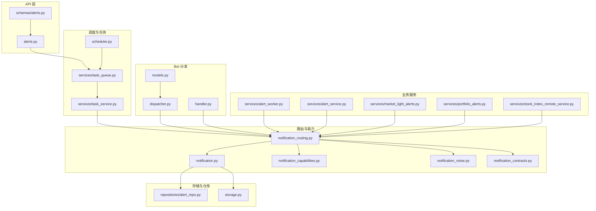
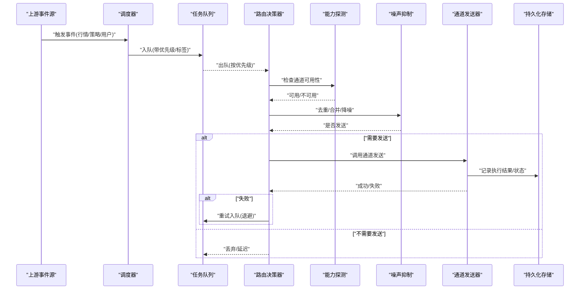
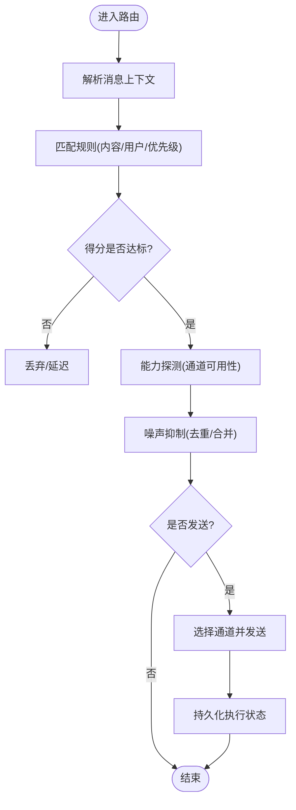
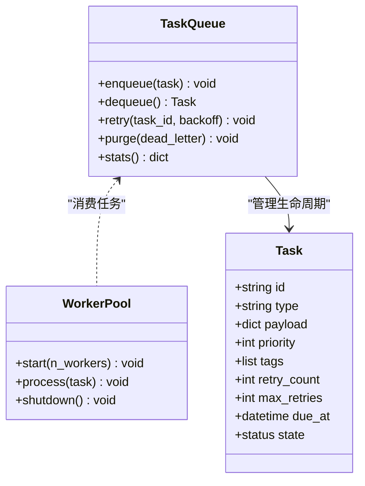
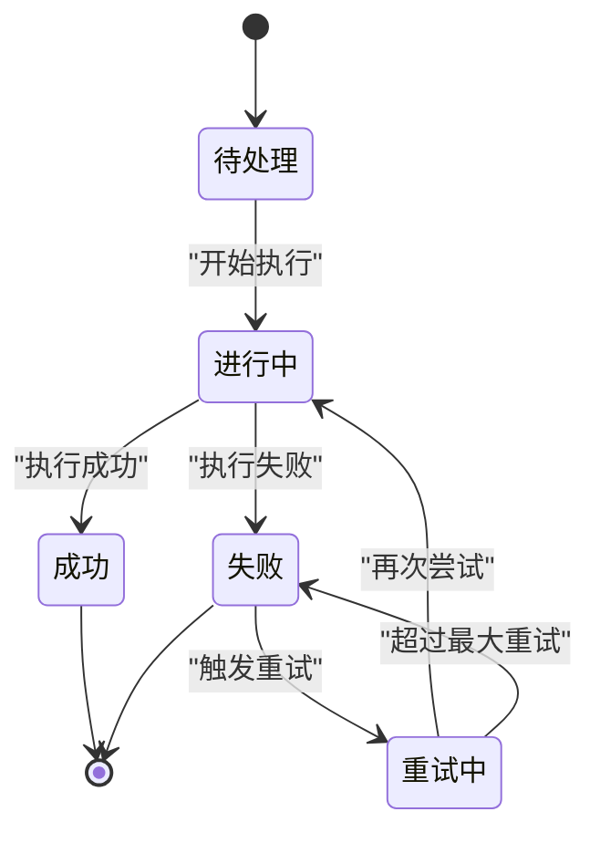
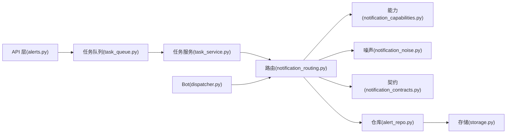

# 消息路由与分发

<cite>
**本文引用的文件**   
- [src/notification_routing.py](file://src/notification_routing.py)
- [src/notification.py](file://src/notification.py)
- [src/notification_capabilities.py](file://src/notification_capabilities.py)
- [src/notification_noise.py](file://src/notification_noise.py)
- [src/notification_contracts.py](file://src/notification_contracts.py)
- [src/scheduler.py](file://src/scheduler.py)
- [src/services/task_queue.py](file://src/services/task_queue.py)
- [src/services/task_service.py](file://src/services/task_service.py)
- [src/repositories/alert_repo.py](file://src/repositories/alert_repo.py)
- [api/v1/endpoints/alerts.py](file://api/v1/endpoints/alerts.py)
- [api/v1/schemas/alerts.py](file://api/v1/schemas/alerts.py)
- [bot/dispatcher.py](file://bot/dispatcher.py)
- [bot/handler.py](file://bot/handler.py)
- [bot/models.py](file://bot/models.py)
- [src/services/alert_worker.py](file://src/services/alert_worker.py)
- [src/services/alert_service.py](file://src/services/alert_service.py)
- [src/services/market_light_alerts.py](file://src/services/market_light_alerts.py)
- [src/services/portfolio_alerts.py](file://src/services/portfolio_alerts.py)
- [src/services/stock_index_remote_service.py](file://src/services/stock_index_remote_service.py)
- [src/storage.py](file://src/storage.py)
- [src/logging_config.py](file://src/logging_config.py)
</cite>

## 目录
1. [简介](#简介)
2. [项目结构](#项目结构)
3. [核心组件](#核心组件)
4. [架构总览](#架构总览)
5. [详细组件分析](#详细组件分析)
6. [依赖关系分析](#依赖关系分析)
7. [性能考量](#性能考量)
8. [故障排查指南](#故障排查指南)
9. [结论](#结论)
10. [附录](#附录)

## 简介
本文件面向“消息路由与分发系统”，聚焦以下目标：
- 说明消息路由规则的配置与管理，包括基于内容、用户和优先级的智能分发。
- 文档化任务队列机制、异步处理与并发控制。
- 解释消息持久化、状态跟踪与失败重试策略。
- 提供路由监控、性能分析与故障诊断工具的使用建议。

该系统在通知与告警场景中承担关键职责：将上游事件（如行情变化、策略信号、用户操作）按规则路由到合适的通道（如邮件、飞书、钉钉、Discord等），并保证高可用、可观测与可恢复。

## 项目结构
围绕消息路由与分发的代码主要分布在以下模块：
- 路由与能力层：定义消息契约、能力探测、噪声抑制与路由决策。
- 调度与任务层：定时触发、任务入队、执行与重试。
- 存储与仓库层：告警规则、执行历史、状态持久化。
- API 层：对外暴露配置、查询与运维接口。
- Bot 分发层：多平台命令与消息分发。
- 基础设施：日志、存储抽象、远程服务集成。

图表来源
- [api/v1/endpoints/alerts.py](file://api/v1/endpoints/alerts.py)
- [api/v1/schemas/alerts.py](file://api/v1/schemas/alerts.py)
- [src/scheduler.py](file://src/scheduler.py)
- [src/services/task_queue.py](file://src/services/task_queue.py)
- [src/services/task_service.py](file://src/services/task_service.py)
- [src/notification_routing.py](file://src/notification_routing.py)
- [src/notification.py](file://src/notification.py)
- [src/notification_capabilities.py](file://src/notification_capabilities.py)
- [src/notification_noise.py](file://src/notification_noise.py)
- [src/notification_contracts.py](file://src/notification_contracts.py)
- [src/repositories/alert_repo.py](file://src/repositories/alert_repo.py)
- [src/storage.py](file://src/storage.py)
- [bot/dispatcher.py](file://bot/dispatcher.py)
- [bot/handler.py](file://bot/handler.py)
- [bot/models.py](file://bot/models.py)
- [src/services/alert_worker.py](file://src/services/alert_worker.py)
- [src/services/alert_service.py](file://src/services/alert_service.py)
- [src/services/market_light_alerts.py](file://src/services/market_light_alerts.py)
- [src/services/portfolio_alerts.py](file://src/services/portfolio_alerts.py)
- [src/services/stock_index_remote_service.py](file://src/services/stock_index_remote_service.py)

章节来源
- [api/v1/endpoints/alerts.py](file://api/v1/endpoints/alerts.py)
- [src/scheduler.py](file://src/scheduler.py)
- [src/services/task_queue.py](file://src/services/task_queue.py)
- [src/notification_routing.py](file://src/notification_routing.py)

## 核心组件
- 路由决策器：根据消息类型、上下文与用户偏好选择目标通道与模板，支持优先级与去重。
- 能力探测：动态检测各通道可用性，避免向不可用通道投递。
- 噪声抑制：对重复或低价值消息进行合并与过滤，降低噪音。
- 任务队列与调度：统一的任务入队、出队、重试与限流，支撑异步与并发。
- 持久化与状态：告警规则、执行记录、失败计数与重试次数持久化。
- API 与配置：通过 REST 接口管理路由规则、查看状态与触发测试。
- Bot 分发：多平台消息的解析与转发，与路由层解耦。

章节来源
- [src/notification_routing.py](file://src/notification_routing.py)
- [src/notification_capabilities.py](file://src/notification_capabilities.py)
- [src/notification_noise.py](file://src/notification_noise.py)
- [src/services/task_queue.py](file://src/services/task_queue.py)
- [src/repositories/alert_repo.py](file://src/repositories/alert_repo.py)
- [api/v1/endpoints/alerts.py](file://api/v1/endpoints/alerts.py)
- [bot/dispatcher.py](file://bot/dispatcher.py)

## 架构总览
整体流程从事件产生到最终投递的关键路径如下：

图表来源
- [src/scheduler.py](file://src/scheduler.py)
- [src/services/task_queue.py](file://src/services/task_queue.py)
- [src/notification_routing.py](file://src/notification_routing.py)
- [src/notification_capabilities.py](file://src/notification_capabilities.py)
- [src/notification_noise.py](file://src/notification_noise.py)
- [src/repositories/alert_repo.py](file://src/repositories/alert_repo.py)

## 详细组件分析

### 路由决策与规则管理
- 规则维度
  - 基于内容：消息主题、关键词、指标阈值匹配。
  - 基于用户：订阅偏好、渠道白名单、时区与频率限制。
  - 基于优先级：紧急/重要/普通等级决定投递顺序与降级策略。
- 决策流程
  - 解析消息上下文，计算命中规则得分。
  - 结合能力探测结果选择最优通道。
  - 应用噪声抑制策略，决定是否发送或合并。
- 配置管理
  - 通过 API 增删改查路由规则与通道配置。
  - 支持热更新与版本回滚（由上层配置服务负责）。

图表来源
- [src/notification_routing.py](file://src/notification_routing.py)
- [src/notification_capabilities.py](file://src/notification_capabilities.py)
- [src/notification_noise.py](file://src/notification_noise.py)
- [api/v1/endpoints/alerts.py](file://api/v1/endpoints/alerts.py)

章节来源
- [src/notification_routing.py](file://src/notification_routing.py)
- [api/v1/endpoints/alerts.py](file://api/v1/endpoints/alerts.py)

### 任务队列与异步并发控制
- 任务模型
  - 包含任务类型、参数、优先级、标签、重试策略与超时。
- 队列特性
  - 优先级队列、去重键、延迟入队、死信队列。
- 并发控制
  - 工作池大小、令牌桶/漏桶限流、背压与拒绝策略。
- 重试与退避
  - 指数退避、最大重试次数、幂等性保障。

图表来源
- [src/services/task_queue.py](file://src/services/task_queue.py)
- [src/services/task_service.py](file://src/services/task_service.py)

章节来源
- [src/services/task_queue.py](file://src/services/task_queue.py)
- [src/services/task_service.py](file://src/services/task_service.py)

### 消息持久化、状态跟踪与失败重试
- 持久化对象
  - 告警规则、执行记录、失败计数、重试队列。
- 状态机
  - 待处理、进行中、成功、失败、重试中、已取消。
- 重试策略
  - 按错误类型分类重试，区分网络异常与业务异常。
- 审计与追踪
  - 唯一消息 ID、链路追踪、耗时统计。

图表来源
- [src/repositories/alert_repo.py](file://src/repositories/alert_repo.py)
- [src/storage.py](file://src/storage.py)

章节来源
- [src/repositories/alert_repo.py](file://src/repositories/alert_repo.py)
- [src/storage.py](file://src/storage.py)

### API 与配置管理
- 路由规则管理
  - 创建/更新/删除规则，校验与生效流程。
- 通道配置
  - 凭据管理、健康检查、开关控制。
- 监控与诊断
  - 队列深度、成功率、平均耗时、失败原因分布。

章节来源
- [api/v1/endpoints/alerts.py](file://api/v1/endpoints/alerts.py)
- [api/v1/schemas/alerts.py](file://api/v1/schemas/alerts.py)

### Bot 分发与多平台接入
- 命令解析与路由
  - 不同平台消息格式统一为内部模型，再交由路由层处理。
- 平台适配
  - 各平台适配器封装发送与回调逻辑。
- 安全与鉴权
  - 平台级鉴权与权限控制。

章节来源
- [bot/dispatcher.py](file://bot/dispatcher.py)
- [bot/handler.py](file://bot/handler.py)
- [bot/models.py](file://bot/models.py)

### 业务服务与触发源
- 市场轻量告警
  - 基于市场状态与指标的轻量触发。
- 组合告警
  - 基于持仓与风险阈值的告警。
- 索引远程服务
  - 外部数据源拉取与缓存，驱动告警。

章节来源
- [src/services/market_light_alerts.py](file://src/services/market_light_alerts.py)
- [src/services/portfolio_alerts.py](file://src/services/portfolio_alerts.py)
- [src/services/stock_index_remote_service.py](file://src/services/stock_index_remote_service.py)

## 依赖关系分析
- 松耦合设计
  - 路由层与发送器解耦，通过能力探测与契约接口协作。
- 关键依赖
  - 任务队列依赖存储与日志；路由依赖能力与噪声抑制；API 依赖仓库与服务。
- 潜在循环依赖
  - 通过分层与接口隔离避免循环引用。

图表来源
- [api/v1/endpoints/alerts.py](file://api/v1/endpoints/alerts.py)
- [src/services/task_queue.py](file://src/services/task_queue.py)
- [src/services/task_service.py](file://src/services/task_service.py)
- [src/notification_routing.py](file://src/notification_routing.py)
- [src/notification_capabilities.py](file://src/notification_capabilities.py)
- [src/notification_noise.py](file://src/notification_noise.py)
- [src/notification_contracts.py](file://src/notification_contracts.py)
- [src/repositories/alert_repo.py](file://src/repositories/alert_repo.py)
- [src/storage.py](file://src/storage.py)
- [bot/dispatcher.py](file://bot/dispatcher.py)

章节来源
- [src/notification_routing.py](file://src/notification_routing.py)
- [src/services/task_queue.py](file://src/services/task_queue.py)

## 性能考量
- 队列吞吐
  - 合理设置工作池大小与限流策略，避免阻塞与资源耗尽。
- 路由效率
  - 规则索引与缓存命中优化，减少全量匹配。
- 发送器优化
  - 连接复用、批量发送、超时与重试退避。
- 存储读写
  - 异步写入、批处理与分区表设计。
- 监控指标
  - 队列长度、P95/P99 延迟、成功率、失败率、重试率。

[本节为通用指导，不直接分析具体文件]

## 故障排查指南
- 常见问题
  - 通道不可用：检查能力探测与健康检查。
  - 规则未命中：核对规则条件与上下文字段。
  - 队列堆积：检查工作池容量与消费者速率。
  - 频繁重试：定位错误类型与退避策略。
- 诊断工具
  - 日志采集与分析：统一日志格式与分级。
  - 指标收集：Prometheus/Grafana 集成。
  - 链路追踪：消息 ID 贯穿全流程。
- 快速恢复
  - 临时关闭问题通道、切换备用通道。
  - 清理死信队列与积压任务。

章节来源
- [src/logging_config.py](file://src/logging_config.py)
- [src/storage.py](file://src/storage.py)

## 结论
该消息路由与分发系统通过清晰的分层与模块化设计，实现了灵活的路由规则、可靠的异步任务处理与完善的监控诊断能力。建议在生产环境中强化规则治理、完善指标与告警、持续优化队列与发送器性能，确保在高负载下的稳定性与可观测性。

[本节为总结性内容，不直接分析具体文件]

## 附录
- 术语表
  - 路由：根据规则将消息定向到合适通道。
  - 能力探测：检测通道可用性与健康状态。
  - 噪声抑制：去重、合并与过滤低价值消息。
  - 任务队列：异步任务的缓冲与调度。
  - 死信队列：无法处理的失败任务暂存。
- 最佳实践
  - 规则最小化与可测试性。
  - 幂等设计与重试策略。
  - 监控先行与可观测性。

[本节为补充信息，不直接分析具体文件]