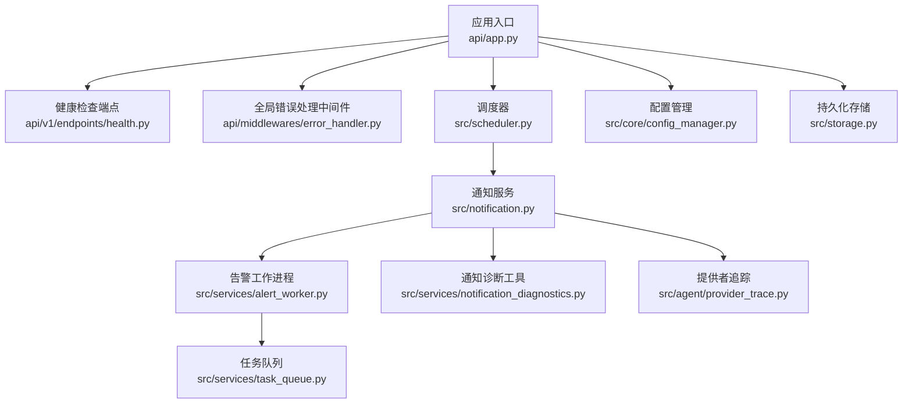
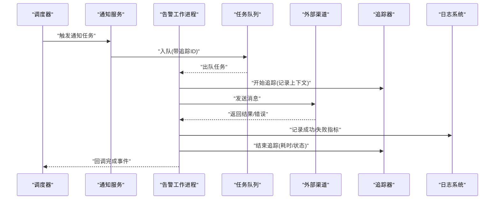
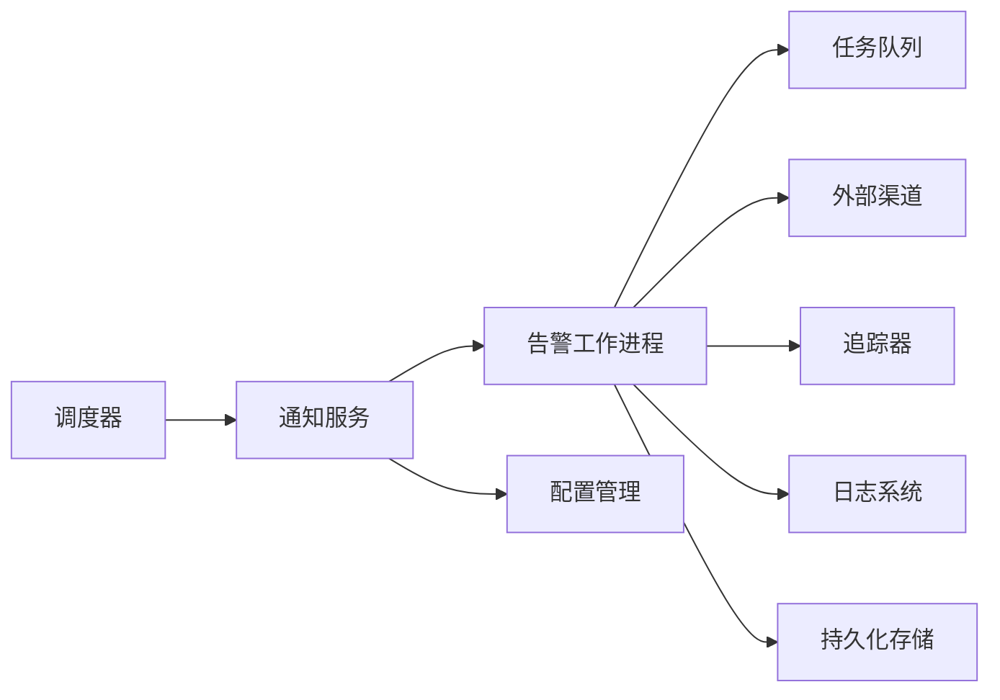

# 监控与调试

<cite>
**本文引用的文件**   
- [logging_config.py](file://src/logging_config.py)
- [notification.py](file://src/notification.py)
- [notification_diagnostics.py](file://src/services/notification_diagnostics.py)
- [alert_worker.py](file://src/services/alert_worker.py)
- [task_queue.py](file://src/services/task_queue.py)
- [run_diagnostics.py](file://src/services/run_diagnostics.py)
- [app.py](file://api/app.py)
- [health.py](file://api/v1/endpoints/health.py)
- [error_handler.py](file://api/middlewares/error_handler.py)
- [provider_trace.py](file://src/agent/provider_trace.py)
- [scheduler.py](file://src/scheduler.py)
- [config_manager.py](file://src/core/config_manager.py)
- [storage.py](file://src/storage.py)
</cite>

## 目录
1. [简介](#简介)
2. [项目结构](#项目结构)
3. [核心组件](#核心组件)
4. [架构总览](#架构总览)
5. [详细组件分析](#详细组件分析)
6. [依赖关系分析](#依赖关系分析)
7. [性能考量](#性能考量)
8. [故障排查指南](#故障排查指南)
9. [结论](#结论)
10. [附录](#附录)

## 简介
本文件面向通知系统的监控与调试，覆盖日志记录策略、关键指标收集与性能监控、调试工具使用（消息追踪、错误诊断、性能分析）、告警统计报表、发送成功率监控、渠道健康检查，以及常见问题排查与性能优化建议。目标是帮助运维与研发快速定位问题、评估系统健康度并持续优化。

## 项目结构
通知与监控相关代码主要分布在以下模块：
- 日志配置与统一输出：logging_config.py
- 通知调度与执行：notification.py、alert_worker.py、task_queue.py、scheduler.py
- 诊断与排障：notification_diagnostics.py、run_diagnostics.py
- API 与健康检查：app.py、health.py、error_handler.py
- 外部调用追踪：provider_trace.py
- 配置与存储：config_manager.py、storage.py

图表来源
- [app.py](file://api/app.py)
- [health.py](file://api/v1/endpoints/health.py)
- [error_handler.py](file://api/middlewares/error_handler.py)
- [scheduler.py](file://src/scheduler.py)
- [notification.py](file://src/notification.py)
- [alert_worker.py](file://src/services/alert_worker.py)
- [task_queue.py](file://src/services/task_queue.py)
- [notification_diagnostics.py](file://src/services/notification_diagnostics.py)
- [provider_trace.py](file://src/agent/provider_trace.py)
- [config_manager.py](file://src/core/config_manager.py)
- [storage.py](file://src/storage.py)

章节来源
- [app.py](file://api/app.py)
- [health.py](file://api/v1/endpoints/health.py)
- [error_handler.py](file://api/middlewares/error_handler.py)
- [scheduler.py](file://src/scheduler.py)
- [notification.py](file://src/notification.py)
- [alert_worker.py](file://src/services/alert_worker.py)
- [task_queue.py](file://src/services/task_queue.py)
- [notification_diagnostics.py](file://src/services/notification_diagnostics.py)
- [provider_trace.py](file://src/agent/provider_trace.py)
- [config_manager.py](file://src/core/config_manager.py)
- [storage.py](file://src/storage.py)

## 核心组件
- 日志配置与采集：集中式日志初始化、分级输出、结构化字段注入，便于聚合与检索。
- 通知调度与执行：基于调度器触发通知任务，通过工作进程与队列解耦，保障高吞吐与可恢复性。
- 诊断与排障：提供通道连通性检测、重试与超时分析、失败根因定位等能力。
- 健康检查与错误处理：对外暴露健康状态，统一捕获异常并标准化错误响应。
- 外部调用追踪：对 LLM/第三方渠道的调用进行链路追踪与耗时统计。
- 配置与存储：动态配置加载与持久化，支撑运行时调优与审计。

章节来源
- [logging_config.py](file://src/logging_config.py)
- [notification.py](file://src/notification.py)
- [alert_worker.py](file://src/services/alert_worker.py)
- [task_queue.py](file://src/services/task_queue.py)
- [notification_diagnostics.py](file://src/services/notification_diagnostics.py)
- [run_diagnostics.py](file://src/services/run_diagnostics.py)
- [provider_trace.py](file://src/agent/provider_trace.py)
- [config_manager.py](file://src/core/config_manager.py)
- [storage.py](file://src/storage.py)

## 架构总览
通知系统采用“调度-执行-队列”分层架构，配合统一的日志、追踪与健康检查，形成可观测闭环。

图表来源
- [scheduler.py](file://src/scheduler.py)
- [notification.py](file://src/notification.py)
- [alert_worker.py](file://src/services/alert_worker.py)
- [task_queue.py](file://src/services/task_queue.py)
- [provider_trace.py](file://src/agent/provider_trace.py)
- [logging_config.py](file://src/logging_config.py)

## 详细组件分析

### 日志记录策略
- 统一初始化：在应用启动时集中配置日志级别、输出目标与格式化模板，确保各模块一致。
- 结构化字段：为每条日志注入请求ID、渠道名、消息ID、阶段等关键字段，便于跨层关联。
- 分级输出：DEBUG/INFO/WARN/ERROR 分级控制，生产环境默认关闭低级别日志以减少开销。
- 采样与限流：对高频日志进行采样或限流，避免风暴影响性能。
- 外部依赖日志：对第三方渠道调用进行最小化日志，避免敏感信息泄露。

章节来源
- [logging_config.py](file://src/logging_config.py)

### 关键指标与性能监控
- 发送成功率：按渠道、规则维度统计成功/失败比率，支持时间窗口聚合。
- 延迟分布：端到端耗时、各阶段耗时（入队、出队、发送、回调）分位统计。
- 队列积压：队列长度、消费速率、消费者健康状态。
- 资源使用：CPU、内存、GC 停顿、线程池占用。
- 外部依赖：第三方渠道可用性、超时率、错误码分布。

章节来源
- [task_queue.py](file://src/services/task_queue.py)
- [alert_worker.py](file://src/services/alert_worker.py)
- [provider_trace.py](file://src/agent/provider_trace.py)

### 调试工具使用方法
- 消息追踪：通过追踪ID贯穿调度、入队、出队、发送全流程，可在日志中检索全链路。
- 错误诊断：利用诊断工具进行通道连通性测试、凭据校验、网络与时区检查。
- 性能分析：结合追踪数据与队列指标，识别瓶颈环节（如慢查询、外部超时）。
- 回放与复现：基于持久化的上下文快照与输入参数，构造最小复现场景。

章节来源
- [notification_diagnostics.py](file://src/services/notification_diagnostics.py)
- [run_diagnostics.py](file://src/services/run_diagnostics.py)
- [provider_trace.py](file://src/agent/provider_trace.py)

### 告警统计报表
- 维度：按渠道、规则、业务域、时间段聚合。
- 指标：发送量、成功量、失败量、成功率、平均/分位延迟、错误类型分布。
- 可视化：支持导出 CSV/JSON 供 BI 系统接入，或在前端展示趋势图。

章节来源
- [alert_worker.py](file://src/services/alert_worker.py)
- [task_queue.py](file://src/services/task_queue.py)

### 发送成功率监控
- 实时看板：近 5/15/60 分钟成功率、错误 Top 原因、受影响渠道。
- 阈值告警：成功率低于阈值、错误率突增、渠道不可用等触发告警。
- 自动降级：当某渠道失败率过高时，自动切换备用渠道或暂停发送。

章节来源
- [alert_worker.py](file://src/services/alert_worker.py)
- [notification.py](file://src/notification.py)

### 渠道健康检查
- 连通性探测：定时发起轻量探测请求，验证凭据与网络可达性。
- 健康评分：综合成功率、延迟、错误码分布计算健康分数。
- 自愈策略：失败次数超过阈值则标记为不健康，自动隔离并通知运维。

章节来源
- [notification_diagnostics.py](file://src/services/notification_diagnostics.py)
- [health.py](file://api/v1/endpoints/health.py)

### 错误处理与统一响应
- 全局中间件：捕获未处理异常，转换为标准错误响应，附带错误码与追踪ID。
- 分类处理：区分客户端错误与服务端错误，记录不同级别的日志。
- 幂等与重试：对可重试错误实施指数退避重试，避免雪崩。

章节来源
- [error_handler.py](file://api/middlewares/error_handler.py)
- [app.py](file://api/app.py)

### 外部调用追踪
- 链路追踪：为每次外部调用生成唯一追踪ID，记录请求/响应摘要与耗时。
- 采样策略：对慢请求与错误请求提高采样率，降低正常流量开销。
- 审计与合规：脱敏敏感字段，保留必要审计信息。

章节来源
- [provider_trace.py](file://src/agent/provider_trace.py)

### 调度与任务队列
- 调度器：按规则周期触发通知任务，支持并发与限流。
- 任务队列：保证顺序与可靠性，支持死信队列与重试策略。
- 工作进程：多进程/多线程模型，提升吞吐与容错。

章节来源
- [scheduler.py](file://src/scheduler.py)
- [task_queue.py](file://src/services/task_queue.py)
- [alert_worker.py](file://src/services/alert_worker.py)

### 配置管理与存储
- 动态配置：支持运行时更新日志级别、重试策略、采样率等。
- 持久化：关键状态与指标落盘，便于重启恢复与审计。
- 版本兼容：配置迁移与校验，防止错误配置导致运行异常。

章节来源
- [config_manager.py](file://src/core/config_manager.py)
- [storage.py](file://src/storage.py)

## 依赖关系分析
通知子系统与外部依赖包括：调度器、任务队列、工作进程、外部渠道、日志系统、追踪器、配置与存储。

图表来源
- [scheduler.py](file://src/scheduler.py)
- [notification.py](file://src/notification.py)
- [alert_worker.py](file://src/services/alert_worker.py)
- [task_queue.py](file://src/services/task_queue.py)
- [provider_trace.py](file://src/agent/provider_trace.py)
- [logging_config.py](file://src/logging_config.py)
- [config_manager.py](file://src/core/config_manager.py)
- [storage.py](file://src/storage.py)

章节来源
- [scheduler.py](file://src/scheduler.py)
- [notification.py](file://src/notification.py)
- [alert_worker.py](file://src/services/alert_worker.py)
- [task_queue.py](file://src/services/task_queue.py)
- [provider_trace.py](file://src/agent/provider_trace.py)
- [logging_config.py](file://src/logging_config.py)
- [config_manager.py](file://src/core/config_manager.py)
- [storage.py](file://src/storage.py)

## 性能考量
- 队列背压：监控队列长度与消费速率，必要时扩容消费者或限流入队。
- 重试策略：合理设置最大重试次数与退避间隔，避免放大错误。
- 连接池：复用外部渠道连接，减少握手开销。
- 缓存热点：对频繁读取的配置与元数据进行缓存，降低 IO 压力。
- 异步化：将非阻塞操作异步执行，提升整体吞吐。
- 采样与降采样：在高负载时对低频日志与追踪进行采样，平衡可观测性与性能。

[本节为通用指导，无需特定文件引用]

## 故障排查指南
- 无法发送消息
  - 检查渠道健康状态与凭据配置
  - 查看错误日志中的错误码与堆栈
  - 使用诊断工具进行连通性测试
- 发送延迟升高
  - 观察队列积压与消费者数量
  - 分析外部渠道响应时间与超时率
  - 检查资源使用（CPU/内存/GC）
- 成功率下降
  - 定位错误类型分布与受影响渠道
  - 检查是否触发自动降级或熔断
  - 核对最近配置变更与依赖服务状态
- 追踪不到消息
  - 确认追踪ID是否正确传递
  - 检查日志级别与采样策略
  - 验证持久化存储是否可用

章节来源
- [notification_diagnostics.py](file://src/services/notification_diagnostics.py)
- [run_diagnostics.py](file://src/services/run_diagnostics.py)
- [error_handler.py](file://api/middlewares/error_handler.py)
- [health.py](file://api/v1/endpoints/health.py)

## 结论
通过统一的日志、追踪与健康检查，结合调度-执行-队列的分层架构，通知系统具备良好的可观测性与可维护性。建议在生产环境中持续完善指标采集与告警策略，定期演练故障场景，确保系统在高峰与异常情况下稳定运行。

[本节为总结性内容，无需特定文件引用]

## 附录
- 常用命令与接口
  - 健康检查：访问健康端点获取系统状态与依赖健康度
  - 诊断工具：运行诊断脚本进行通道连通性与配置校验
  - 指标导出：导出队列与发送指标用于离线分析
- 最佳实践
  - 严格区分环境配置，避免误用测试凭据
  - 对关键路径增加冗余与降级策略
  - 定期审查日志与追踪数据，发现潜在风险

[本节为补充说明，无需特定文件引用]