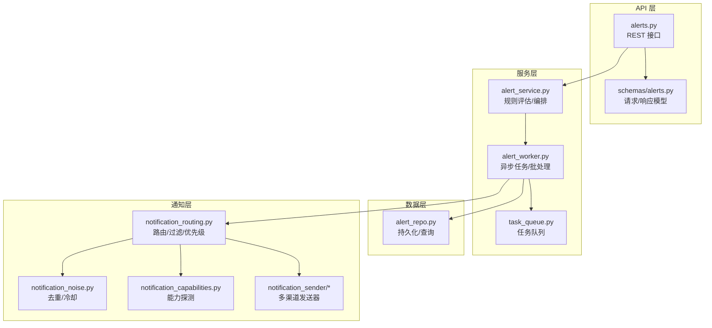
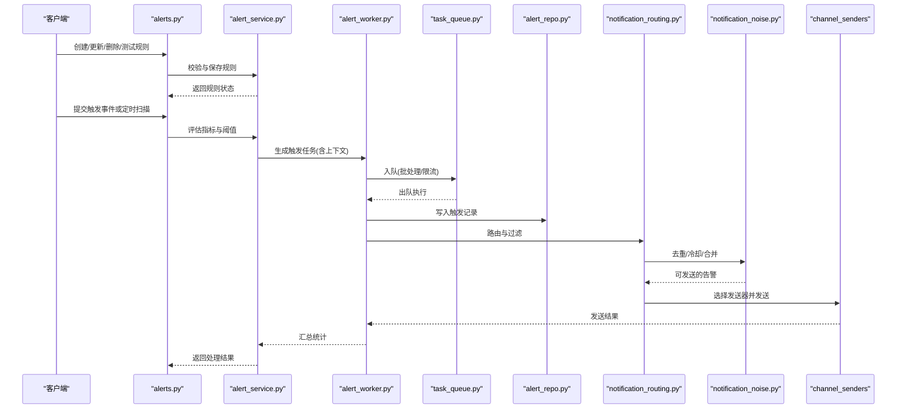
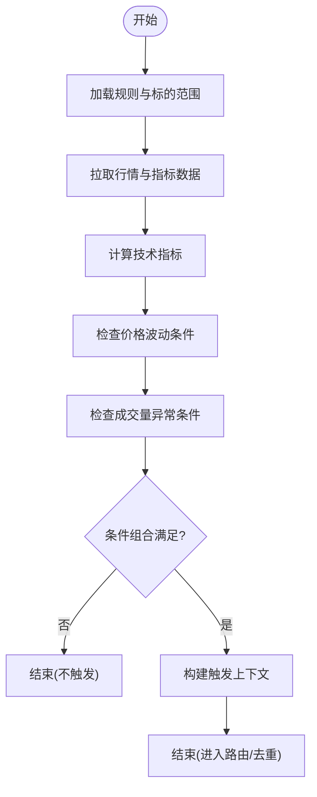
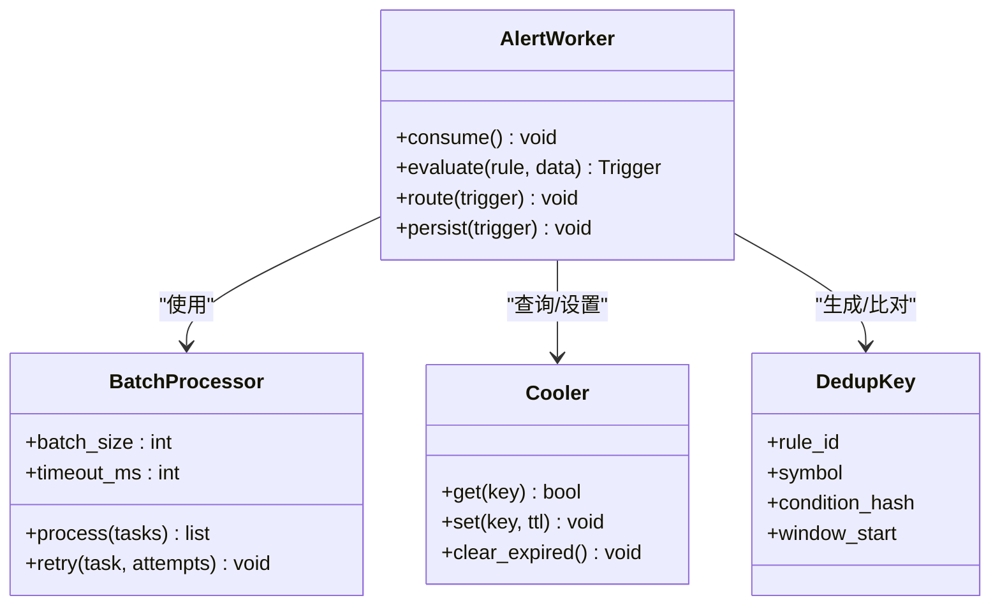
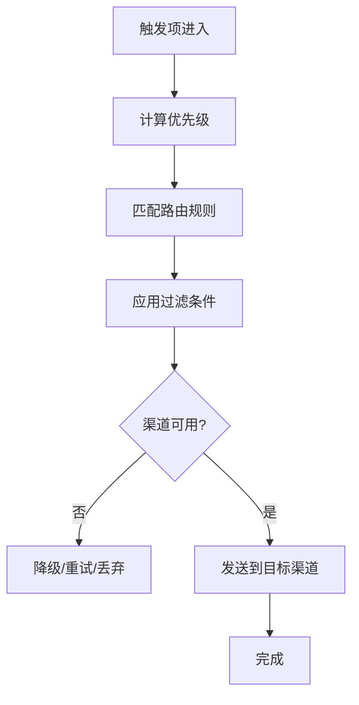
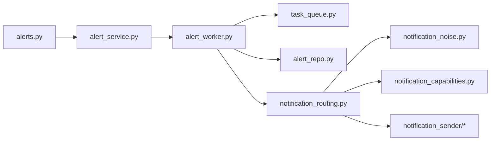

# 警报规则引擎

<cite>
**本文引用的文件**   
- [api/v1/endpoints/alerts.py](file://api/v1/endpoints/alerts.py)
- [api/v1/schemas/alerts.py](file://api/v1/schemas/alerts.py)
- [src/services/alert_service.py](file://src/services/alert_service.py)
- [src/services/alert_worker.py](file://src/services/alert_worker.py)
- [src/repositories/alert_repo.py](file://src/repositories/alert_repo.py)
- [src/notification_routing.py](file://src/notification_routing.py)
- [src/notification_noise.py](file://src/notification_noise.py)
- [src/notification_capabilities.py](file://src/notification_capabilities.py)
- [src/notification_sender/__init__.py](file://src/notification_sender/__init__.py)
- [src/notification_sender/email_sender.py](file://src/notification_sender/email_sender.py)
- [src/notification_sender/telegram_sender.py](file://src/notification_sender/telegram_sender.py)
- [src/notification_sender/wechat_sender.py](file://src/notification_sender/wechat_sender.py)
- [src/notification_sender/discord_sender.py](file://src/notification_sender/discord_sender.py)
- [src/notification_sender/custom_webhook_sender.py](file://src/notification_sender/custom_webhook_sender.py)
- [src/notification_sender/pushover_sender.py](file://src/notification_sender/pushover_sender.py)
- [src/notification_sender/serverchan3_sender.py](file://src/notification_sender/serverchan3_sender.py)
- [src/notification_sender/ntfy_sender.py](file://src/notification_sender/ntfy_sender.py)
- [src/notification_sender/slack_sender.py](file://src/notification_sender/slack_sender.py)
- [src/notification_sender/gotify_sender.py](file://src/notification_sender/gotify_sender.py)
- [src/notification_sender/astrbot_sender.py](file://src/notification_sender/astrbot_sender.py)
- [src/notification_sender/feishu_sender.py](file://src/notification_sender/feishu_sender.py)
- [src/notification_sender/pushplus_sender.py](file://src/notification_sender/pushplus_sender.py)
- [src/services/task_queue.py](file://src/services/task_queue.py)
- [src/config_manager.py](file://src/core/config_manager.py)
- [src/config_registry.py](file://src/core/config_registry.py)
- [src/enums.py](file://src/enums.py)
- [tests/test_alert_api.py](file://tests/test_alert_api.py)
- [tests/test_alert_worker.py](file://tests/test_alert_worker.py)
- [tests/test_notification_routing.py](file://tests/test_notification_routing.py)
- [tests/test_notification_noise.py](file://tests/test_notification_noise.py)
</cite>

## 目录
1. [简介](#简介)
2. [项目结构](#项目结构)
3. [核心组件](#核心组件)
4. [架构总览](#架构总览)
5. [详细组件分析](#详细组件分析)
6. [依赖关系分析](#依赖关系分析)
7. [性能考量](#性能考量)
8. [故障排查指南](#故障排查指南)
9. [结论](#结论)
10. [附录](#附录)

## 简介
本文件面向“警报规则引擎”的完整技术文档，覆盖以下目标：
- 触发条件配置：技术指标阈值、价格波动、成交量异常等。
- 去重机制与冷却时间：避免重复告警与风暴抑制。
- 批量处理策略：高吞吐场景下的批处理与节流。
- 优先级管理、路由规则与过滤条件：按渠道、级别、标的维度分发。
- 扩展方法：自定义规则接入与发送器扩展。
- 性能调优：并发、缓存、队列与存储优化建议。

## 项目结构
警报系统由 API 层、服务层、工作器、仓库层、通知路由与发送器组成，前端通过 API 进行规则管理与触发历史查看。

图表来源
- [api/v1/endpoints/alerts.py](file://api/v1/endpoints/alerts.py)
- [api/v1/schemas/alerts.py](file://api/v1/schemas/alerts.py)
- [src/services/alert_service.py](file://src/services/alert_service.py)
- [src/services/alert_worker.py](file://src/services/alert_worker.py)
- [src/repositories/alert_repo.py](file://src/repositories/alert_repo.py)
- [src/notification_routing.py](file://src/notification_routing.py)
- [src/notification_noise.py](file://src/notification_noise.py)
- [src/notification_capabilities.py](file://src/notification_capabilities.py)
- [src/notification_sender/__init__.py](file://src/notification_sender/__init__.py)

章节来源
- [api/v1/endpoints/alerts.py](file://api/v1/endpoints/alerts.py)
- [api/v1/schemas/alerts.py](file://api/v1/schemas/alerts.py)
- [src/services/alert_service.py](file://src/services/alert_service.py)
- [src/services/alert_worker.py](file://src/services/alert_worker.py)
- [src/repositories/alert_repo.py](file://src/repositories/alert_repo.py)
- [src/notification_routing.py](file://src/notification_routing.py)
- [src/notification_noise.py](file://src/notification_noise.py)
- [src/notification_capabilities.py](file://src/notification_capabilities.py)

## 核心组件
- API 端点：提供规则的增删改查、测试触发、触发历史查询等 REST 接口。
- 服务层：负责规则解析、指标计算、触发判定、结果聚合与调度。
- 工作器：异步执行规则评估、批处理、重试与失败回退。
- 仓库层：规则定义、触发记录、统计指标的持久化与查询。
- 通知路由：基于渠道、级别、标的、标签等维度的路由与过滤。
- 去重与降噪：基于键值与时间窗的去重、冷却期控制、合并上报。
- 发送器：对接多种消息通道（邮件、Telegram、企业微信、飞书、Discord、Slack、Pushover、Gotify、Ntfy、Server酱3、AstrBot、PushPlus、自定义 Webhook）。

章节来源
- [api/v1/endpoints/alerts.py](file://api/v1/endpoints/alerts.py)
- [api/v1/schemas/alerts.py](file://api/v1/schemas/alerts.py)
- [src/services/alert_service.py](file://src/services/alert_service.py)
- [src/services/alert_worker.py](file://src/services/alert_worker.py)
- [src/repositories/alert_repo.py](file://src/repositories/alert_repo.py)
- [src/notification_routing.py](file://src/notification_routing.py)
- [src/notification_noise.py](file://src/notification_noise.py)
- [src/notification_capabilities.py](file://src/notification_capabilities.py)
- [src/notification_sender/__init__.py](file://src/notification_sender/__init__.py)

## 架构总览
整体流程从 API 接收规则与事件，服务层评估并生成触发项，工作器以批处理方式投递到队列，经路由与去重后分发给对应发送器。

图表来源
- [api/v1/endpoints/alerts.py](file://api/v1/endpoints/alerts.py)
- [src/services/alert_service.py](file://src/services/alert_service.py)
- [src/services/alert_worker.py](file://src/services/alert_worker.py)
- [src/repositories/alert_repo.py](file://src/repositories/alert_repo.py)
- [src/notification_routing.py](file://src/notification_routing.py)
- [src/notification_noise.py](file://src/notification_noise.py)
- [src/services/task_queue.py](file://src/services/task_queue.py)
- [src/notification_sender/__init__.py](file://src/notification_sender/__init__.py)

## 详细组件分析

### 触发条件配置（技术指标阈值、价格波动、成交量异常）
- 技术指标阈值：支持常见指标（如均线、RSI、MACD、布林带等）的上下界比较与交叉逻辑。
- 价格波动：支持涨跌幅、振幅、跳空缺口、连续涨跌等条件组合。
- 成交量异常：支持放量/缩量倍数、量价背离、成交金额阈值等。
- 组合条件：支持 AND/OR 嵌套、时间窗口（如 N 根 K 线内）、标的范围（代码/板块/指数）。
- 配置入口：通过 API 的规则定义体提交，包含条件表达式、参数、生效时间、标的白名单等。

图表来源
- [src/services/alert_service.py](file://src/services/alert_service.py)
- [api/v1/schemas/alerts.py](file://api/v1/schemas/alerts.py)

章节来源
- [api/v1/schemas/alerts.py](file://api/v1/schemas/alerts.py)
- [src/services/alert_service.py](file://src/services/alert_service.py)

### 去重机制、冷却时间与批量处理
- 去重键：基于规则 ID + 标的 + 条件摘要生成唯一键，避免同条件重复上报。
- 冷却时间：在冷却窗口内对相同去重键的触发进行抑制；支持按渠道/级别细分冷却。
- 合并策略：同一窗口内的多次触发可合并为一条聚合告警，降低噪音。
- 批量处理：工作器按批次消费队列任务，减少 I/O 与网络开销；支持批大小、超时与重试次数。

图表来源
- [src/services/alert_worker.py](file://src/services/alert_worker.py)
- [src/notification_noise.py](file://src/notification_noise.py)
- [src/services/task_queue.py](file://src/services/task_queue.py)

章节来源
- [src/services/alert_worker.py](file://src/services/alert_worker.py)
- [src/notification_noise.py](file://src/notification_noise.py)
- [src/services/task_queue.py](file://src/services/task_queue.py)

### 优先级管理、路由规则与过滤条件
- 优先级：根据规则级别（如紧急/重要/普通）、标的重要性、市场阶段动态调整。
- 路由规则：按渠道（邮件、IM、Webhook）、级别、标的、标签、时间段进行分流。
- 过滤条件：允许基于内容关键字、数值区间、来源标识进行二次过滤。
- 能力探测：发送前检测渠道可用性，不可用时自动降级或跳过。

图表来源
- [src/notification_routing.py](file://src/notification_routing.py)
- [src/notification_capabilities.py](file://src/notification_capabilities.py)

章节来源
- [src/notification_routing.py](file://src/notification_routing.py)
- [src/notification_capabilities.py](file://src/notification_capabilities.py)

### API 与数据模型
- 规则管理：创建、更新、启用/禁用、删除、批量导入导出。
- 触发测试：在线模拟触发，返回命中详情与预计路由。
- 触发历史：分页查询、筛选（规则、标的、级别、时间）、导出。
- 数据模型：规则定义、触发上下文、路由配置、发送结果。

章节来源
- [api/v1/endpoints/alerts.py](file://api/v1/endpoints/alerts.py)
- [api/v1/schemas/alerts.py](file://api/v1/schemas/alerts.py)

### 工作器与队列
- 任务入队：服务层将评估结果封装为任务，携带规则、标的、上下文与路由信息。
- 批处理消费：工作器按批取出任务，执行路由、去重、发送与持久化。
- 失败处理：重试策略、死信队列、错误日志与告警。
- 监控指标：队列长度、处理延迟、成功率、失败率、渠道耗时。

章节来源
- [src/services/alert_worker.py](file://src/services/alert_worker.py)
- [src/services/task_queue.py](file://src/services/task_queue.py)

### 通知发送器扩展
- 内置发送器：邮件、Telegram、企业微信、飞书、Discord、Slack、Pushover、Gotify、Ntfy、Server酱3、AstrBot、PushPlus、自定义 Webhook。
- 扩展方式：实现统一发送接口，注册到发送器工厂，配置凭据与模板。
- 模板与富媒体：支持文本、Markdown、图片、附件、卡片消息。

章节来源
- [src/notification_sender/__init__.py](file://src/notification_sender/__init__.py)
- [src/notification_sender/email_sender.py](file://src/notification_sender/email_sender.py)
- [src/notification_sender/telegram_sender.py](file://src/notification_sender/telegram_sender.py)
- [src/notification_sender/wechat_sender.py](file://src/notification_sender/wechat_sender.py)
- [src/notification_sender/discord_sender.py](file://src/notification_sender/discord_sender.py)
- [src/notification_sender/custom_webhook_sender.py](file://src/notification_sender/custom_webhook_sender.py)
- [src/notification_sender/pushover_sender.py](file://src/notification_sender/pushover_sender.py)
- [src/notification_sender/serverchan3_sender.py](file://src/notification_sender/serverchan3_sender.py)
- [src/notification_sender/ntfy_sender.py](file://src/notification_sender/ntfy_sender.py)
- [src/notification_sender/slack_sender.py](file://src/notification_sender/slack_sender.py)
- [src/notification_sender/gotify_sender.py](file://src/notification_sender/gotify_sender.py)
- [src/notification_sender/astrbot_sender.py](file://src/notification_sender/astrbot_sender.py)
- [src/notification_sender/pushplus_sender.py](file://src/notification_sender/pushplus_sender.py)

## 依赖关系分析
- API 层依赖服务层的数据校验与业务编排。
- 服务层依赖工作器进行异步处理，依赖仓库层进行持久化。
- 工作器依赖队列进行削峰填谷，依赖路由与去重模块进行分发与降噪。
- 路由模块依赖能力探测与各发送器实现。

图表来源
- [api/v1/endpoints/alerts.py](file://api/v1/endpoints/alerts.py)
- [src/services/alert_service.py](file://src/services/alert_service.py)
- [src/services/alert_worker.py](file://src/services/alert_worker.py)
- [src/repositories/alert_repo.py](file://src/repositories/alert_repo.py)
- [src/services/task_queue.py](file://src/services/task_queue.py)
- [src/notification_routing.py](file://src/notification_routing.py)
- [src/notification_noise.py](file://src/notification_noise.py)
- [src/notification_capabilities.py](file://src/notification_capabilities.py)
- [src/notification_sender/__init__.py](file://src/notification_sender/__init__.py)

章节来源
- [api/v1/endpoints/alerts.py](file://api/v1/endpoints/alerts.py)
- [src/services/alert_service.py](file://src/services/alert_service.py)
- [src/services/alert_worker.py](file://src/services/alert_worker.py)
- [src/repositories/alert_repo.py](file://src/repositories/alert_repo.py)
- [src/services/task_queue.py](file://src/services/task_queue.py)
- [src/notification_routing.py](file://src/notification_routing.py)
- [src/notification_noise.py](file://src/notification_noise.py)
- [src/notification_capabilities.py](file://src/notification_capabilities.py)
- [src/notification_sender/__init__.py](file://src/notification_sender/__init__.py)

## 性能考量
- 队列与批处理：合理设置批大小与超时，避免内存峰值与长尾延迟。
- 去重与冷却：使用高效数据结构（哈希表/滑动窗口），定期清理过期键。
- 指标计算：缓存常用指标与历史数据，按需增量更新。
- 并发控制：限制并发度，防止下游通道限流；对慢通道进行隔离与熔断。
- 存储优化：触发记录分区与归档，冷热分离；索引按规则、标的、时间维度设计。
- 监控与观测：关键指标埋点（入队/出队、处理时长、失败率、渠道耗时）。

[本节为通用指导，无需特定文件引用]

## 故障排查指南
- 常见问题
  - 规则未触发：检查条件表达式、标的范围、生效时间、数据源可用性。
  - 重复告警：确认去重键与冷却时间是否合理，是否存在多实例重复消费。
  - 渠道发送失败：检查凭据、网络连通性、速率限制与模板变量。
  - 队列堆积：检查消费者数量、批大小、超时与重试策略。
- 诊断步骤
  - 查看触发历史与错误日志，定位失败节点。
  - 使用测试触发接口验证规则与路由。
  - 检查能力探测结果与渠道健康状态。
  - 调整冷却与去重策略，观察效果。

章节来源
- [tests/test_alert_api.py](file://tests/test_alert_api.py)
- [tests/test_alert_worker.py](file://tests/test_alert_worker.py)
- [tests/test_notification_routing.py](file://tests/test_notification_routing.py)
- [tests/test_notification_noise.py](file://tests/test_notification_noise.py)

## 结论
本警报规则引擎通过清晰的分层架构与模块化设计，实现了灵活的触发条件配置、可靠的去重与冷却机制、高效的批量处理以及可扩展的通知路由与发送能力。结合合理的性能调优与完善的监控诊断，可在高吞吐与低延迟场景下稳定运行，并为后续扩展（自定义规则、新渠道、高级分析）预留良好空间。

[本节为总结性内容，无需特定文件引用]

## 附录
- 配置参考：规则定义字段、路由规则语法、发送器配置项。
- 最佳实践：规则命名规范、阈值设定原则、渠道选择策略。
- 扩展示例：新增自定义规则类型与发送器的步骤清单。

[本节为补充信息，无需特定文件引用]