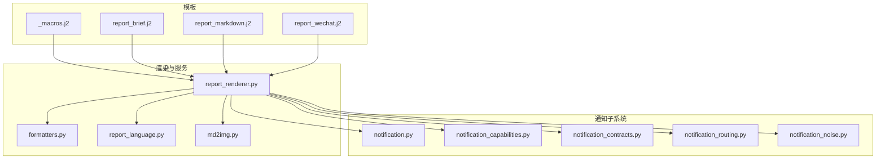
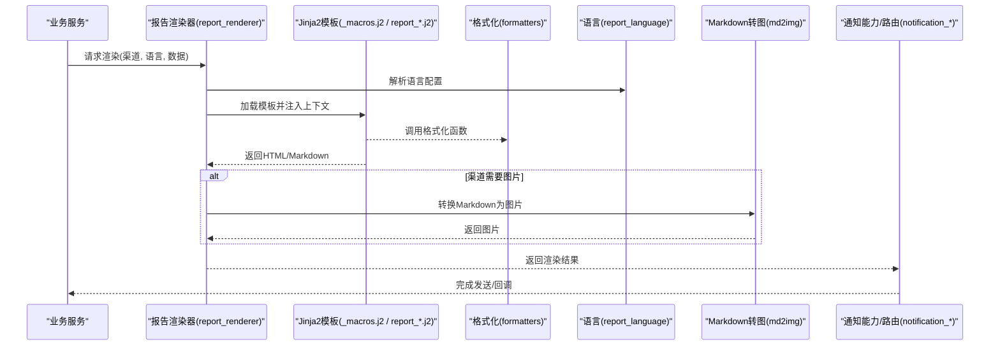
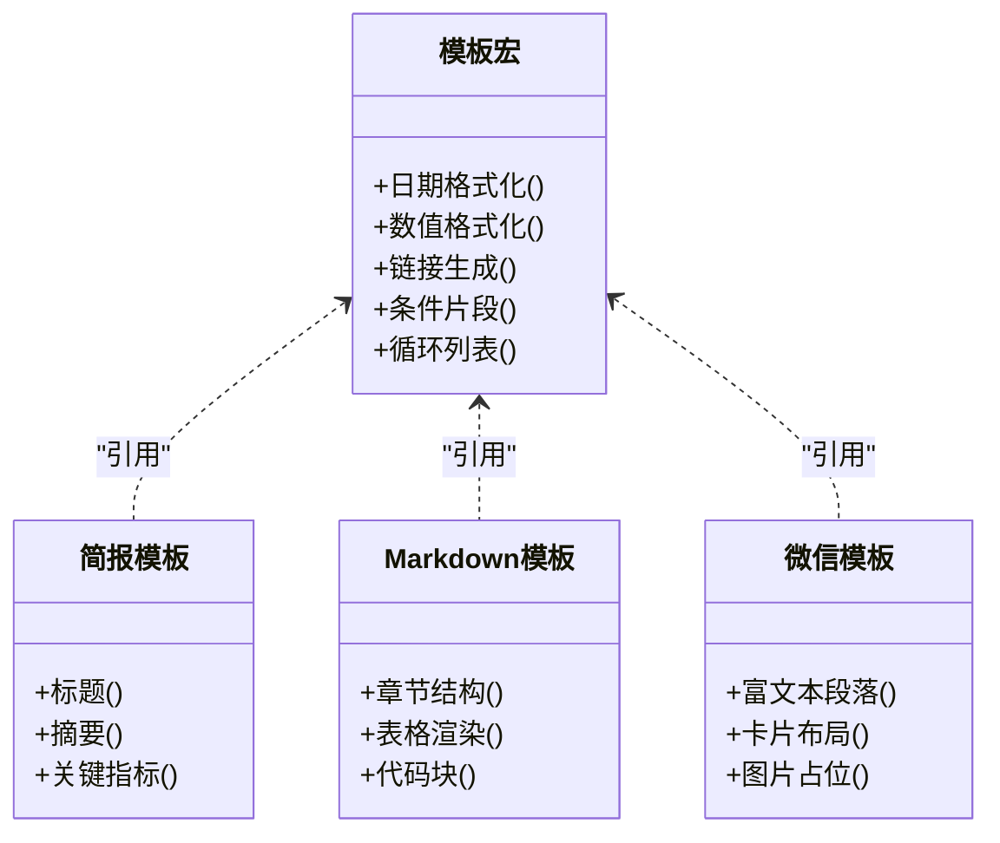
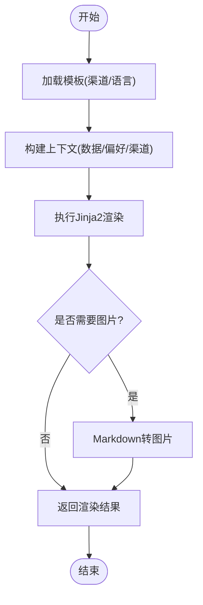
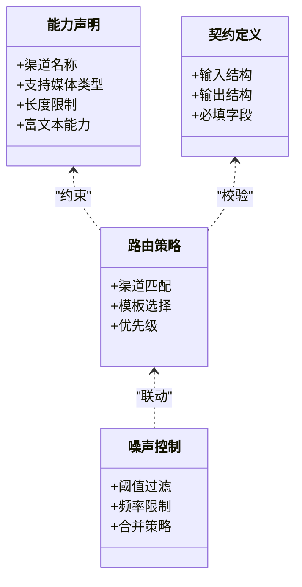
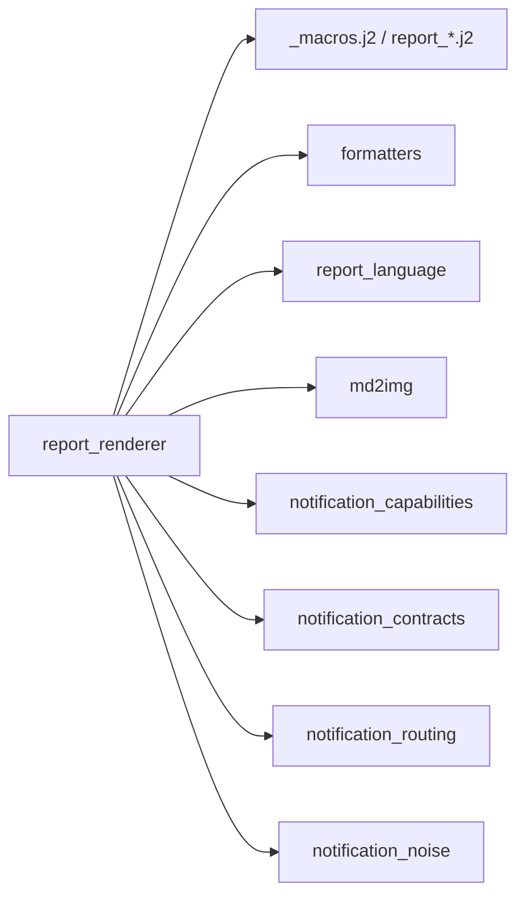

# 通知模板系统

<cite>
**本文引用的文件**   
- [templates/_macros.j2](file://templates/_macros.j2)
- [templates/report_brief.j2](file://templates/report_brief.j2)
- [templates/report_markdown.j2](file://templates/report_markdown.j2)
- [templates/report_wechat.j2](file://templates/report_wechat.j2)
- [src/services/report_renderer.py](file://src/services/report_renderer.py)
- [src/notification.py](file://src/notification.py)
- [src/notification_capabilities.py](file://src/notification_capabilities.py)
- [src/notification_contracts.py](file://src/notification_contracts.py)
- [src/notification_noise.py](file://src/notification_noise.py)
- [src/notification_routing.py](file://src/notification_routing.py)
- [src/formatters.py](file://src/formatters.py)
- [src/report_language.py](file://src/report_language.py)
- [src/md2img.py](file://src/md2img.py)
- [scripts/generate_notification_actions_env_table.py](file://scripts/generate_notification_actions_env_table.py)
- [tests/test_report_renderer.py](file://tests/test_report_renderer.py)
- [tests/test_notification.py](file://tests/test_notification.py)
- [tests/test_notification_capabilities.py](file://tests/test_notification_capabilities.py)
- [tests/test_notification_diagnostics.py](file://tests/test_notification_diagnostics.py)
- [tests/test_notification_noise.py](file://tests/test_notification_noise.py)
- [tests/test_notification_routing.py](file://tests/test_notification_routing.py)
- [tests/test_formatters.py](file://tests/test_formatters.py)
- [tests/test_report_language.py](file://tests/test_report_language.py)
- [tests/test_md2img.py](file://tests/test_md2img.py)
</cite>

## 目录
1. [简介](#简介)
2. [项目结构](#项目结构)
3. [核心组件](#核心组件)
4. [架构总览](#架构总览)
5. [详细组件分析](#详细组件分析)
6. [依赖关系分析](#依赖关系分析)
7. [性能考虑](#性能考虑)
8. [故障排查指南](#故障排查指南)
9. [结论](#结论)
10. [附录](#附录)

## 简介
本文件面向“通知模板系统”，聚焦 Jinja2 模板引擎的使用方式与自定义模板开发，系统化文档化内置模板结构、变量定义与格式化规则，并说明多语言支持、主题定制与响应式呈现。同时覆盖模板调试工具、预览能力与版本管理策略，提供最佳实践、性能优化与安全注意事项，帮助开发者快速上手并稳定扩展通知内容渲染管线。

## 项目结构
通知模板系统围绕以下关键位置组织：
- 模板文件位于 templates 目录，包含通用宏与不同渠道/用途的报告模板。
- 渲染服务位于 src/services/report_renderer.py，负责加载模板、注入上下文、执行渲染。
- 通知相关能力、契约、路由、噪声控制等位于 src 下的 notification_* 模块。
- 格式化工具与报告语言处理位于 src/formatters.py 与 src/report_language.py。
- Markdown 转图片能力位于 src/md2img.py。
- 测试用例覆盖渲染、能力、路由、噪声、诊断、格式化与语言等维度。

图表来源
- [templates/_macros.j2](file://templates/_macros.j2)
- [templates/report_brief.j2](file://templates/report_brief.j2)
- [templates/report_markdown.j2](file://templates/report_markdown.j2)
- [templates/report_wechat.j2](file://templates/report_wechat.j2)
- [src/services/report_renderer.py](file://src/services/report_renderer.py)
- [src/formatters.py](file://src/formatters.py)
- [src/report_language.py](file://src/report_language.py)
- [src/md2img.py](file://src/md2img.py)
- [src/notification.py](file://src/notification.py)
- [src/notification_capabilities.py](file://src/notification_capabilities.py)
- [src/notification_contracts.py](file://src/notification_contracts.py)
- [src/notification_routing.py](file://src/notification_routing.py)
- [src/notification_noise.py](file://src/notification_noise.py)

章节来源
- [src/services/report_renderer.py](file://src/services/report_renderer.py)
- [src/notification.py](file://src/notification.py)
- [src/notification_capabilities.py](file://src/notification_capabilities.py)
- [src/notification_contracts.py](file://src/notification_contracts.py)
- [src/notification_routing.py](file://src/notification_routing.py)
- [src/notification_noise.py](file://src/notification_noise.py)
- [src/formatters.py](file://src/formatters.py)
- [src/report_language.py](file://src/report_language.py)
- [src/md2img.py](file://src/md2img.py)

## 核心组件
- 模板引擎与渲染器
  - 使用 Jinja2 作为模板引擎，通过 report_renderer 统一加载模板、注入上下文、执行渲染，并提供缓存与错误处理。
- 内置模板
  - _macros.j2：公共宏（如日期、数值、链接、列表等），供各模板复用。
  - report_brief.j2：精简版报告模板，适合移动端或短消息。
  - report_markdown.j2：Markdown 报告模板，便于在聊天/文档平台展示。
  - report_wechat.j2：微信生态适配的富文本/图文模板。
- 格式化与本地化
  - formatters.py：数字、百分比、时间、金额等格式化函数，供模板调用。
  - report_language.py：报告语言选择与切换逻辑，驱动多语言输出。
- 多渠道与能力
  - notification_* 模块：定义通知能力、契约、路由与噪声控制，确保模板在不同渠道正确呈现。
- Markdown 转图
  - md2img.py：将 Markdown 转换为图片，用于不支持富文本的渠道。

章节来源
- [src/services/report_renderer.py](file://src/services/report_renderer.py)
- [templates/_macros.j2](file://templates/_macros.j2)
- [templates/report_brief.j2](file://templates/report_brief.j2)
- [templates/report_markdown.j2](file://templates/report_markdown.j2)
- [templates/report_wechat.j2](file://templates/report_wechat.j2)
- [src/formatters.py](file://src/formatters.py)
- [src/report_language.py](file://src/report_language.py)
- [src/notification_capabilities.py](file://src/notification_capabilities.py)
- [src/notification_contracts.py](file://src/notification_contracts.py)
- [src/notification_routing.py](file://src/notification_routing.py)
- [src/notification_noise.py](file://src/notification_noise.py)
- [src/md2img.py](file://src/md2img.py)

## 架构总览
通知模板系统的渲染流程如下：上游业务触发通知生成，渲染器根据目标渠道与语言选择模板，注入数据上下文，调用格式化函数与宏，最终产出 HTML/Markdown/图片等内容；随后由通知路由与能力层决定发送渠道与去重策略。

图表来源
- [src/services/report_renderer.py](file://src/services/report_renderer.py)
- [templates/_macros.j2](file://templates/_macros.j2)
- [templates/report_markdown.j2](file://templates/report_markdown.j2)
- [src/formatters.py](file://src/formatters.py)
- [src/report_language.py](file://src/report_language.py)
- [src/md2img.py](file://src/md2img.py)
- [src/notification_capabilities.py](file://src/notification_capabilities.py)
- [src/notification_routing.py](file://src/notification_routing.py)

## 详细组件分析

### 模板与宏设计
- 宏职责
  - 日期/时间格式化、数值精度控制、货币符号、链接生成、条件片段、循环列表等。
- 模板分工
  - report_brief.j2：强调关键指标与摘要，适合短信/推送。
  - report_markdown.j2：结构化 Markdown，便于在聊天/知识库中展示。
  - report_wechat.j2：适配微信生态的富文本样式与排版。
- 变量约定
  - 建议以领域对象命名（如 stock_info、market_summary、indicators），避免裸字段名。
  - 对可选字段提供默认值与空值保护。
- 安全与健壮性
  - 模板内禁止直接访问敏感属性，所有外部输入需经 formatters 过滤与校验。
  - 使用 Jinja2 的安全模式与白名单过滤器。

图表来源
- [templates/_macros.j2](file://templates/_macros.j2)
- [templates/report_brief.j2](file://templates/report_brief.j2)
- [templates/report_markdown.j2](file://templates/report_markdown.j2)
- [templates/report_wechat.j2](file://templates/report_wechat.j2)

章节来源
- [templates/_macros.j2](file://templates/_macros.j2)
- [templates/report_brief.j2](file://templates/report_brief.j2)
- [templates/report_markdown.j2](file://templates/report_markdown.j2)
- [templates/report_wechat.j2](file://templates/report_wechat.j2)

### 渲染器与上下文注入
- 模板加载
  - 按渠道与语言选择模板路径，支持热更新与缓存。
- 上下文构建
  - 聚合业务数据、用户偏好、渠道特性与语言设置，形成统一的渲染上下文。
- 渲染执行
  - 调用 Jinja2 渲染，捕获异常并回退到安全内容。
- 输出后处理
  - 根据渠道进行 HTML/Markdown/图片转换与压缩。

图表来源
- [src/services/report_renderer.py](file://src/services/report_renderer.py)
- [src/md2img.py](file://src/md2img.py)

章节来源
- [src/services/report_renderer.py](file://src/services/report_renderer.py)
- [src/md2img.py](file://src/md2img.py)

### 格式化与本地化
- 格式化函数
  - 统一数字、百分比、时间、金额、单位换算等，保证模板输出一致性。
- 语言支持
  - 基于 report_language 选择文案与日期/数字格式，支持多语言键值映射。
- 最佳实践
  - 模板仅做展示逻辑，复杂计算下沉至 formatters 与业务服务。

章节来源
- [src/formatters.py](file://src/formatters.py)
- [src/report_language.py](file://src/report_language.py)

### 多渠道能力与路由
- 能力定义
  - 通过 notification_capabilities 声明各渠道支持的媒体类型、长度限制与富文本能力。
- 契约规范
  - notification_contracts 定义输入输出结构与必填字段，保障跨模块一致性。
- 路由与去噪
  - notification_routing 决定模板与渠道匹配；notification_noise 实现阈值与频率控制，避免信息过载。

图表来源
- [src/notification_capabilities.py](file://src/notification_capabilities.py)
- [src/notification_contracts.py](file://src/notification_contracts.py)
- [src/notification_routing.py](file://src/notification_routing.py)
- [src/notification_noise.py](file://src/notification_noise.py)

章节来源
- [src/notification_capabilities.py](file://src/notification_capabilities.py)
- [src/notification_contracts.py](file://src/notification_contracts.py)
- [src/notification_routing.py](file://src/notification_routing.py)
- [src/notification_noise.py](file://src/notification_noise.py)

### 调试、预览与版本管理
- 调试工具
  - 单元测试覆盖渲染、能力、路由、噪声、格式化与语言等场景，便于回归验证。
  - 脚本 generate_notification_actions_env_table.py 可辅助生成环境变量对照表，提升配置可观测性。
- 预览功能
  - 通过渲染器传入样例数据，输出 HTML/Markdown/图片，结合前端面板进行可视化预览。
- 版本管理
  - 模板文件独立版本化，变更需配合测试用例与兼容性检查；渲染器应支持模板版本前缀与回滚。

章节来源
- [tests/test_report_renderer.py](file://tests/test_report_renderer.py)
- [tests/test_notification.py](file://tests/test_notification.py)
- [tests/test_notification_capabilities.py](file://tests/test_notification_capabilities.py)
- [tests/test_notification_diagnostics.py](file://tests/test_notification_diagnostics.py)
- [tests/test_notification_noise.py](file://tests/test_notification_noise.py)
- [tests/test_notification_routing.py](file://tests/test_notification_routing.py)
- [tests/test_formatters.py](file://tests/test_formatters.py)
- [tests/test_report_language.py](file://tests/test_report_language.py)
- [tests/test_md2img.py](file://tests/test_md2img.py)
- [scripts/generate_notification_actions_env_table.py](file://scripts/generate_notification_actions_env_table.py)

## 依赖关系分析
- 内部依赖
  - 渲染器依赖模板、格式化、语言与图片转换模块。
  - 通知子系统依赖能力、契约、路由与噪声控制模块。
- 外部依赖
  - Jinja2 模板引擎、Markdown 渲染与图片转换库（由 md2img 封装）。
- 耦合与解耦
  - 通过契约与能力声明降低耦合；模板与渲染器分离，便于替换与扩展。

图表来源
- [src/services/report_renderer.py](file://src/services/report_renderer.py)
- [templates/_macros.j2](file://templates/_macros.j2)
- [templates/report_brief.j2](file://templates/report_brief.j2)
- [templates/report_markdown.j2](file://templates/report_markdown.j2)
- [templates/report_wechat.j2](file://templates/report_wechat.j2)
- [src/formatters.py](file://src/formatters.py)
- [src/report_language.py](file://src/report_language.py)
- [src/md2img.py](file://src/md2img.py)
- [src/notification_capabilities.py](file://src/notification_capabilities.py)
- [src/notification_contracts.py](file://src/notification_contracts.py)
- [src/notification_routing.py](file://src/notification_routing.py)
- [src/notification_noise.py](file://src/notification_noise.py)

章节来源
- [src/services/report_renderer.py](file://src/services/report_renderer.py)
- [src/formatters.py](file://src/formatters.py)
- [src/report_language.py](file://src/report_language.py)
- [src/md2img.py](file://src/md2img.py)
- [src/notification_capabilities.py](file://src/notification_capabilities.py)
- [src/notification_contracts.py](file://src/notification_contracts.py)
- [src/notification_routing.py](file://src/notification_routing.py)
- [src/notification_noise.py](file://src/notification_noise.py)

## 性能考虑
- 模板缓存
  - 启用 Jinja2 模板缓存，减少重复编译开销。
- 上下文裁剪
  - 按需注入字段，避免传递冗余数据。
- 渲染并行
  - 对批量通知采用并发渲染与限流，避免阻塞主线程。
- 图片转换
  - 对 Markdown 转图片进行异步队列与缓存，避免重复转换。
- 输出压缩
  - 对 HTML/Markdown 进行最小化与压缩，降低传输体积。

[本节为通用指导，不直接分析具体文件]

## 故障排查指南
- 常见问题定位
  - 模板变量缺失：检查上下文构建与字段命名约定。
  - 渠道不兼容：核对能力声明与路由策略。
  - 语言切换异常：确认语言配置与本地化键值。
  - 图片转换失败：检查 Markdown 内容与图片转换依赖。
- 诊断工具
  - 使用单元测试与诊断脚本定位问题；开启渲染日志与错误堆栈。
- 回滚策略
  - 模板版本化与灰度发布，出现问题快速回滚。

章节来源
- [tests/test_notification_diagnostics.py](file://tests/test_notification_diagnostics.py)
- [scripts/generate_notification_actions_env_table.py](file://scripts/generate_notification_actions_env_table.py)

## 结论
通知模板系统以 Jinja2 为核心，结合统一的渲染器、格式化与语言模块，以及完善的通知能力、契约、路由与噪声控制，实现了多渠道、多语言、可扩展的通知内容生产管线。通过模板宏复用、严格的数据契约与完善的测试覆盖，系统在稳定性与可维护性上具备良好基础。建议在后续迭代中持续优化模板缓存、并发渲染与图片转换性能，并加强安全过滤与审计能力。

[本节为总结性内容，不直接分析具体文件]

## 附录
- 自定义模板开发步骤
  - 新增模板文件，遵循变量命名与空值保护约定。
  - 在渲染器中注册模板与渠道映射。
  - 补充单元测试与预览用例。
- 多语言与主题定制
  - 扩展 report_language 的语言包与格式化规则。
  - 在模板中使用主题变量与样式宏，保持渠道一致性。
- 安全与合规
  - 禁用危险过滤器，启用安全模式。
  - 对外部输入进行清洗与校验，避免注入风险。

[本节为概念性内容，不直接分析具体文件]