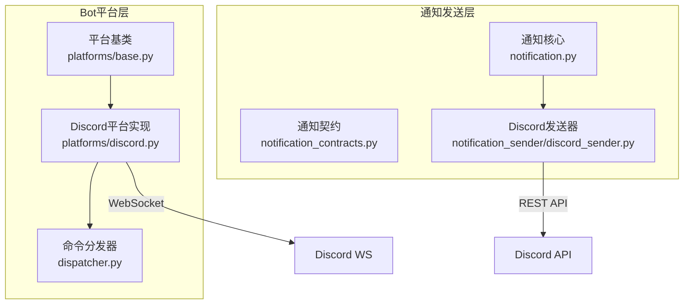
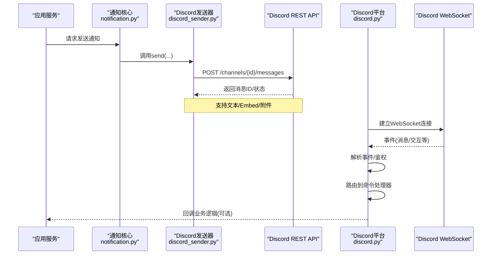
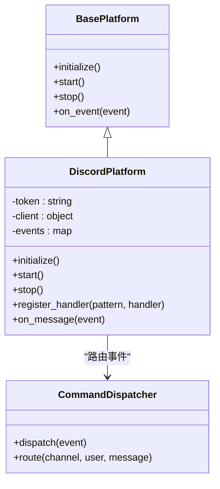
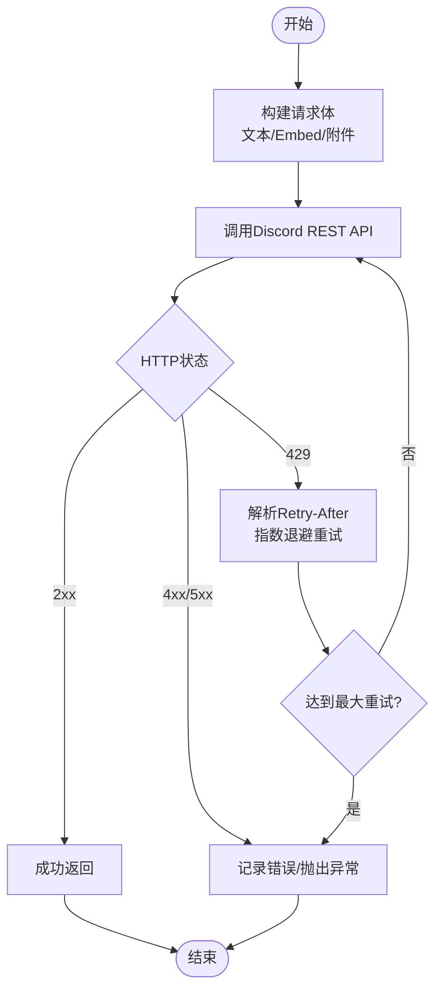
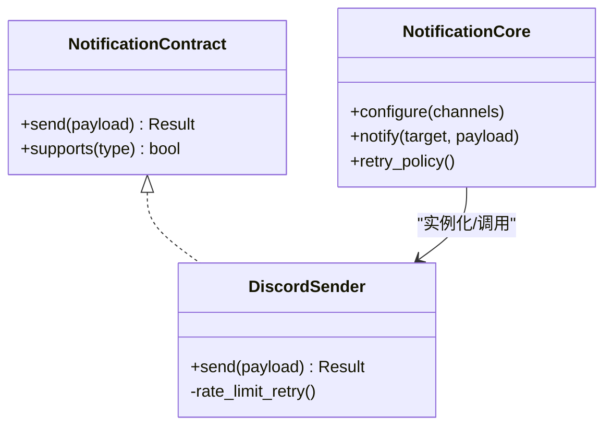
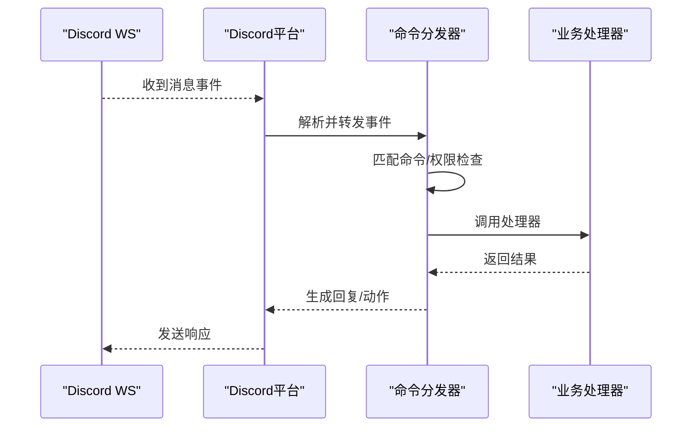
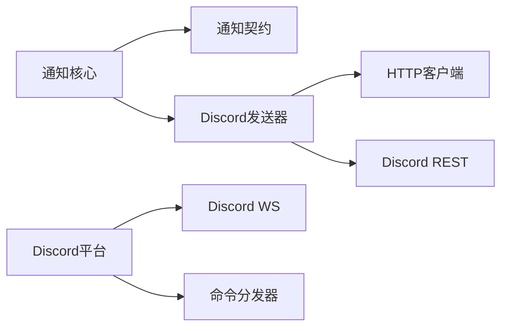

# Discord渠道集成

<cite>
**本文引用的文件**   
- [discord.py](file://bot/platforms/discord.py)
- [discord_sender.py](file://src/notification_sender/discord_sender.py)
- [discord-bot-config.md](file://docs/bot/discord-bot-config.md)
- [dispatcher.py](file://bot/dispatcher.py)
- [base.py](file://bot/platforms/base.py)
- [notification.py](file://src/notification.py)
- [notification_contracts.py](file://src/notification_contracts.py)
- [test_discord_platform.py](file://tests/test_discord_platform.py)
</cite>

## 目录
1. [简介](#简介)
2. [项目结构](#项目结构)
3. [核心组件](#核心组件)
4. [架构总览](#架构总览)
5. [详细组件分析](#详细组件分析)
6. [依赖关系分析](#依赖关系分析)
7. [性能与速率限制](#性能与速率限制)
8. [故障排查指南](#故障排查指南)
9. [结论](#结论)
10. [附录：配置示例与环境变量](#附录配置示例与环境变量)

## 简介
本文件面向需要在项目中接入Discord作为通知/消息渠道的读者，覆盖以下主题：
- 创建Discord服务器、添加Bot并授权所需权限
- Token配置与权限设置
- 使用Discord API发送文本消息、Embed消息与附件上传
- WebSocket连接管理（Bot客户端）与消息事件处理
- 速率限制与重试策略
- 服务器配置示例与常见问题排查

## 项目结构
本项目将Discord能力拆分为两部分：
- Bot平台层：负责WebSocket连接、事件监听与命令分发
- 通知发送层：封装Discord REST API调用，用于发送消息、Embed与附件

图表来源
- [base.py](file://bot/platforms/base.py)
- [discord.py](file://bot/platforms/discord.py)
- [dispatcher.py](file://bot/dispatcher.py)
- [notification_contracts.py](file://src/notification_contracts.py)
- [discord_sender.py](file://src/notification_sender/discord_sender.py)
- [notification.py](file://src/notification.py)

章节来源
- [discord.py](file://bot/platforms/discord.py)
- [discord_sender.py](file://src/notification_sender/discord_sender.py)
- [dispatcher.py](file://bot/dispatcher.py)
- [base.py](file://bot/platforms/base.py)
- [notification_contracts.py](file://src/notification_contracts.py)
- [notification.py](file://src/notification.py)

## 核心组件
- Discord平台实现：封装Bot生命周期、WebSocket连接、事件回调与命令路由
- Discord通知发送器：封装REST API调用，支持文本、Embed与附件上传
- 通知契约与核心：统一通知接口与调度逻辑，屏蔽具体通道差异
- 命令分发器：将接收到的消息按规则分发给对应处理器

章节来源
- [discord.py](file://bot/platforms/discord.py)
- [discord_sender.py](file://src/notification_sender/discord_sender.py)
- [notification_contracts.py](file://src/notification_contracts.py)
- [notification.py](file://src/notification.py)
- [dispatcher.py](file://bot/dispatcher.py)

## 架构总览
下图展示从“触发通知”到“Discord端呈现”的端到端流程，以及Bot侧的事件处理路径。

图表来源
- [notification.py](file://src/notification.py)
- [discord_sender.py](file://src/notification_sender/discord_sender.py)
- [discord.py](file://bot/platforms/discord.py)

## 详细组件分析

### Discord平台实现（Bot）
- 职责
  - 初始化Bot客户端，加载Token与必要配置
  - 建立并维护WebSocket长连接
  - 注册事件回调（如消息、交互）
  - 将事件路由到命令处理器或业务回调
- 关键点
  - 连接失败的重试与退避
  - 事件过滤（频道/用户/角色）
  - 命令前缀与权限校验
  - 与上层命令分发器的协作

图表来源
- [base.py](file://bot/platforms/base.py)
- [discord.py](file://bot/platforms/discord.py)
- [dispatcher.py](file://bot/dispatcher.py)

章节来源
- [discord.py](file://bot/platforms/discord.py)
- [base.py](file://bot/platforms/base.py)
- [dispatcher.py](file://bot/dispatcher.py)

### Discord通知发送器（REST）
- 职责
  - 封装Discord REST API调用
  - 支持发送纯文本、Embed与附件
  - 统一错误码与异常映射
  - 提供重试与限流适配
- 关键能力
  - 文本消息：标题、内容、颜色、字段等
  - Embed消息：结构化展示，适合报告/摘要
  - 附件上传：图片/文件，附带说明
  - 速率限制：识别429响应，指数退避重试

图表来源
- [discord_sender.py](file://src/notification_sender/discord_sender.py)

章节来源
- [discord_sender.py](file://src/notification_sender/discord_sender.py)

### 通知契约与核心
- 契约定义
  - 统一的发送接口：send(message, embed?, attachments?)
  - 统一的错误模型与结果对象
- 核心调度
  - 根据配置选择具体发送器
  - 聚合多通道发送（可选）
  - 日志与指标上报

图表来源
- [notification_contracts.py](file://src/notification_contracts.py)
- [notification.py](file://src/notification.py)
- [discord_sender.py](file://src/notification_sender/discord_sender.py)

章节来源
- [notification_contracts.py](file://src/notification_contracts.py)
- [notification.py](file://src/notification.py)

### 命令分发器
- 职责
  - 将Bot收到的事件按频道/用户/命令前缀进行匹配
  - 调用对应的业务处理器
  - 处理权限校验与节流
- 关键点
  - 命令注册表与优先级
  - 异步执行与超时控制
  - 错误回写至原频道

图表来源
- [dispatcher.py](file://bot/dispatcher.py)
- [discord.py](file://bot/platforms/discord.py)

章节来源
- [dispatcher.py](file://bot/dispatcher.py)
- [discord.py](file://bot/platforms/discord.py)

## 依赖关系分析
- 模块耦合
  - Discord平台依赖Bot框架与事件系统
  - 通知发送器依赖HTTP客户端与Discord REST API
  - 通知核心通过契约解耦各通道实现
- 外部依赖
  - Discord API（REST与WebSocket）
  - HTTP客户端库（用于REST调用）
  - 事件驱动运行时（用于WS事件）

图表来源
- [notification.py](file://src/notification.py)
- [notification_contracts.py](file://src/notification_contracts.py)
- [discord_sender.py](file://src/notification_sender/discord_sender.py)
- [discord.py](file://bot/platforms/discord.py)
- [dispatcher.py](file://bot/dispatcher.py)

章节来源
- [notification.py](file://src/notification.py)
- [notification_contracts.py](file://src/notification_contracts.py)
- [discord_sender.py](file://src/notification_sender/discord_sender.py)
- [discord.py](file://bot/platforms/discord.py)
- [dispatcher.py](file://bot/dispatcher.py)

## 性能与速率限制
- 速率限制
  - Discord对消息发送、编辑、附件上传等接口有严格限制
  - 建议实现指数退避重试，读取Retry-After头
  - 批量发送时采用队列与并发上限控制
- 连接管理
  - WebSocket断线自动重连，避免频繁重建
  - 心跳与空闲检测，及时清理无效会话
- 资源优化
  - Embed字段精简，避免过大负载
  - 附件压缩与缓存，减少重复上传
  - 日志采样与降级策略

[本节为通用指导，不直接分析具体文件]

## 故障排查指南
- 无法连接/频繁掉线
  - 检查Token是否有效、网络连通性、代理设置
  - 查看WebSocket重连日志与错误码
- 权限不足
  - 确认Bot已加入目标服务器且具备所需权限（发送消息、嵌入链接、上传文件等）
  - 检查频道权限与角色分配
- 429速率限制
  - 观察请求频率，降低并发或增加退避间隔
  - 合理拆分任务，避免短时间大量请求
- 附件上传失败
  - 检查文件大小与类型限制
  - 确认Content-Type与文件名编码正确
- 事件未触发
  - 核对事件订阅与过滤器（频道/用户/角色）
  - 验证命令前缀与匹配规则

章节来源
- [discord.py](file://bot/platforms/discord.py)
- [discord_sender.py](file://src/notification_sender/discord_sender.py)
- [test_discord_platform.py](file://tests/test_discord_platform.py)

## 结论
通过将Discord能力拆分为“平台层（Bot/WS）”和“发送层（REST）”，本方案在保持高内聚低耦合的同时，提供了稳定的消息发送与事件处理能力。配合合理的速率限制与连接管理策略，可在生产环境中可靠运行。

[本节为总结性内容，不直接分析具体文件]

## 附录：配置示例与环境变量
- 服务器与Bot创建
  - 在Discord开发者控制台创建应用并启用Bot
  - 邀请Bot到目标服务器，授予发送消息、嵌入链接、上传文件等权限
- 环境变量
  - DISCORD_BOT_TOKEN：Bot访问令牌
  - DISCORD_CHANNEL_ID：默认通知频道ID（可选）
  - DISCORD_RETRY_MAX：最大重试次数（可选）
  - DISCORD_TIMEOUT：HTTP超时时间（可选）
- 配置文件
  - 参考文档中的示例配置，按需开启/关闭功能开关

章节来源
- [discord-bot-config.md](file://docs/bot/discord-bot-config.md)