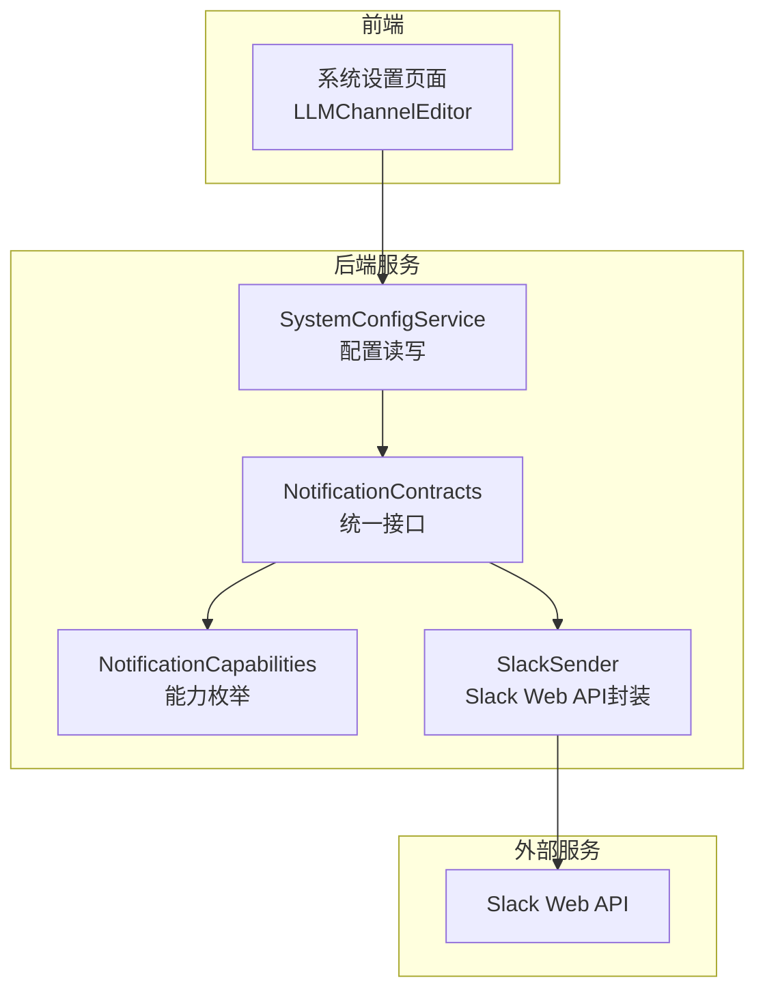
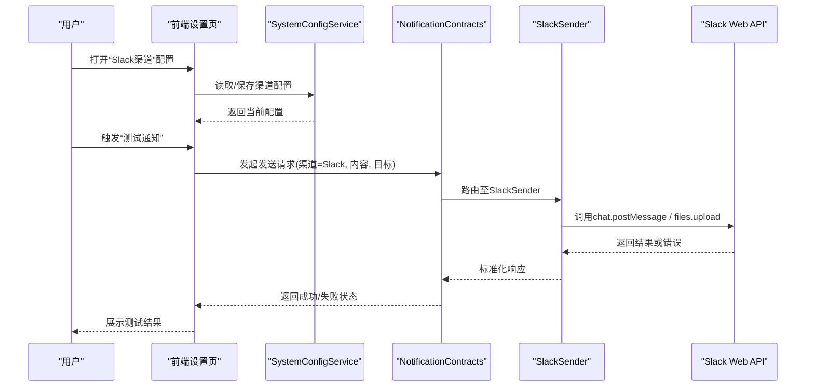
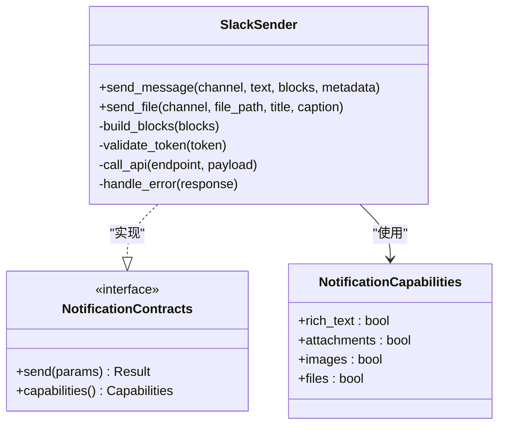
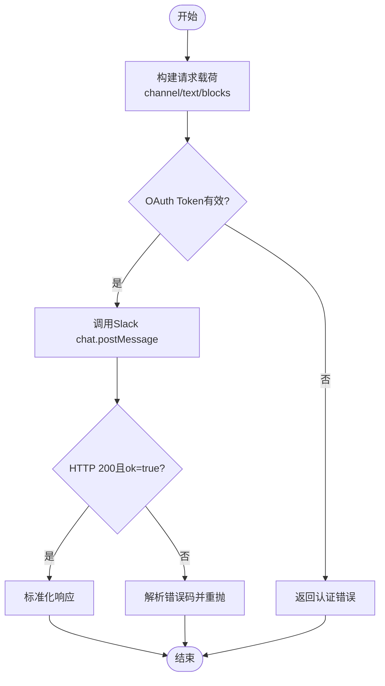
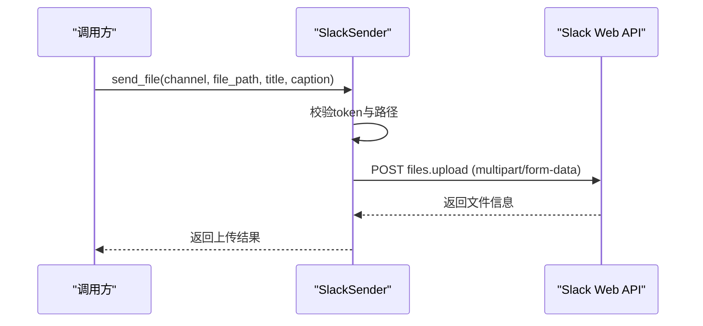
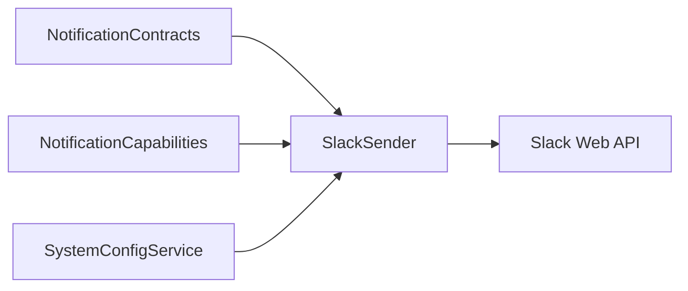

# Slack渠道集成

<cite>
**本文引用的文件**   
- [slack_sender.py](file://src/notification_sender/slack_sender.py)
- [notification.py](file://src/notification.py)
- [notification_capabilities.py](file://src/notification_capabilities.py)
- [notification_contracts.py](file://src/notification_contracts.py)
- [system_config_service.py](file://src/services/system_config_service.py)
- [settings_panel_error_boundary.py](file://apps/dsa-web/src/components/common/SettingsPanelErrorBoundary.tsx)
- [llm_channel_editor.py](file://apps/dsa-web/src/components/settings/LLMChannelEditor.tsx)
- [notifications.md](file://docs/notifications.md)
</cite>

## 目录
1. [简介](#简介)
2. [项目结构](#项目结构)
3. [核心组件](#核心组件)
4. [架构总览](#架构总览)
5. [详细组件分析](#详细组件分析)
6. [依赖关系分析](#依赖关系分析)
7. [性能考虑](#性能考虑)
8. [故障排查指南](#故障排查指南)
9. [结论](#结论)
10. [附录](#附录)

## 简介
本章节面向需要在系统中接入Slack作为通知渠道的读者，涵盖以下内容：
- Slack App创建与安装流程要点
- OAuth Token配置与频道权限设置
- Slack Web API使用方法（消息发送、Block Kit富文本、文件分享）
- 消息格式与富文本支持说明
- 错误处理机制与最佳实践
- 完整配置示例与常见问题定位

## 项目结构
Slack渠道相关代码主要位于后端通知发送器模块与前端系统配置界面中：
- 后端实现：src/notification_sender/slack_sender.py 负责调用Slack Web API进行消息与文件发送
- 通知框架：src/notification.py、src/notification_capabilities.py、src/notification_contracts.py 定义能力与契约
- 系统配置：src/services/system_config_service.py 提供配置读取与校验
- 前端配置面板：apps/dsa-web/src/components/settings/LLMChannelEditor.tsx 用于编辑渠道配置
- 文档参考：docs/notifications.md 包含通知能力概览

图表来源
- [slack_sender.py](file://src/notification_sender/slack_sender.py)
- [notification.py](file://src/notification.py)
- [notification_capabilities.py](file://src/notification_capabilities.py)
- [notification_contracts.py](file://src/notification_contracts.py)
- [system_config_service.py](file://src/services/system_config_service.py)
- [llm_channel_editor.py](file://apps/dsa-web/src/components/settings/LLMChannelEditor.tsx)

章节来源
- [slack_sender.py](file://src/notification_sender/slack_sender.py)
- [notification.py](file://src/notification.py)
- [notification_capabilities.py](file://src/notification_capabilities.py)
- [notification_contracts.py](file://src/notification_contracts.py)
- [system_config_service.py](file://src/services/system_config_service.py)
- [llm_channel_editor.py](file://apps/dsa-web/src/components/settings/LLMChannelEditor.tsx)

## 核心组件
- SlackSender：封装Slack Web API调用，包括消息发送、Block Kit构建、文件上传等
- NotificationContracts：定义各通知渠道的统一接口与数据结构
- NotificationCapabilities：声明支持的渠道能力（如富文本、附件、图片等）
- SystemConfigService：管理渠道配置项（如OAuth Token、频道ID、超时等）
- LLMChannelEditor：前端配置编辑器，用于输入和保存Slack渠道参数

章节来源
- [slack_sender.py](file://src/notification_sender/slack_sender.py)
- [notification_contracts.py](file://src/notification_contracts.py)
- [notification_capabilities.py](file://src/notification_capabilities.py)
- [system_config_service.py](file://src/services/system_config_service.py)
- [llm_channel_editor.py](file://apps/dsa-web/src/components/settings/LLMChannelEditor.tsx)

## 架构总览
下图展示了从前端配置到Slack Web API的端到端调用链。

图表来源
- [slack_sender.py](file://src/notification_sender/slack_sender.py)
- [notification_contracts.py](file://src/notification_contracts.py)
- [system_config_service.py](file://src/services/system_config_service.py)

## 详细组件分析

### SlackSender组件分析
SlackSender负责将内部通知模型转换为Slack API所需的请求体，并处理响应与错误。

图表来源
- [slack_sender.py](file://src/notification_sender/slack_sender.py)
- [notification_contracts.py](file://src/notification_contracts.py)
- [notification_capabilities.py](file://src/notification_capabilities.py)

章节来源
- [slack_sender.py](file://src/notification_sender/slack_sender.py)
- [notification_contracts.py](file://src/notification_contracts.py)
- [notification_capabilities.py](file://src/notification_capabilities.py)

### 消息发送流程（含Block Kit）
当需要发送富文本消息时，SlackSender会构建Block Kit结构并通过chat.postMessage接口发送。

图表来源
- [slack_sender.py](file://src/notification_sender/slack_sender.py)

章节来源
- [slack_sender.py](file://src/notification_sender/slack_sender.py)

### 文件分享流程
对于文件分享场景，SlackSender通过files.upload接口上传文件，并在消息中附带标题与描述。

图表来源
- [slack_sender.py](file://src/notification_sender/slack_sender.py)

章节来源
- [slack_sender.py](file://src/notification_sender/slack_sender.py)

### 配置与权限设置
- OAuth Token：在系统配置中保存Slack Bot Token（通常以xoxb开头），需具备channels:read、chat:write、files:write等权限
- 频道权限：确保Bot已加入目标频道，或使用私聊ID；若使用公共频道，需确认邀请链接与权限策略
- 前端配置：通过LLMChannelEditor输入Token、频道ID、可选的超时与重试参数

章节来源
- [system_config_service.py](file://src/services/system_config_service.py)
- [llm_channel_editor.py](file://apps/dsa-web/src/components/settings/LLMChannelEditor.tsx)

### Block Kit富文本支持
- 支持文本块、分区、按钮、图像等常见Block类型
- 建议对长文本进行分段，避免单条消息超过字符限制
- 复杂布局优先使用Section与Actions组合，保证可读性

章节来源
- [slack_sender.py](file://src/notification_sender/slack_sender.py)

## 依赖关系分析
SlackSender依赖通知契约与能力枚举，同时受系统配置服务影响。

图表来源
- [notification_contracts.py](file://src/notification_contracts.py)
- [notification_capabilities.py](file://src/notification_capabilities.py)
- [system_config_service.py](file://src/services/system_config_service.py)
- [slack_sender.py](file://src/notification_sender/slack_sender.py)

章节来源
- [notification_contracts.py](file://src/notification_contracts.py)
- [notification_capabilities.py](file://src/notification_capabilities.py)
- [system_config_service.py](file://src/services/system_config_service.py)
- [slack_sender.py](file://src/notification_sender/slack_sender.py)

## 性能考虑
- 连接复用：保持HTTP客户端连接池，减少握手开销
- 批量发送：合并多条短消息为一条Block Kit消息，降低API调用次数
- 超时与重试：合理设置超时时间，并对瞬时网络错误实施指数退避重试
- 限流保护：遵循Slack速率限制，必要时增加队列与节流逻辑

## 故障排查指南
- 认证失败：检查OAuth Token是否有效、是否过期或被撤销；确认Bot已加入目标频道
- 权限不足：确认已授予channels:read、chat:write、files:write等必要权限
- 频道不存在或不可达：核对频道ID是否正确，是否为私有频道且未邀请Bot
- 文件上传失败：检查文件大小与类型限制，确认网络连接与磁盘路径有效
- 富文本渲染异常：验证Block Kit JSON结构是否符合规范，避免非法字段

章节来源
- [slack_sender.py](file://src/notification_sender/slack_sender.py)
- [notifications.md](file://docs/notifications.md)

## 结论
通过SlackSender与通知框架的协作，系统能够稳定地向Slack发送文本、富文本与文件。合理的配置与权限设置是保障通知可靠性的关键。建议在部署前完成端到端测试，并结合监控与日志完善问题定位能力。

## 附录
- Slack App创建与安装要点
  - 在Slack开发者平台创建App，启用Bots功能并生成Bot User OAuth Token
  - 添加所需OAuth权限（channels:read、chat:write、files:write等）
  - 安装App到工作区，并将Bot邀请至目标频道
- 配置示例（键名说明）
  - slack_bot_token：Slack Bot OAuth Token
  - slack_channel_id：目标频道ID或私聊ID
  - slack_timeout：HTTP请求超时秒数
  - slack_retry_max：最大重试次数
- 最佳实践
  - 使用环境变量或密钥管理服务存储敏感Token
  - 对Block Kit模板进行版本化管理与单元测试
  - 记录每次发送的请求与响应摘要，便于审计与排障