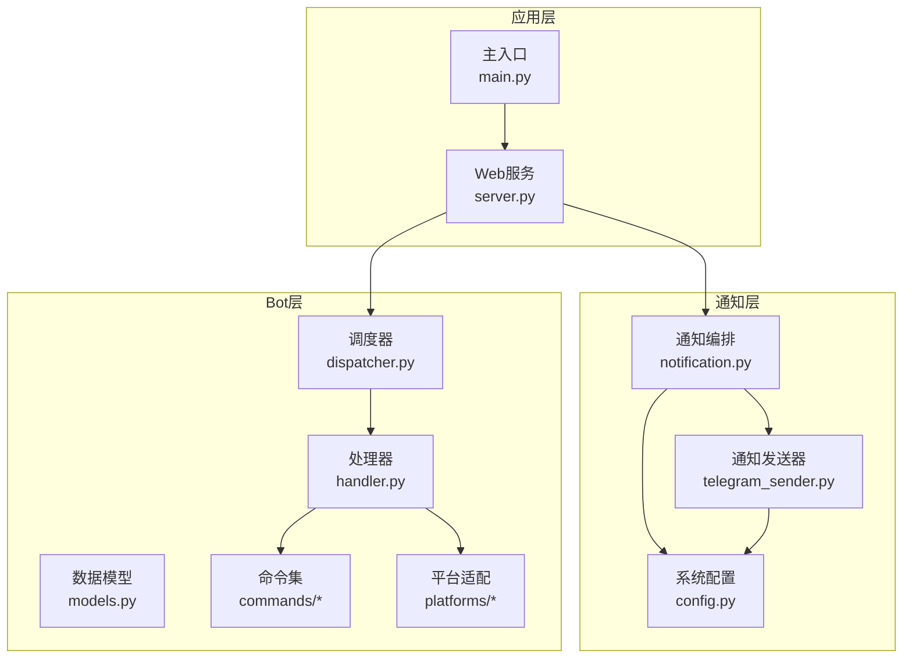
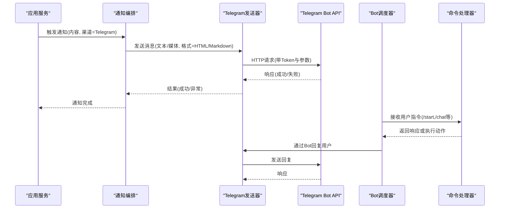
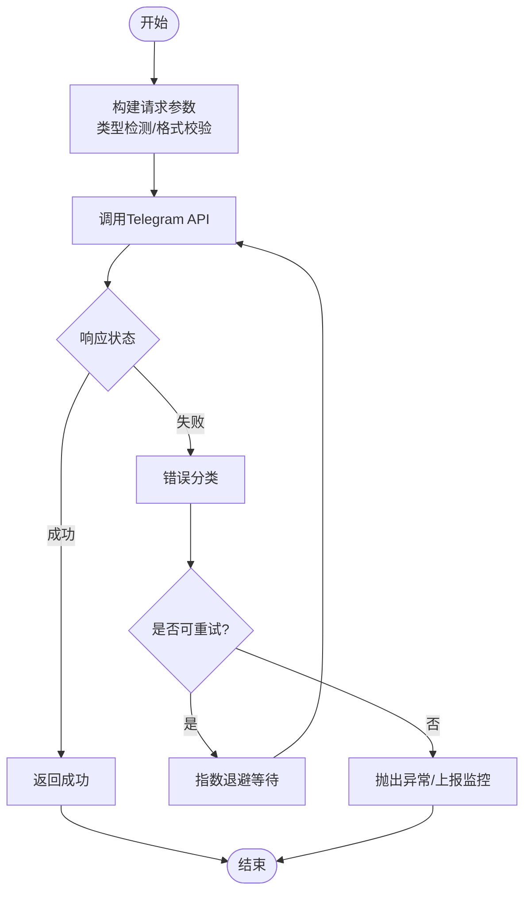
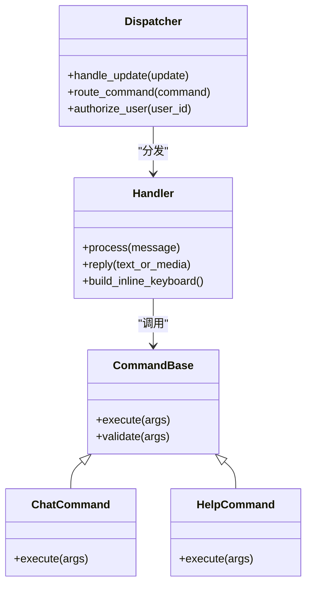
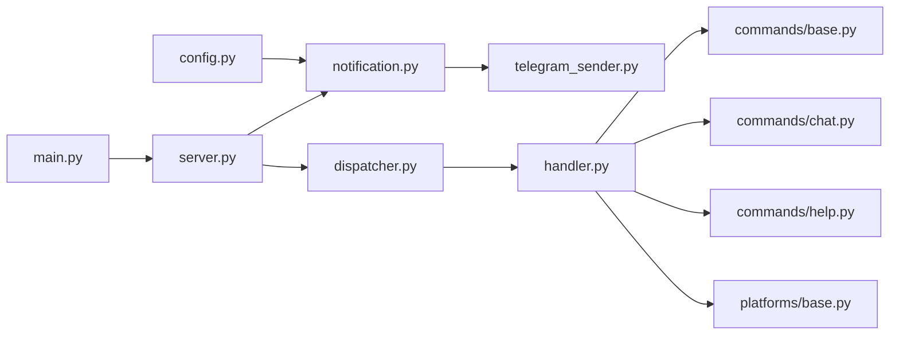

# Telegram渠道集成

<cite>
**本文档引用的文件**   
- [telegram_sender.py](file://src/notification_sender/telegram_sender.py)
- [notification.py](file://src/notification.py)
- [config.py](file://src/config.py)
- [bot/dispatcher.py](file://bot/dispatcher.py)
- [bot/handler.py](file://bot/handler.py)
- [bot/models.py](file://bot/models.py)
- [bot/commands/base.py](file://bot/commands/base.py)
- [bot/commands/chat.py](file://bot/commands/chat.py)
- [bot/commands/help.py](file://bot/commands/help.py)
- [bot/platforms/base.py](file://bot/platforms/base.py)
- [bot/platforms/dingtalk.py](file://bot/platforms/dingtalk.py)
- [bot/platforms/discord.py](file://bot/platforms/discord.py)
- [bot/platforms/feishu_stream.py](file://bot/platforms/feishu_stream.py)
- [main.py](file://main.py)
- [server.py](file://server.py)
- [pyproject.toml](file://pyproject.toml)
- [requirements.txt](file://requirements.txt)
- [docker/Dockerfile](file://docker/Dockerfile)
- [docker/docker-compose.yml](file://docker/docker-compose.yml)
</cite>

## 目录
1. [简介](#简介)
2. [项目结构](#项目结构)
3. [核心组件](#核心组件)
4. [架构总览](#架构总览)
5. [详细组件分析](#详细组件分析)
6. [依赖关系分析](#依赖关系分析)
7. [性能与限流](#性能与限流)
8. [故障排查指南](#故障排查指南)
9. [结论](#结论)
10. [附录：配置示例与环境变量](#附录配置示例与环境变量)

## 简介
本章节面向需要在系统中接入Telegram通知与Bot能力的开发者与运维人员，提供从Bot创建、Token配置、权限管理到API使用（消息发送、文件上传、Inline键盘）、消息格式（HTML/Markdown）、分页处理与错误处理的完整说明。同时给出可操作的配置示例与API限流建议，帮助快速落地并稳定运行。

## 项目结构
本项目采用多模块组织方式，Telegram相关能力主要分布在以下位置：
- 通知发送器：src/notification_sender/telegram_sender.py
- 通知编排与路由：src/notification.py
- 系统配置：src/config.py
- Bot框架与命令：bot/*（dispatcher、handler、models、commands、platforms）
- 应用入口与服务器：main.py、server.py
- 依赖与容器化：pyproject.toml、requirements.txt、docker/*

图表来源
- [telegram_sender.py](file://src/notification_sender/telegram_sender.py)
- [notification.py](file://src/notification.py)
- [config.py](file://src/config.py)
- [dispatcher.py](file://bot/dispatcher.py)
- [handler.py](file://bot/handler.py)
- [models.py](file://bot/models.py)
- [base.py](file://bot/commands/base.py)
- [chat.py](file://bot/commands/chat.py)
- [help.py](file://bot/commands/help.py)
- [base.py](file://bot/platforms/base.py)
- [dingtalk.py](file://bot/platforms/dingtalk.py)
- [discord.py](file://bot/platforms/discord.py)
- [feishu_stream.py](file://bot/platforms/feishu_stream.py)
- [main.py](file://main.py)
- [server.py](file://server.py)

章节来源
- [telegram_sender.py](file://src/notification_sender/telegram_sender.py)
- [notification.py](file://src/notification.py)
- [config.py](file://src/config.py)
- [dispatcher.py](file://bot/dispatcher.py)
- [handler.py](file://bot/handler.py)
- [models.py](file://bot/models.py)
- [base.py](file://bot/commands/base.py)
- [chat.py](file://bot/commands/chat.py)
- [help.py](file://bot/commands/help.py)
- [base.py](file://bot/platforms/base.py)
- [dingtalk.py](file://bot/platforms/dingtalk.py)
- [discord.py](file://bot/platforms/discord.py)
- [feishu_stream.py](file://bot/platforms/feishu_stream.py)
- [main.py](file://main.py)
- [server.py](file://server.py)

## 核心组件
- Telegram通知发送器：封装对Telegram Bot API的调用，支持文本、图片、文档、音频、视频等媒体类型，支持HTML/Markdown解析模式，具备重试与限流策略。
- 通知编排器：统一触发通知流程，选择目标渠道（如Telegram），组装消息体，调用发送器。
- 配置中心：集中管理Telegram Token、代理、超时、并发、重试等参数。
- Bot调度器与处理器：负责接收用户指令、路由到具体命令、维护会话上下文。
- 平台适配层：抽象不同平台的接入差异，便于扩展新的平台。

章节来源
- [telegram_sender.py](file://src/notification_sender/telegram_sender.py)
- [notification.py](file://src/notification.py)
- [config.py](file://src/config.py)
- [dispatcher.py](file://bot/dispatcher.py)
- [handler.py](file://bot/handler.py)
- [models.py](file://bot/models.py)

## 架构总览
下图展示了从业务侧触发通知到Telegram发送的端到端流程，以及Bot命令的交互路径。

图表来源
- [notification.py](file://src/notification.py)
- [telegram_sender.py](file://src/notification_sender/telegram_sender.py)
- [dispatcher.py](file://bot/dispatcher.py)
- [handler.py](file://bot/handler.py)
- [base.py](file://bot/commands/base.py)
- [chat.py](file://bot/commands/chat.py)
- [help.py](file://bot/commands/help.py)

## 详细组件分析

### Telegram通知发送器
- 功能要点
  - 支持文本消息与多种媒体类型（图片、文档、音频、视频、动画等）。
  - 支持HTML与Markdown两种消息格式解析。
  - 支持文件上传（本地路径或URL），自动选择合适API方法。
  - 支持Inline键盘与回调操作（用于交互式菜单）。
  - 内置重试机制与指数退避，避免瞬时失败。
  - 限流控制：遵循Telegram速率限制，按Chat/全局维度进行节流。
- 关键实现点
  - 构造HTTP客户端，设置超时、代理、重试次数。
  - 根据消息类型选择对应API端点（sendMessage、sendPhoto、sendDocument等）。
  - 格式化消息体，校验长度与字符集。
  - 错误分类：网络错误、认证失败、内容非法、限流等，分别处理。
  - 日志记录：请求摘要、响应状态、耗时与错误堆栈。

图表来源
- [telegram_sender.py](file://src/notification_sender/telegram_sender.py)

章节来源
- [telegram_sender.py](file://src/notification_sender/telegram_sender.py)

### 通知编排器
- 职责
  - 统一入口，决定使用哪个渠道发送通知。
  - 组装消息体（文本、附件、按钮等），选择解析模式（HTML/Markdown）。
  - 调用发送器并处理结果，必要时回退或告警。
- 关键点
  - 渠道选择策略：基于配置与目标受众。
  - 消息模板渲染：将业务数据转换为最终消息。
  - 幂等与去重：避免重复通知。
  - 监控指标：成功率、延迟、失败原因分布。

章节来源
- [notification.py](file://src/notification.py)

### 配置中心
- 管理项
  - Telegram Token、代理、超时、并发、重试次数、限流阈值。
  - 默认消息格式（HTML/Markdown）、语言、时区。
  - 渠道开关与白名单（允许发送的目标Chat ID）。
- 关键点
  - 环境变量优先，配置文件次之，默认值兜底。
  - 启动时校验必填项（如Token）。
  - 动态重载（可选）：热更新配置而不重启服务。

章节来源
- [config.py](file://src/config.py)

### Bot调度器与处理器
- 调度器
  - 监听更新（消息、回调、编辑等），分发给处理器。
  - 维护会话上下文与权限校验。
- 处理器
  - 解析命令与参数，调用业务逻辑。
  - 生成响应（文本、媒体、Inline键盘）。
- 命令集
  - /start：初始化与授权。
  - /chat：对话模式。
  - /help：帮助信息。
  - 其他业务命令（分析、行情、策略等）。

图表来源
- [dispatcher.py](file://bot/dispatcher.py)
- [handler.py](file://bot/handler.py)
- [base.py](file://bot/commands/base.py)
- [chat.py](file://bot/commands/chat.py)
- [help.py](file://bot/commands/help.py)

章节来源
- [dispatcher.py](file://bot/dispatcher.py)
- [handler.py](file://bot/handler.py)
- [models.py](file://bot/models.py)
- [base.py](file://bot/commands/base.py)
- [chat.py](file://bot/commands/chat.py)
- [help.py](file://bot/commands/help.py)

### 平台适配层
- 设计思想
  - 抽象统一的平台接口，屏蔽底层差异。
  - 新增平台只需实现适配器，复用通用逻辑。
- 现有平台
  - DingTalk、Discord、Feishu Stream等。
- 扩展性
  - 注册表机制，按需加载。
  - 错误与限流统一处理。

章节来源
- [base.py](file://bot/platforms/base.py)
- [dingtalk.py](file://bot/platforms/dingtalk.py)
- [discord.py](file://bot/platforms/discord.py)
- [feishu_stream.py](file://bot/platforms/feishu_stream.py)

## 依赖关系分析
- 外部依赖
  - Telegram Bot SDK或HTTP客户端（requests/httpx等）。
  - 配置库（pydantic/envparse等）。
  - 日志与监控（标准logging或第三方）。
- 内部依赖
  - 通知编排依赖配置中心与发送器。
  - Bot调度器依赖处理器与命令集。
  - 平台适配层被调度器与处理器共同使用。

图表来源
- [config.py](file://src/config.py)
- [notification.py](file://src/notification.py)
- [telegram_sender.py](file://src/notification_sender/telegram_sender.py)
- [main.py](file://main.py)
- [server.py](file://server.py)
- [dispatcher.py](file://bot/dispatcher.py)
- [handler.py](file://bot/handler.py)
- [base.py](file://bot/commands/base.py)
- [chat.py](file://bot/commands/chat.py)
- [help.py](file://bot/commands/help.py)
- [base.py](file://bot/platforms/base.py)

章节来源
- [config.py](file://src/config.py)
- [notification.py](file://src/notification.py)
- [telegram_sender.py](file://src/notification_sender/telegram_sender.py)
- [dispatcher.py](file://bot/dispatcher.py)
- [handler.py](file://bot/handler.py)
- [base.py](file://bot/commands/base.py)
- [chat.py](file://bot/commands/chat.py)
- [help.py](file://bot/commands/help.py)
- [base.py](file://bot/platforms/base.py)

## 性能与限流
- 限流策略
  - 全局限流：限制每秒请求数，避免触发Telegram的全局限制。
  - 通道限流：按Chat ID维度限制，防止单个频道过载。
  - 指数退避：失败重试时逐步增加等待时间。
- 并发控制
  - 线程池或异步任务队列，限制并发度。
  - 批量发送合并，减少请求次数。
- 资源优化
  - 连接复用与超时调优。
  - 大文件分块上传与断点续传（如适用）。
- 监控与告警
  - 记录QPS、延迟、错误率。
  - 达到阈值时告警并降级（如关闭非关键通知）。

[本节为通用指导，不直接分析具体文件]

## 故障排查指南
- 常见问题
  - Token无效：检查BotFather中生成的Token是否正确，权限是否开启。
  - 消息过长：拆分消息或使用文档/图片形式。
  - 媒体大小超限：压缩文件或改用链接分享。
  - 限流触发：降低频率或启用排队与退避。
  - 代理问题：确认代理地址与认证配置正确。
- 诊断步骤
  - 查看日志中的错误码与堆栈。
  - 使用最小化用例复现问题。
  - 临时关闭重试与并发，定位根因。
  - 检查网络连通性与DNS解析。
- 恢复措施
  - 修正配置后重启服务。
  - 清理卡住的任务队列。
  - 切换备用代理或网络出口。

章节来源
- [telegram_sender.py](file://src/notification_sender/telegram_sender.py)
- [notification.py](file://src/notification.py)
- [config.py](file://src/config.py)

## 结论
通过本项目的Telegram渠道集成方案，可实现稳定的通知推送与Bot交互能力。合理的配置、限流与错误处理是保障高可用的关键。建议在上线前进行充分测试，包括边界条件与异常场景，确保用户体验与系统稳定性。

[本节为总结性内容，不直接分析具体文件]

## 附录：配置示例与环境变量
- 环境变量清单（示例）
  - TELEGRAM_BOT_TOKEN：BotFather提供的Token。
  - TELEGRAM_PROXY_URL：代理地址（可选）。
  - TELEGRAM_TIMEOUT：HTTP超时秒数。
  - TELEGRAM_RETRIES：最大重试次数。
  - TELEGRAM_RATE_LIMIT：每秒最大请求数。
  - TELEGRAM_DEFAULT_FORMAT：默认消息格式（html/markdown）。
  - TELEGRAM_ALLOWED_CHATS：允许的Chat ID列表（逗号分隔）。
- 配置优先级
  - 环境变量 > 配置文件 > 默认值。
- 部署建议
  - 使用Docker容器化部署，隔离依赖。
  - 在CI/CD中注入敏感配置，避免硬编码。
  - 定期轮换Token与代理凭据。

章节来源
- [config.py](file://src/config.py)
- [Dockerfile](file://docker/Dockerfile)
- [docker-compose.yml](file://docker/docker-compose.yml)
- [pyproject.toml](file://pyproject.toml)
- [requirements.txt](file://requirements.txt)