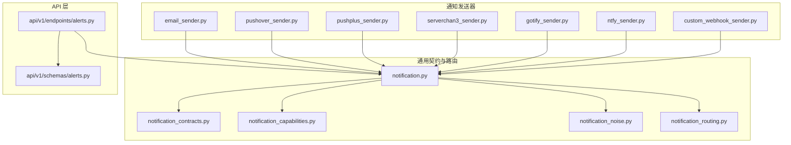
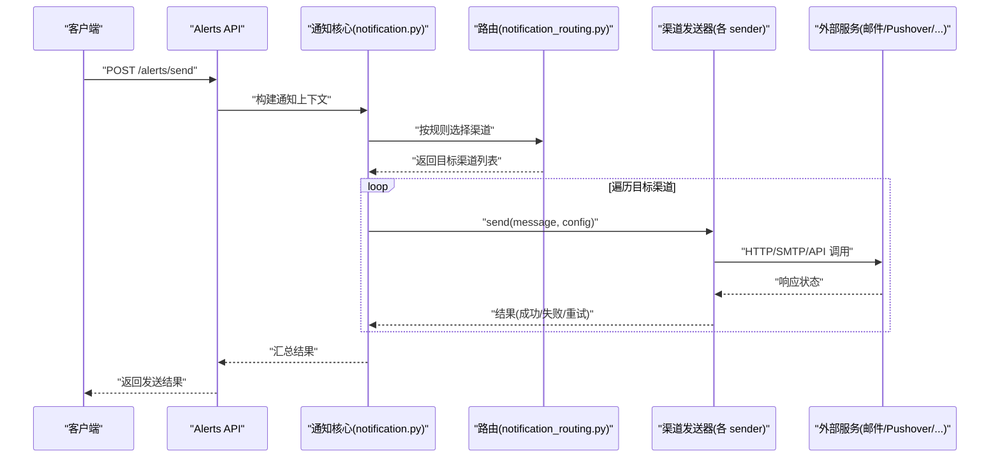
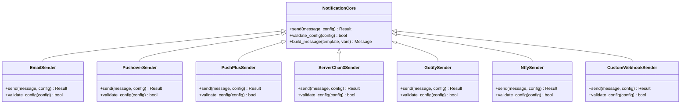
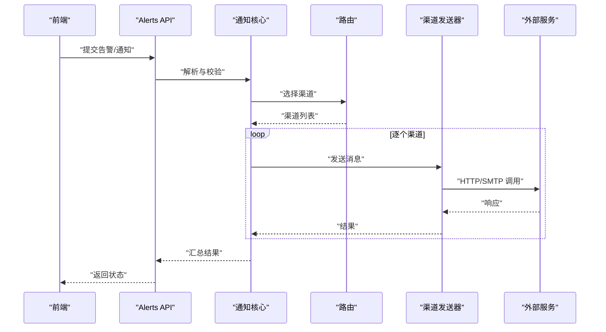
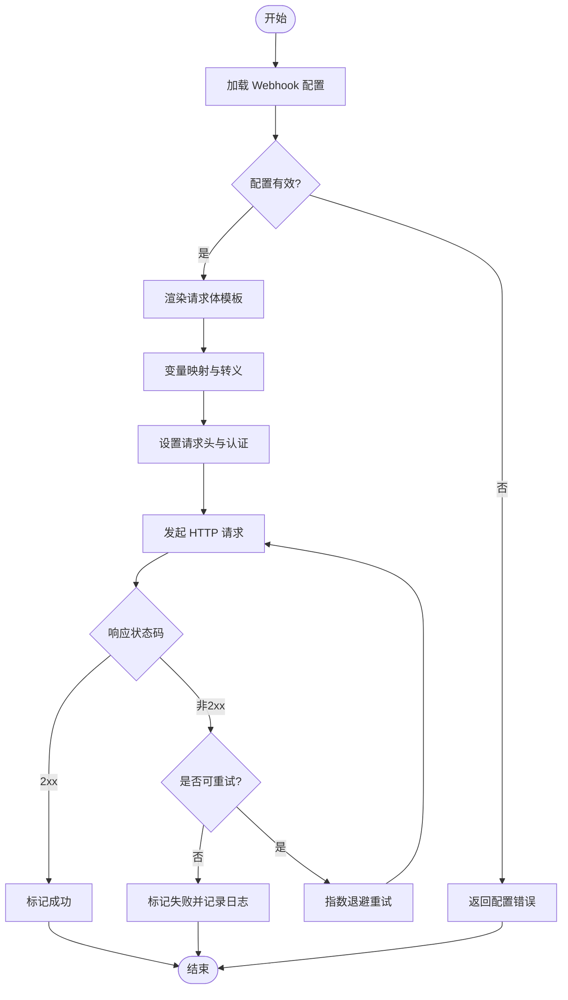
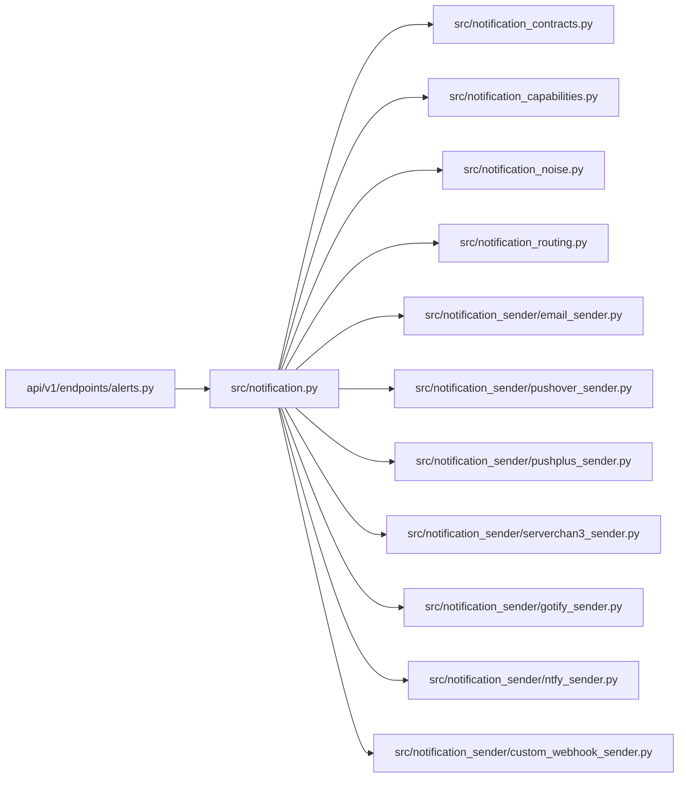

# 其他渠道集成

<cite>
**本文引用的文件**   
- [src/notification_sender/email_sender.py](file://src/notification_sender/email_sender.py)
- [src/notification_sender/pushover_sender.py](file://src/notification_sender/pushover_sender.py)
- [src/notification_sender/pushplus_sender.py](file://src/notification_sender/pushplus_sender.py)
- [src/notification_sender/serverchan3_sender.py](file://src/notification_sender/serverchan3_sender.py)
- [src/notification_sender/gotify_sender.py](file://src/notification_sender/gotify_sender.py)
- [src/notification_sender/ntfy_sender.py](file://src/notification_sender/ntfy_sender.py)
- [src/notification_sender/custom_webhook_sender.py](file://src/notification_sender/custom_webhook_sender.py)
- [src/notification.py](file://src/notification.py)
- [src/notification_contracts.py](file://src/notification_contracts.py)
- [src/notification_capabilities.py](file://src/notification_capabilities.py)
- [src/notification_noise.py](file://src/notification_noise.py)
- [src/notification_routing.py](file://src/notification_routing.py)
- [api/v1/endpoints/alerts.py](file://api/v1/endpoints/alerts.py)
- [api/v1/schemas/alerts.py](file://api/v1/schemas/alerts.py)
- [tests/test_notification_sender.py](file://tests/test_notification_sender.py)
</cite>

## 目录
1. [简介](#简介)
2. [项目结构](#项目结构)
3. [核心组件](#核心组件)
4. [架构总览](#架构总览)
5. [详细组件分析](#详细组件分析)
6. [依赖分析](#依赖分析)
7. [性能考虑](#性能考虑)
8. [故障排查指南](#故障排查指南)
9. [结论](#结论)
10. [附录](#附录)

## 简介
本文件面向“其他通知渠道”的集成与使用，覆盖邮件推送、Pushover、PushPlus、Server酱、Gotify、Ntfy、自定义Webhook等渠道。文档从系统架构、数据流、接口规范到配置参数、认证方式、消息格式进行系统化说明，并提供新渠道接入的标准流程与测试方法，帮助开发者快速扩展与落地。

## 项目结构
通知子系统位于 src/notification_sender 目录下，每个渠道一个发送器实现；通用契约与能力定义在 src 根目录的 notification_* 文件中；API 层通过 api/v1/endpoints/alerts.py 暴露告警与通知相关能力，前端通过 API 调用触发通知。

图表来源
- [src/notification_sender/email_sender.py](file://src/notification_sender/email_sender.py)
- [src/notification_sender/pushover_sender.py](file://src/notification_sender/pushover_sender.py)
- [src/notification_sender/pushplus_sender.py](file://src/notification_sender/pushplus_sender.py)
- [src/notification_sender/serverchan3_sender.py](file://src/notification_sender/serverchan3_sender.py)
- [src/notification_sender/gotify_sender.py](file://src/notification_sender/gotify_sender.py)
- [src/notification_sender/ntfy_sender.py](file://src/notification_sender/ntfy_sender.py)
- [src/notification_sender/custom_webhook_sender.py](file://src/notification_sender/custom_webhook_sender.py)
- [src/notification.py](file://src/notification.py)
- [src/notification_contracts.py](file://src/notification_contracts.py)
- [src/notification_capabilities.py](file://src/notification_capabilities.py)
- [src/notification_noise.py](file://src/notification_noise.py)
- [src/notification_routing.py](file://src/notification_routing.py)
- [api/v1/endpoints/alerts.py](file://api/v1/endpoints/alerts.py)
- [api/v1/schemas/alerts.py](file://api/v1/schemas/alerts.py)

章节来源
- [src/notification.py](file://src/notification.py)
- [src/notification_contracts.py](file://src/notification_contracts.py)
- [src/notification_capabilities.py](file://src/notification_capabilities.py)
- [src/notification_noise.py](file://src/notification_noise.py)
- [src/notification_routing.py](file://src/notification_routing.py)
- [api/v1/endpoints/alerts.py](file://api/v1/endpoints/alerts.py)
- [api/v1/schemas/alerts.py](file://api/v1/schemas/alerts.py)

## 核心组件
- 发送器抽象与统一入口：各渠道发送器遵循统一的接口契约，由通用通知模块调度执行。
- 能力与噪声控制：能力声明用于描述渠道支持的消息类型（文本、富文本、图片等），噪声控制避免重复或低价值通知。
- 路由与选择：根据规则将通知分发到合适的渠道，支持多目标与优先级。
- API 集成：通过 REST 接口提交告警与通知任务，前端可触发测试与查看结果。

章节来源
- [src/notification.py](file://src/notification.py)
- [src/notification_contracts.py](file://src/notification_contracts.py)
- [src/notification_capabilities.py](file://src/notification_capabilities.py)
- [src/notification_noise.py](file://src/notification_noise.py)
- [src/notification_routing.py](file://src/notification_routing.py)
- [api/v1/endpoints/alerts.py](file://api/v1/endpoints/alerts.py)
- [api/v1/schemas/alerts.py](file://api/v1/schemas/alerts.py)

## 架构总览
下图展示了从 API 请求到具体渠道发送器的调用链路与数据流转。

图表来源
- [api/v1/endpoints/alerts.py](file://api/v1/endpoints/alerts.py)
- [src/notification.py](file://src/notification.py)
- [src/notification_routing.py](file://src/notification_routing.py)
- [src/notification_sender/email_sender.py](file://src/notification_sender/email_sender.py)
- [src/notification_sender/pushover_sender.py](file://src/notification_sender/pushover_sender.py)
- [src/notification_sender/pushplus_sender.py](file://src/notification_sender/pushplus_sender.py)
- [src/notification_sender/serverchan3_sender.py](file://src/notification_sender/serverchan3_sender.py)
- [src/notification_sender/gotify_sender.py](file://src/notification_sender/gotify_sender.py)
- [src/notification_sender/ntfy_sender.py](file://src/notification_sender/ntfy_sender.py)
- [src/notification_sender/custom_webhook_sender.py](file://src/notification_sender/custom_webhook_sender.py)

## 详细组件分析

### 邮件推送（Email）
- 认证方式：通常使用 SMTP 服务器地址、端口、用户名/密码或访问令牌；可选 TLS/SSL。
- 消息格式：支持纯文本与 HTML 正文，附件（如报告图片）可通过 MIME 封装。
- 配置参数要点：
  - 发件人邮箱与显示名
  - SMTP 主机、端口、加密方式
  - 收件人列表、抄送/密送
  - 主题模板与正文模板变量
- 错误处理：连接失败、认证失败、超时、内容校验失败等应记录并返回明确错误码。

章节来源
- [src/notification_sender/email_sender.py](file://src/notification_sender/email_sender.py)
- [src/notification.py](file://src/notification.py)

### Pushover
- 认证方式：用户密钥（User Key）与应用令牌（Token）。
- 消息格式：标题、消息体、优先级、声音、设备、URL、图标等。
- 配置参数要点：
  - User Key、Token
  - 默认设备与声音
  - 重试与过期策略
- 错误处理：无效密钥、配额限制、网络异常等需区分并提示。

章节来源
- [src/notification_sender/pushover_sender.py](file://src/notification_sender/pushover_sender.py)
- [src/notification.py](file://src/notification.py)

### PushPlus
- 认证方式：Token（通常在服务端获取后配置）。
- 消息格式：标题、内容、频道（微信/企业微信/钉钉等）、是否 Markdown。
- 配置参数要点：
  - Token
  - 默认频道与消息类型
  - 重试与限流
- 错误处理：Token 失效、频率限制、平台不可用等。

章节来源
- [src/notification_sender/pushplus_sender.py](file://src/notification_sender/pushplus_sender.py)
- [src/notification.py](file://src/notification.py)

### Server酱（ServerChan3）
- 认证方式：SCKEY（或新版 Token）。
- 消息格式：标题、正文、可选扩展字段。
- 配置参数要点：
  - SCKEY/Token
  - 通道类型（微信/邮箱等）
  - 重试与超时
- 错误处理：密钥无效、服务限流、网络错误。

章节来源
- [src/notification_sender/serverchan3_sender.py](file://src/notification_sender/serverchan3_sender.py)
- [src/notification.py](file://src/notification.py)

### Gotify
- 认证方式：应用令牌（App Token）。
- 消息格式：标题、消息、优先级、附加键值对。
- 配置参数要点：
  - 服务端地址
  - App Token
  - 默认优先级与标签
- 错误处理：未授权、服务不可达、消息过大等。

章节来源
- [src/notification_sender/gotify_sender.py](file://src/notification_sender/gotify_sender.py)
- [src/notification.py](file://src/notification.py)

### Ntfy
- 认证方式：可选 Basic Auth 或 Bearer Token。
- 消息格式：主题、消息、标题、优先级、附件、回调 URL。
- 配置参数要点：
  - 服务端地址
  - 认证信息
  - 默认主题与优先级
- 错误处理：认证失败、主题不存在、网络异常。

章节来源
- [src/notification_sender/ntfy_sender.py](file://src/notification_sender/ntfy_sender.py)
- [src/notification.py](file://src/notification.py)

### 自定义 Webhook
- 认证方式：由用户自定义（Header、Query、Body 签名等）。
- 消息格式：完全自定义，支持 JSON/XML/表单等，支持模板变量替换。
- 配置参数要点：
  - 目标 URL
  - 请求方法与头
  - 请求体模板与变量映射
  - 重试与超时策略
- 错误处理：HTTP 状态码判断、重试策略、日志记录。

章节来源
- [src/notification_sender/custom_webhook_sender.py](file://src/notification_sender/custom_webhook_sender.py)
- [src/notification.py](file://src/notification.py)

### 通用接口规范与扩展开发指南
- 统一接口契约：所有发送器需实现标准方法（如 send、validate_config、build_message），以便被核心模块统一调度。
- 能力声明：通过能力模块声明支持的媒体类型（文本、富文本、图片、附件）与特性（Markdown、优先级、回调）。
- 路由规则：基于渠道能力、目标受众、告警级别进行智能选择，支持多目标与回退。
- 噪声控制：去重、合并、节流，避免频繁打扰。
- 配置管理：集中式配置与校验，敏感信息加密存储。
- 测试方法：
  - 单元测试：模拟外部服务响应，验证消息构造与错误分支。
  - 集成测试：对接真实沙箱环境，验证端到端发送。
  - 回归测试：确保新增渠道不影响既有逻辑。

章节来源
- [src/notification_contracts.py](file://src/notification_contracts.py)
- [src/notification_capabilities.py](file://src/notification_capabilities.py)
- [src/notification_noise.py](file://src/notification_noise.py)
- [src/notification_routing.py](file://src/notification_routing.py)
- [src/notification.py](file://src/notification.py)
- [tests/test_notification_sender.py](file://tests/test_notification_sender.py)

### 类图（发送器抽象与实现）

图表来源
- [src/notification.py](file://src/notification.py)
- [src/notification_sender/email_sender.py](file://src/notification_sender/email_sender.py)
- [src/notification_sender/pushover_sender.py](file://src/notification_sender/pushover_sender.py)
- [src/notification_sender/pushplus_sender.py](file://src/notification_sender/pushplus_sender.py)
- [src/notification_sender/serverchan3_sender.py](file://src/notification_sender/serverchan3_sender.py)
- [src/notification_sender/gotify_sender.py](file://src/notification_sender/gotify_sender.py)
- [src/notification_sender/ntfy_sender.py](file://src/notification_sender/ntfy_sender.py)
- [src/notification_sender/custom_webhook_sender.py](file://src/notification_sender/custom_webhook_sender.py)

### 序列图（API 到渠道发送）

图表来源
- [api/v1/endpoints/alerts.py](file://api/v1/endpoints/alerts.py)
- [src/notification.py](file://src/notification.py)
- [src/notification_routing.py](file://src/notification_routing.py)
- [src/notification_sender/custom_webhook_sender.py](file://src/notification_sender/custom_webhook_sender.py)

### 流程图（自定义 Webhook 消息构造）

图表来源
- [src/notification_sender/custom_webhook_sender.py](file://src/notification_sender/custom_webhook_sender.py)

## 依赖分析
- 耦合关系：通知核心与各发送器松耦合，通过统一契约交互；路由与能力模块提供灵活的选择与过滤。
- 外部依赖：各发送器依赖各自的外部服务（SMTP、HTTP API），需在配置中明确超时与重试策略。
- 潜在循环依赖：应避免发送器直接依赖 API 层，保持单向依赖（API -> 核心 -> 发送器）。

图表来源
- [api/v1/endpoints/alerts.py](file://api/v1/endpoints/alerts.py)
- [src/notification.py](file://src/notification.py)
- [src/notification_contracts.py](file://src/notification_contracts.py)
- [src/notification_capabilities.py](file://src/notification_capabilities.py)
- [src/notification_noise.py](file://src/notification_noise.py)
- [src/notification_routing.py](file://src/notification_routing.py)
- [src/notification_sender/email_sender.py](file://src/notification_sender/email_sender.py)
- [src/notification_sender/pushover_sender.py](file://src/notification_sender/pushover_sender.py)
- [src/notification_sender/pushplus_sender.py](file://src/notification_sender/pushplus_sender.py)
- [src/notification_sender/serverchan3_sender.py](file://src/notification_sender/serverchan3_sender.py)
- [src/notification_sender/gotify_sender.py](file://src/notification_sender/gotify_sender.py)
- [src/notification_sender/ntfy_sender.py](file://src/notification_sender/ntfy_sender.py)
- [src/notification_sender/custom_webhook_sender.py](file://src/notification_sender/custom_webhook_sender.py)

章节来源
- [api/v1/endpoints/alerts.py](file://api/v1/endpoints/alerts.py)
- [src/notification.py](file://src/notification.py)
- [src/notification_contracts.py](file://src/notification_contracts.py)
- [src/notification_capabilities.py](file://src/notification_capabilities.py)
- [src/notification_noise.py](file://src/notification_noise.py)
- [src/notification_routing.py](file://src/notification_routing.py)

## 性能考虑
- 并发与队列：高并发场景下建议使用异步发送与任务队列，避免阻塞主流程。
- 连接复用：HTTP 客户端与 SMTP 连接池可减少握手开销。
- 批量与合并：对相似消息进行合并发送，降低外部服务压力。
- 超时与重试：合理设置超时与最大重试次数，采用指数退避与熔断策略。
- 缓存与幂等：对外部服务的查询结果进行缓存，保证幂等性以避免重复通知。

[本节为通用指导，不直接分析具体文件]

## 故障排查指南
- 常见问题定位：
  - 认证失败：检查密钥/令牌是否正确、权限是否足够。
  - 网络异常：确认目标服务可达、代理与防火墙设置。
  - 消息格式错误：核对模板变量与必填字段。
  - 限流与配额：关注外部服务的速率限制与配额消耗。
- 调试建议：
  - 开启详细日志，记录请求与响应。
  - 使用沙箱或测试账号进行最小化复现。
  - 逐步隔离问题（先连通性，再认证，再业务逻辑）。

章节来源
- [tests/test_notification_sender.py](file://tests/test_notification_sender.py)

## 结论
通过统一的契约与模块化设计，本项目实现了多渠道通知的可插拔扩展。邮件、Pushover、PushPlus、Server酱、Gotify、Ntfy、自定义 Webhook 等渠道均遵循一致的接口与配置规范，便于维护与升级。结合能力声明、路由与噪声控制，可在复杂场景中稳定可靠地送达关键信息。

[本节为总结，不直接分析具体文件]

## 附录
- 配置示例与环境变量：建议在部署时通过环境变量注入敏感信息，并在配置管理中集中维护。
- 测试用例参考：参见 tests/test_notification_sender.py，了解如何编写单元与集成测试。
- 扩展新渠道步骤：
  1. 新建发送器文件，实现统一接口。
  2. 在能力模块声明支持的特性。
  3. 在路由模块注册渠道选择规则。
  4. 编写单测与集成测试，覆盖正常与异常路径。
  5. 更新文档与配置说明。

[本节为补充信息，不直接分析具体文件]