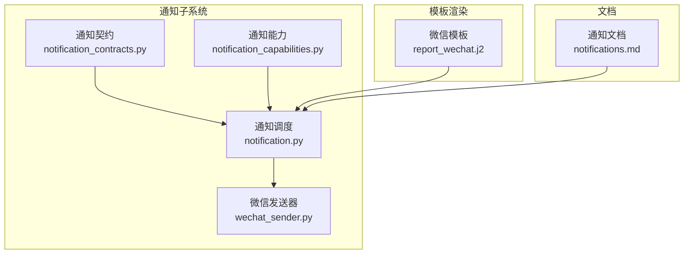
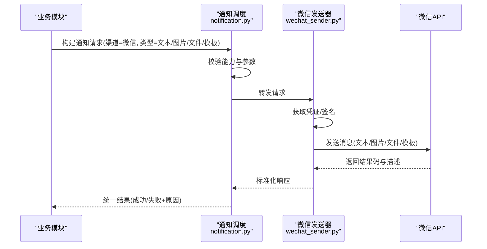
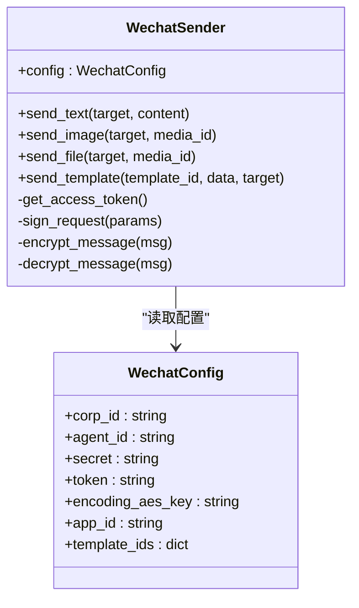
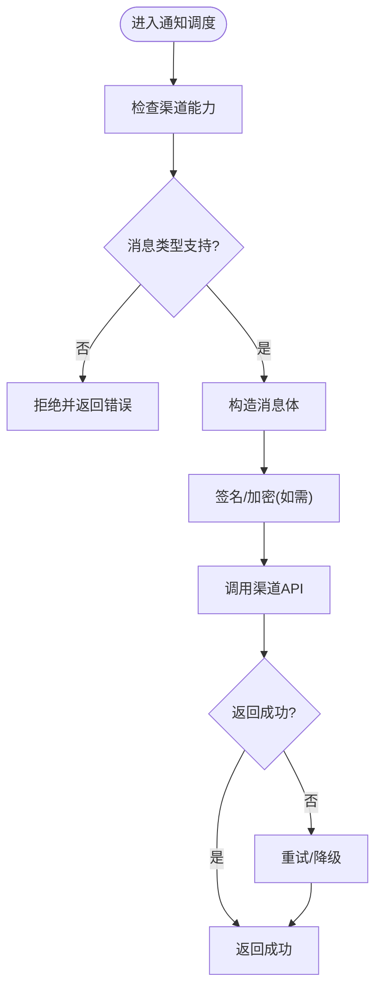
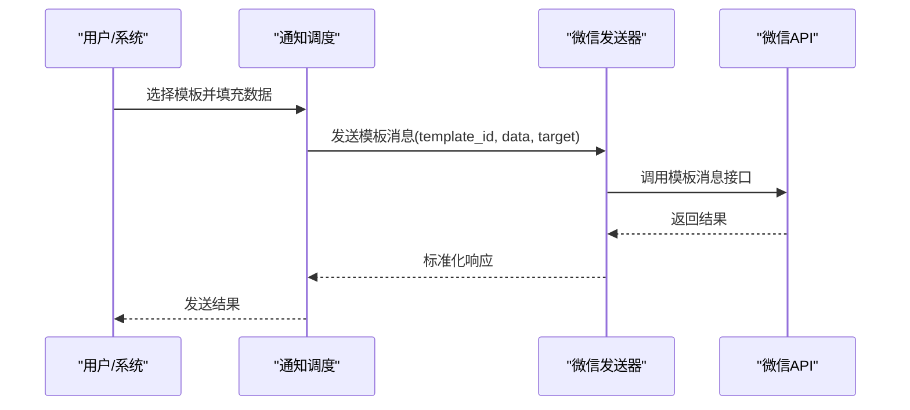
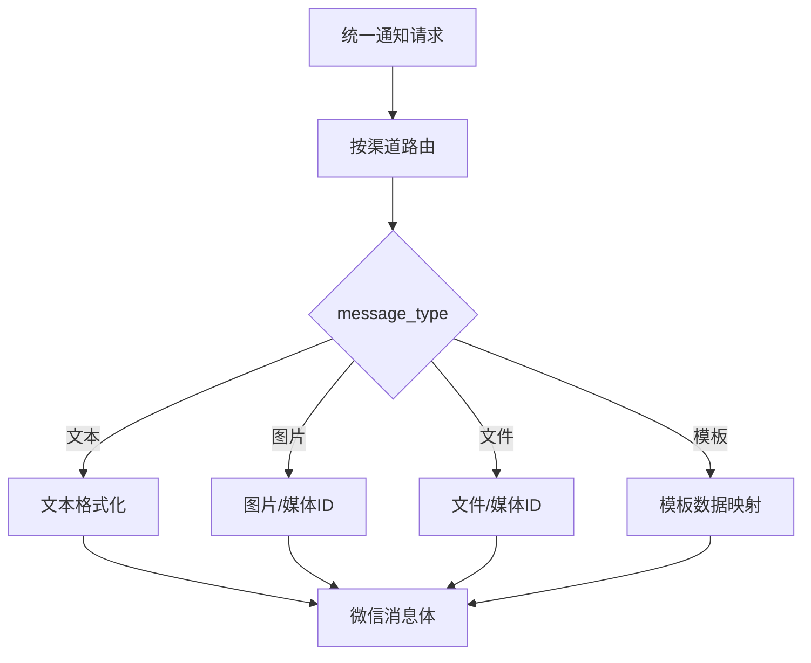
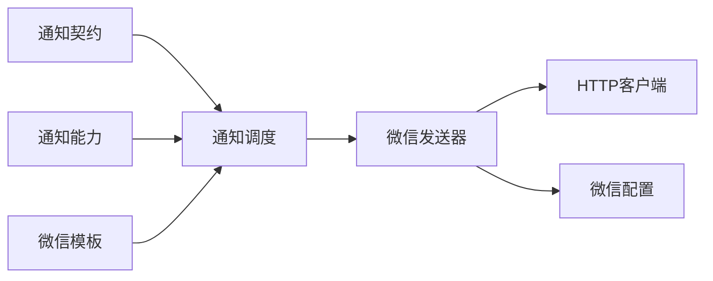

# 微信渠道集成

<cite>
**本文引用的文件**   
- [wechat_sender.py](file://src/notification_sender/wechat_sender.py)
- [notification.py](file://src/notification.py)
- [notification_contracts.py](file://src/notification_contracts.py)
- [notification_capabilities.py](file://src/notification_capabilities.py)
- [templates/report_wechat.j2](file://templates/report_wechat.j2)
- [notifications.md](file://docs/notifications.md)
</cite>

## 目录
1. [简介](#简介)
2. [项目结构](#项目结构)
3. [核心组件](#核心组件)
4. [架构总览](#架构总览)
5. [详细组件分析](#详细组件分析)
6. [依赖关系分析](#依赖关系分析)
7. [性能考虑](#性能考虑)
8. [故障排查指南](#故障排查指南)
9. [结论](#结论)
10. [附录](#附录)

## 简介
本文件面向需要在系统中接入“微信渠道”的开发者与运维人员，系统支持企业微信与微信公众号两类通知场景。文档涵盖：
- 企业微信与微信公众号的接入方式（AppID、AppSecret 等配置项）
- 消息推送接口调用方法
- 支持的 message types（文本、图片、文件等）
- 模板消息的配置与使用方法
- 消息格式转换、签名验证机制与错误处理策略
- 完整配置示例与故障排查指南

说明：
- 企业微信通常通过应用或自建应用进行消息推送；公众号则通过模板消息或客服消息等方式触达用户。
- 不同渠道在认证、鉴权、消息体结构与发送接口上存在差异，需按渠道分别配置与调试。

[本节不直接分析具体文件]

## 项目结构
微信相关能力主要位于通知子系统与模板渲染层：
- 通知发送器：实现各渠道的具体发送逻辑（含微信）
- 通知契约与能力定义：统一消息模型、能力枚举与路由
- 模板渲染：将业务报告转换为微信适配的消息内容
- 文档：通知能力与使用指南

图表来源
- [notification_contracts.py](file://src/notification_contracts.py)
- [notification_capabilities.py](file://src/notification_capabilities.py)
- [notification.py](file://src/notification.py)
- [wechat_sender.py](file://src/notification_sender/wechat_sender.py)
- [templates/report_wechat.j2](file://templates/report_wechat.j2)
- [docs/notifications.md](file://docs/notifications.md)

章节来源
- [notification.py](file://src/notification.py)
- [notification_contracts.py](file://src/notification_contracts.py)
- [notification_capabilities.py](file://src/notification_capabilities.py)
- [wechat_sender.py](file://src/notification_sender/wechat_sender.py)
- [templates/report_wechat.j2](file://templates/report_wechat.j2)
- [docs/notifications.md](file://docs/notifications.md)

## 核心组件
- 通知契约（Notification Contracts）
  - 定义统一的消息模型、字段约束与序列化规则，确保多通道一致的数据流转。
- 通知能力（Notification Capabilities）
  - 声明各渠道支持的能力集（如是否支持富媒体、模板消息、异步发送等）。
- 通知调度（Notification Core）
  - 负责消息路由、重试、限流、日志记录与结果聚合。
- 微信发送器（WeChat Sender）
  - 封装企业微信/公众号的认证、签名、消息构造与HTTP调用。
- 模板渲染（WeChat Template）
  - 将业务数据渲染为微信友好的消息格式（文本、图文、卡片等）。

章节来源
- [notification_contracts.py](file://src/notification_contracts.py)
- [notification_capabilities.py](file://src/notification_capabilities.py)
- [notification.py](file://src/notification.py)
- [wechat_sender.py](file://src/notification_sender/wechat_sender.py)
- [templates/report_wechat.j2](file://templates/report_wechat.j2)

## 架构总览
下图展示从业务侧到微信渠道的整体流程：业务生成通知请求，经通知调度路由至微信发送器，完成认证、签名、消息构造后调用微信API，返回结果由调度层统一处理并上报。

图表来源
- [notification.py](file://src/notification.py)
- [wechat_sender.py](file://src/notification_sender/wechat_sender.py)

章节来源
- [notification.py](file://src/notification.py)
- [wechat_sender.py](file://src/notification_sender/wechat_sender.py)

## 详细组件分析

### 微信发送器（企业微信与公众号）
职责：
- 管理企业微信应用/自建应用的 AppID、AppSecret、AgentId、Token、EncodingAESKey 等
- 管理微信公众号的 AppID、AppSecret、模板ID、回调URL等
- 实现签名与加密（如需要），获取 access_token，构造消息体并调用对应API
- 统一错误码映射与重试策略

关键要点：
- 企业微信：
  - 应用消息：通过 CorpID + AgentId + Secret 获取 access_token，再调用应用消息接口
  - 安全模式：启用 Token/EncodingAESKey 时，需要对消息体进行加解密
- 微信公众号：
  - 模板消息：通过 AppID + AppSecret 获取 access_token，再调用模板消息接口
  - 签名验证：服务端回调需校验签名与时间戳，防止伪造请求

图表来源
- [wechat_sender.py](file://src/notification_sender/wechat_sender.py)

章节来源
- [wechat_sender.py](file://src/notification_sender/wechat_sender.py)

### 通知契约与能力
- 契约（Contracts）
  - 定义统一的 message_type（文本、图片、文件、模板等）、目标标识（用户/群/公众号OpenID等）、附件与富媒体字段
- 能力（Capabilities）
  - 声明各渠道对 message_type 的支持情况、是否支持模板消息、是否支持富媒体、是否支持异步发送等

图表来源
- [notification_contracts.py](file://src/notification_contracts.py)
- [notification_capabilities.py](file://src/notification_capabilities.py)
- [notification.py](file://src/notification.py)

章节来源
- [notification_contracts.py](file://src/notification_contracts.py)
- [notification_capabilities.py](file://src/notification_capabilities.py)
- [notification.py](file://src/notification.py)

### 模板消息配置与使用
- 企业微信模板：
  - 在企业微信后台创建模板，记录 template_id
  - 在配置中绑定 template_id 与变量映射
  - 发送时传入模板数据字典，由发送器组装为模板消息体
- 公众号模板：
  - 在公众号后台创建模板，记录 template_id
  - 配置 app_id、secret、template_ids
  - 发送时传入模板数据与接收方 openid

图表来源
- [wechat_sender.py](file://src/notification_sender/wechat_sender.py)
- [templates/report_wechat.j2](file://templates/report_wechat.j2)

章节来源
- [wechat_sender.py](file://src/notification_sender/wechat_sender.py)
- [templates/report_wechat.j2](file://templates/report_wechat.j2)

### 消息格式转换
- 输入：统一的通知请求（包含 message_type、target、content/media/template_data）
- 转换：根据渠道与类型构造微信消息体（文本、图片、文件、模板）
- 输出：符合微信API规范的JSON或表单数据

图表来源
- [notification_contracts.py](file://src/notification_contracts.py)
- [notification_capabilities.py](file://src/notification_capabilities.py)
- [wechat_sender.py](file://src/notification_sender/wechat_sender.py)

章节来源
- [notification_contracts.py](file://src/notification_contracts.py)
- [notification_capabilities.py](file://src/notification_capabilities.py)
- [wechat_sender.py](file://src/notification_sender/wechat_sender.py)

## 依赖关系分析
- 通知调度依赖契约与能力定义，确保消息合法性与渠道能力匹配
- 微信发送器依赖配置与HTTP客户端，用于认证、签名与API调用
- 模板渲染依赖Jinja模板，将业务数据转换为微信友好格式

图表来源
- [notification_contracts.py](file://src/notification_contracts.py)
- [notification_capabilities.py](file://src/notification_capabilities.py)
- [notification.py](file://src/notification.py)
- [wechat_sender.py](file://src/notification_sender/wechat_sender.py)
- [templates/report_wechat.j2](file://templates/report_wechat.j2)

章节来源
- [notification_contracts.py](file://src/notification_contracts.py)
- [notification_capabilities.py](file://src/notification_capabilities.py)
- [notification.py](file://src/notification.py)
- [wechat_sender.py](file://src/notification_sender/wechat_sender.py)
- [templates/report_wechat.j2](file://templates/report_wechat.j2)

## 性能考虑
- 连接池与超时：合理设置HTTP连接池大小与超时，避免频繁握手与阻塞
- 令牌缓存：access_token 应缓存并按有效期刷新，减少重复获取
- 批量发送：对同一批目标合并请求，降低API调用次数
- 重试与退避：对临时性错误采用指数退避重试，避免雪崩
- 异步化：非关键路径可异步发送，提升整体吞吐

[本节提供通用建议，不直接分析具体文件]

## 故障排查指南
常见问题与定位步骤：
- 认证失败
  - 检查 AppID/AppSecret/CorpID/AgentId/Secret 是否正确
  - 确认网络可达与域名解析正常
  - 查看 access_token 获取日志与错误码
- 签名/加密失败
  - 核对 Token/EncodingAESKey 配置
  - 检查时间戳与随机数是否符合要求
  - 确认消息体未篡改
- 模板消息无效
  - 确认 template_id 存在且已发布
  - 检查模板变量名与数据映射是否一致
- 富媒体上传失败
  - 确认媒体文件类型与大小限制
  - 检查 media_id 是否过期
- 错误码对照
  - 参考微信官方错误码表，定位具体问题
  - 在通知调度层记录标准化错误信息

章节来源
- [wechat_sender.py](file://src/notification_sender/wechat_sender.py)
- [notification.py](file://src/notification.py)
- [docs/notifications.md](file://docs/notifications.md)

## 结论
通过统一的通知契约与能力定义，结合微信发送器的渠道适配与模板渲染，系统能够稳定地向企业微信与微信公众号推送文本、图片、文件与模板消息。建议在部署时严格校验配置、完善日志与监控，并遵循重试与限流策略，以提升可靠性与性能。

[本节总结性内容，不直接分析具体文件]

## 附录
- 配置示例（企业微信）
  - 必填项：corp_id、agent_id、secret
  - 可选项：token、encoding_aes_key（启用安全模式）
  - 模板：template_id 与变量映射
- 配置示例（微信公众号）
  - 必填项：app_id、secret
  - 模板：template_id 与变量映射
  - 回调：回调URL与签名校验配置
- 消息类型支持矩阵
  - 文本：所有渠道均支持
  - 图片/文件：需先上传媒体，再发送 media_id
  - 模板：按渠道模板规范填写变量

章节来源
- [wechat_sender.py](file://src/notification_sender/wechat_sender.py)
- [templates/report_wechat.j2](file://templates/report_wechat.j2)
- [docs/notifications.md](file://docs/notifications.md)