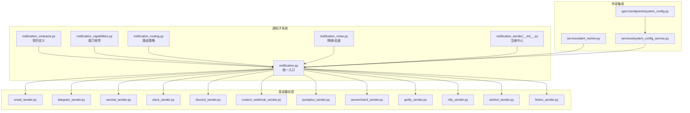
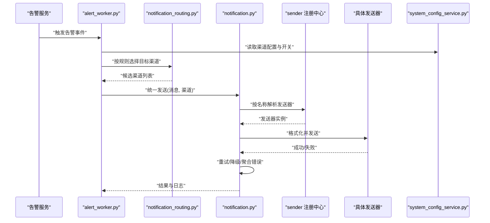
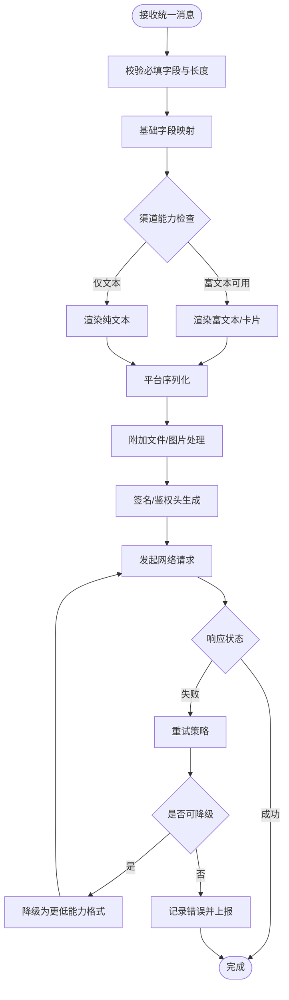
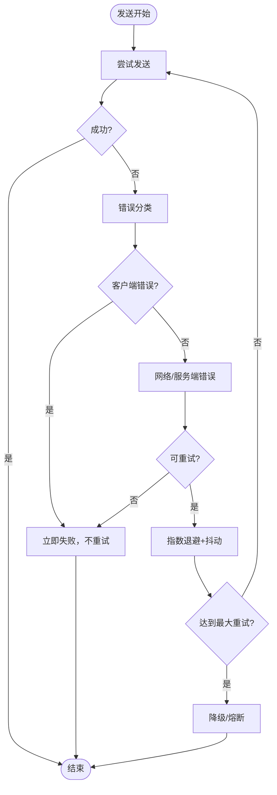
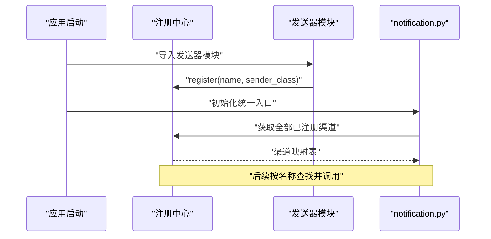
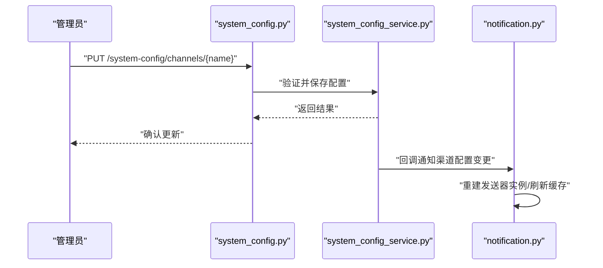
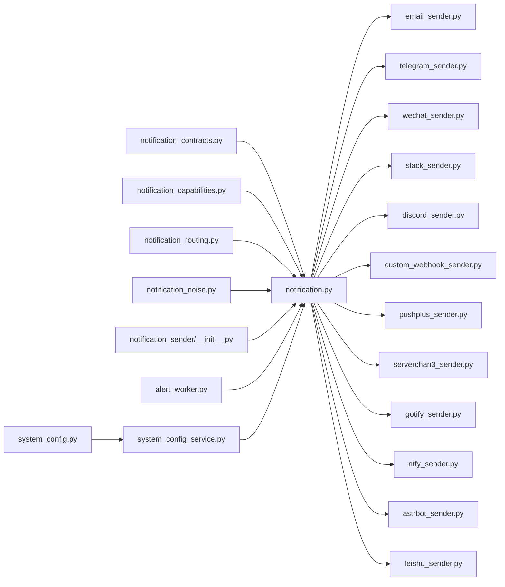

# 渠道开发指南

<cite>
**本文档引用的文件**   
- [src/notification_sender/__init__.py](file://src/notification_sender/__init__.py)
- [src/notification_sender/email_sender.py](file://src/notification_sender/email_sender.py)
- [src/notification_sender/telegram_sender.py](file://src/notification_sender/telegram_sender.py)
- [src/notification_sender/wechat_sender.py](file://src/notification_sender/wechat_sender.py)
- [src/notification_sender/slack_sender.py](file://src/notification_sender/slack_sender.py)
- [src/notification_sender/discord_sender.py](file://src/notification_sender/discord_sender.py)
- [src/notification_sender/custom_webhook_sender.py](file://src/notification_sender/custom_webhook_sender.py)
- [src/notification_sender/pushplus_sender.py](file://src/notification_sender/pushplus_sender.py)
- [src/notification_sender/serverchan3_sender.py](file://src/notification_sender/serverchan3_sender.py)
- [src/notification_sender/gotify_sender.py](file://src/notification_sender/gotify_sender.py)
- [src/notification_sender/ntfy_sender.py](file://src/notification_sender/ntfy_sender.py)
- [src/notification_sender/astrbot_sender.py](file://src/notification_sender/astrbot_sender.py)
- [src/notification_sender/feishu_sender.py](file://src/notification_sender/feishu_sender.py)
- [src/notification.py](file://src/notification.py)
- [src/notification_contracts.py](file://src/notification_contracts.py)
- [src/notification_capabilities.py](file://src/notification_capabilities.py)
- [src/notification_noise.py](file://src/notification_noise.py)
- [src/notification_routing.py](file://src/notification_routing.py)
- [src/services/alert_worker.py](file://src/services/alert_worker.py)
- [src/services/system_config_service.py](file://src/services/system_config_service.py)
- [api/v1/endpoints/system_config.py](file://api/v1/endpoints/system_config.py)
- [tests/test_notification.py](file://tests/test_notification.py)
- [tests/test_notification_sender.py](file://tests/test_notification_sender.py)
- [tests/test_notification_diagnostics.py](file://tests/test_notification_diagnostics.py)
</cite>

## 目录
1. [简介](#简介)
2. [项目结构](#项目结构)
3. [核心组件](#核心组件)
4. [架构总览](#架构总览)
5. [详细组件分析](#详细组件分析)
6. [依赖关系分析](#依赖关系分析)
7. [性能考虑](#性能考虑)
8. [故障排查指南](#故障排查指南)
9. [结论](#结论)
10. [附录](#附录)

## 简介
本指南面向希望接入新通讯平台的开发者，围绕通知渠道的抽象设计、基类继承与必需实现方法、消息格式转换、错误处理与重试机制、日志记录规范、渠道注册与配置管理、动态加载原理进行系统化说明。文档同时提供完整的开发示例、测试方法与部署步骤，帮助快速、稳定地接入新的通知平台。

## 项目结构
通知子系统主要位于以下模块：
- 发送器实现：src/notification_sender/*（各平台的具体发送器）
- 契约与能力定义：src/notification_contracts.py、src/notification_capabilities.py
- 路由与降噪：src/notification_routing.py、src/notification_noise.py
- 统一入口与编排：src/notification.py
- 告警工作流集成：src/services/alert_worker.py
- 配置管理与API：src/services/system_config_service.py、api/v1/endpoints/system_config.py
- 测试用例：tests/test_notification*.py

图表来源
- [src/notification.py](file://src/notification.py)
- [src/notification_contracts.py](file://src/notification_contracts.py)
- [src/notification_capabilities.py](file://src/notification_capabilities.py)
- [src/notification_routing.py](file://src/notification_routing.py)
- [src/notification_noise.py](file://src/notification_noise.py)
- [src/notification_sender/__init__.py](file://src/notification_sender/__init__.py)
- [src/services/alert_worker.py](file://src/services/alert_worker.py)
- [src/services/system_config_service.py](file://src/services/system_config_service.py)
- [api/v1/endpoints/system_config.py](file://api/v1/endpoints/system_config.py)

章节来源
- [src/notification.py](file://src/notification.py)
- [src/notification_contracts.py](file://src/notification_contracts.py)
- [src/notification_capabilities.py](file://src/notification_capabilities.py)
- [src/notification_routing.py](file://src/notification_routing.py)
- [src/notification_noise.py](file://src/notification_noise.py)
- [src/notification_sender/__init__.py](file://src/notification_sender/__init__.py)
- [src/services/alert_worker.py](file://src/services/alert_worker.py)
- [src/services/system_config_service.py](file://src/services/system_config_service.py)
- [api/v1/endpoints/system_config.py](file://api/v1/endpoints/system_config.py)

## 核心组件
- 契约与能力
  - 契约定义了统一的发送接口、消息体结构与返回约定，确保不同平台的一致性。
  - 能力枚举用于描述渠道支持的能力（如富文本、图片、卡片等），便于上层按能力选择或降级。
- 路由与降噪
  - 路由根据目标渠道、受众、事件类型将消息分发到具体发送器。
  - 降噪负责去重、限流、合并，避免风暴式推送。
- 发送器注册中心
  - 集中管理所有已注册的发送器实例，提供按名称查找与调用能力。
- 统一入口
  - 对外暴露统一的发送函数，内部完成路由、格式化、重试、日志与错误聚合。
- 配置与API
  - 通过系统配置服务统一管理渠道凭据与开关，并提供REST接口进行热更新。
- 告警工作流
  - 在告警触发后，调用通知子系统完成多渠道投递。

章节来源
- [src/notification_contracts.py](file://src/notification_contracts.py)
- [src/notification_capabilities.py](file://src/notification_capabilities.py)
- [src/notification_routing.py](file://src/notification_routing.py)
- [src/notification_noise.py](file://src/notification_noise.py)
- [src/notification_sender/__init__.py](file://src/notification_sender/__init__.py)
- [src/notification.py](file://src/notification.py)
- [src/services/system_config_service.py](file://src/services/system_config_service.py)
- [api/v1/endpoints/system_config.py](file://api/v1/endpoints/system_config.py)
- [src/services/alert_worker.py](file://src/services/alert_worker.py)

## 架构总览
下图展示了从告警触发到多渠道投递的整体流程，包括路由、格式化、重试、日志与错误处理。

图表来源
- [src/services/alert_worker.py](file://src/services/alert_worker.py)
- [src/notification_routing.py](file://src/notification_routing.py)
- [src/notification.py](file://src/notification.py)
- [src/notification_sender/__init__.py](file://src/notification_sender/__init__.py)
- [src/services/system_config_service.py](file://src/services/system_config_service.py)

## 详细组件分析

### 发送器抽象与基类
- 抽象契约
  - 定义统一的发送接口、消息体结构、能力声明与错误约定。
- 基类职责
  - 封装通用逻辑：参数校验、模板渲染、网络请求、重试、超时、鉴权、日志、指标埋点。
  - 子类仅需实现平台特定的序列化与HTTP/SDK调用。
- 必需实现的方法
  - 构建请求体（适配平台格式）
  - 执行发送（含鉴权头、签名、分页等）
  - 解析响应（成功/失败判定与错误码映射）
  - 能力探测（可选，用于动态能力判断）

```mermaid
classDiagram
class BaseSender {
+validate_params(params) bool
+build_payload(message, context) dict
+send(payload, options) Result
+retry_policy() RetryPolicy
+logger() Logger
+metrics() Metrics
}
class EmailSender {
+build_payload(message, context) dict
+send(payload, options) Result
}
class TelegramSender {
+build_payload(message, context) dict
+send(payload, options) Result
}
class WechatSender {
+build_payload(message, context) dict
+send(payload, options) Result
}
class SlackSender {
+build_payload(message, context) dict
+send(payload, options) Result
}
class DiscordSender {
+build_payload(message, context) dict
+send(payload, options) Result
}
class CustomWebhookSender {
+build_payload(message, context) dict
+send(payload, options) Result
}
class PushPlusSender {
+build_payload(message, context) dict
+send(payload, options) Result
}
class ServerChan3Sender {
+build_payload(message, context) dict
+send(payload, options) Result
}
class GotifySender {
+build_payload(message, context) dict
+send(payload, options) Result
}
class NtfySender {
+build_payload(message, context) dict
+send(payload, options) Result
}
class AstrBotSender {
+build_payload(message, context) dict
+send(payload, options) Result
}
class FeiShuSender {
+build_payload(message, context) dict
+send(payload, options) Result
}
BaseSender <|-- EmailSender
BaseSender <|-- TelegramSender
BaseSender <|-- WechatSender
BaseSender <|-- SlackSender
BaseSender <|-- DiscordSender
BaseSender <|-- CustomWebhookSender
BaseSender <|-- PushPlusSender
BaseSender <|-- ServerChan3Sender
BaseSender <|-- GotifySender
BaseSender <|-- NtfySender
BaseSender <|-- AstrBotSender
BaseSender <|-- FeiShuSender
```

图表来源
- [src/notification_sender/email_sender.py](file://src/notification_sender/email_sender.py)
- [src/notification_sender/telegram_sender.py](file://src/notification_sender/telegram_sender.py)
- [src/notification_sender/wechat_sender.py](file://src/notification_sender/wechat_sender.py)
- [src/notification_sender/slack_sender.py](file://src/notification_sender/slack_sender.py)
- [src/notification_sender/discord_sender.py](file://src/notification_sender/discord_sender.py)
- [src/notification_sender/custom_webhook_sender.py](file://src/notification_sender/custom_webhook_sender.py)
- [src/notification_sender/pushplus_sender.py](file://src/notification_sender/pushplus_sender.py)
- [src/notification_sender/serverchan3.py](file://src/notification_sender/serverchan3_sender.py)
- [src/notification_sender/gotify_sender.py](file://src/notification_sender/gotify_sender.py)
- [src/notification_sender/ntfy_sender.py](file://src/notification_sender/ntfy_sender.py)
- [src/notification_sender/astrbot_sender.py](file://src/notification_sender/astrbot_sender.py)
- [src/notification_sender/feishu_sender.py](file://src/notification_sender/feishu_sender.py)

章节来源
- [src/notification_contracts.py](file://src/notification_contracts.py)
- [src/notification_sender/email_sender.py](file://src/notification_sender/email_sender.py)
- [src/notification_sender/telegram_sender.py](file://src/notification_sender/telegram_sender.py)
- [src/notification_sender/wechat_sender.py](file://src/notification_sender/wechat_sender.py)
- [src/notification_sender/slack_sender.py](file://src/notification_sender/slack_sender.py)
- [src/notification_sender/discord_sender.py](file://src/notification_sender/discord_sender.py)
- [src/notification_sender/custom_webhook_sender.py](file://src/notification_sender/custom_webhook_sender.py)
- [src/notification_sender/pushplus_sender.py](file://src/notification_sender/pushplus_sender.py)
- [src/notification_sender/serverchan3_sender.py](file://src/notification_sender/serverchan3_sender.py)
- [src/notification_sender/gotify_sender.py](file://src/notification_sender/gotify_sender.py)
- [src/notification_sender/ntfy_sender.py](file://src/notification_sender/ntfy_sender.py)
- [src/notification_sender/astrbot_sender.py](file://src/notification_sender/astrbot_sender.py)
- [src/notification_sender/feishu_sender.py](file://src/notification_sender/feishu_sender.py)

### 消息格式转换
- 输入模型
  - 统一的消息体包含标题、正文、附件、富文本标记、目标受众、优先级、扩展字段等。
- 转换策略
  - 基类提供模板渲染与字段映射；各发送器实现平台特定序列化（JSON/表单/Markdown/富文本卡片）。
- 能力适配
  - 根据渠道能力枚举决定使用纯文本、富文本或卡片；不支持的能力自动降级为文本。
- 安全与合规
  - 敏感信息脱敏、长度限制、字符集过滤、附件大小限制。

图表来源
- [src/notification.py](file://src/notification.py)
- [src/notification_capabilities.py](file://src/notification_capabilities.py)
- [src/notification_sender/custom_webhook_sender.py](file://src/notification_sender/custom_webhook_sender.py)

章节来源
- [src/notification.py](file://src/notification.py)
- [src/notification_capabilities.py](file://src/notification_capabilities.py)
- [src/notification_sender/custom_webhook_sender.py](file://src/notification_sender/custom_webhook_sender.py)

### 错误处理与重试机制
- 错误分类
  - 客户端错误（参数非法、权限不足）、网络错误（超时、DNS失败）、服务端错误（业务异常、限流）。
- 重试策略
  - 指数退避、最大重试次数、抖动随机化、幂等键控制。
- 降级与熔断
  - 当某渠道持续失败时，自动切换至备用渠道或关闭该渠道开关。
- 错误上报
  - 结构化错误码、上下文追踪ID、关键参数摘要（脱敏）。

图表来源
- [src/notification.py](file://src/notification.py)
- [src/notification_sender/custom_webhook_sender.py](file://src/notification_sender/custom_webhook_sender.py)

章节来源
- [src/notification.py](file://src/notification.py)
- [src/notification_sender/custom_webhook_sender.py](file://src/notification_sender/custom_webhook_sender.py)

### 日志记录要求
- 分级记录
  - DEBUG：请求/响应摘要、重试次数、耗时
  - INFO：发送成功、渠道切换、配置变更
  - WARN：限流、降级、部分失败
  - ERROR：不可恢复错误、上游异常
- 结构化字段
  - 渠道名、消息ID、用户ID、追踪ID、耗时、错误码、错误信息（脱敏）
- 输出位置
  - 标准输出、文件滚动、集中式日志采集（可选）

章节来源
- [src/notification.py](file://src/notification.py)
- [src/notification_sender/custom_webhook_sender.py](file://src/notification_sender/custom_webhook_sender.py)

### 渠道注册机制与动态加载
- 注册方式
  - 通过发送器模块的初始化代码向注册中心登记渠道名称与类引用。
- 动态加载
  - 启动时扫描已导入的发送器模块，构建名称到实例的映射。
- 运行时发现
  - 支持按需加载新渠道（例如插件化），无需重启主进程。

图表来源
- [src/notification_sender/__init__.py](file://src/notification_sender/__init__.py)
- [src/notification.py](file://src/notification.py)

章节来源
- [src/notification_sender/__init__.py](file://src/notification_sender/__init__.py)
- [src/notification.py](file://src/notification.py)

### 配置管理与动态加载
- 配置项
  - 渠道开关、凭据（密钥、URL、Token）、重试参数、超时、限流阈值、降级策略。
- 存储与同步
  - 配置文件/环境变量/数据库持久化；运行时通过系统配置服务热更新。
- API 管理
  - 提供REST接口查询与修改渠道配置，支持校验与审计。

图表来源
- [api/v1/endpoints/system_config.py](file://api/v1/endpoints/system_config.py)
- [src/services/system_config_service.py](file://src/services/system_config_service.py)
- [src/notification.py](file://src/notification.py)

章节来源
- [api/v1/endpoints/system_config.py](file://api/v1/endpoints/system_config.py)
- [src/services/system_config_service.py](file://src/services/system_config_service.py)
- [src/notification.py](file://src/notification.py)

### 路由与降噪
- 路由策略
  - 基于事件类型、受众标签、渠道可用性、优先级进行匹配与排序。
- 降噪规则
  - 去重窗口、合并相似消息、限流与背压、静默时段。
- 可观测性
  - 路由命中统计、降噪命中率、渠道负载分布。

章节来源
- [src/notification_routing.py](file://src/notification_routing.py)
- [src/notification_noise.py](file://src/notification_noise.py)

### 与告警工作流的集成
- 触发时机
  - 告警条件满足后，由工作流调用通知子系统。
- 批量与并发
  - 支持批量消息合并与并发投递，提升吞吐。
- 回退与补偿
  - 失败消息进入死信队列，支持人工干预与重放。

章节来源
- [src/services/alert_worker.py](file://src/services/alert_worker.py)
- [src/notification.py](file://src/notification.py)

## 依赖关系分析
- 内聚与耦合
  - 发送器之间低耦合，通过统一契约与注册中心解耦。
  - 路由与降噪独立于具体发送器，便于替换与扩展。
- 外部依赖
  - HTTP客户端、第三方SDK、配置中心、日志与监控。
- 循环依赖
  - 通过分层与接口隔离避免循环依赖。

图表来源
- [src/notification_contracts.py](file://src/notification_contracts.py)
- [src/notification_capabilities.py](file://src/notification_capabilities.py)
- [src/notification_routing.py](file://src/notification_routing.py)
- [src/notification_noise.py](file://src/notification_noise.py)
- [src/notification_sender/__init__.py](file://src/notification_sender/__init__.py)
- [src/notification.py](file://src/notification.py)
- [src/services/alert_worker.py](file://src/services/alert_worker.py)
- [src/services/system_config_service.py](file://src/services/system_config_service.py)
- [api/v1/endpoints/system_config.py](file://api/v1/endpoints/system_config.py)

章节来源
- [src/notification_contracts.py](file://src/notification_contracts.py)
- [src/notification_capabilities.py](file://src/notification_capabilities.py)
- [src/notification_routing.py](file://src/notification_routing.py)
- [src/notification_noise.py](file://src/notification_noise.py)
- [src/notification_sender/__init__.py](file://src/notification_sender/__init__.py)
- [src/notification.py](file://src/notification.py)
- [src/services/alert_worker.py](file://src/services/alert_worker.py)
- [src/services/system_config_service.py](file://src/services/system_config_service.py)
- [api/v1/endpoints/system_config.py](file://api/v1/endpoints/system_config.py)

## 性能考虑
- 连接池与复用
  - 复用HTTP连接，减少握手开销。
- 并发与限流
  - 合理设置并发度，遵循上游限流策略，避免雪崩。
- 批量化与合并
  - 合并相近消息，降低请求频次。
- 缓存与预热
  - 缓存鉴权令牌、模板渲染结果。
- 资源监控
  - 跟踪QPS、延迟、错误率、内存与CPU占用。

[本节为通用指导，不涉及具体文件]

## 故障排查指南
- 常见问题定位
  - 渠道无法启用：检查配置项、网络连通性与权限。
  - 发送失败：查看错误码、重试次数、降级路径。
  - 消息未达：检查路由规则、降噪策略与受众匹配。
- 诊断工具
  - 提供诊断接口与日志采样，辅助定位问题。
- 测试建议
  - 单元测试覆盖序列化与错误分支。
  - 集成测试模拟上游失败与限流场景。

章节来源
- [tests/test_notification.py](file://tests/test_notification.py)
- [tests/test_notification_sender.py](file://tests/test_notification_sender.py)
- [tests/test_notification_diagnostics.py](file://tests/test_notification_diagnostics.py)

## 结论
通过统一的契约、清晰的基类继承、完善的路由与降噪、健壮的错误与重试机制、规范的日志记录以及灵活的配置与动态加载，通知子系统能够以较低成本接入新的通讯平台。遵循本指南的开发流程与最佳实践，可显著提升稳定性与可维护性。

[本节为总结性内容，不涉及具体文件]

## 附录

### 新增渠道开发步骤
- 新建发送器模块
  - 在 src/notification_sender/ 下创建新模块，继承基类并实现必要方法。
- 注册渠道
  - 在模块初始化中向注册中心登记渠道名称与类引用。
- 配置项
  - 在系统配置服务中添加渠道相关配置项，并在API端点暴露。
- 路由与能力
  - 在能力枚举中补充新渠道能力，必要时调整路由策略。
- 测试
  - 编写单测与集成测试，覆盖正常、失败、重试、降级路径。
- 部署
  - 更新依赖与环境变量，重启服务使新渠道生效。

章节来源
- [src/notification_sender/__init__.py](file://src/notification_sender/__init__.py)
- [src/services/system_config_service.py](file://src/services/system_config_service.py)
- [api/v1/endpoints/system_config.py](file://api/v1/endpoints/system_config.py)
- [tests/test_notification_sender.py](file://tests/test_notification_sender.py)

### 测试方法与用例设计
- 单元测试
  - 校验消息序列化、参数校验、错误分支。
- 集成测试
  - 模拟上游响应（成功、限流、超时、鉴权失败）。
- 端到端测试
  - 从告警触发到多渠道投递的全链路验证。

章节来源
- [tests/test_notification.py](file://tests/test_notification.py)
- [tests/test_notification_sender.py](file://tests/test_notification_sender.py)
- [tests/test_notification_diagnostics.py](file://tests/test_notification_diagnostics.py)

### 部署步骤
- 环境准备
  - 安装依赖、配置环境变量（渠道凭据、重试、超时、日志级别）。
- 服务启动
  - 启动后端服务，确保发送器模块被正确导入与注册。
- 配置生效
  - 通过API或配置文件更新渠道开关与参数，观察日志与指标。
- 健康检查
  - 访问健康端点，确认渠道就绪与连通性。

章节来源
- [src/services/system_config_service.py](file://src/services/system_config_service.py)
- [api/v1/endpoints/system_config.py](file://api/v1/endpoints/system_config.py)
- [src/notification.py](file://src/notification.py)