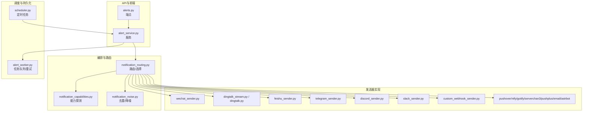
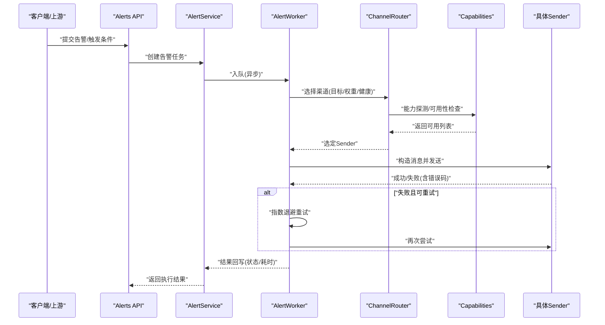
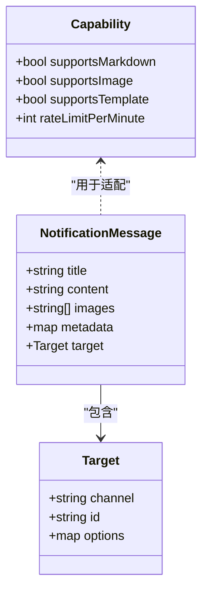
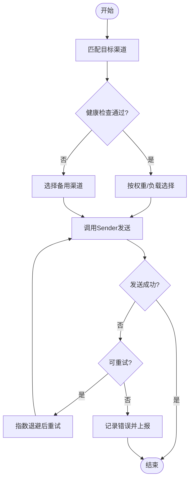
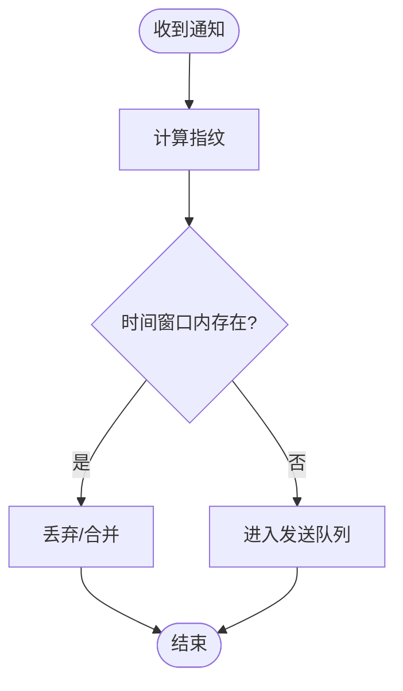
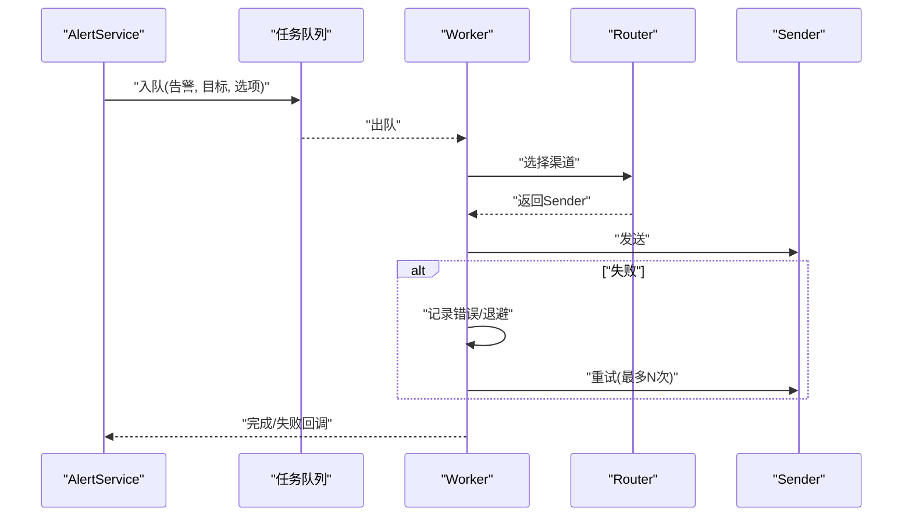
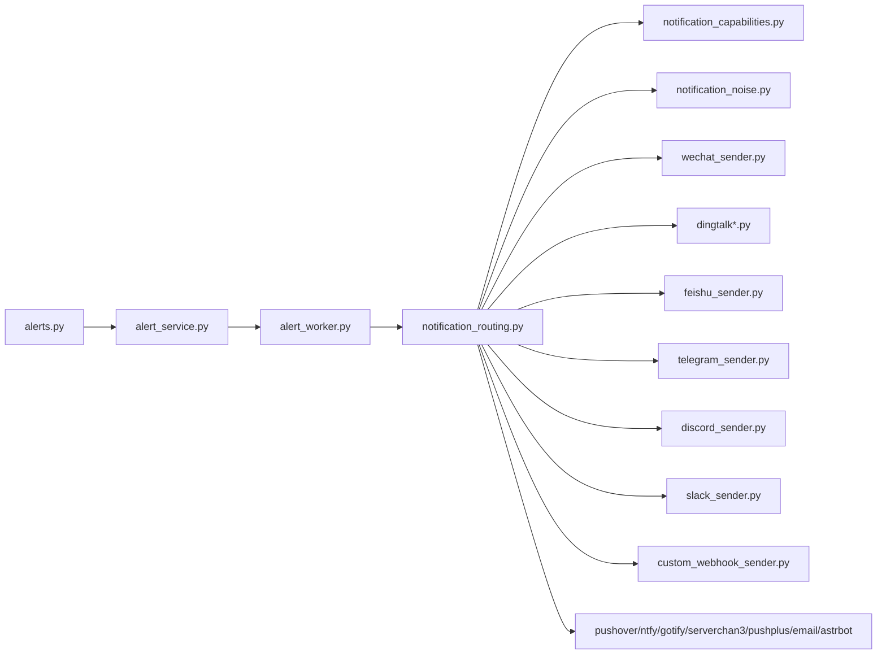

# 通知渠道集成

<cite>
**本文引用的文件**   
- [src/notification.py](file://src/notification.py)
- [src/notification_capabilities.py](file://src/notification_capabilities.py)
- [src/notification_contracts.py](file://src/notification_contracts.py)
- [src/notification_noise.py](file://src/notification_noise.py)
- [src/notification_routing.py](file://src/notification_routing.py)
- [src/services/alert_worker.py](file://src/services/alert_worker.py)
- [src/services/alert_service.py](file://src/services/alert_service.py)
- [src/services/notification_diagnostics.py](file://src/services/notification_diagnostics.py)
- [src/notification_sender/__init__.py](file://src/notification_sender/__init__.py)
- [src/notification_sender/wechat_sender.py](file://src/notification_sender/wechat_sender.py)
- [src/notification_sender/telegram_sender.py](file://src/notification_sender/telegram_sender.py)
- [src/notification_sender/discord_sender.py](file://src/notification_sender/discord_sender.py)
- [src/notification_sender/slack_sender.py](file://src/notification_sender/slack_sender.py)
- [src/notification_sender/feishu_sender.py](file://src/notification_sender/feishu_sender.py)
- [src/notification_sender/custom_webhook_sender.py](file://src/notification_sender/custom_webhook_sender.py)
- [src/notification_sender/pushover_sender.py](file://src/notification_sender/pushover_sender.py)
- [src/notification_sender/ntfy_sender.py](file://src/notification_sender/ntfy_sender.py)
- [src/notification_sender/gotify_sender.py](file://src/notification_sender/gotify_sender.py)
- [src/notification_sender/serverchan3_sender.py](file://src/notification_sender/serverchan3_sender.py)
- [src/notification_sender/pushplus_sender.py](file://src/notification_sender/pushplus_sender.py)
- [src/notification_sender/email_sender.py](file://src/notification_sender/email_sender.py)
- [src/notification_sender/astrbot_sender.py](file://src/notification_sender/astrbot_sender.py)
- [src/config.py](file://src/config.py)
- [src/scheduler.py](file://src/scheduler.py)
- [api/v1/endpoints/alerts.py](file://api/v1/endpoints/alerts.py)
- [api/v1/schemas/alerts.py](file://api/v1/schemas/alerts.py)
- [tests/test_notification.py](file://tests/test_notification.py)
- [tests/test_notification_sender.py](file://tests/test_notification_sender.py)
- [tests/test_notification_routing.py](file://tests/test_notification_routing.py)
- [tests/test_notification_diagnostics.py](file://tests/test_notification_diagnostics.py)
- [tests/test_pipeline_single_notify_thread_safety.py](file://tests/test_pipeline_single_notify_thread安全.py)
</cite>

## 目录
1. [简介](#简介)
2. [项目结构](#项目结构)
3. [核心组件](#核心组件)
4. [架构总览](#架构总览)
5. [详细组件分析](#详细组件分析)
6. [依赖关系分析](#依赖关系分析)
7. [性能与限流](#性能与限流)
8. [故障转移与负载均衡](#故障转移与负载均衡)
9. [错误处理与重试机制](#错误处理与重试机制)
10. [各渠道配置与消息格式](#各渠道配置与消息格式)
11. [新渠道接入指南](#新渠道接入指南)
12. [测试方法](#测试方法)
13. [部署步骤](#部署步骤)
14. [故障排查](#故障排查)
15. [结论](#结论)

## 简介
本文件面向“通知渠道集成”的完整说明，覆盖已实现的通讯平台（微信、钉钉、飞书、Telegram、Discord、Slack等）的接入方式、配置参数、认证方式与消息格式；并阐述渠道选择策略、故障转移与负载均衡机制。同时提供新渠道接入的开发规范、测试方法与部署步骤，以及限流、错误处理和重试策略说明，帮助读者快速理解与扩展系统能力。

## 项目结构
通知子系统由“路由与编排层 + 发送器实现层 + 服务与调度层 + API与前端交互”组成：
- 路由与编排层：负责渠道选择、去重降噪、能力探测与诊断。
- 发送器实现层：按渠道封装HTTP/WebSocket调用、鉴权、消息体构造与错误映射。
- 服务与调度层：将告警事件转化为通知任务，进行并发控制与重试。
- API与前端交互：暴露配置、测试与状态查询接口。

**图表来源** 
- [api/v1/endpoints/alerts.py](file://api/v1/endpoints/alerts.py)
- [src/services/alert_service.py](file://src/services/alert_service.py)
- [src/notification_routing.py](file://src/notification_routing.py)
- [src/notification_capabilities.py](file://src/notification_capabilities.py)
- [src/notification_noise.py](file://src/notification_noise.py)
- [src/notification_sender/wechat_sender.py](file://src/notification_sender/wechat_sender.py)
- [src/notification_sender/telegram_sender.py](file://src/notification_sender/telegram_sender.py)
- [src/notification_sender/discord_sender.py](file://src/notification_sender/discord_sender.py)
- [src/notification_sender/slack_sender.py](file://src/notification_sender/slack_sender.py)
- [src/notification_sender/feishu_sender.py](file://src/notification_sender/feishu_sender.py)
- [src/notification_sender/custom_webhook_sender.py](file://src/notification_sender/custom_webhook_sender.py)
- [src/services/alert_worker.py](file://src/services/alert_worker.py)
- [src/scheduler.py](file://src/scheduler.py)

**章节来源**
- [src/notification_routing.py](file://src/notification_routing.py)
- [src/notification_capabilities.py](file://src/notification_capabilities.py)
- [src/notification_noise.py](file://src/notification_noise.py)
- [src/services/alert_worker.py](file://src/services/alert_worker.py)
- [src/services/alert_service.py](file://src/services/alert_service.py)
- [api/v1/endpoints/alerts.py](file://api/v1/endpoints/alerts.py)

## 核心组件
- 通知契约与能力定义：统一消息模型、能力枚举、校验规则。
- 渠道路由与选择：基于目标、优先级、健康度、负载与权重动态选择发送器。
- 去重与降噪：按内容指纹、时间窗口与阈值抑制重复与噪声。
- 发送器抽象与实现：每个渠道一个Sender类，封装鉴权、请求、解析与错误映射。
- 告警工作流：从触发到投递的全链路编排，含重试、退避与失败降级。
- 诊断与可观测性：健康检查、延迟统计、错误分类与上报。

**章节来源**
- [src/notification_contracts.py](file://src/notification_contracts.py)
- [src/notification_capabilities.py](file://src/notification_capabilities.py)
- [src/notification_routing.py](file://src/notification_routing.py)
- [src/notification_noise.py](file://src/notification_noise.py)
- [src/notification_sender/__init__.py](file://src/notification_sender/__init__.py)
- [src/services/alert_worker.py](file://src/services/alert_worker.py)
- [src/services/notification_diagnostics.py](file://src/services/notification_diagnostics.py)

## 架构总览
下图展示一次通知从API到渠道投递的关键流程，包括路由选择、能力检测、去重、发送与重试。

**图表来源** 
- [api/v1/endpoints/alerts.py](file://api/v1/endpoints/alerts.py)
- [src/services/alert_service.py](file://src/services/alert_service.py)
- [src/services/alert_worker.py](file://src/services/alert_worker.py)
- [src/notification_routing.py](file://src/notification_routing.py)
- [src/notification_capabilities.py](file://src/notification_capabilities.py)
- [src/notification_sender/wechat_sender.py](file://src/notification_sender/wechat_sender.py)

## 详细组件分析

### 通知契约与能力
- 消息契约：统一标题、正文、富文本/图片、附件、目标对象（用户/群组/频道）、渠道元数据。
- 能力枚举：是否支持富文本、图片、Markdown、模板渲染、批量发送、速率限制等。
- 校验与转换：对输入字段进行类型与长度校验，转换为各渠道所需格式。

**图表来源** 
- [src/notification_contracts.py](file://src/notification_contracts.py)
- [src/notification_capabilities.py](file://src/notification_capabilities.py)

**章节来源**
- [src/notification_contracts.py](file://src/notification_contracts.py)
- [src/notification_capabilities.py](file://src/notification_capabilities.py)

### 渠道路由与选择
- 选择依据：目标匹配、渠道权重、健康状态、历史成功率、当前负载。
- 策略模式：支持固定优先、轮询、加权随机、健康感知切换。
- 降级路径：主通道失败自动切换到备用通道或通用Webhook。

**图表来源** 
- [src/notification_routing.py](file://src/notification_routing.py)
- [src/notification_capabilities.py](file://src/notification_capabilities.py)

**章节来源**
- [src/notification_routing.py](file://src/notification_routing.py)

### 去重与降噪
- 指纹生成：基于标题+摘要+目标ID生成哈希。
- 时间窗口：同一指纹在N分钟内只发一次。
- 阈值抑制：低优先级或相似内容合并推送。

**图表来源** 
- [src/notification_noise.py](file://src/notification_noise.py)

**章节来源**
- [src/notification_noise.py](file://src/notification_noise.py)

### 告警工作流与重试
- 任务入队：异步化处理，避免阻塞API响应。
- 重试策略：指数退避、最大重试次数、失败隔离。
- 状态追踪：记录每次尝试的时间、错误码与原因。

**图表来源** 
- [src/services/alert_worker.py](file://src/services/alert_worker.py)
- [src/services/alert_service.py](file://src/services/alert_service.py)
- [src/notification_routing.py](file://src/notification_routing.py)

**章节来源**
- [src/services/alert_worker.py](file://src/services/alert_worker.py)
- [src/services/alert_service.py](file://src/services/alert_service.py)

### 诊断与可观测性
- 健康检查：定期探测各渠道连通性与限流状态。
- 指标采集：成功率、延迟、错误分类、重试次数。
- 诊断工具：一键自检、日志聚合、问题定位建议。

**章节来源**
- [src/services/notification_diagnostics.py](file://src/services/notification_diagnostics.py)

## 依赖关系分析
- 上层依赖：API端点与服务层依赖路由与发送器抽象。
- 发送器之间解耦：通过统一接口与能力描述进行装配。
- 外部依赖：各渠道HTTP/API、WebSocket、邮件SMTP等。

**图表来源** 
- [api/v1/endpoints/alerts.py](file://api/v1/endpoints/alerts.py)
- [src/services/alert_service.py](file://src/services/alert_service.py)
- [src/services/alert_worker.py](file://src/services/alert_worker.py)
- [src/notification_routing.py](file://src/notification_routing.py)
- [src/notification_capabilities.py](file://src/notification_capabilities.py)
- [src/notification_noise.py](file://src/notification_noise.py)
- [src/notification_sender/wechat_sender.py](file://src/notification_sender/wechat_sender.py)
- [src/notification_sender/telegram_sender.py](file://src/notification_sender/telegram_sender.py)
- [src/notification_sender/discord_sender.py](file://src/notification_sender/discord_sender.py)
- [src/notification_sender/slack_sender.py](file://src/notification_sender/slack_sender.py)
- [src/notification_sender/feishu_sender.py](file://src/notification_sender/feishu_sender.py)
- [src/notification_sender/custom_webhook_sender.py](file://src/notification_sender/custom_webhook_sender.py)
- [src/notification_sender/pushover_sender.py](file://src/notification_sender/pushover_sender.py)
- [src/notification_sender/ntfy_sender.py](file://src/notification_sender/ntfy_sender.py)
- [src/notification_sender/gotify_sender.py](file://src/notification_sender/gotify_sender.py)
- [src/notification_sender/serverchan3_sender.py](file://src/notification_sender/serverchan3_sender.py)
- [src/notification_sender/pushplus_sender.py](file://src/notification_sender/pushplus_sender.py)
- [src/notification_sender/email_sender.py](file://src/notification_sender/email_sender.py)
- [src/notification_sender/astrbot_sender.py](file://src/notification_sender/astrbot_sender.py)

**章节来源**
- [src/notification_sender/__init__.py](file://src/notification_sender/__init__.py)

## 性能与限流
- 并发控制：任务队列限制并发数，避免瞬时峰值压垮下游。
- 渠道限流：根据各渠道API限制设置每分钟/小时配额，超限排队或拒绝。
- 连接复用：HTTP连接池、长连接（如WS）减少握手开销。
- 批量化：支持批量消息合并，降低请求频率。

[本节为通用指导，不直接分析具体文件]

## 故障转移与负载均衡
- 健康感知：实时监测各渠道可用性，失败自动切换。
- 多通道冗余：同一目标可配置多个渠道，按权重轮询。
- 降级策略：当专用通道不可用时，回退至通用Webhook或邮件。
- 熔断保护：连续失败达到阈值后短暂熔断，等待恢复。

**章节来源**
- [src/notification_routing.py](file://src/notification_routing.py)
- [src/notification_capabilities.py](file://src/notification_capabilities.py)

## 错误处理与重试机制
- 错误分类：网络错误、认证失败、限流、业务校验失败等。
- 重试策略：指数退避、抖动、最大重试次数、幂等键。
- 失败降级：切换备用通道、缓存待发送、告警上报。
- 可观测性：错误码、堆栈、上下文信息记录。

**章节来源**
- [src/services/alert_worker.py](file://src/services/alert_worker.py)
- [src/services/notification_diagnostics.py](file://src/services/notification_diagnostics.py)

## 各渠道配置与消息格式
以下为已实现渠道的配置要点与消息格式说明（以字段名与行为为主，不含代码片段）：

- 微信（WeChat）
  - 认证：企业微信应用Token/Secret或第三方平台凭证。
  - 配置项：应用ID、密钥、部门/用户ID、消息类型、模板ID。
  - 消息格式：文本、Markdown、图片、卡片消息。
  - 限流：按应用级别限制每分钟请求数。
  - 错误处理：签名失败、权限不足、频控超限。

- 钉钉（DingTalk）
  - 认证：机器人Webhook签名或企业内部应用AccessKey。
  - 配置项：机器人URL/签名密钥、消息类型、@成员。
  - 消息格式：文本、Markdown、ActionCard、FeedCard。
  - 限流：按机器人或应用维度限制。
  - 错误处理：签名校验失败、权限不足、频控。

- 飞书（Feishu/Lark）
  - 认证：应用App ID/Secret或事件订阅签名。
  - 配置项：租户ID、应用凭证、接收人ID、消息模板。
  - 消息格式：文本、富文本、交互式卡片。
  - 限流：按应用与消息类型限制。
  - 错误处理：鉴权失败、权限不足、频控。

- Telegram
  - 认证：Bot Token。
  - 配置项：Bot Token、Chat ID、解析模式、禁用链接预览。
  - 消息格式：MarkdownHTML、图片、文档、Inline键盘。
  - 限流：每秒请求限制。
  - 错误处理：无效Token、聊天不存在、频控。

- Discord
  - 认证：Bot Token或Webhook URL。
  - 配置项：Bot Token/Channel ID或Webhook URL、Embed格式。
  - 消息格式：Embed、图片、文件。
  - 限流：按端点限制。
  - 错误处理：权限不足、频控、无效Token。

- Slack
  - 认证：Bot Token或Incoming Webhook。
  - 配置项：Token/URL、Channel、Block Kit消息。
  - 消息格式：Blocks、图片、文件。
  - 限流：按API端点限制。
  - 错误处理：权限不足、频控、无效Token。

- 自定义Webhook
  - 认证：Header或Body签名。
  - 配置项：URL、Method、Headers、Body模板、重试策略。
  - 消息格式：任意JSON/XML，支持模板变量替换。
  - 限流：由服务端决定。
  - 错误处理：HTTP错误、超时、签名失败。

- Pushover / Ntfy / Gotify / ServerChan3 / PushPlus / Email / AstrBot
  - 认证：各自平台的Token/URL/SMTP配置。
  - 配置项：平台特定标识、收件人、主题、正文模板。
  - 消息格式：文本/富文本/附件（视平台支持）。
  - 限流：平台限制。
  - 错误处理：鉴权失败、频控、网络异常。

**章节来源**
- [src/notification_sender/wechat_sender.py](file://src/notification_sender/wechat_sender.py)
- [src/notification_sender/telegram_sender.py](file://src/notification_sender/telegram_sender.py)
- [src/notification_sender/discord_sender.py](file://src/notification_sender/discord_sender.py)
- [src/notification_sender/slack_sender.py](file://src/notification_sender/slack_sender.py)
- [src/notification_sender/feishu_sender.py](file://src/notification_sender/feishu_sender.py)
- [src/notification_sender/custom_webhook_sender.py](file://src/notification_sender/custom_webhook_sender.py)
- [src/notification_sender/pushover_sender.py](file://src/notification_sender/pushover_sender.py)
- [src/notification_sender/ntfy_sender.py](file://src/notification_sender/ntfy_sender.py)
- [src/notification_sender/gotify_sender.py](file://src/notification_sender/gotify_sender.py)
- [src/notification_sender/serverchan3_sender.py](file://src/notification_sender/serverchan3_sender.py)
- [src/notification_sender/pushplus_sender.py](file://src/notification_sender/pushplus_sender.py)
- [src/notification_sender/email_sender.py](file://src/notification_sender/email_sender.py)
- [src/notification_sender/astrbot_sender.py](file://src/notification_sender/astrbot_sender.py)

## 新渠道接入指南
- 接口规范
  - 实现统一的Sender接口：初始化、发送、健康检查、能力声明。
  - 定义渠道能力：是否支持Markdown、图片、模板、批量。
  - 错误映射：将平台错误码映射为内部错误类型。
- 配置管理
  - 新增环境变量或配置项，纳入统一配置加载。
  - 提供默认值与校验规则。
- 路由与能力注册
  - 在路由表中注册新渠道，声明优先级与权重。
  - 在能力探测中增加健康检查逻辑。
- 测试方法
  - 单元测试：模拟HTTP响应，验证消息构造与错误处理。
  - 集成测试：使用沙箱账号或Mock服务进行端到端验证。
  - 回归测试：确保与其他渠道无冲突。
- 部署步骤
  - 更新配置文件与环境变量。
  - 重启服务并运行健康检查。
  - 灰度发布与监控观察。

**章节来源**
- [src/notification_sender/__init__.py](file://src/notification_sender/__init__.py)
- [src/config.py](file://src/config.py)
- [src/notification_capabilities.py](file://src/notification_capabilities.py)
- [src/notification_routing.py](file://src/notification_routing.py)

## 测试方法
- 单测覆盖：针对消息构造、错误映射、重试逻辑与限流边界。
- 集成测试：对接真实或Mock渠道，验证端到端流程。
- 稳定性测试：高并发与长时间运行下的资源占用与错误率。
- 诊断测试：健康检查与指标上报有效性。

**章节来源**
- [tests/test_notification.py](file://tests/test_notification.py)
- [tests/test_notification_sender.py](file://tests/test_notification_sender.py)
- [tests/test_notification_routing.py](file://tests/test_notification_routing.py)
- [tests/test_notification_diagnostics.py](file://tests/test_notification_diagnostics.py)

## 部署步骤
- 环境准备：安装依赖、配置环境变量（各渠道Token/URL等）。
- 配置加载：确认配置项生效，启动前校验必填项。
- 服务启动：启动后端服务与调度器。
- 健康检查：运行诊断工具，确认各渠道可达。
- 灰度上线：先小流量验证，逐步扩大范围。
- 监控告警：关注成功率、延迟、错误分类与重试次数。

**章节来源**
- [src/config.py](file://src/config.py)
- [src/scheduler.py](file://src/scheduler.py)
- [src/services/notification_diagnostics.py](file://src/services/notification_diagnostics.py)

## 故障排查
- 常见问题
  - 认证失败：检查Token/Secret是否正确、权限是否授予。
  - 频控超限：降低发送频率或申请更高配额。
  - 网络异常：检查代理、防火墙与DNS解析。
  - 消息格式错误：核对模板与字段类型。
- 诊断工具
  - 健康检查：逐渠道连通性测试。
  - 日志分析：查看错误码、堆栈与上下文。
  - 指标看板：成功率、延迟、重试次数趋势。

**章节来源**
- [src/services/notification_diagnostics.py](file://src/services/notification_diagnostics.py)

## 结论
本通知渠道集成系统通过统一契约、灵活路由、健壮的重试与限流机制，实现了多渠道稳定可靠的告警投递。新增渠道遵循接口规范与能力声明即可快速接入。建议在生产环境中启用健康检查与诊断工具，持续优化渠道权重与限流策略，保障关键告警的高可用送达。