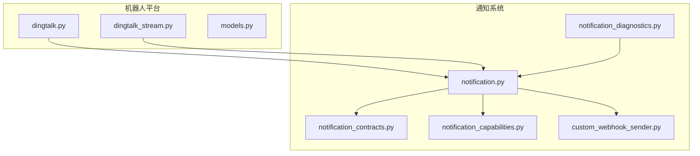
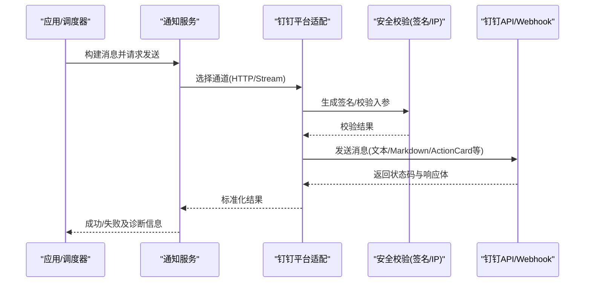
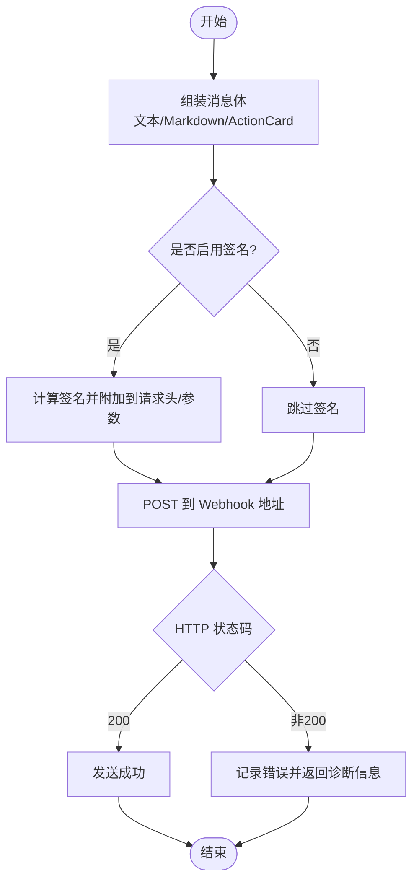
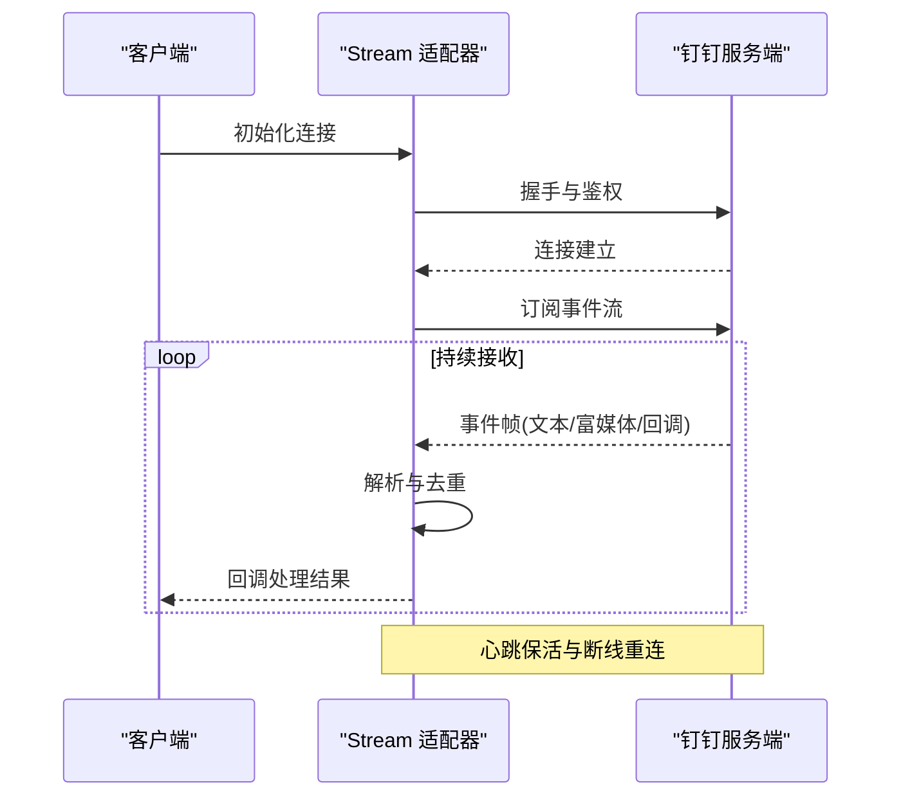
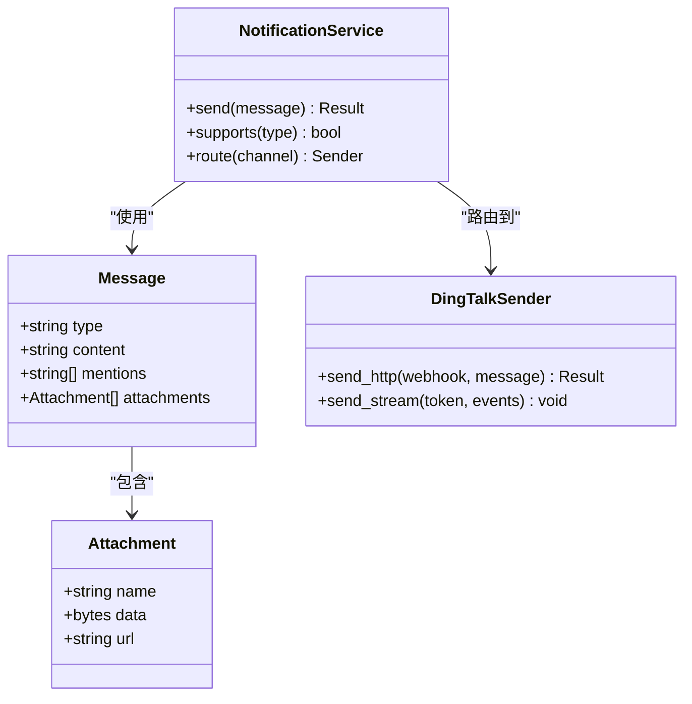
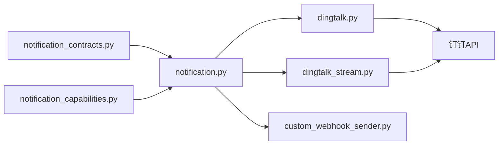

# 钉钉渠道集成

<cite>
**本文引用的文件**   
- [bot/platforms/dingtalk.py](file://bot/platforms/dingtalk.py)
- [bot/platforms/dingtalk_stream.py](file://bot/platforms/dingtalk_stream.py)
- [bot/models.py](file://bot/models.py)
- [src/notification_sender/custom_webhook_sender.py](file://src/notification_sender/custom_webhook_sender.py)
- [src/notification.py](file://src/notification.py)
- [src/notification_capabilities.py](file://src/notification_capabilities.py)
- [src/notification_contracts.py](file://src/notification_contracts.py)
- [src/services/notification_diagnostics.py](file://src/services/notification_diagnostics.py)
- [docs/bot/dingding-bot-config.md](file://docs/bot/dingding-bot-config.md)
</cite>

## 目录
1. [简介](#简介)
2. [项目结构](#项目结构)
3. [核心组件](#核心组件)
4. [架构总览](#架构总览)
5. [详细组件分析](#详细组件分析)
6. [依赖分析](#依赖分析)
7. [性能考虑](#性能考虑)
8. [故障排查指南](#故障排查指南)
9. [结论](#结论)
10. [附录](#附录)

## 简介
本文件面向“钉钉”通知与机器人渠道的集成与使用，覆盖以下要点：
- Webhook 地址与安全配置（加签、IP 白名单）
- 消息类型支持（文本、Markdown、ActionCard 等）、@用户功能与富媒体发送
- 流式通信模式（SSE/长连接）、事件回调处理与消息去重机制
- 完整配置示例与调试方法

说明：尽管目标包含企业微信机器人，但本仓库中钉钉渠道的实现位于 bot 平台层与通知发送层。文档将基于代码实际实现进行说明，并在必要时给出通用建议。

## 项目结构
钉钉相关能力主要分布在以下位置：
- 机器人平台适配层：bot/platforms/dingtalk.py、bot/platforms/dingtalk_stream.py
- 机器人数据模型：bot/models.py
- 自定义 Webhook 发送器：src/notification_sender/custom_webhook_sender.py
- 通知系统契约与能力：src/notification_contracts.py、src/notification_capabilities.py、src/notification.py
- 诊断工具：src/services/notification_diagnostics.py
- 官方文档参考：docs/bot/dingding-bot-config.md

图表来源
- [bot/platforms/dingtalk.py](file://bot/platforms/dingtalk.py)
- [bot/platforms/dingtalk_stream.py](file://bot/platforms/dingtalk_stream.py)
- [bot/models.py](file://bot/models.py)
- [src/notification.py](file://src/notification.py)
- [src/notification_contracts.py](file://src/notification_contracts.py)
- [src/notification_capabilities.py](file://src/notification_capabilities.py)
- [src/notification_sender/custom_webhook_sender.py](file://src/notification_sender/custom_webhook_sender.py)
- [src/services/notification_diagnostics.py](file://src/services/notification_diagnostics.py)

章节来源
- [bot/platforms/dingtalk.py](file://bot/platforms/dingtalk.py)
- [bot/platforms/dingtalk_stream.py](file://bot/platforms/dingtalk_stream.py)
- [bot/models.py](file://bot/models.py)
- [src/notification.py](file://src/notification.py)
- [src/notification_contracts.py](file://src/notification_contracts.py)
- [src/notification_capabilities.py](file://src/notification_capabilities.py)
- [src/notification_sender/custom_webhook_sender.py](file://src/notification_sender/custom_webhook_sender.py)
- [src/services/notification_diagnostics.py](file://src/services/notification_diagnostics.py)

## 核心组件
- 钉钉机器人平台适配（HTTP 与 Stream）
  - HTTP 模式：通过 Webhook 接口推送消息，支持签名校验与 IP 白名单
  - Stream 模式：基于长连接的流式通信，适合实时事件回调与增量更新
- 自定义 Webhook 发送器：统一封装对外部 Webhook 的调用，便于扩展其他通道
- 通知契约与能力：定义消息体结构、能力开关与路由策略
- 诊断工具：提供连通性检查、签名验证与错误定位

章节来源
- [bot/platforms/dingtalk.py](file://bot/platforms/dingtalk.py)
- [bot/platforms/dingtalk_stream.py](file://bot/platforms/dingtalk_stream.py)
- [src/notification_sender/custom_webhook_sender.py](file://src/notification_sender/custom_webhook_sender.py)
- [src/notification_contracts.py](file://src/notification_contracts.py)
- [src/notification_capabilities.py](file://src/notification_capabilities.py)
- [src/services/notification_diagnostics.py](file://src/services/notification_diagnostics.py)

## 架构总览
钉钉渠道的整体交互流程如下：
- 业务侧通过通知服务构造消息对象
- 平台适配层根据模式选择 HTTP Webhook 或 Stream 通道
- 安全层完成签名计算与校验（如启用）
- 发送后返回结果，失败时进入重试与诊断流程

图表来源
- [src/notification.py](file://src/notification.py)
- [bot/platforms/dingtalk.py](file://bot/platforms/dingtalk.py)
- [bot/platforms/dingtalk_stream.py](file://bot/platforms/dingtalk_stream.py)
- [src/notification_sender/custom_webhook_sender.py](file://src/notification_sender/custom_webhook_sender.py)

## 详细组件分析

### 钉钉 HTTP 机器人（Webhook）
- 配置项
  - Webhook 地址：用于 POST 消息
  - 安全配置：可选加签（密钥）与 IP 白名单
- 消息类型
  - 文本、Markdown、ActionCard 等（以平台适配层支持的类型为准）
  - @用户：在消息内容中按约定格式引用用户
  - 富媒体：图片、文件等需遵循钉钉 API 限制与大小要求
- 发送流程
  - 组装消息体 -> 计算签名（若启用）-> 发起 HTTP 请求 -> 解析响应 -> 返回结果

图表来源
- [bot/platforms/dingtalk.py](file://bot/platforms/dingtalk.py)
- [src/notification_sender/custom_webhook_sender.py](file://src/notification_sender/custom_webhook_sender.py)

章节来源
- [bot/platforms/dingtalk.py](file://bot/platforms/dingtalk.py)
- [src/notification_sender/custom_webhook_sender.py](file://src/notification_sender/custom_webhook_sender.py)

### 钉钉 Stream 模式（长连接）
- 适用场景
  - 需要实时事件回调、增量消息推送、低延迟交互
- 关键特性
  - 建立长连接，订阅事件流
  - 心跳保活与断线重连
  - 事件回调处理与幂等性控制（去重）
- 典型流程
  - 初始化连接 -> 鉴权（Token/签名）-> 订阅事件 -> 接收并处理事件 -> 异常恢复

图表来源
- [bot/platforms/dingtalk_stream.py](file://bot/platforms/dingtalk_stream.py)

章节来源
- [bot/platforms/dingtalk_stream.py](file://bot/platforms/dingtalk_stream.py)

### 消息模型与契约
- 消息体结构
  - 统一的消息抽象，包含类型、内容、附件、@用户列表等字段
- 能力声明
  - 各通道支持的能力（如 Markdown、ActionCard、富媒体）由能力层声明
- 路由与分发
  - 根据目标渠道与能力选择具体发送器

图表来源
- [bot/models.py](file://bot/models.py)
- [src/notification_contracts.py](file://src/notification_contracts.py)
- [src/notification_capabilities.py](file://src/notification_capabilities.py)
- [src/notification.py](file://src/notification.py)

章节来源
- [bot/models.py](file://bot/models.py)
- [src/notification_contracts.py](file://src/notification_contracts.py)
- [src/notification_capabilities.py](file://src/notification_capabilities.py)
- [src/notification.py](file://src/notification.py)

### 自定义 Webhook 发送器
- 职责
  - 统一封装 HTTP 请求、超时、重试、错误处理
  - 支持为不同通道注入签名逻辑与头部
- 扩展点
  - 新增外部 Webhook 通道时，复用该发送器即可

章节来源
- [src/notification_sender/custom_webhook_sender.py](file://src/notification_sender/custom_webhook_sender.py)

### 事件回调与消息去重
- 事件回调
  - Stream 模式下，服务端推送事件，客户端解析并触发回调
- 去重机制
  - 基于事件 ID 或消息指纹进行幂等判断，避免重复处理
  - 结合内存缓存或持久化存储保证一致性

章节来源
- [bot/platforms/dingtalk_stream.py](file://bot/platforms/dingtalk_stream.py)
- [src/notification.py](file://src/notification.py)

## 依赖分析
- 模块耦合
  - 平台适配层依赖通知契约与能力声明
  - 发送器依赖统一的 HTTP 客户端与错误处理
- 外部依赖
  - 钉钉 API/Webhook、网络库、加密库（签名）
- 潜在循环依赖
  - 通过分层与接口隔离避免循环

图表来源
- [src/notification_contracts.py](file://src/notification_contracts.py)
- [src/notification_capabilities.py](file://src/notification_capabilities.py)
- [src/notification.py](file://src/notification.py)
- [bot/platforms/dingtalk.py](file://bot/platforms/dingtalk.py)
- [bot/platforms/dingtalk_stream.py](file://bot/platforms/dingtalk_stream.py)
- [src/notification_sender/custom_webhook_sender.py](file://src/notification_sender/custom_webhook_sender.py)

章节来源
- [src/notification_contracts.py](file://src/notification_contracts.py)
- [src/notification_capabilities.py](file://src/notification_capabilities.py)
- [src/notification.py](file://src/notification.py)
- [bot/platforms/dingtalk.py](file://bot/platforms/dingtalk.py)
- [bot/platforms/dingtalk_stream.py](file://bot/platforms/dingtalk_stream.py)
- [src/notification_sender/custom_webhook_sender.py](file://src/notification_sender/custom_webhook_sender.py)

## 性能考虑
- 连接复用
  - HTTP 使用连接池；Stream 保持长连接减少握手开销
- 并发与限流
  - 合理设置并发度与速率限制，避免触发钉钉限流
- 重试与退避
  - 指数退避与最大重试次数，降低瞬时抖动影响
- 资源清理
  - 及时关闭连接与释放资源，防止内存泄漏

[本节为通用指导，不直接分析具体文件]

## 故障排查指南
- 常见问题
  - Webhook 地址错误或不可达
  - 签名校验失败（密钥不一致或算法差异）
  - IP 白名单未包含服务器出口 IP
  - 消息体格式不符合钉钉规范
- 诊断步骤
  - 使用诊断工具检查连通性与签名
  - 查看日志中的错误码与响应体
  - 逐步缩小范围（最小消息体、禁用签名）
- 调试建议
  - 开启详细日志
  - 使用抓包工具确认请求与响应
  - 在沙箱环境验证后再上线

章节来源
- [src/services/notification_diagnostics.py](file://src/services/notification_diagnostics.py)
- [src/notification.py](file://src/notification.py)

## 结论
钉钉渠道在本仓库中以“平台适配 + 通知契约 + 发送器”的分层设计实现，既支持传统的 Webhook 推送，也支持 Stream 流式通信。通过统一的消息模型与能力声明，可灵活扩展更多通道。建议在部署时严格配置安全项（签名与 IP 白名单），并结合诊断工具进行联调与监控。

[本节为总结，不直接分析具体文件]

## 附录
- 配置示例与参考
  - 钉钉机器人配置参考文档：docs/bot/dingding-bot-config.md
  - 环境变量与系统配置项可在通知服务与平台适配层中查找

章节来源
- [docs/bot/dingding-bot-config.md](file://docs/bot/dingding-bot-config.md)