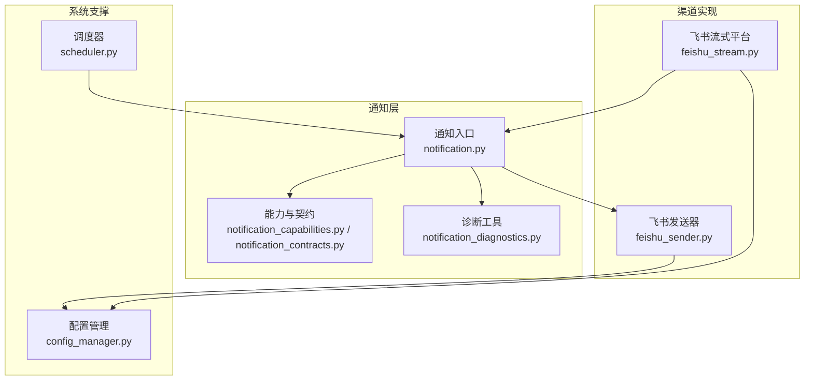
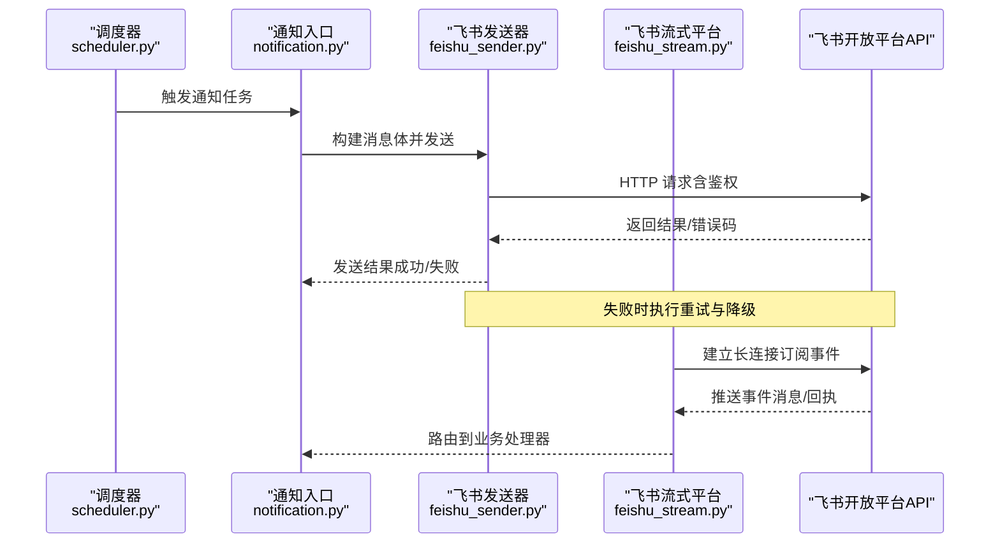
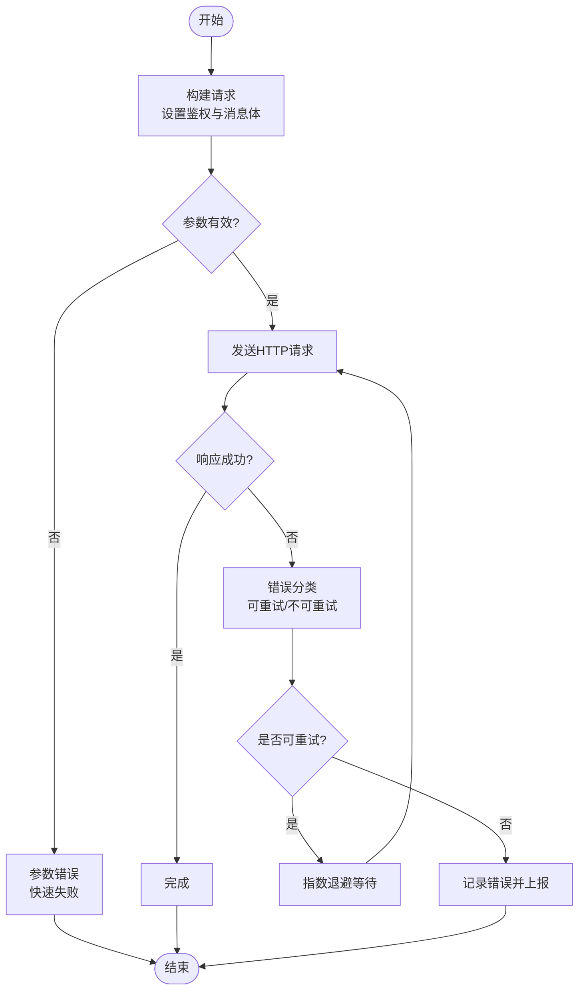
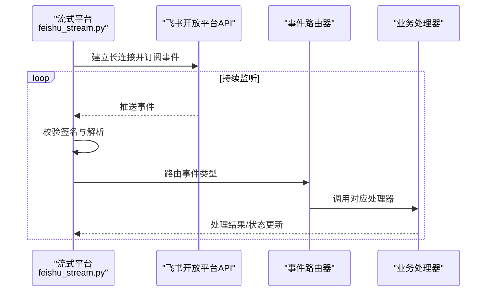
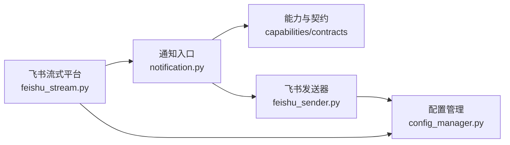

# 飞书渠道集成

<cite>
**本文档引用的文件**   
- [feishu_sender.py](file://src/notification_sender/feishu_sender.py)
- [feishu_stream.py](file://bot/platforms/feishu_stream.py)
- [feishu-bot-config.md](file://docs/bot/feishu-bot-config.md)
- [e2e_test_feishu_app.py](file://scripts/e2e_test_feishu_app.py)
- [test_feishu_stream.py](file://tests/test_feishu_stream.py)
- [test_feishu_stream_ordering.py](file://tests/test_feishu_stream_ordering.py)
- [notification.py](file://src/notification.py)
- [notification_capabilities.py](file://src/notification_capabilities.py)
- [notification_contracts.py](file://src/notification_contracts.py)
- [notification_diagnostics.py](file://src/services/notification_diagnostics.py)
- [config_manager.py](file://src/core/config_manager.py)
- [scheduler.py](file://src/scheduler.py)
</cite>

## 目录
1. [简介](#简介)
2. [项目结构](#项目结构)
3. [核心组件](#核心组件)
4. [架构总览](#架构总览)
5. [详细组件分析](#详细组件分析)
6. [依赖关系分析](#依赖关系分析)
7. [性能考虑](#性能考虑)
8. [故障排查指南](#故障排查指南)
9. [结论](#结论)
10. [附录](#附录)

## 简介
本文件面向需要在系统中接入“飞书”作为通知与机器人交互渠道的读者，提供从应用创建、权限配置到消息发送、事件处理、错误重试与部署配置的完整说明。文档覆盖：
- 飞书应用的创建与权限配置（Bot Token、IM 权限）
- IM 消息发送接口与消息类型（文本、富文本、卡片等）
- 流式事件处理（长连接接收事件）
- 消息状态回调与错误重试机制
- 应用部署配置与常见问题解决方案

## 项目结构
与飞书渠道相关的代码主要分布在以下位置：
- 通知发送器：src/notification_sender/feishu_sender.py
- 飞书平台适配（流式事件）：bot/platforms/feishu_stream.py
- 飞书配置文档：docs/bot/feishu-bot-config.md
- 端到端测试脚本：scripts/e2e_test_feishu_app.py
- 单元测试：tests/test_feishu_stream.py、tests/test_feishu_stream_ordering.py
- 通知能力与契约：src/notification_capabilities.py、src/notification_contracts.py、src/notification.py
- 诊断工具：src/services/notification_diagnostics.py
- 配置管理：src/core/config_manager.py
- 调度器：src/scheduler.py

图表来源
- [feishu_sender.py](file://src/notification_sender/feishu_sender.py)
- [feishu_stream.py](file://bot/platforms/feishu_stream.py)
- [notification.py](file://src/notification.py)
- [notification_capabilities.py](file://src/notification_capabilities.py)
- [notification_contracts.py](file://src/notification_contracts.py)
- [notification_diagnostics.py](file://src/services/notification_diagnostics.py)
- [config_manager.py](file://src/core/config_manager.py)
- [scheduler.py](file://src/scheduler.py)

章节来源
- [feishu_sender.py](file://src/notification_sender/feishu_sender.py)
- [feishu_stream.py](file://bot/platforms/feishu_stream.py)
- [feishu-bot-config.md](file://docs/bot/feishu-bot-config.md)
- [notification.py](file://src/notification.py)
- [notification_capabilities.py](file://src/notification_capabilities.py)
- [notification_contracts.py](file://src/notification_contracts.py)
- [notification_diagnostics.py](file://src/services/notification_diagnostics.py)
- [config_manager.py](file://src/core/config_manager.py)
- [scheduler.py](file://src/scheduler.py)

## 核心组件
- 飞书发送器（feishu_sender.py）
  - 负责调用飞书 IM API 发送消息，支持多种消息体类型（文本、富文本、卡片等）。
  - 封装鉴权（Bot Token）、请求重试、错误码映射与日志记录。
- 飞书流式平台（feishu_stream.py）
  - 建立与飞书的长连接，订阅并处理事件（如消息回调、状态回执等）。
  - 维护事件路由、去重与顺序性保障，触发上层业务处理。
- 通知能力与契约（notification_capabilities.py、notification_contracts.py）
  - 定义统一的通知接口与数据结构，屏蔽不同渠道差异。
- 通知入口（notification.py）
  - 聚合各渠道发送逻辑，按策略路由到具体实现。
- 诊断工具（notification_diagnostics.py）
  - 提供健康检查、连通性测试与问题定位辅助。
- 配置管理（config_manager.py）
  - 加载与校验飞书相关环境变量与配置项。
- 调度器（scheduler.py）
  - 定时任务驱动通知流程（如每日报告推送），在需要时触发飞书发送。

章节来源
- [feishu_sender.py](file://src/notification_sender/feishu_sender.py)
- [feishu_stream.py](file://bot/platforms/feishu_stream.py)
- [notification_capabilities.py](file://src/notification_capabilities.py)
- [notification_contracts.py](file://src/notification_contracts.py)
- [notification.py](file://src/notification.py)
- [notification_diagnostics.py](file://src/services/notification_diagnostics.py)
- [config_manager.py](file://src/core/config_manager.py)
- [scheduler.py](file://src/scheduler.py)

## 架构总览
下图展示了从调度器触发通知，到飞书发送器或流式事件处理的整体流程。

图表来源
- [scheduler.py](file://src/scheduler.py)
- [notification.py](file://src/notification.py)
- [feishu_sender.py](file://src/notification_sender/feishu_sender.py)
- [feishu_stream.py](file://bot/platforms/feishu_stream.py)

## 详细组件分析

### 飞书发送器（feishu_sender.py）
- 功能要点
  - 使用 Bot Token 进行鉴权，构造请求头。
  - 支持的消息类型：文本、富文本、卡片消息等，通过统一的数据结构组装。
  - 错误处理：对常见错误码进行分类，区分可重试与不可重试场景。
  - 重试机制：指数退避 + 最大重试次数，避免瞬时抖动导致失败。
  - 日志与追踪：记录关键步骤与响应码，便于排障。
- 数据模型
  - 消息体：包含 type、content/card 等字段，遵循飞书 IM 规范。
  - 目标标识：支持 chat_id、user_id 等。
- 异常与边界
  - 网络超时、限流、Token 失效等场景的处理策略。
  - 空消息体、非法目标标识的校验与快速失败。

图表来源
- [feishu_sender.py](file://src/notification_sender/feishu_sender.py)

章节来源
- [feishu_sender.py](file://src/notification_sender/feishu_sender.py)

### 飞书流式平台（feishu_stream.py）
- 功能要点
  - 建立与飞书的事件长连接，订阅所需事件（如消息回调、状态回执）。
  - 事件解析与路由：将原始事件转换为内部事件对象，分发到对应处理器。
  - 顺序性与幂等：保证事件顺序处理，基于 event_id 去重。
  - 心跳与重连：检测连接健康，自动重连与断线恢复。
- 事件处理流程
  - 接收事件 -> 校验签名 -> 解析载荷 -> 路由到处理器 -> 更新状态/回调。

图表来源
- [feishu_stream.py](file://bot/platforms/feishu_stream.py)

章节来源
- [feishu_stream.py](file://bot/platforms/feishu_stream.py)

### 通知能力与契约（notification_capabilities.py、notification_contracts.py）
- 能力声明
  - 定义支持的渠道、消息类型、能力开关（如是否支持卡片、富文本）。
- 契约定义
  - 统一的消息结构、发送接口、回调与错误码约定。
- 扩展性
  - 新增渠道需实现统一接口，并在能力注册中声明。

章节来源
- [notification_capabilities.py](file://src/notification_capabilities.py)
- [notification_contracts.py](file://src/notification_contracts.py)

### 通知入口（notification.py）
- 职责
  - 根据目标渠道选择具体发送器，组装消息体，调用发送。
  - 聚合错误与重试策略，统一返回结果。
- 与飞书集成
  - 当目标为飞书时，委托 feishu_sender.py 发送；若涉及事件回调，交由 feishu_stream.py 处理。

章节来源
- [notification.py](file://src/notification.py)

### 诊断工具（notification_diagnostics.py）
- 功能
  - 连通性测试：验证飞书 Token 有效性、API 可达性。
  - 能力探测：检测当前渠道支持的消息类型。
  - 日志导出：输出关键链路日志，辅助定位问题。

章节来源
- [notification_diagnostics.py](file://src/services/notification_diagnostics.py)

### 配置管理（config_manager.py）
- 飞书相关配置项
  - Bot Token、App ID、App Secret、Webhook 地址、事件订阅 URL 等。
- 校验与默认值
  - 必填项校验、格式校验、默认值回退。

章节来源
- [config_manager.py](file://src/core/config_manager.py)

### 调度器（scheduler.py）
- 作用
  - 定时触发通知任务（如每日市场报告、告警推送）。
  - 在飞书渠道启用时，调用通知入口发送消息。

章节来源
- [scheduler.py](file://src/scheduler.py)

## 依赖关系分析
- 模块耦合
  - 通知入口依赖能力与契约，再委派给具体渠道实现（飞书发送器/流式平台）。
  - 飞书发送器依赖配置管理与网络库；流式平台依赖配置管理与事件解析。
- 外部依赖
  - 飞书开放平台 API（HTTP 与事件长连接）。
- 潜在循环依赖
  - 通过统一契约解耦，避免直接循环引用。

图表来源
- [notification.py](file://src/notification.py)
- [notification_capabilities.py](file://src/notification_capabilities.py)
- [notification_contracts.py](file://src/notification_contracts.py)
- [feishu_sender.py](file://src/notification_sender/feishu_sender.py)
- [feishu_stream.py](file://bot/platforms/feishu_stream.py)
- [config_manager.py](file://src/core/config_manager.py)

章节来源
- [notification.py](file://src/notification.py)
- [notification_capabilities.py](file://src/notification_capabilities.py)
- [notification_contracts.py](file://src/notification_contracts.py)
- [feishu_sender.py](file://src/notification_sender/feishu_sender.py)
- [feishu_stream.py](file://bot/platforms/feishu_stream.py)
- [config_manager.py](file://src/core/config_manager.py)

## 性能考虑
- 发送器优化
  - 连接复用与请求批量化（如批量发消息）。
  - 合理设置超时与重试间隔，避免雪崩。
- 流式平台优化
  - 事件解析异步化，减少阻塞。
  - 心跳周期与重连退避策略调优。
- 资源控制
  - 并发限制与队列长度上限，防止内存溢出。
- 监控与度量
  - 记录发送成功率、延迟分布、错误码占比。

[本节为通用指导，不直接分析具体文件]

## 故障排查指南
- 常见问题
  - Token 无效或过期：检查应用凭证与权限范围。
  - 权限不足：确认已开启 IM 消息发送与事件订阅权限。
  - 网络异常：检查代理、防火墙与域名解析。
  - 事件未收到：确认事件订阅 URL 可访问且签名校验通过。
- 诊断步骤
  - 使用诊断工具进行连通性与能力探测。
  - 查看发送器与流式平台的日志，定位错误码与堆栈。
  - 使用端到端测试脚本验证基础流程。
- 参考文件
  - 飞书配置文档：docs/bot/feishu-bot-config.md
  - 端到端测试：scripts/e2e_test_feishu_app.py
  - 单元测试：tests/test_feishu_stream.py、tests/test_feishu_stream_ordering.py

章节来源
- [feishu-bot-config.md](file://docs/bot/feishu-bot-config.md)
- [e2e_test_feishu_app.py](file://scripts/e2e_test_feishu_app.py)
- [test_feishu_stream.py](file://tests/test_feishu_stream.py)
- [test_feishu_stream_ordering.py](file://tests/test_feishu_stream_ordering.py)
- [notification_diagnostics.py](file://src/services/notification_diagnostics.py)

## 结论
通过统一的通道抽象与飞书专用实现，系统能够稳定地发送多种类型的飞书消息，并通过流式事件处理实现双向交互。结合完善的错误重试、诊断工具与配置管理，可在生产环境中可靠运行。建议在生产部署前完成权限校验、连通性测试与压力测试，确保服务稳定性。

[本节为总结性内容，不直接分析具体文件]

## 附录
- 应用创建与权限配置
  - 在飞书开放平台创建应用，启用机器人能力与 IM 消息权限。
  - 获取 Bot Token，配置事件订阅 URL 与回调地址。
- 消息类型支持
  - 文本、富文本、卡片消息等，依据业务需求选择合适的类型。
- 部署配置
  - 环境变量注入 Bot Token、App ID、Secret 等。
  - 启动流式服务以接收事件，确保端口与域名可达。
- 参考文档
  - docs/bot/feishu-bot-config.md

[本节为补充信息，不直接分析具体文件]