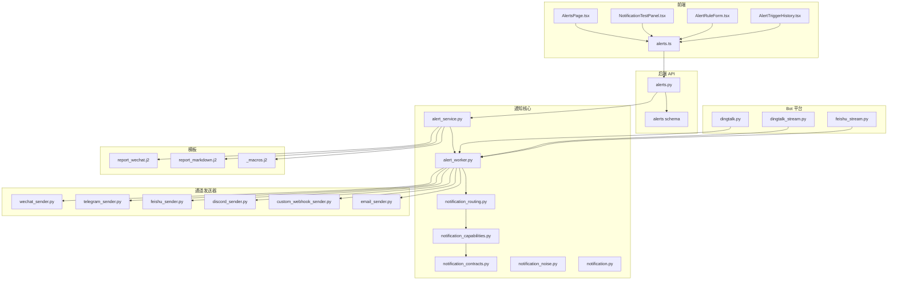
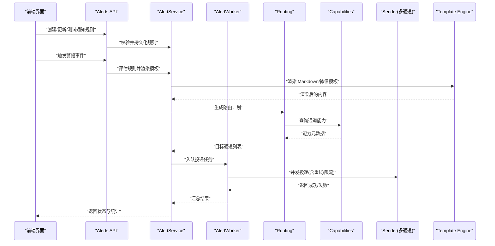
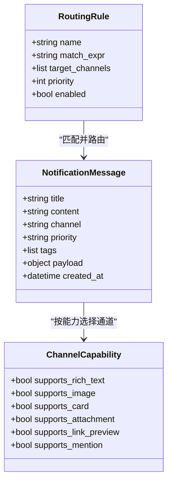
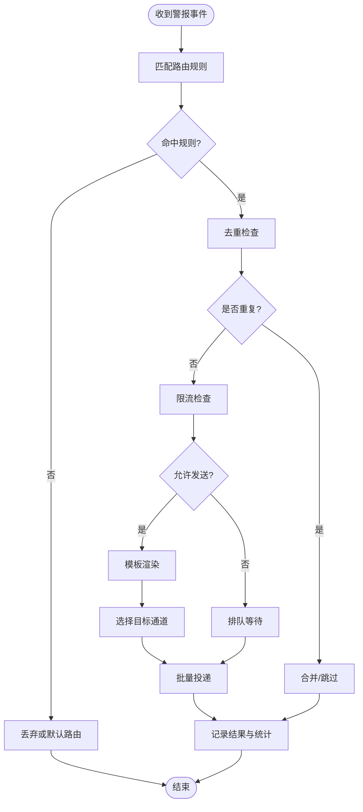
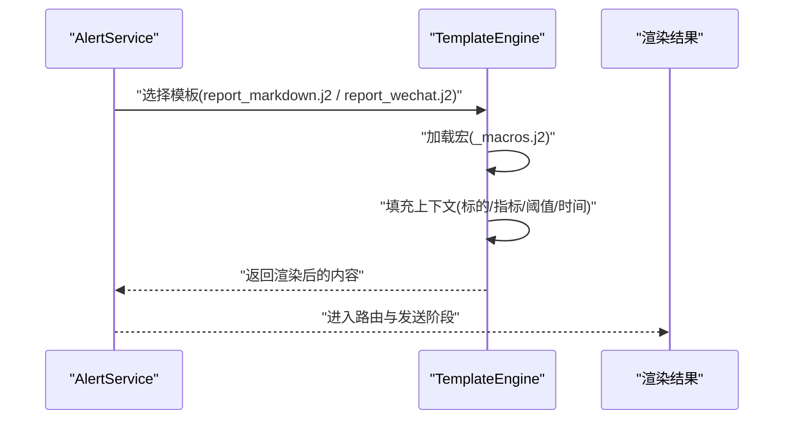
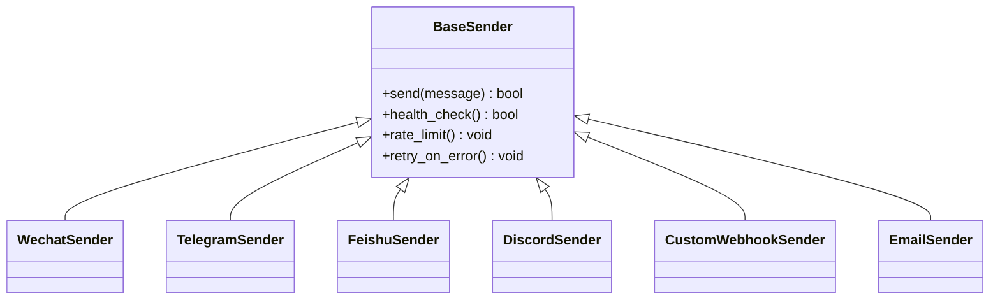
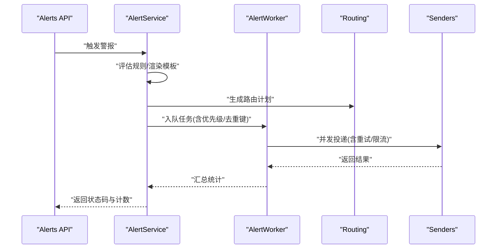
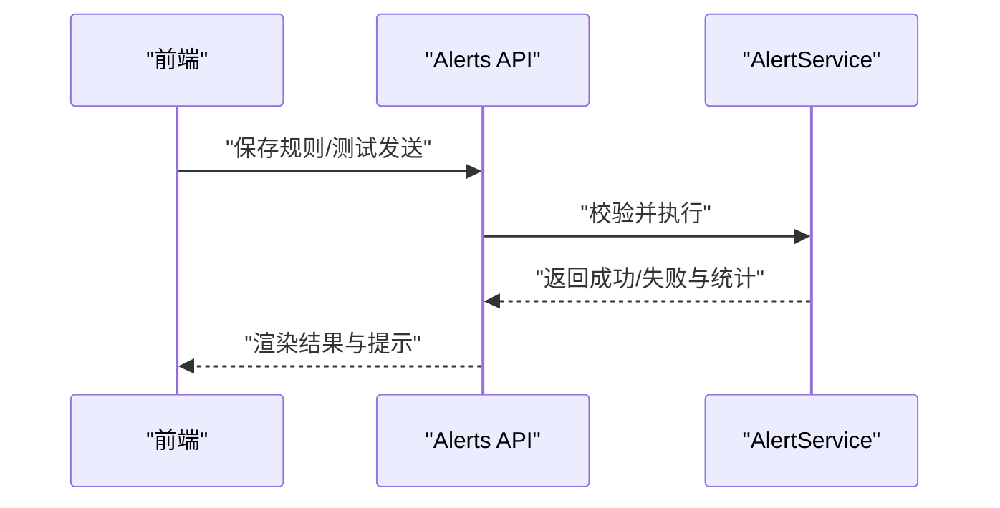
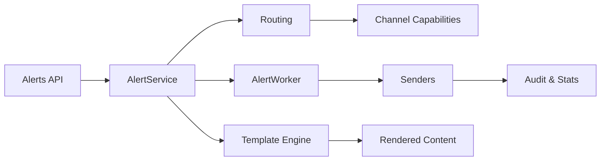

# 通知系统

<cite>
**本文档引用的文件**   
- [src/notification.py](file://src/notification.py)
- [src/notification_capabilities.py](file://src/notification_capabilities.py)
- [src/notification_contracts.py](file://src/notification_contracts.py)
- [src/notification_noise.py](file://src/notification_noise.py)
- [src/notification_routing.py](file://src/notification_routing.py)
- [src/services/alert_service.py](file://src/services/alert_service.py)
- [src/services/alert_worker.py](file://src/services/alert_worker.py)
- [src/services/notification_diagnostics.py](file://src/services/notification_diagnostics.py)
- [src/scheduler.py](file://src/scheduler.py)
- [api/v1/endpoints/alerts.py](file://api/v1/endpoints/alerts.py)
- [api/v1/schemas/alerts.py](file://api/v1/schemas/alerts.py)
- [apps/dsa-web/src/pages/AlertsPage.tsx](file://apps/dsa-web/src/pages/AlertsPage.tsx)
- [apps/dsa-web/src/components/alerts/AlertRuleForm.tsx](file://apps/dsa-web/src/components/alerts/AlertRuleForm.tsx)
- [apps/dsa-web/src/components/alerts/AlertTriggerHistory.tsx](file://apps/dsa-web/src/components/alerts/AlertTriggerHistory.tsx)
- [apps/dsa-web/src/components/settings/NotificationTestPanel.tsx](file://apps/dsa-web/src/components/settings/NotificationTestPanel.tsx)
- [apps/dsa-web/src/api/alerts.ts](file://apps/dsa-web/src/api/alerts.ts)
- [src/notification_sender/__init__.py](file://src/notification_sender/__init__.py)
- [src/notification_sender/wechat_sender.py](file://src/notification_sender/wechat_sender.py)
- [src/notification_sender/telegram_sender.py](file://src/notification_sender/telegram_sender.py)
- [src/notification_sender/feishu_sender.py](file://src/notification_sender/feishu_sender.py)
- [src/notification_sender/discord_sender.py](file://src/notification_sender/discord_sender.py)
- [src/notification_sender/custom_webhook_sender.py](file://src/notification_sender/custom_webhook_sender.py)
- [src/notification_sender/email_sender.py](file://src/notification_sender/email_sender.py)
- [templates/report_wechat.j2](file://templates/report_wechat.j2)
- [templates/report_markdown.j2](file://templates/report_markdown.j2)
- [templates/_macros.j2](file://templates/_macros.j2)
- [bot/platforms/base.py](file://bot/platforms/base.py)
- [bot/platforms/dingtalk.py](file://bot/platforms/dingtalk.py)
- [bot/platforms/dingtalk_stream.py](file://bot/platforms/dingtalk_stream.py)
- [bot/platforms/feishu_stream.py](file://bot/platforms/feishu_stream.py)
- [scripts/generate_notification_actions_env_table.py](file://scripts/generate_notification_actions_env_table.py)
</cite>

## 目录
1. [简介](#简介)
2. [项目结构](#项目结构)
3. [核心组件](#核心组件)
4. [架构总览](#架构总览)
5. [详细组件分析](#详细组件分析)
6. [依赖关系分析](#依赖关系分析)
7. [性能考量](#性能考量)
8. [故障排查指南](#故障排查指南)
9. [结论](#结论)
10. [附录](#附录)

## 简介
本文件面向“多渠道通知推送”子系统，覆盖以下目标：
- 多渠道通知平台集成（微信、钉钉、飞书、Telegram、Discord、邮件、Webhook 等）
- 通知模板系统与渲染机制
- 消息路由规则与优先级管理
- 警报触发条件、去重机制与批量发送优化
- 新渠道接入指南、模板定制与监控告警配置
- 通知效果统计与调试工具使用说明

该子系统由后端服务（API、调度器、工作进程）、通知路由与能力层、多通道发送器、前端配置与测试面板共同组成，形成从“事件产生—规则匹配—模板渲染—路由分发—通道投递—结果回写”的完整闭环。

## 项目结构
通知相关代码主要分布在以下模块：
- 路由与能力层：src/notification_routing.py、src/notification_capabilities.py、src/notification_contracts.py、src/notification_noise.py、src/notification.py
- 服务与工作流：src/services/alert_service.py、src/services/alert_worker.py、src/services/notification_diagnostics.py、src/scheduler.py
- API 与前端：api/v1/endpoints/alerts.py、api/v1/schemas/alerts.py、apps/dsa-web/src/pages/AlertsPage.tsx、apps/dsa-web/src/components/alerts/*、apps/dsa-web/src/components/settings/NotificationTestPanel.tsx、apps/dsa-web/src/api/alerts.ts
- 通道发送器：src/notification_sender/*
- 模板引擎：templates/*.j2
- Bot 平台适配（钉钉、飞书等）：bot/platforms/*
- 辅助脚本：scripts/generate_notification_actions_env_table.py

图表来源
- [api/v1/endpoints/alerts.py](file://api/v1/endpoints/alerts.py)
- [src/services/alert_service.py](file://src/services/alert_service.py)
- [src/services/alert_worker.py](file://src/services/alert_worker.py)
- [src/notification_routing.py](file://src/notification_routing.py)
- [src/notification_capabilities.py](file://src/notification_capabilities.py)
- [src/notification_contracts.py](file://src/notification_contracts.py)
- [src/notification_noise.py](file://src/notification_noise.py)
- [src/notification.py](file://src/notification.py)
- [src/notification_sender/wechat_sender.py](file://src/notification_sender/wechat_sender.py)
- [src/notification_sender/telegram_sender.py](file://src/notification_sender/telegram_sender.py)
- [src/notification_sender/feishu_sender.py](file://src/notification_sender/feishu_sender.py)
- [src/notification_sender/discord_sender.py](file://src/notification_sender/discord_sender.py)
- [src/notification_sender/custom_webhook_sender.py](file://src/notification_sender/custom_webhook_sender.py)
- [src/notification_sender/email_sender.py](file://src/notification_sender/email_sender.py)
- [templates/report_wechat.j2](file://templates/report_wechat.j2)
- [templates/report_markdown.j2](file://templates/report_markdown.j2)
- [templates/_macros.j2](file://templates/_macros.j2)
- [bot/platforms/dingtalk.py](file://bot/platforms/dingtalk.py)
- [bot/platforms/dingtalk_stream.py](file://bot/platforms/dingtalk_stream.py)
- [bot/platforms/feishu_stream.py](file://bot/platforms/feishu_stream.py)

章节来源
- [api/v1/endpoints/alerts.py](file://api/v1/endpoints/alerts.py)
- [src/services/alert_service.py](file://src/services/alert_service.py)
- [src/services/alert_worker.py](file://src/services/alert_worker.py)
- [src/notification_routing.py](file://src/notification_routing.py)
- [src/notification_capabilities.py](file://src/notification_capabilities.py)
- [src/notification_contracts.py](file://src/notification_contracts.py)
- [src/notification_noise.py](file://src/notification_noise.py)
- [src/notification.py](file://src/notification.py)
- [src/notification_sender/__init__.py](file://src/notification_sender/__init__.py)
- [templates/report_wechat.j2](file://templates/report_wechat.j2)
- [templates/report_markdown.j2](file://templates/report_markdown.j2)
- [templates/_macros.j2](file://templates/_macros.j2)
- [bot/platforms/base.py](file://bot/platforms/base.py)
- [bot/platforms/dingtalk.py](file://bot/platforms/dingtalk.py)
- [bot/platforms/dingtalk_stream.py](file://bot/platforms/dingtalk_stream.py)
- [bot/platforms/feishu_stream.py](file://bot/platforms/feishu_stream.py)

## 核心组件
- 通知契约与能力
  - 统一消息契约定义与能力枚举，确保各通道对字段语义一致。
  - 能力层提供“是否支持富文本/图片/卡片/附件/链接预览”等元数据，便于前端展示与路由决策。
- 路由与降噪
  - 路由层根据规则（标签、级别、受众、时间窗口）将消息定向到指定通道或群组。
  - 降噪层实现去重、合并、限流与静默策略，避免风暴式通知。
- 服务与工作流
  - 警报服务负责规则评估、模板渲染、路由选择与任务入队。
  - 工作进程负责并发投递、重试、失败回退与结果上报。
- 通道发送器
  - 每个通道一个发送器，封装鉴权、请求构造、错误处理与速率限制。
- 模板系统
  - 基于 Jinja2 的多格式模板（Markdown、微信专用等），支持宏与变量注入。
- 前端与 API
  - 前端提供规则编辑、历史查看与测试面板；后端暴露 REST API 进行 CRUD 与测试。

章节来源
- [src/notification_contracts.py](file://src/notification_contracts.py)
- [src/notification_capabilities.py](file://src/notification_capabilities.py)
- [src/notification_routing.py](file://src/notification_routing.py)
- [src/notification_noise.py](file://src/notification_noise.py)
- [src/services/alert_service.py](file://src/services/alert_service.py)
- [src/services/alert_worker.py](file://src/services/alert_worker.py)
- [src/notification.py](file://src/notification.py)
- [src/notification_sender/__init__.py](file://src/notification_sender/__init__.py)
- [templates/report_wechat.j2](file://templates/report_wechat.j2)
- [templates/report_markdown.j2](file://templates/report_markdown.j2)
- [templates/_macros.j2](file://templates/_macros.j2)
- [api/v1/endpoints/alerts.py](file://api/v1/endpoints/alerts.py)
- [apps/dsa-web/src/pages/AlertsPage.tsx](file://apps/dsa-web/src/pages/AlertsPage.tsx)
- [apps/dsa-web/src/components/alerts/AlertRuleForm.tsx](file://apps/dsa-web/src/components/alerts/AlertRuleForm.tsx)
- [apps/dsa-web/src/components/alerts/AlertTriggerHistory.tsx](file://apps/dsa-web/src/components/alerts/AlertTriggerHistory.tsx)
- [apps/dsa-web/src/components/settings/NotificationTestPanel.tsx](file://apps/dsa-web/src/components/settings/NotificationTestPanel.tsx)
- [apps/dsa-web/src/api/alerts.ts](file://apps/dsa-web/src/api/alerts.ts)

## 架构总览
通知系统采用“服务编排 + 工作队列 + 通道插件化”的架构：
- 入口：API 接收警报创建/更新/删除与测试请求
- 编排：警报服务解析规则、渲染模板、生成路由计划
- 执行：工作进程按优先级与并发度投递至各通道发送器
- 反馈：投递结果写入审计日志与统计指标，供前端与诊断工具使用

图表来源
- [api/v1/endpoints/alerts.py](file://api/v1/endpoints/alerts.py)
- [src/services/alert_service.py](file://src/services/alert_service.py)
- [src/services/alert_worker.py](file://src/services/alert_worker.py)
- [src/notification_routing.py](file://src/notification_routing.py)
- [src/notification_capabilities.py](file://src/notification_capabilities.py)
- [src/notification.py](file://src/notification.py)
- [templates/report_wechat.j2](file://templates/report_wechat.j2)
- [templates/report_markdown.j2](file://templates/report_markdown.j2)

## 详细组件分析

### 通知契约与能力模型
- 契约层定义消息体字段（标题、正文、图片、卡片、链接、优先级、标签、受众等），保证跨通道一致性。
- 能力层声明各通道支持的特性（富文本、图片、卡片、附件、链接预览、@提醒等），用于前端展示与路由决策。
- 通过能力矩阵，路由层可自动选择最合适的通道组合（如优先走有卡片能力的通道）。

图表来源
- [src/notification_contracts.py](file://src/notification_contracts.py)
- [src/notification_capabilities.py](file://src/notification_capabilities.py)
- [src/notification_routing.py](file://src/notification_routing.py)

章节来源
- [src/notification_contracts.py](file://src/notification_contracts.py)
- [src/notification_capabilities.py](file://src/notification_capabilities.py)
- [src/notification_routing.py](file://src/notification_routing.py)

### 路由与降噪
- 路由规则支持表达式匹配（标签、级别、受众、时间窗口），命中后生成目标通道列表。
- 降噪策略包括：
  - 去重：相同键值（如标的+指标+时间窗口）在窗口内只发一次
  - 合并：同一批次相似消息聚合为一条摘要
  - 限流：通道级/全局级速率控制，避免触发平台限制
  - 静默：维护静默时段与白名单，减少打扰

图表来源
- [src/notification_routing.py](file://src/notification_routing.py)
- [src/notification_noise.py](file://src/notification_noise.py)
- [src/services/alert_service.py](file://src/services/alert_service.py)

章节来源
- [src/notification_routing.py](file://src/notification_routing.py)
- [src/notification_noise.py](file://src/notification_noise.py)
- [src/services/alert_service.py](file://src/services/alert_service.py)

### 模板系统
- 模板语言：Jinja2，支持宏、循环、条件与格式化函数。
- 内置模板：
  - report_markdown.j2：通用 Markdown 报告
  - report_wechat.j2：微信专用富文本/卡片
  - _macros.j2：公共宏（日期、数值、链接等）
- 渲染流程：服务层准备上下文（标的、指标、阈值、时间、策略等）→ 选择模板 → 渲染 → 输出结构化内容（Markdown/HTML/富文本）

图表来源
- [templates/report_markdown.j2](file://templates/report_markdown.j2)
- [templates/report_wechat.j2](file://templates/report_wechat.j2)
- [templates/_macros.j2](file://templates/_macros.j2)
- [src/services/alert_service.py](file://src/services/alert_service.py)

章节来源
- [templates/report_markdown.j2](file://templates/report_markdown.j2)
- [templates/report_wechat.j2](file://templates/report_wechat.j2)
- [templates/_macros.j2](file://templates/_macros.j2)
- [src/services/alert_service.py](file://src/services/alert_service.py)

### 通道发送器与平台集成
- 已实现通道：
  - 微信：wechat_sender.py
  - Telegram：telegram_sender.py
  - 飞书：feishu_sender.py
  - Discord：discord_sender.py
  - 自定义 Webhook：custom_webhook_sender.py
  - 邮件：email_sender.py
- Bot 平台适配（钉钉、飞书）：
  - dingtalk.py、dingtalk_stream.py、feishu_stream.py 提供与 Bot 框架的对接能力
- 发送器职责：
  - 鉴权与签名
  - 请求构造（JSON/表单/富文本）
  - 错误处理与重试
  - 速率限制与退避
  - 结果回调与审计

图表来源
- [src/notification_sender/__init__.py](file://src/notification_sender/__init__.py)
- [src/notification_sender/wechat_sender.py](file://src/notification_sender/wechat_sender.py)
- [src/notification_sender/telegram_sender.py](file://src/notification_sender/telegram_sender.py)
- [src/notification_sender/feishu_sender.py](file://src/notification_sender/feishu_sender.py)
- [src/notification_sender/discord_sender.py](file://src/notification_sender/discord_sender.py)
- [src/notification_sender/custom_webhook_sender.py](file://src/notification_sender/custom_webhook_sender.py)
- [src/notification_sender/email_sender.py](file://src/notification_sender/email_sender.py)
- [bot/platforms/dingtalk.py](file://bot/platforms/dingtalk.py)
- [bot/platforms/dingtalk_stream.py](file://bot/platforms/dingtalk_stream.py)
- [bot/platforms/feishu_stream.py](file://bot/platforms/feishu_stream.py)

章节来源
- [src/notification_sender/__init__.py](file://src/notification_sender/__init__.py)
- [src/notification_sender/wechat_sender.py](file://src/notification_sender/wechat_sender.py)
- [src/notification_sender/telegram_sender.py](file://src/notification_sender/telegram_sender.py)
- [src/notification_sender/feishu_sender.py](file://src/notification_sender/feishu_sender.py)
- [src/notification_sender/discord_sender.py](file://src/notification_sender/discord_sender.py)
- [src/notification_sender/custom_webhook_sender.py](file://src/notification_sender/custom_webhook_sender.py)
- [src/notification_sender/email_sender.py](file://src/notification_sender/email_sender.py)
- [bot/platforms/base.py](file://bot/platforms/base.py)
- [bot/platforms/dingtalk.py](file://bot/platforms/dingtalk.py)
- [bot/platforms/dingtalk_stream.py](file://bot/platforms/dingtalk_stream.py)
- [bot/platforms/feishu_stream.py](file://bot/platforms/feishu_stream.py)

### 警报服务与工作进程
- 警报服务：
  - 规则评估：读取用户配置的规则，计算触发条件（阈值、区间、趋势、组合逻辑）
  - 模板渲染：根据规则类型选择模板并填充上下文
  - 路由计划：结合能力与规则生成目标通道列表
  - 任务入队：将投递任务交给工作进程
- 工作进程：
  - 并发投递：按通道并行发送，支持批量合并
  - 重试与退避：指数退避与最大重试次数
  - 失败回退：降级到其他通道或缓存待重试
  - 结果上报：写入审计日志与统计指标

图表来源
- [src/services/alert_service.py](file://src/services/alert_service.py)
- [src/services/alert_worker.py](file://src/services/alert_worker.py)
- [src/notification_routing.py](file://src/notification_routing.py)
- [src/notification_noise.py](file://src/notification_noise.py)

章节来源
- [src/services/alert_service.py](file://src/services/alert_service.py)
- [src/services/alert_worker.py](file://src/services/alert_worker.py)
- [src/notification_routing.py](file://src/notification_routing.py)
- [src/notification_noise.py](file://src/notification_noise.py)

### 前端与 API
- API：
  - 规则 CRUD、测试发送、历史查询、统计指标
- 前端：
  - AlertsPage：规则列表与操作
  - AlertRuleForm：规则编辑表单（条件、阈值、通道、模板、优先级）
  - AlertTriggerHistory：触发历史与详情
  - NotificationTestPanel：通道连通性测试与样例发送
  - alerts.ts：API 调用封装

图表来源
- [api/v1/endpoints/alerts.py](file://api/v1/endpoints/alerts.py)
- [api/v1/schemas/alerts.py](file://api/v1/schemas/alerts.py)
- [apps/dsa-web/src/pages/AlertsPage.tsx](file://apps/dsa-web/src/pages/AlertsPage.tsx)
- [apps/dsa-web/src/components/alerts/AlertRuleForm.tsx](file://apps/dsa-web/src/components/alerts/AlertRuleForm.tsx)
- [apps/dsa-web/src/components/alerts/AlertTriggerHistory.tsx](file://apps/dsa-web/src/components/alerts/AlertTriggerHistory.tsx)
- [apps/dsa-web/src/components/settings/NotificationTestPanel.tsx](file://apps/dsa-web/src/components/settings/NotificationTestPanel.tsx)
- [apps/dsa-web/src/api/alerts.ts](file://apps/dsa-web/src/api/alerts.ts)

章节来源
- [api/v1/endpoints/alerts.py](file://api/v1/endpoints/alerts.py)
- [api/v1/schemas/alerts.py](file://api/v1/schemas/alerts.py)
- [apps/dsa-web/src/pages/AlertsPage.tsx](file://apps/dsa-web/src/pages/AlertsPage.tsx)
- [apps/dsa-web/src/components/alerts/AlertRuleForm.tsx](file://apps/dsa-web/src/components/alerts/AlertRuleForm.tsx)
- [apps/dsa-web/src/components/alerts/AlertTriggerHistory.tsx](file://apps/dsa-web/src/components/alerts/AlertTriggerHistory.tsx)
- [apps/dsa-web/src/components/settings/NotificationTestPanel.tsx](file://apps/dsa-web/src/components/settings/NotificationTestPanel.tsx)
- [apps/dsa-web/src/api/alerts.ts](file://apps/dsa-web/src/api/alerts.ts)

### 调度与触发
- 调度器负责周期性任务（如市场复盘、指标刷新、警报扫描）与事件驱动触发。
- 警报触发可由定时任务或外部事件（API、消息总线）驱动，统一进入警报服务评估。

章节来源
- [src/scheduler.py](file://src/scheduler.py)
- [src/services/alert_service.py](file://src/services/alert_service.py)

## 依赖关系分析
- 低耦合设计：
  - 通道发送器通过统一接口解耦，新增通道只需实现发送器并注册
  - 路由与降噪独立于具体通道，便于扩展规则与策略
- 关键依赖链：
  - API → 警报服务 → 路由 → 发送器
  - 模板引擎 → 渲染结果 → 路由选择
  - 工作进程 → 并发投递 → 统计与审计

图表来源
- [api/v1/endpoints/alerts.py](file://api/v1/endpoints/alerts.py)
- [src/services/alert_service.py](file://src/services/alert_service.py)
- [src/notification_routing.py](file://src/notification_routing.py)
- [src/notification_capabilities.py](file://src/notification_capabilities.py)
- [src/services/alert_worker.py](file://src/services/alert_worker.py)
- [src/notification.py](file://src/notification.py)

章节来源
- [api/v1/endpoints/alerts.py](file://api/v1/endpoints/alerts.py)
- [src/services/alert_service.py](file://src/services/alert_service.py)
- [src/notification_routing.py](file://src/notification_routing.py)
- [src/notification_capabilities.py](file://src/notification_capabilities.py)
- [src/services/alert_worker.py](file://src/services/alert_worker.py)
- [src/notification.py](file://src/notification.py)

## 性能考量
- 并发投递：工作进程按通道并行发送，提升吞吐
- 批量合并：相似消息合并为一条，降低通道压力
- 去重与限流：避免重复与超限，保障稳定性
- 模板预编译：常用模板缓存，减少渲染开销
- 异步处理：API 快速返回，后台异步投递与重试
- 资源隔离：通道级限流与超时，防止单通道拖垮整体

[本节为通用指导，不直接分析具体文件]

## 故障排查指南
- 诊断工具：
  - notification_diagnostics.py：通道连通性检测、配置校验、延迟与成功率统计
- 常见问题：
  - 通道鉴权失败：检查密钥、签名、域名白名单
  - 限流/配额不足：调整频率、分批发送、升级配额
  - 模板渲染异常：检查变量缺失、语法错误、宏引用
  - 路由未命中：检查规则表达式、标签与受众匹配
  - 去重误伤：检查去重键粒度与时间窗口设置
- 调试建议：
  - 启用详细日志，观察路由与发送链路
  - 使用前端“测试面板”发送样例消息
  - 查看触发历史与统计指标定位问题

章节来源
- [src/services/notification_diagnostics.py](file://src/services/notification_diagnostics.py)
- [apps/dsa-web/src/components/settings/NotificationTestPanel.tsx](file://apps/dsa-web/src/components/settings/NotificationTestPanel.tsx)
- [apps/dsa-web/src/components/alerts/AlertTriggerHistory.tsx](file://apps/dsa-web/src/components/alerts/AlertTriggerHistory.tsx)

## 结论
通知系统通过“契约+能力+路由+降噪+模板+通道插件化”的设计，实现了高内聚、低耦合、可扩展的多渠道推送能力。配合前端配置与诊断工具，能够快速落地复杂场景下的警报通知需求，并提供良好的可观测性与可维护性。

[本节为总结，不直接分析具体文件]

## 附录

### 新通知渠道接入指南
- 步骤概览：
  - 新建发送器类，继承基础发送器，实现 send、健康检查、限流与重试
  - 在发送器注册表中注册新通道
  - 在能力层声明新通道支持的特性
  - 在前端与路由中增加新通道选项
  - 编写模板片段（如需富文本/卡片）
  - 使用测试面板验证连通性与样式
- 参考实现：
  - wechat_sender.py、telegram_sender.py、feishu_sender.py、discord_sender.py、custom_webhook_sender.py、email_sender.py

章节来源
- [src/notification_sender/__init__.py](file://src/notification_sender/__init__.py)
- [src/notification_sender/wechat_sender.py](file://src/notification_sender/wechat_sender.py)
- [src/notification_sender/telegram_sender.py](file://src/notification_sender/telegram_sender.py)
- [src/notification_sender/feishu_sender.py](file://src/notification_sender/feishu_sender.py)
- [src/notification_sender/discord_sender.py](file://src/notification_sender/discord_sender.py)
- [src/notification_sender/custom_webhook_sender.py](file://src/notification_sender/custom_webhook_sender.py)
- [src/notification_sender/email_sender.py](file://src/notification_sender/email_sender.py)
- [src/notification_capabilities.py](file://src/notification_capabilities.py)
- [apps/dsa-web/src/components/settings/NotificationTestPanel.tsx](file://apps/dsa-web/src/components/settings/NotificationTestPanel.tsx)

### 模板定制与变量说明
- 模板位置：templates/*.j2
- 常用变量：标的、指标、阈值、时间、策略、链接、图片等
- 宏与格式化：_macros.j2 提供日期、数值、链接等复用逻辑
- 定制建议：
  - 保持字段语义稳定，避免破坏契约
  - 针对通道特性选择合适模板（Markdown/微信富文本）
  - 使用条件与循环增强可读性

章节来源
- [templates/report_markdown.j2](file://templates/report_markdown.j2)
- [templates/report_wechat.j2](file://templates/report_wechat.j2)
- [templates/_macros.j2](file://templates/_macros.j2)
- [src/services/alert_service.py](file://src/services/alert_service.py)

### 监控告警配置
- 指标采集：发送成功率、延迟、失败原因、限流次数、去重率
- 告警阈值：失败率突增、延迟超标、通道不可用
- 可视化：前端统计面板与后端日志聚合
- 建议：
  - 为关键通道设置独立告警
  - 结合业务指标（如交易信号）设置分级告警

章节来源
- [src/services/notification_diagnostics.py](file://src/services/notification_diagnostics.py)
- [apps/dsa-web/src/components/settings/NotificationTestPanel.tsx](file://apps/dsa-web/src/components/settings/NotificationTestPanel.tsx)

### 通知效果统计与调试工具
- 统计维度：通道、规则、时间窗口、成功率、延迟、去重与合并比例
- 调试工具：
  - 前端测试面板：快速验证通道与模板
  - 触发历史：查看每条消息的详情与状态
  - 诊断脚本：自动化检测配置与连通性

章节来源
- [apps/dsa-web/src/components/settings/NotificationTestPanel.tsx](file://apps/dsa-web/src/components/settings/NotificationTestPanel.tsx)
- [apps/dsa-web/src/components/alerts/AlertTriggerHistory.tsx](file://apps/dsa-web/src/components/alerts/AlertTriggerHistory.tsx)
- [src/services/notification_diagnostics.py](file://src/services/notification_diagnostics.py)

### 环境变量与动作表生成
- 脚本用途：生成通知动作与环境变量的对照表，便于配置与文档化
- 使用方式：运行脚本生成表格，纳入部署与运维文档

章节来源
- [scripts/generate_notification_actions_env_table.py](file://scripts/generate_notification_actions_env_table.py)