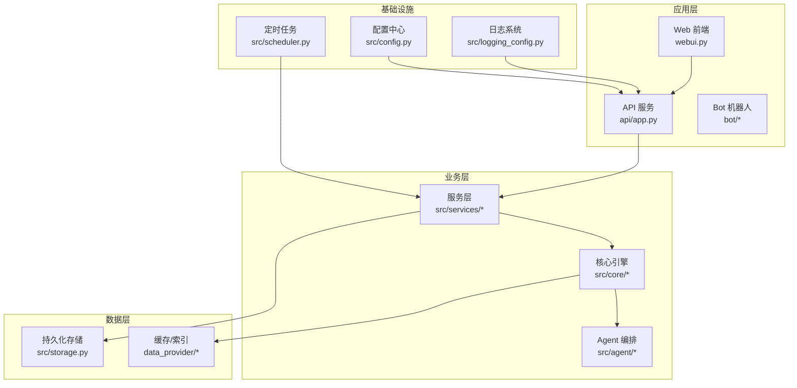
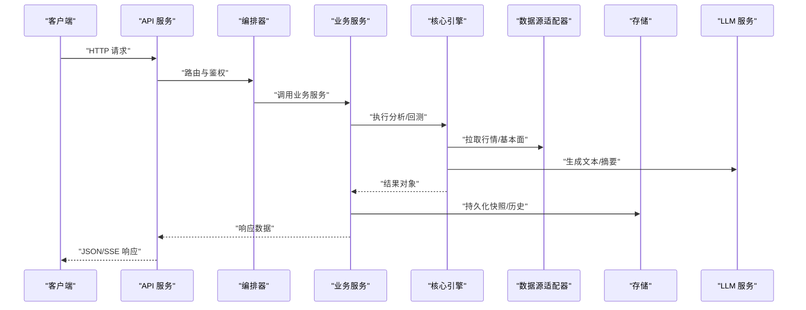
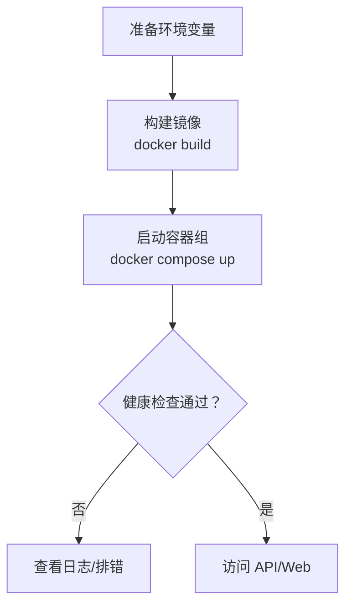
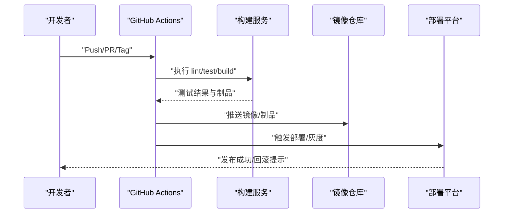
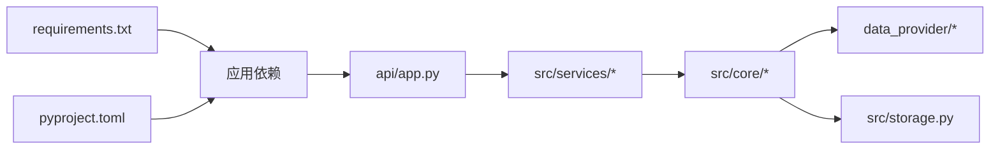

# 部署指南

<cite>
**本文引用的文件**   
- [main.py](file://main.py)
- [server.py](file://server.py)
- [api/app.py](file://api/app.py)
- [docker/Dockerfile](file://docker/Dockerfile)
- [docker/docker-compose.yml](file://docker/docker-compose.yml)
- [docker/entrypoint.sh](file://docker/entrypoint.sh)
- [.github/workflows/ci.yml](file://.github/workflows/ci.yml)
- [.github/workflows/release.yml](file://.github/workflows/release.yml)
- [scripts/test.sh](file://scripts/test.sh)
- [scripts/ci_gate.sh](file://scripts/ci_gate.sh)
- [pyproject.toml](file://pyproject.toml)
- [requirements.txt](file://requirements.txt)
- [src/config.py](file://src/config.py)
- [src/logging_config.py](file://src/logging_config.py)
- [src/scheduler.py](file://src/scheduler.py)
- [src/storage.py](file://src/storage.py)
- [webui.py](file://webui.py)
</cite>

## 目录
1. [简介](#简介)
2. [项目结构](#项目结构)
3. [核心组件](#核心组件)
4. [架构总览](#架构总览)
5. [详细组件分析](#详细组件分析)
6. [依赖关系分析](#依赖关系分析)
7. [性能考虑](#性能考虑)
8. [故障排查指南](#故障排查指南)
9. [结论](#结论)
10. [附录](#附录)

## 简介
本指南面向生产环境，提供该股票分析系统的全面部署方案与最佳实践。内容涵盖：
- Docker 容器化部署
- Kubernetes 集群部署
- 传统服务器部署
- CI/CD 流水线、自动化测试与发布流程
- 负载均衡、数据库备份、日志收集与监控告警
- 性能调优、安全加固与故障恢复
- 不同云平台的适配要点

## 项目结构
系统由后端 API、Web 前端、桌面端、Bot 机器人、数据源适配器、任务调度与存储等模块组成。关键入口与部署相关文件如下：
- 后端服务入口：main.py、server.py、api/app.py
- Web 前端入口：webui.py
- 容器化：docker/Dockerfile、docker/docker-compose.yml、docker/entrypoint.sh
- CI/CD：.github/workflows/ci.yml、.github/workflows/release.yml
- 构建与脚本：scripts/test.sh、scripts/ci_gate.sh
- 配置与运行时：src/config.py、src/logging_config.py、src/scheduler.py、src/storage.py
- 依赖管理：pyproject.toml、requirements.txt

**图表来源** 
- [webui.py](file://webui.py)
- [api/app.py](file://api/app.py)
- [src/scheduler.py](file://src/scheduler.py)
- [src/storage.py](file://src/storage.py)
- [src/logging_config.py](file://src/logging_config.py)
- [src/config.py](file://src/config.py)

**章节来源**
- [main.py](file://main.py)
- [server.py](file://server.py)
- [api/app.py](file://api/app.py)
- [webui.py](file://webui.py)

## 核心组件
- API 服务：基于 FastAPI（或同类框架）的 REST/SSE 接口，承载分析、回测、策略、通知等能力。
- Web 前端：静态资源 + 轻量服务，用于控制台与可视化。
- Agent 与核心引擎：负责市场上下文构建、策略路由、信号提取与报告渲染。
- 数据源适配器：多源行情与基本面数据获取。
- 任务调度：定时任务驱动每日市场分析、指标刷新与通知。
- 存储：结构化数据与快照持久化。
- 配置与日志：集中式配置与统一日志输出。

**章节来源**
- [api/app.py](file://api/app.py)
- [src/config.py](file://src/config.py)
- [src/logging_config.py](file://src/logging_config.py)
- [src/scheduler.py](file://src/scheduler.py)
- [src/storage.py](file://src/storage.py)

## 架构总览
下图展示从请求到数据处理与返回的关键路径，以及外部依赖（LLM、数据源、消息通道）。

**图表来源** 
- [api/app.py](file://api/app.py)
- [src/scheduler.py](file://src/scheduler.py)
- [src/storage.py](file://src/storage.py)

## 详细组件分析

### 容器化部署（Docker）
- 镜像构建：使用 docker/Dockerfile 定义运行环境与依赖安装。
- 启动脚本：docker/entrypoint.sh 负责环境变量注入、健康检查与进程管理。
- 编排：docker/docker-compose.yml 定义 API、Web、依赖服务（如数据库、缓存）及网络卷挂载。

建议步骤：
1. 准备 .env 或环境变量文件，包含数据库连接、LLM 密钥、端口映射等。
2. 构建镜像并启动服务，确认健康检查通过。
3. 将日志与数据目录挂载到宿主机，便于备份与观测。

**图表来源** 
- [docker/Dockerfile](file://docker/Dockerfile)
- [docker/docker-compose.yml](file://docker/docker-compose.yml)
- [docker/entrypoint.sh](file://docker/entrypoint.sh)

**章节来源**
- [docker/Dockerfile](file://docker/Dockerfile)
- [docker/docker-compose.yml](file://docker/docker-compose.yml)
- [docker/entrypoint.sh](file://docker/entrypoint.sh)

### Kubernetes 集群部署
- 将 API 与 Web 拆分为 Deployment/Service/Ingress。
- 使用 ConfigMap/Secret 管理配置与敏感信息。
- 使用 PersistentVolume 挂载数据目录，确保重启不丢数据。
- 设置 HPA 基于 CPU/内存或自定义指标自动扩缩容。
- 配置探针（liveness/readiness）保障健康与滚动更新。

建议清单：
- API Deployment：副本数≥2，资源限制与请求值合理设置。
- Ingress：HTTPS 终止、路径路由、限流与白名单。
- Secret：数据库密码、LLM Key、第三方 Token。
- ConfigMap：非敏感配置项（端口、开关、日志级别）。
- PVC：数据库与日志目录持久化。
- CronJob：定期备份与数据清理任务。

[本节为概念性指导，未直接分析具体代码文件]

### 传统服务器部署
- 使用 Python 虚拟环境安装依赖（requirements.txt/pyproject.toml）。
- 使用 systemd 或 supervisor 管理进程，设置开机自启。
- 使用 Nginx 作为反向代理，启用 HTTPS、Gzip、缓存与限流。
- 配置日志轮转（logrotate），定期归档与压缩。
- 使用防火墙与安全组限制入站端口。

[本节为概念性指导，未直接分析具体代码文件]

### CI/CD 流水线与发布流程
- 触发条件：push、PR、tag。
- 阶段：lint、单元测试、集成测试、构建镜像、推送镜像仓库、发布制品。
- 质量门禁：脚本 ci_gate.sh 控制分支保护与通过率。
- 发布：release.yml 自动生成版本标签与发布说明。

**图表来源** 
- [.github/workflows/ci.yml](file://.github/workflows/ci.yml)
- [.github/workflows/release.yml](file://.github/workflows/release.yml)
- [scripts/ci_gate.sh](file://scripts/ci_gate.sh)
- [scripts/test.sh](file://scripts/test.sh)

**章节来源**
- [.github/workflows/ci.yml](file://.github/workflows/ci.yml)
- [.github/workflows/release.yml](file://.github/workflows/release.yml)
- [scripts/test.sh](file://scripts/test.sh)
- [scripts/ci_gate.sh](file://scripts/ci_gate.sh)

### 负载均衡与高可用
- API 服务多副本部署，配合 Ingress/网关进行流量分发。
- 会话无状态化，用户态与会话存储于外部 Redis。
- 数据库主从复制与读写分离，连接池优化。
- 健康检查失败自动摘除与快速重试。

[本节为概念性指导，未直接分析具体代码文件]

### 数据库备份与恢复
- 全量备份：每日凌晨执行，保留周期按合规要求设定。
- 增量备份：每小时快照，支持时间点恢复。
- 异地容灾：跨可用区/跨地域同步。
- 恢复演练：定期验证备份有效性。

[本节为概念性指导，未直接分析具体代码文件]

### 日志收集与监控告警
- 统一日志格式与分级，集中采集至 ELK/Loki。
- 关键指标暴露（Prometheus），包括 QPS、延迟、错误率、资源使用。
- 告警规则：阈值+异常检测，多渠道通知（邮件、钉钉、飞书、Slack）。
- 链路追踪：对长耗时任务进行采样与记录。

[本节为概念性指导，未直接分析具体代码文件]

### 性能调优
- 并发模型：异步 I/O、线程池隔离、任务队列削峰。
- 缓存策略：热点数据缓存、多级缓存（本地+分布式）。
- 数据库优化：索引、查询优化、连接池大小与超时。
- LLM 调用：批处理、缓存、降级与熔断。

[本节为概念性指导，未直接分析具体代码文件]

### 安全加固
- 最小权限原则：服务账号、数据库账户、云资源权限。
- 密钥管理：Secrets 管理、轮换策略、审计日志。
- 网络安全：TLS 强制、WAF、IP 白名单、DDoS 防护。
- 输入校验与输出编码：防注入、XSS、CSRF。

[本节为概念性指导，未直接分析具体代码文件]

### 故障恢复与弹性
- 幂等设计：重复请求不影响一致性。
- 重试与退避：指数退避、最大重试次数。
- 熔断与降级：依赖不可用时快速失败与替代路径。
- 自愈：自动重启、滚动更新、蓝绿/金丝雀发布。

[本节为概念性指导，未直接分析具体代码文件]

### 云平台适配
- AWS：EKS + RDS + ElastiCache + CloudWatch + Secrets Manager。
- Azure：AKS + Azure SQL + Cache + Monitor + Key Vault。
- GCP：GKE + Cloud SQL + Memorystore + Monitoring + Secret Manager。
- 阿里云：ACK + RDS + Redis + SLS + KMS。

[本节为概念性指导，未直接分析具体代码文件]

## 依赖关系分析
- 运行时依赖：Python 包管理与依赖锁定（pyproject.toml、requirements.txt）。
- 外部依赖：数据库、缓存、消息队列、LLM、数据源 API。
- 内部模块：API → Services → Core → Data/Storage。

**图表来源** 
- [requirements.txt](file://requirements.txt)
- [pyproject.toml](file://pyproject.toml)
- [api/app.py](file://api/app.py)
- [src/storage.py](file://src/storage.py)

**章节来源**
- [requirements.txt](file://requirements.txt)
- [pyproject.toml](file://pyproject.toml)

## 性能考虑
- 启动时间：镜像分层优化、依赖预编译、懒加载。
- 吞吐与延迟：水平扩展、连接池、缓存命中、批量处理。
- 资源使用：CPU/内存限制、GC 参数、I/O 优化。
- 可观测性：埋点、指标、日志、追踪四件套。

[本节为概念性指导，未直接分析具体代码文件]

## 故障排查指南
- 常见问题：
  - 启动失败：检查环境变量、端口占用、依赖安装。
  - 健康检查失败：查看探针配置与服务状态。
  - 数据库连接失败：核对连接串、权限、网络策略。
  - LLM 调用超时：检查密钥、配额、网络连通性与重试策略。
- 诊断工具：
  - 日志定位：统一日志格式与集中采集。
  - 指标看板：QPS、延迟、错误率、资源使用。
  - 链路追踪：定位慢调用与瓶颈。

**章节来源**
- [src/logging_config.py](file://src/logging_config.py)
- [src/config.py](file://src/config.py)
- [src/scheduler.py](file://src/scheduler.py)
- [src/storage.py](file://src/storage.py)

## 结论
通过容器化与编排、CI/CD 自动化、完善的监控与备份策略，本系统可在多种环境中稳定运行。生产部署应遵循最小权限、安全加固、弹性与可观测性原则，并结合云平台特性进行优化。

[本节为总结性内容，未直接分析具体代码文件]

## 附录
- 环境变量清单：数据库、缓存、LLM、通知渠道、端口与开关。
- 健康检查端点：/health 与 /ready。
- 常用命令：构建、启动、停止、扩容、回滚。
- 参考文档：README、DEPLOY_EN.md、full-guide.md。

[本节为补充信息，未直接分析具体代码文件]