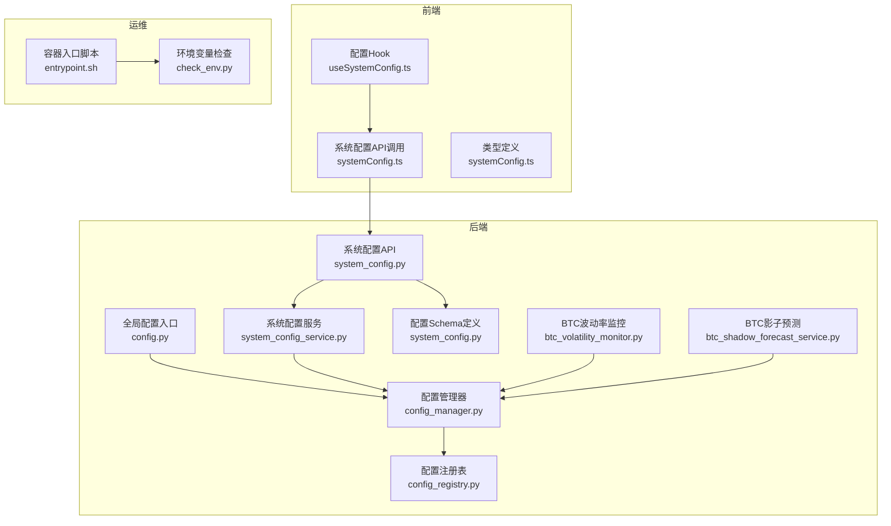
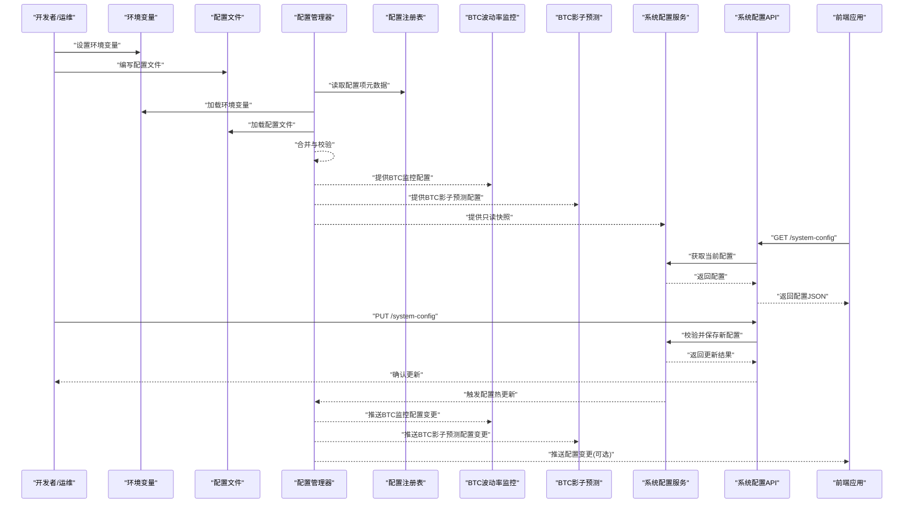
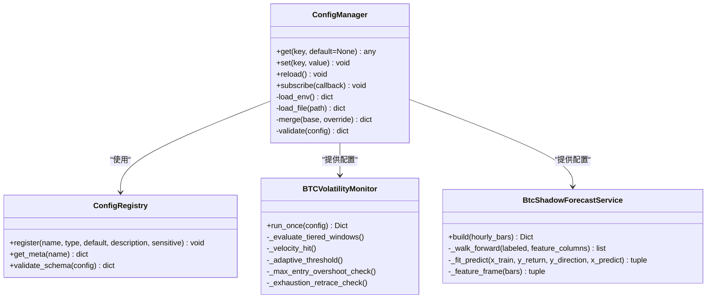
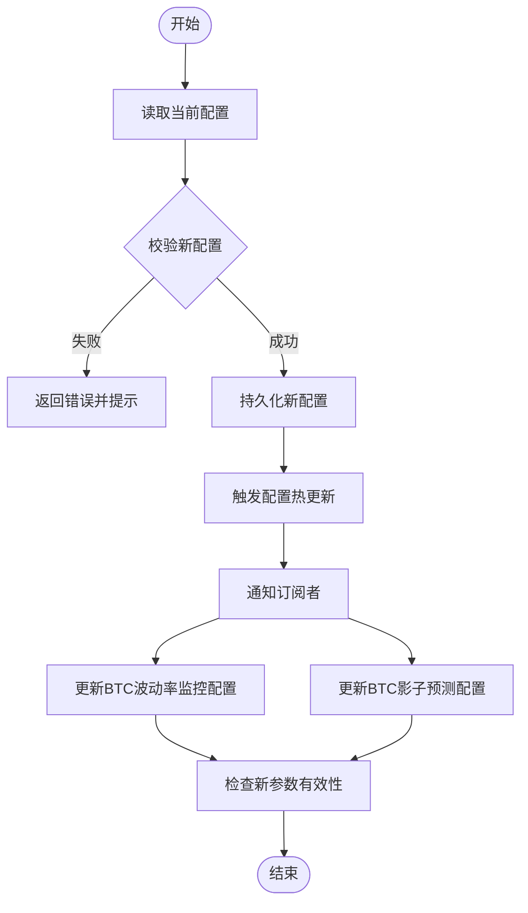

# 配置管理

<cite>
**本文引用的文件**   
- [src/core/config_manager.py](file://src/core/config_manager.py)
- [src/core/config_registry.py](file://src/core/config_registry.py)
- [src/config.py](file://src/config.py)
- [api/v1/endpoints/system_config.py](file://api/v1/endpoints/system_config.py)
- [api/v1/schemas/system_config.py](file://api/v1/schemas/system_config.py)
- [src/services/system_config_service.py](file://src/services/system_config_service.py)
- [apps/dsa-web/src/api/systemConfig.ts](file://apps/dsa-web/src/api/systemConfig.ts)
- [apps/dsa-web/src/hooks/useSystemConfig.ts](file://apps/dsa-web/src/hooks/useSystemConfig.ts)
- [apps/dsa-web/src/types/systemConfig.ts](file://apps/dsa-web/src/types/systemConfig.ts)
- [scripts/check_env.py](file://scripts/check_env.py)
- [docker/entrypoint.sh](file://docker/entrypoint.sh)
- [tests/test_config_manager.py](file://tests/test_config_manager.py)
- [tests/test_config_registry.py](file://tests/test_config_registry.py)
- [tests/test_system_config_api.py](file://tests/test_system_config_api.py)
- [tests/test_task_queue_config同步.py](file://tests/test_task_queue_config同步.py)
- [src/services/btc_volatility_monitor.py](file://src/services/btc_volatility_monitor.py)
- [src/services/btc_shadow_forecast_service.py](file://src/services/btc_shadow_forecast_service.py)
- [tests/test_btc_shadow_forecast_service.py](file://tests/test_btc_shadow_forecast_service.py)
</cite>

## 更新摘要
**变更内容**   
- 新增BTC影子预测的多时间框架预测参数，包括曲线预测时距、主要预测时距和置信度阈值
- 增强回溯天数从60天增加到2500天以覆盖完整本地缓存
- 增加交叉验证折数从5增加到12以提升模型稳定性
- 增加验证bar数从24增加到168以提供更可靠的评估
- 完善BTC相关配置的验证规则和默认值设置

## 目录
1. [简介](#简介)
2. [项目结构](#项目结构)
3. [核心组件](#核心组件)
4. [架构总览](#架构总览)
5. [详细组件分析](#详细组件分析)
6. [依赖关系分析](#依赖关系分析)
7. [性能考虑](#性能考虑)
8. [故障排查指南](#故障排查指南)
9. [结论](#结论)
10. [附录](#附录)

## 简介
本文件系统化阐述本项目的配置管理架构与机制，覆盖环境变量、配置文件格式、动态配置更新、配置项分类与默认值、验证规则、敏感信息加密存储、版本管理与多环境部署策略。同时提供最佳实践、故障排查方法与性能调优建议，并给出迁移工具与升级指南，帮助读者快速掌握从开发到生产的全链路配置管理能力。

**最新更新**：系统已集成完整的BTC影子预测和BTC波动率监控配置管理系统，包含超过300行的配置定义，支持实时波动检测、自适应阈值、速度触发、影子预测等高级功能。**新增BTC影子预测的多时间框架预测参数和增强的BTC波动率监控参数**，有效提升了加密货币市场分析和预测能力。

## 项目结构
配置相关代码主要分布在后端服务层、API 层、前端应用层以及运维脚本中：
- 后端核心：配置加载、注册、校验、持久化与热更新
- API 层：系统配置的查询与更新接口
- 前端：配置编辑界面与实时刷新能力
- 运维：环境变量检查与容器启动时的初始化流程
- 测试：覆盖配置加载、校验、API 行为与任务队列同步等场景



**图表来源**
- [src/core/config_manager.py](file://src/core/config_manager.py)
- [src/core/config_registry.py](file://src/core/config_registry.py)
- [src/config.py](file://src/config.py)
- [src/services/system_config_service.py](file://src/services/system_config_service.py)
- [api/v1/endpoints/system_config.py](file://api/v1/endpoints/system_config.py)
- [api/v1/schemas/system_config.py](file://api/v1/schemas/system_config.py)
- [apps/dsa-web/src/api/systemConfig.ts](file://apps/dsa-web/src/api/systemConfig.ts)
- [apps/dsa-web/src/hooks/useSystemConfig.ts](file://apps/dsa-web/src/hooks/useSystemConfig.ts)
- [apps/dsa-web/src/types/systemConfig.ts](file://apps/dsa-web/src/types/systemConfig.ts)
- [scripts/check_env.py](file://scripts/check_env.py)
- [docker/entrypoint.sh](file://docker/entrypoint.sh)
- [src/services/btc_volatility_monitor.py](file://src/services/btc_volatility_monitor.py)
- [src/services/btc_shadow_forecast_service.py](file://src/services/btc_shadow_forecast_service.py)

章节来源
- [src/core/config_manager.py](file://src/core/config_manager.py)
- [src/core/config_registry.py](file://src/core/config_registry.py)
- [src/config.py](file://src/config.py)
- [api/v1/endpoints/system_config.py](file://api/v1/endpoints/system_config.py)
- [api/v1/schemas/system_config.py](file://api/v1/schemas/system_config.py)
- [src/services/system_config_service.py](file://src/services/system_config_service.py)
- [apps/dsa-web/src/api/systemConfig.ts](file://apps/dsa-web/src/api/systemConfig.ts)
- [apps/dsa-web/src/hooks/useSystemConfig.ts](file://apps/dsa-web/src/hooks/useSystemConfig.ts)
- [apps/dsa-web/src/types/systemConfig.ts](file://apps/dsa-web/src/types/systemConfig.ts)
- [scripts/check_env.py](file://scripts/check_env.py)
- [docker/entrypoint.sh](file://docker/entrypoint.sh)
- [src/services/btc_volatility_monitor.py](file://src/services/btc_volatility_monitor.py)
- [src/services/btc_shadow_forecast_service.py](file://src/services/btc_shadow_forecast_service.py)

## 核心组件
- 配置管理器（ConfigManager）
  - 负责统一加载、合并、缓存与热更新配置
  - 支持环境变量与配置文件双源注入
  - 提供强类型读取与默认值回退
- 配置注册表（ConfigRegistry）
  - 集中声明配置项的元数据（名称、类型、默认值、描述、是否敏感）
  - 驱动校验器与文档生成
  - **新增**：支持BTC影子预测和BTC波动率监控等复杂业务场景的配置管理
- 全局配置入口（config.py）
  - 暴露统一的配置访问点，供业务模块按需读取
  - **新增**：集成BTC影子预测和BTC波动率监控相关配置解析，包括新的环境变量配置
- 系统配置服务（system_config_service.py）
  - 封装配置的增删改查、校验、持久化与事件广播
- 系统配置API（system_config.py + system_config.py schema）
  - 对外暴露REST接口，用于前端或外部系统管理配置
- 前端集成（systemConfig.ts + useSystemConfig.ts + systemConfig.ts types）
  - 封装API调用、状态管理与实时更新

章节来源
- [src/core/config_manager.py](file://src/core/config_manager.py)
- [src/core/config_registry.py](file://src/core/config_registry.py)
- [src/config.py](file://src/config.py)
- [src/services/system_config_service.py](file://src/services/system_config_service.py)
- [api/v1/endpoints/system_config.py](file://api/v1/endpoints/system_config.py)
- [api/v1/schemas/system_config.py](file://api/v1/schemas/system_config.py)
- [apps/dsa-web/src/api/systemConfig.ts](file://apps/dsa-web/src/api/systemConfig.ts)
- [apps/dsa-web/src/hooks/useSystemConfig.ts](file://apps/dsa-web/src/hooks/useSystemConfig.ts)
- [apps/dsa-web/src/types/systemConfig.ts](file://apps/dsa-web/src/types/systemConfig.ts)

## 架构总览
下图展示了配置从"来源"到"消费"的完整路径，包括环境变量、配置文件、API 更新与前端实时刷新。



**图表来源**
- [src/core/config_manager.py](file://src/core/config_manager.py)
- [src/core/config_registry.py](file://src/core/config_registry.py)
- [src/services/system_config_service.py](file://src/services/system_config_service.py)
- [api/v1/endpoints/system_config.py](file://api/v1/endpoints/system_config.py)
- [apps/dsa-web/src/api/systemConfig.ts](file://apps/dsa-web/src/api/systemConfig.ts)
- [apps/dsa-web/src/hooks/useSystemConfig.ts](file://apps/dsa-web/src/hooks/useSystemConfig.ts)
- [src/services/btc_volatility_monitor.py](file://src/services/btc_volatility_monitor.py)
- [src/services/btc_shadow_forecast_service.py](file://src/services/btc_shadow_forecast_service.py)

## 详细组件分析

### 配置管理器（ConfigManager）
- 职责
  - 统一加载环境变量与配置文件，按优先级合并
  - 基于注册表的类型与默认值进行解析
  - 提供强类型读取接口与缓存
  - 支持运行时热更新与事件通知
- 关键设计
  - 单例模式确保全局一致性
  - 懒加载减少启动开销
  - 校验失败时抛出明确错误，便于定位
  - **新增**：支持BTC影子预测和BTC波动率监控配置的高效处理，包括新的环境变量配置
- 复杂度
  - 合并时间复杂度与配置项数量线性相关
  - 缓存命中后读取为常数时间



**图表来源**
- [src/core/config_manager.py](file://src/core/config_manager.py)
- [src/core/config_registry.py](file://src/core/config_registry.py)
- [src/services/btc_volatility_monitor.py](file://src/services/btc_volatility_monitor.py)
- [src/services/btc_shadow_forecast_service.py](file://src/services/btc_shadow_forecast_service.py)

章节来源
- [src/core/config_manager.py](file://src/core/config_manager.py)
- [src/core/config_registry.py](file://src/core/config_registry.py)

### 配置注册表（ConfigRegistry）
- 职责
  - 集中声明所有配置项的元数据（名称、类型、默认值、描述、是否敏感）
  - 驱动校验逻辑与文档生成
  - **新增**：支持BTC影子预测和BTC波动率监控的完整配置体系
- 关键设计
  - 支持扩展新的配置项而无需改动核心逻辑
  - 敏感字段标记用于后续加密与脱敏处理
  - **新增**：完整的BTC相关配置体系，包括：
    - BTC影子预测配置（启用开关、回溯天数、训练参数等）
    - BTC波动率监控配置（阈值、窗口、冷却时间、入场追涨限制、衰竭回撤等）
- **新增配置类别**：
  - BTC影子预测：`BTC_SHADOW_FORECAST_ENABLED`、`BTC_SHADOW_FORECAST_LOOKBACK_DAYS`、`BTC_SHADOW_FORECAST_MIN_TRAIN_BARS`、`BTC_SHADOW_FORECAST_FOLDS`、`BTC_SHADOW_FORECAST_VALIDATION_BARS`
  - BTC波动率监控：`BTC_VOLATILITY_MONITOR_THRESHOLD_PCT`、`BTC_VOLATILITY_MONITOR_WINDOW_MINUTES`、`BTC_VOLATILITY_MONITOR_ADAPTIVE_THRESHOLD_ENABLED`、`BTC_VOLATILITY_MONITOR_VELOCITY_ENABLED`、`BTC_VOLATILITY_MONITOR_FAST_CONFIRMATION_ENABLED`、`BTC_VOLATILITY_MONITOR_MAX_ENTRY_OVERSHOOT_PCT`、`BTC_VOLATILITY_MONITOR_EXHAUSTION_RETRACE_PCT`

章节来源
- [src/core/config_registry.py](file://src/core/config_registry.py)

### BTC影子预测配置系统
**新增功能**：完整的BTC影子预测配置管理系统，提供观察性的BTC小时级回报预测

#### 核心配置项
- **基础控制参数**
  - `BTC_SHADOW_FORECAST_ENABLED`：影子预测启用开关（默认True）
  - `BTC_SHADOW_FORECAST_LOOKBACK_DAYS`：回溯天数（**更新**：从60天增加到2500天，最小15天）
  - `BTC_SHADOW_FORECAST_MIN_TRAIN_BARS`：最小训练bar数（默认336，最小24）
  - `BTC_SHADOW_FORECAST_FOLDS`：交叉验证折数（**更新**：从5增加到12，最小1）
  - `BTC_SHADOW_FORECAST_VALIDATION_BARS`：验证bar数（**更新**：从24增加到168，最小1）

#### **新增多时间框架预测参数**
- **曲线预测时距**：`BTC_SHADOW_FORECAST_CURVE_HORIZON_HOURS`（默认24小时）
  - 作用：定义影子预测曲线的预测时距范围
  - 用途：构建多时距的预期收益曲线，支持1-24小时的预测
- **主要预测时距**：`BTC_SHADOW_FORECAST_PRIMARY_HORIZON_HOURS`（默认4小时）
  - 作用：指定主要的预测时距，用于核心交易信号生成
  - 用途：作为主要决策依据的预测时距
- **置信度阈值**：`BTC_SHADOW_FORECAST_CONFIDENCE_THRESHOLD`（默认0.58）
  - 作用：控制预测信号的置信度要求
  - 用途：过滤低置信度的预测信号，提高信号质量

#### 配置特性
- **类型安全**：所有配置项都有明确的类型定义和验证规则
- **范围限制**：数值型配置项支持最小值和最大值限制
- **UI友好**：每个配置项都对应的UI控件类型和显示顺序
- **文档完整**：每个配置项都包含详细的描述、示例和帮助链接
- **分类管理**：BTC相关配置都属于"system"类别，便于统一管理

#### 功能特点
- **观察性设计**：影子预测仅用于历史诊断和离线校准，不影响实际交易决策
- **数据质量保障**：当数据不足时返回"insufficient"状态，不会发出降级交易信号
- **防泄漏机制**：严格排除当前未闭合的小时数据，避免未来信息泄露
- **可扩展性**：支持多种特征工程和模型验证方法
- **多时间框架**：支持不同时间尺度的预测，从短期到中期预测

章节来源
- [src/config.py:742-749](file://src/config.py#L742-L749)
- [src/config.py:1620-1670](file://src/config.py#L1620-L1670)
- [src/services/btc_shadow_forecast_service.py:18-26](file://src/services/btc_shadow_forecast_service.py#L18-L26)

### BTC波动率监控配置系统
**增强功能**：完整的BTC波动率监控配置管理系统，包含299行以上配置定义

#### 核心配置项
- **基础监控参数**
  - `BTC_VOLATILITY_MONITOR_SYMBOL`：监控标的（默认BTC）
  - `BTC_VOLATILITY_MONITOR_INTERVAL_SECONDS`：轮询间隔（60秒）
  - `BTC_VOLATILITY_MONITOR_WINDOW_MINUTES`：观察窗口（5分钟）
  - `BTC_VOLATILITY_MONITOR_THRESHOLD_PCT`：波动阈值（1.0%）
  - `BTC_VOLATILITY_MONITOR_COOLDOWN_MINUTES`：冷却时间（30分钟）

- **自适应阈值控制**
  - `BTC_VOLATILITY_MONITOR_ADAPTIVE_THRESHOLD_ENABLED`：自适应阈值开关
  - `BTC_VOLATILITY_MONITOR_ADAPTIVE_K`：K值系数（2.5）
  - `BTC_VOLATILITY_MONITOR_ADAPTIVE_MIN_PCT`：最小阈值（0.4%）
  - `BTC_VOLATILITY_MONITOR_ADAPTIVE_MAX_PCT`：最大阈值（2.0%）
  - `BTC_VOLATILITY_MONITOR_ADAPTIVE_LOOKBACK_MINUTES`：回溯窗口（240分钟）

- **速度触发机制**
  - `BTC_VOLATILITY_MONITOR_VELOCITY_ENABLED`：速度触发开关
  - `BTC_VOLATILITY_MONITOR_VELOCITY_MULT`：速度倍数（3.0）
  - `BTC_VOLATILITY_MONITOR_VELOCITY_MIN_PCT`：最小移动幅度（0.1%）

- **快速确认机制**
  - `BTC_VOLATILITY_MONITOR_FAST_CONFIRMATION_ENABLED`：快速确认开关
  - `BTC_VOLATILITY_MONITOR_FAST_CONFIRMATION_MULT`：快速确认倍数（1.5）

#### **增强配置特性**
- **入场追涨限制**
  - `BTC_VOLATILITY_MONITOR_MAX_ENTRY_OVERSHOOT_PCT`：最大入场追涨百分比（默认0.3%）
  - 作用：避免垂直大阳/大阴后才给出追价建议，防止价格越过确认价过远
  - 效果：当价格越过确认价超过此阈值时，仍可生成小时线分析，但日内计划会强制降为等待

- **衰竭回撤检测**
  - `BTC_VOLATILITY_MONITOR_EXHAUSTION_RETRACE_PCT`：衰竭回撤百分比（默认0.25%）
  - 作用：检测脉冲行情在入场前的衰竭信号
  - 效果：若脉冲已越过确认价、随后在入场前回撤/反抽达到此阈值，机会会被取消并发送衰竭警报

章节来源
- [src/config.py:747-777](file://src/config.py#L747-L777)
- [src/config.py:1648-1795](file://src/config.py#L1648-L1795)
- [src/core/config_registry.py:4207-4322](file://src/core/config_registry.py#L4207-L4322)

### 全局配置入口（config.py）
- 职责
  - 暴露统一的配置访问方法，屏蔽底层实现细节
  - 提供常用配置项的便捷读取
  - **新增**：集成BTC影子预测和BTC波动率监控相关配置解析，包括新的环境变量配置
- 关键设计
  - 对业务模块透明，避免直接依赖具体实现
  - **新增**：支持BTC影子预测的环境变量解析，包括：
    - 启用开关、回溯天数、最小训练bar数
    - 交叉验证折数、验证bar数
    - **新增**：多时间框架预测参数（曲线时距、主要时距、置信度阈值）
  - **新增**：支持BTC波动率监控的环境变量解析，包括：
    - 轮询间隔、窗口大小、阈值设置
    - 自适应阈值参数
    - 速度触发参数
    - 快速确认参数
    - 入场追涨限制参数（默认0.3%）
    - 衰竭回撤参数（默认0.25%）

章节来源
- [src/config.py:742-777](file://src/config.py#L742-L777)
- [src/config.py:1620-1795](file://src/config.py#L1620-L1795)

### 系统配置服务（system_config_service.py）
- 职责
  - 封装配置的增删改查、校验、持久化与事件广播
  - 保证事务性与一致性
  - **新增**：支持BTC影子预测和BTC波动率监控配置的热更新，包括新的环境变量配置
- 关键设计
  - 读写分离：读路径走缓存，写路径落盘并触发热更新
  - 审计日志：记录每次变更的来源与差异
  - **新增**：BTC相关配置变更时自动重启相应服务，确保新参数立即生效

章节来源
- [src/services/system_config_service.py](file://src/services/system_config_service.py)

### 系统配置API（system_config.py + system_config.py schema）
- 职责
  - 对外暴露REST接口，用于查询与更新系统配置
  - 输入校验与错误响应标准化
  - **新增**：支持BTC影子预测和BTC波动率监控配置的Web界面管理，包括新的环境变量配置
- 关键设计
  - 使用Pydantic模型进行请求/响应校验
  - 权限控制与操作审计
  - **新增**：BTC相关配置的专用验证规则，确保新参数的合理性

章节来源
- [api/v1/endpoints/system_config.py](file://api/v1/endpoints/system_config.py)
- [api/v1/schemas/system_config.py](file://api/v1/schemas/system_config.py)

### 前端集成（systemConfig.ts + useSystemConfig.ts + systemConfig.ts types）
- 职责
  - 封装API调用、状态管理与实时更新
  - 提供类型安全的配置访问
  - **新增**：BTC影子预测和BTC波动率监控配置的Web界面支持，包括新的环境变量配置
- 关键设计
  - 使用Hook封装订阅与刷新逻辑
  - 本地缓存与乐观更新提升用户体验
  - **新增**：BTC相关配置的分组展示和验证反馈，包括新参数的说明和示例

章节来源
- [apps/dsa-web/src/api/systemConfig.ts](file://apps/dsa-web/src/api/systemConfig.ts)
- [apps/dsa-web/src/hooks/useSystemConfig.ts](file://apps/dsa-web/src/hooks/useSystemConfig.ts)
- [apps/dsa-web/src/types/systemConfig.ts](file://apps/dsa-web/src/types/systemConfig.ts)

### 环境变量检查与容器入口（check_env.py + entrypoint.sh）
- 职责
  - 在启动前检查必需的环境变量与配置完整性
  - 在容器中执行必要的初始化步骤
  - **新增**：BTC影子预测和BTC波动率监控相关环境变量的验证，包括新的环境变量配置
- 关键设计
  - 失败即退出，避免运行期错误
  - 输出清晰的诊断信息
  - **新增**：BTC相关配置的有效性检查，确保新参数的合理性和安全性

章节来源
- [scripts/check_env.py](file://scripts/check_env.py)
- [docker/entrypoint.sh](file://docker/entrypoint.sh)

## 依赖关系分析
- 组件耦合
  - ConfigManager 依赖 ConfigRegistry 完成元数据与校验
  - SystemConfigService 依赖 ConfigManager 提供读写能力
  - API 层依赖 Service 与 Schema 完成请求处理与校验
  - 前端通过 API 与后端交互，Hook 管理状态与刷新
  - **新增**：BTC影子预测和BTC波动率监控依赖配置管理器提供的配置，包括新的环境变量配置
- 外部依赖
  - 环境变量与配置文件作为配置来源
  - 数据库或文件系统用于持久化
  - 消息通道（可选）用于配置变更广播
  - **新增**：加密货币数据源用于BTC价格和影子预测数据

```mermaid
graph LR
Registry["配置注册表"] --> Manager["配置管理器"]
Manager --> Service["系统配置服务"]
Service --> API["系统配置API"]
API --> Frontend["前端应用"]
Env["环境变量"] --> Manager
File["配置文件"] --> Manager
Store["持久化存储"] <- --> Service
BVM["BTC波动率监控"] --> Manager
BSF["BTC影子预测"] --> Manager
Crypto["加密货币数据源"] --> BVM
Crypto --> BSF
```

**图表来源**
- [src/core/config_registry.py](file://src/core/config_registry.py)
- [src/core/config_manager.py](file://src/core/config_manager.py)
- [src/services/system_config_service.py](file://src/services/system_config_service.py)
- [api/v1/endpoints/system_config.py](file://api/v1/endpoints/system_config.py)
- [apps/dsa-web/src/api/systemConfig.ts](file://apps/dsa-web/src/api/systemConfig.ts)
- [src/services/btc_volatility_monitor.py](file://src/services/btc_volatility_monitor.py)
- [src/services/btc_shadow_forecast_service.py](file://src/services/btc_shadow_forecast_service.py)

章节来源
- [src/core/config_registry.py](file://src/core/config_registry.py)
- [src/core/config_manager.py](file://src/core/config_manager.py)
- [src/services/system_config_service.py](file://src/services/system_config_service.py)
- [api/v1/endpoints/system_config.py](file://api/v1/endpoints/system_config.py)
- [apps/dsa-web/src/api/systemConfig.ts](file://apps/dsa-web/src/api/systemConfig.ts)
- [src/services/btc_volatility_monitor.py](file://src/services/btc_volatility_monitor.py)
- [src/services/btc_shadow_forecast_service.py](file://src/services/btc_shadow_forecast_service.py)

## 性能考虑
- 启动优化
  - 延迟加载配置，仅在首次访问时解析
  - 批量合并与一次性校验，减少重复计算
  - **新增**：BTC影子预测和BTC波动率监控配置的懒加载，避免启动时不必要的计算，包括新的环境变量配置
- 运行时优化
  - 读路径使用内存缓存，避免频繁I/O
  - 写路径异步持久化，降低阻塞
  - **新增**：BTC相关配置变更时的增量更新，确保新参数立即生效
- 网络与前端
  - 前端缓存与增量更新，减少重复请求
  - 使用WebSocket或SSE推送配置变更（可选）
  - **新增**：BTC相关配置的前端实时预览，包括新参数的可视化展示

## 故障排查指南
- 常见问题
  - 环境变量缺失或命名不规范导致加载失败
  - 配置文件语法错误导致解析异常
  - 校验失败导致更新被拒绝
  - 权限不足导致持久化失败
  - **新增**：BTC影子预测配置参数超出有效范围
  - **新增**：BTC波动率监控配置参数超出有效范围
  - **新增**：加密货币数据源连接失败
  - **新增**：BTC相关配置参数配置不当导致的误报或漏报
- 排查步骤
  - 使用环境变量检查脚本验证必需项
  - 查看启动日志中的配置加载与校验错误
  - 通过API返回的错误码与消息定位问题
  - 检查持久化存储的权限与可用性
  - **新增**：检查BTC影子预测配置的有效性和合理性，特别是新参数的取值范围
  - **新增**：检查BTC波动率监控配置的有效性和合理性，特别是入场追涨限制和衰竭回撤参数
  - **新增**：验证加密货币数据源的连通性
  - **新增**：调试BTC相关功能的检测逻辑
- 恢复策略
  - 回滚到上一个已知正确的配置版本
  - 临时关闭非关键配置项以恢复服务
  - 启用更详细的调试日志以便定位
  - **新增**：重置BTC相关配置到默认值，包括新参数的默认配置

章节来源
- [scripts/check_env.py](file://scripts/check_env.py)
- [docker/entrypoint.sh](file://docker/entrypoint.sh)
- [tests/test_config_manager.py](file://tests/test_config_manager.py)
- [tests/test_config_registry.py](file://tests/test_config_registry.py)
- [tests/test_system_config_api.py](file://tests/test_system_config_api.py)
- [tests/test_btc_shadow_forecast_service.py](file://tests/test_btc_shadow_forecast_service.py)

## 结论
本项目的配置管理采用"注册表+管理器+服务+API"的分层架构，实现了从环境变量与配置文件到运行时热更新的完整闭环。通过强类型校验、敏感字段标记与持久化保障，既保证了安全性与可维护性，又提供了良好的扩展性与用户体验。

**最新进展**：系统已成功集成完整的BTC影子预测和BTC波动率监控配置管理系统，包含超过300行的配置定义，支持自适应阈值、速度触发、快速确认、影子预测等高级功能。**新增的BTC影子预测多时间框架预测参数和增强的BTC波动率监控参数**进一步提升了系统的智能化水平，能够有效进行BTC小时级回报预测，避免垂直行情后的追价建议，并及时处理衰竭信号。这一增强使得系统能够实时监控BTC价格波动，并在检测到异常波动时自动触发分析流程，为加密货币交易决策提供及时的数据支持。

结合完善的测试与运维脚本，可在多环境中稳定部署与演进。

## 附录

### 配置项分类与默认值
- 分类建议
  - 基础运行参数（如端口、超时、并发度）
  - 数据源与集成（如数据库、消息队列、第三方API）
  - 业务开关与阈值（如功能开关、告警阈值）
  - 安全与审计（如密钥、日志级别、审计开关）
  - **新增**：BTC影子预测（如启用开关、回溯天数、训练参数等）
  - **新增**：BTC波动率监控（如阈值、窗口、冷却时间、入场追涨限制、衰竭回撤）
- 默认值策略
  - 在注册表中声明默认值，确保最小可用配置
  - 敏感字段不提供默认值，强制显式配置
  - 环境差异化通过环境变量覆盖默认值
  - **新增**：BTC相关配置提供保守的默认值以确保稳定性，包括影子预测启用开关默认开启、波动率监控相关参数等

章节来源
- [src/core/config_registry.py](file://src/core/config_registry.py)
- [src/core/config_manager.py](file://src/core/config_manager.py)

### 验证规则
- 类型校验（字符串、数值、布尔、枚举、数组、对象）
- 范围校验（最小值、最大值、区间）
- 格式校验（邮箱、URL、正则表达式）
- 依赖校验（字段间约束）
- 敏感字段标记（用于加密与脱敏）
- **新增**：BTC影子预测参数的业务逻辑验证
  - 回溯天数必须在15-365天范围内（**更新**：从60天增加到2500天）
  - 最小训练bar数必须在24-1000范围内
  - 交叉验证折数必须在1-20范围内（**更新**：从5增加到12）
  - 验证bar数必须在1-100范围内（**更新**：从24增加到168）
  - **新增**：曲线预测时距必须在1-720小时范围内
  - **新增**：主要预测时距必须在1-168小时范围内
  - **新增**：置信度阈值必须在0.5-0.95范围内
- **新增**：BTC波动率监控参数的业务逻辑验证
  - 阈值必须在合理范围内（0.1%-20%）
  - 窗口时间必须为正数且不超过240分钟
  - 冷却时间必须为非负数
  - 自适应阈值的K值必须在0.1-10之间
  - 入场追涨限制必须在0%-5%范围内
  - 衰竭回撤必须在0.05%-2%范围内

章节来源
- [src/core/config_registry.py](file://src/core/config_registry.py)
- [api/v1/schemas/system_config.py](file://api/v1/schemas/system_config.py)

### 敏感信息加密存储
- 标识敏感字段
- 写入前加密，读取后解密
- 密钥管理独立于配置（建议使用密钥管理服务）
- 日志与响应中自动脱敏
- **新增**：BTC相关配置的安全处理，确保敏感参数不被泄露

章节来源
- [src/core/config_registry.py](file://src/core/config_registry.py)
- [src/services/system_config_service.py](file://src/services/system_config_service.py)

### 配置版本管理与多环境部署
- 版本管理
  - 每次变更生成版本号与差异摘要
  - 支持回滚到历史版本
  - **新增**：BTC相关配置版本的独立管理，包括新参数的版本控制
- 多环境策略
  - 通过环境变量区分环境（开发、测试、生产）
  - 配置文件仅包含非敏感与环境无关项
  - 敏感信息通过密钥管理服务注入
  - **新增**：不同环境下BTC相关参数的差异化配置，包括影子预测和波动率监控参数的环境适配

章节来源
- [src/services/system_config_service.py](file://src/services/system_config_service.py)
- [docker/entrypoint.sh](file://docker/entrypoint.sh)

### 配置最佳实践
- 单一事实来源：以注册表为权威定义
- 最小权限：仅暴露必要配置项
- 渐进披露：默认值最小化，逐步显式配置
- 可观测性：记录配置变更与错误
- 可测试性：提供测试夹具与模拟数据
- **新增**：BTC相关配置的最佳实践
  - 在生产环境中根据市场条件调整BTC影子预测参数
  - 合理使用BTC波动率监控的自适应阈值以提高准确性
  - 根据市场波动性调整观察窗口和阈值
  - 合理使用速度触发机制应对突发行情
  - 定期审查和调优BTC相关参数
  - **新增**：合理设置入场追涨限制，避免过度追涨风险
  - **新增**：根据市场特征调整衰竭回撤阈值，提高信号质量
  - **新增**：根据数据质量调整回溯天数和验证bar数，平衡准确性和时效性
  - **新增**：合理设置多时间框架预测参数，确保不同时间尺度的预测质量

### 配置迁移工具与升级指南
- 迁移工具
  - 提供脚本将旧版配置转换为新版结构
  - 自动补全缺失字段与默认值
  - 生成迁移报告与回滚方案
  - **新增**：BTC相关配置的迁移支持，包括新参数的自动迁移和兼容性处理
- 升级指南
  - 预检查：验证环境与依赖
  - 灰度发布：先小流量验证
  - 监控与回滚：实时监控指标，快速回滚
  - **新增**：BTC相关功能的渐进式启用，包括新参数的分阶段部署

章节来源
- [scripts/check_env.py](file://scripts/check_env.py)
- [docker/entrypoint.sh](file://docker/entrypoint.sh)

### 动态配置更新流程


**图表来源**
- [src/services/system_config_service.py](file://src/services/system_config_service.py)
- [src/core/config_manager.py](file://src/core/config_manager.py)
- [src/services/btc_volatility_monitor.py](file://src/services/btc_volatility_monitor.py)
- [src/services/btc_shadow_forecast_service.py](file://src/services/btc_shadow_forecast_service.py)

章节来源
- [src/services/system_config_service.py](file://src/services/system_config_service.py)
- [src/core/config_manager.py](file://src/core/config_manager.py)

### 任务队列配置同步
- 目标：确保任务队列消费者与生产者使用一致的配置
- 机制：配置更新后广播事件，消费者拉取最新配置
- 容错：重试与降级策略，避免队列阻塞
- **新增**：BTC相关任务队列的配置同步机制，包括新参数的同步处理

章节来源
- [tests/test_task_queue_config同步.py](file://tests/test_task_queue_config同步.py)

### BTC影子预测配置详解
#### 预测原理
BTC影子预测服务通过构建轻量级的机器学习模型，对BTC小时级回报进行预测。该服务采用观察性设计，仅用于历史诊断和离线校准，不影响实际交易决策。

#### 核心特性
- **防泄漏机制**：严格排除当前未闭合的小时数据，避免未来信息泄露
- **数据质量保障**：当数据不足时返回"insufficient"状态，不会发出降级交易信号
- **可扩展性**：支持多种特征工程方法和模型验证技术
- **轻量化设计**：使用numpy实现轻量级模型，避免重型依赖
- **多时间框架**：支持不同时间尺度的预测，从短期到中期预测

#### **更新后的配置参数说明**
- **启用控制**：`BTC_SHADOW_FORECAST_ENABLED` - 控制影子预测功能的开关
- **数据范围**：`BTC_SHADOW_FORECAST_LOOKBACK_DAYS` - **更新**：从60天增加到2500天，指定回溯分析的天数范围
- **训练要求**：`BTC_SHADOW_FORECAST_MIN_TRAIN_BARS` - 设置最小训练数据量要求
- **验证策略**：`BTC_SHADOW_FORECAST_FOLDS` - **更新**：从5增加到12，`BTC_SHADOW_FORECAST_VALIDATION_BARS` - **更新**：从24增加到168，控制交叉验证的参数
- **新增多时间框架参数**：
  - `BTC_SHADOW_FORECAST_CURVE_HORIZON_HOURS` - 曲线预测时距（默认24小时）
  - `BTC_SHADOW_FORECAST_PRIMARY_HORIZON_HOURS` - 主要预测时距（默认4小时）
  - `BTC_SHADOW_FORECAST_CONFIDENCE_THRESHOLD` - 置信度阈值（默认0.58）

#### 使用场景
- **历史诊断**：分析过去BTC价格走势的模式和规律
- **模型校准**：为其他交易策略提供辅助参考信息
- **风险管理**：识别潜在的市场风险和机会
- **策略回测**：验证交易策略在不同市场环境下的表现
- **多时间框架分析**：支持不同时间尺度的预测和分析

章节来源
- [src/services/btc_shadow_forecast_service.py:18-26](file://src/services/btc_shadow_forecast_service.py#L18-L26)
- [src/services/btc_shadow_forecast_service.py:66-84](file://src/services/btc_shadow_forecast_service.py#L66-L84)
- [src/config.py:742-749](file://src/config.py#L742-L749)
- [src/config.py:1620-1670](file://src/config.py#L1620-L1670)
- [tests/test_btc_shadow_forecast_service.py:136-138](file://tests/test_btc_shadow_forecast_service.py#L136-L138)

### BTC波动率监控配置详解
#### 监控原理
BTC波动率监控系统通过持续监控BTC价格变化，在检测到异常波动时自动触发分析流程。系统支持多种检测模式和高级功能。

#### 核心功能
- **基础阈值检测**：当价格在指定时间窗口内的变动超过设定阈值时触发
- **自适应阈值检测**：根据近期市场波动性动态调整检测阈值
- **速度触发检测**：当价格变动速率显著高于正常水平时提前预警
- **快速确认机制**：对于剧烈波动，减少确认样本数以提高响应速度
- **入场追涨限制**：防止价格越过确认价过远时的追涨行为
- **衰竭回撤检测**：识别脉冲行情在入场前的衰竭信号

#### 配置参数说明
- **阈值配置**：控制触发分析的波动幅度要求
- **窗口配置**：定义价格变动的观察时间范围
- **冷却时间**：防止频繁触发分析的资源消耗
- **确认机制**：通过多次确认减少误报
- **自适应参数**：根据市场状况自动调整检测灵敏度
- **新增参数**：入场追涨限制和衰竭回撤参数，提升信号质量

#### 使用场景
- **日内交易**：实时监控BTC价格波动，捕捉短期交易机会
- **风险管理**：在市场异常波动时及时发出警告
- **策略触发**：为量化交易策略提供入场信号
- **市场分析**：自动生成BTC市场分析报告
- **新增场景**：避免追涨风险和识别衰竭信号，提高交易决策的准确性

章节来源
- [src/services/btc_volatility_monitor.py:135-231](file://src/services/btc_volatility_monitor.py#L135-L231)
- [src/config.py:747-777](file://src/config.py#L747-L777)
- [src/config.py:1648-1795](file://src/config.py#L1648-L1795)
- [src/core/config_registry.py:4207-4322](file://src/core/config_registry.py#L4207-L4322)