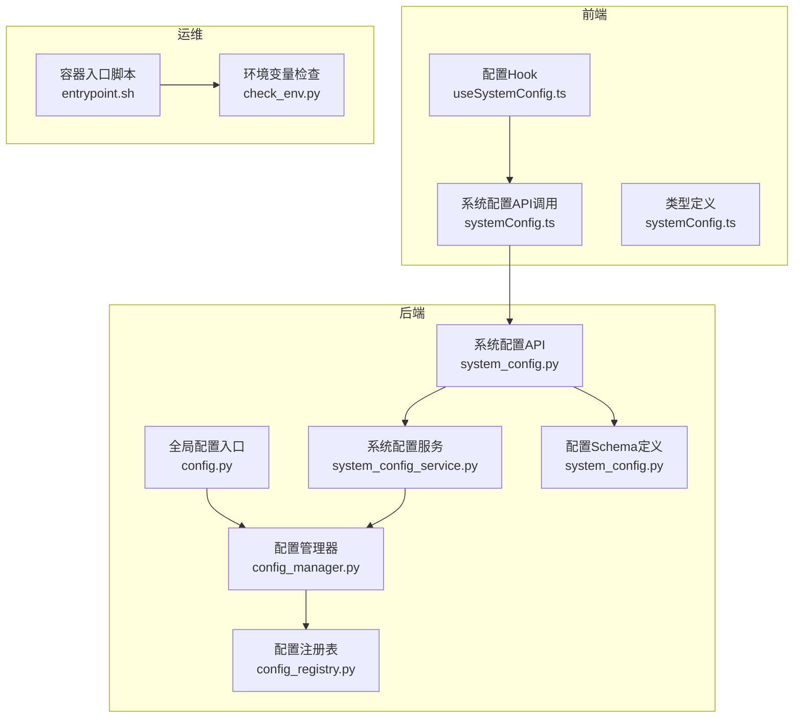
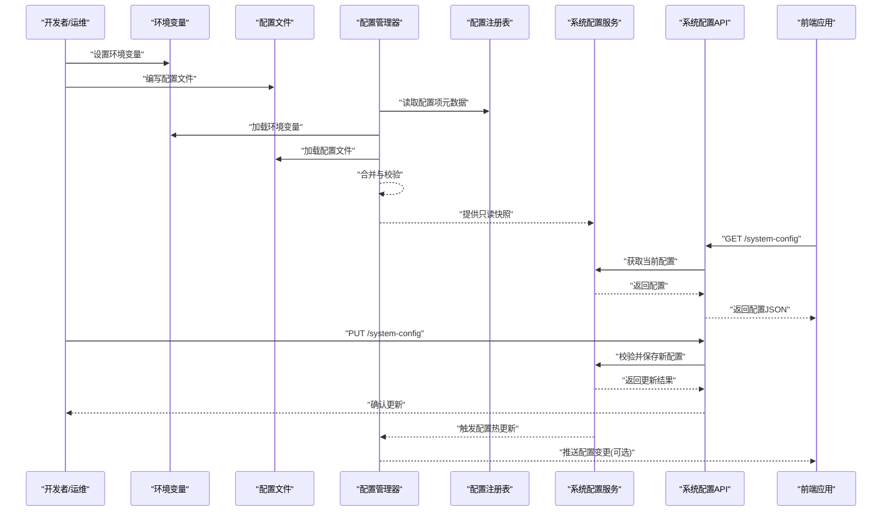
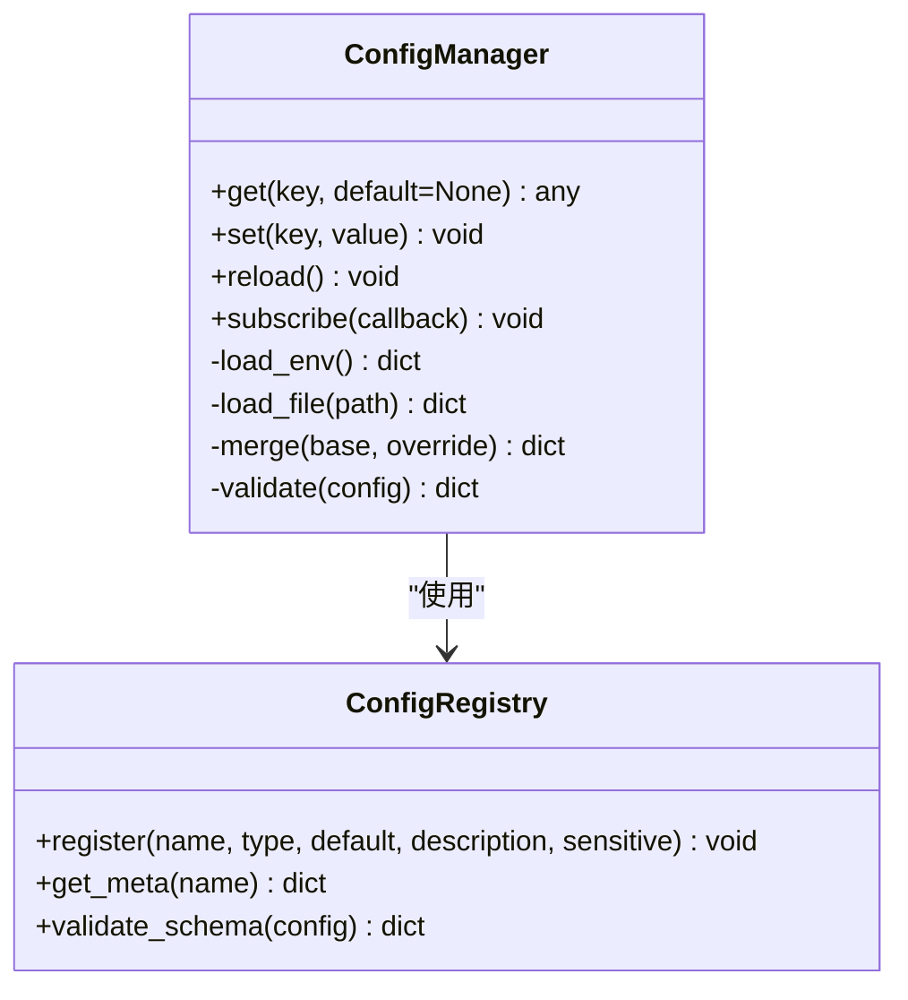
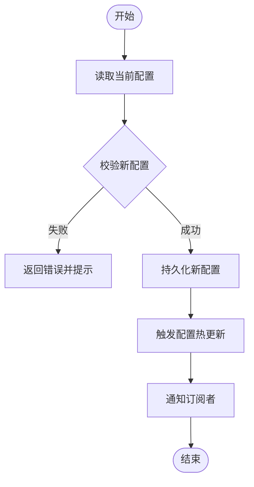

# 配置管理

<cite>
**本文引用的文件**   
- [src/core/config_manager.py](file://src/core/config_manager.py)
- [src/core/config_registry.py](file://src/core/config_registry.py)
- [src/config.py](file://src/config.py)
- [api/v1/endpoints/system_config.py](file://api/v1/endpoints/system_config.py)
- [api/v1/schemas/system_config.py](file://api/v1/schemas/system_config.py)
- [src/services/system_config_service.py](file://src/services/system_config_service.py)
- [apps/dsa-web/src/api/systemConfig.ts](file://apps/dsa-web/src/api/systemConfig.ts)
- [apps/dsa-web/src/hooks/useSystemConfig.ts](file://apps/dsa-web/src/hooks/useSystemConfig.ts)
- [apps/dsa-web/src/types/systemConfig.ts](file://apps/dsa-web/src/types/systemConfig.ts)
- [scripts/check_env.py](file://scripts/check_env.py)
- [docker/entrypoint.sh](file://docker/entrypoint.sh)
- [tests/test_config_manager.py](file://tests/test_config_manager.py)
- [tests/test_config_registry.py](file://tests/test_config_registry.py)
- [tests/test_system_config_api.py](file://tests/test_system_config_api.py)
- [tests/test_task_queue_config_sync.py](file://tests/test_task_queue_config同步.py)
</cite>

## 目录
1. [简介](#简介)
2. [项目结构](#项目结构)
3. [核心组件](#核心组件)
4. [架构总览](#架构总览)
5. [详细组件分析](#详细组件分析)
6. [依赖关系分析](#依赖关系分析)
7. [性能考虑](#性能考虑)
8. [故障排查指南](#故障排查指南)
9. [结论](#结论)
10. [附录](#附录)

## 简介
本文件系统化阐述本项目的配置管理架构与机制，覆盖环境变量、配置文件格式、动态配置更新、配置项分类与默认值、验证规则、敏感信息加密存储、版本管理与多环境部署策略。同时提供最佳实践、故障排查方法与性能调优建议，并给出迁移工具与升级指南，帮助读者快速掌握从开发到生产的全链路配置管理能力。

## 项目结构
配置相关代码主要分布在后端服务层、API 层、前端应用层以及运维脚本中：
- 后端核心：配置加载、注册、校验、持久化与热更新
- API 层：系统配置的查询与更新接口
- 前端：配置编辑界面与实时刷新能力
- 运维：环境变量检查与容器启动时的初始化流程
- 测试：覆盖配置加载、校验、API 行为与任务队列同步等场景



图表来源
- [src/core/config_manager.py](file://src/core/config_manager.py)
- [src/core/config_registry.py](file://src/core/config_registry.py)
- [src/config.py](file://src/config.py)
- [src/services/system_config_service.py](file://src/services/system_config_service.py)
- [api/v1/endpoints/system_config.py](file://api/v1/endpoints/system_config.py)
- [api/v1/schemas/system_config.py](file://api/v1/schemas/system_config.py)
- [apps/dsa-web/src/api/systemConfig.ts](file://apps/dsa-web/src/api/systemConfig.ts)
- [apps/dsa-web/src/hooks/useSystemConfig.ts](file://apps/dsa-web/src/hooks/useSystemConfig.ts)
- [apps/dsa-web/src/types/systemConfig.ts](file://apps/dsa-web/src/types/systemConfig.ts)
- [scripts/check_env.py](file://scripts/check_env.py)
- [docker/entrypoint.sh](file://docker/entrypoint.sh)

章节来源
- [src/core/config_manager.py](file://src/core/config_manager.py)
- [src/core/config_registry.py](file://src/core/config_registry.py)
- [src/config.py](file://src/config.py)
- [api/v1/endpoints/system_config.py](file://api/v1/endpoints/system_config.py)
- [api/v1/schemas/system_config.py](file://api/v1/schemas/system_config.py)
- [src/services/system_config_service.py](file://src/services/system_config_service.py)
- [apps/dsa-web/src/api/systemConfig.ts](file://apps/dsa-web/src/api/systemConfig.ts)
- [apps/dsa-web/src/hooks/useSystemConfig.ts](file://apps/dsa-web/src/hooks/useSystemConfig.ts)
- [apps/dsa-web/src/types/systemConfig.ts](file://apps/dsa-web/src/types/systemConfig.ts)
- [scripts/check_env.py](file://scripts/check_env.py)
- [docker/entrypoint.sh](file://docker/entrypoint.sh)

## 核心组件
- 配置管理器（ConfigManager）
  - 负责统一加载、合并、缓存与热更新配置
  - 支持环境变量与配置文件双源注入
  - 提供强类型读取与默认值回退
- 配置注册表（ConfigRegistry）
  - 集中声明配置项的元数据（名称、类型、默认值、描述、是否敏感）
  - 驱动校验器与文档生成
- 全局配置入口（config.py）
  - 暴露统一的配置访问点，供业务模块按需读取
- 系统配置服务（system_config_service.py）
  - 封装配置的增删改查、校验、持久化与事件广播
- 系统配置API（system_config.py + system_config.py schema）
  - 对外暴露REST接口，用于前端或外部系统管理配置
- 前端集成（systemConfig.ts + useSystemConfig.ts + systemConfig.ts types）
  - 封装API调用、状态管理与实时更新

章节来源
- [src/core/config_manager.py](file://src/core/config_manager.py)
- [src/core/config_registry.py](file://src/core/config_registry.py)
- [src/config.py](file://src/config.py)
- [src/services/system_config_service.py](file://src/services/system_config_service.py)
- [api/v1/endpoints/system_config.py](file://api/v1/endpoints/system_config.py)
- [api/v1/schemas/system_config.py](file://api/v1/schemas/system_config.py)
- [apps/dsa-web/src/api/systemConfig.ts](file://apps/dsa-web/src/api/systemConfig.ts)
- [apps/dsa-web/src/hooks/useSystemConfig.ts](file://apps/dsa-web/src/hooks/useSystemConfig.ts)
- [apps/dsa-web/src/types/systemConfig.ts](file://apps/dsa-web/src/types/systemConfig.ts)

## 架构总览
下图展示了配置从“来源”到“消费”的完整路径，包括环境变量、配置文件、API 更新与前端实时刷新。



图表来源
- [src/core/config_manager.py](file://src/core/config_manager.py)
- [src/core/config_registry.py](file://src/core/config_registry.py)
- [src/services/system_config_service.py](file://src/services/system_config_service.py)
- [api/v1/endpoints/system_config.py](file://api/v1/endpoints/system_config.py)
- [apps/dsa-web/src/api/systemConfig.ts](file://apps/dsa-web/src/api/systemConfig.ts)
- [apps/dsa-web/src/hooks/useSystemConfig.ts](file://apps/dsa-web/src/hooks/useSystemConfig.ts)

## 详细组件分析

### 配置管理器（ConfigManager）
- 职责
  - 统一加载环境变量与配置文件，按优先级合并
  - 基于注册表的类型与默认值进行解析
  - 提供强类型读取接口与缓存
  - 支持运行时热更新与事件通知
- 关键设计
  - 单例模式确保全局一致性
  - 懒加载减少启动开销
  - 校验失败时抛出明确错误，便于定位
- 复杂度
  - 合并时间复杂度与配置项数量线性相关
  - 缓存命中后读取为常数时间



图表来源
- [src/core/config_manager.py](file://src/core/config_manager.py)
- [src/core/config_registry.py](file://src/core/config_registry.py)

章节来源
- [src/core/config_manager.py](file://src/core/config_manager.py)
- [src/core/config_registry.py](file://src/core/config_registry.py)

### 配置注册表（ConfigRegistry）
- 职责
  - 集中声明所有配置项的元数据（名称、类型、默认值、描述、是否敏感）
  - 驱动校验逻辑与文档生成
- 关键设计
  - 支持扩展新的配置项而无需改动核心逻辑
  - 敏感字段标记用于后续加密与脱敏处理

章节来源
- [src/core/config_registry.py](file://src/core/config_registry.py)

### 全局配置入口（config.py）
- 职责
  - 暴露统一的配置访问方法，屏蔽底层实现细节
  - 提供常用配置项的便捷读取
- 关键设计
  - 对业务模块透明，避免直接依赖具体实现

章节来源
- [src/config.py](file://src/config.py)

### 系统配置服务（system_config_service.py）
- 职责
  - 封装配置的增删改查、校验、持久化与事件广播
  - 保证事务性与一致性
- 关键设计
  - 读写分离：读路径走缓存，写路径落盘并触发热更新
  - 审计日志：记录每次变更的来源与差异

章节来源
- [src/services/system_config_service.py](file://src/services/system_config_service.py)

### 系统配置API（system_config.py + system_config.py schema）
- 职责
  - 对外暴露REST接口，用于查询与更新系统配置
  - 输入校验与错误响应标准化
- 关键设计
  - 使用Pydantic模型进行请求/响应校验
  - 权限控制与操作审计

章节来源
- [api/v1/endpoints/system_config.py](file://api/v1/endpoints/system_config.py)
- [api/v1/schemas/system_config.py](file://api/v1/schemas/system_config.py)

### 前端集成（systemConfig.ts + useSystemConfig.ts + systemConfig.ts types）
- 职责
  - 封装API调用、状态管理与实时更新
  - 提供类型安全的配置访问
- 关键设计
  - 使用Hook封装订阅与刷新逻辑
  - 本地缓存与乐观更新提升用户体验

章节来源
- [apps/dsa-web/src/api/systemConfig.ts](file://apps/dsa-web/src/api/systemConfig.ts)
- [apps/dsa-web/src/hooks/useSystemConfig.ts](file://apps/dsa-web/src/hooks/useSystemConfig.ts)
- [apps/dsa-web/src/types/systemConfig.ts](file://apps/dsa-web/src/types/systemConfig.ts)

### 环境变量检查与容器入口（check_env.py + entrypoint.sh）
- 职责
  - 在启动前检查必需的环境变量与配置完整性
  - 在容器中执行必要的初始化步骤
- 关键设计
  - 失败即退出，避免运行期错误
  - 输出清晰的诊断信息

章节来源
- [scripts/check_env.py](file://scripts/check_env.py)
- [docker/entrypoint.sh](file://docker/entrypoint.sh)

## 依赖关系分析
- 组件耦合
  - ConfigManager 依赖 ConfigRegistry 完成元数据与校验
  - SystemConfigService 依赖 ConfigManager 提供读写能力
  - API 层依赖 Service 与 Schema 完成请求处理与校验
  - 前端通过 API 与后端交互，Hook 管理状态与刷新
- 外部依赖
  - 环境变量与配置文件作为配置来源
  - 数据库或文件系统用于持久化
  - 消息通道（可选）用于配置变更广播

```mermaid
graph LR
Registry["配置注册表"] --> Manager["配置管理器"]
Manager --> Service["系统配置服务"]
Service --> API["系统配置API"]
API --> Frontend["前端应用"]
Env["环境变量"] --> Manager
File["配置文件"] --> Manager
Store["持久化存储"] <- --> Service
```

图表来源
- [src/core/config_registry.py](file://src/core/config_registry.py)
- [src/core/config_manager.py](file://src/core/config_manager.py)
- [src/services/system_config_service.py](file://src/services/system_config_service.py)
- [api/v1/endpoints/system_config.py](file://api/v1/endpoints/system_config.py)
- [apps/dsa-web/src/api/systemConfig.ts](file://apps/dsa-web/src/api/systemConfig.ts)

章节来源
- [src/core/config_registry.py](file://src/core/config_registry.py)
- [src/core/config_manager.py](file://src/core/config_manager.py)
- [src/services/system_config_service.py](file://src/services/system_config_service.py)
- [api/v1/endpoints/system_config.py](file://api/v1/endpoints/system_config.py)
- [apps/dsa-web/src/api/systemConfig.ts](file://apps/dsa-web/src/api/systemConfig.ts)

## 性能考虑
- 启动优化
  - 延迟加载配置，仅在首次访问时解析
  - 批量合并与一次性校验，减少重复计算
- 运行时优化
  - 读路径使用内存缓存，避免频繁I/O
  - 写路径异步持久化，降低阻塞
- 网络与前端
  - 前端缓存与增量更新，减少重复请求
  - 使用WebSocket或SSE推送配置变更（可选）

[本节为通用指导，不直接分析具体文件]

## 故障排查指南
- 常见问题
  - 环境变量缺失或命名不规范导致加载失败
  - 配置文件语法错误导致解析异常
  - 校验失败导致更新被拒绝
  - 权限不足导致持久化失败
- 排查步骤
  - 使用环境变量检查脚本验证必需项
  - 查看启动日志中的配置加载与校验错误
  - 通过API返回的错误码与消息定位问题
  - 检查持久化存储的权限与可用性
- 恢复策略
  - 回滚到上一个已知正确的配置版本
  - 临时关闭非关键配置项以恢复服务
  - 启用更详细的调试日志以便定位

章节来源
- [scripts/check_env.py](file://scripts/check_env.py)
- [docker/entrypoint.sh](file://docker/entrypoint.sh)
- [tests/test_config_manager.py](file://tests/test_config_manager.py)
- [tests/test_config_registry.py](file://tests/test_config_registry.py)
- [tests/test_system_config_api.py](file://tests/test_system_config_api.py)

## 结论
本项目的配置管理采用“注册表+管理器+服务+API”的分层架构，实现了从环境变量与配置文件到运行时热更新的完整闭环。通过强类型校验、敏感字段标记与持久化保障，既保证了安全性与可维护性，又提供了良好的扩展性与用户体验。结合完善的测试与运维脚本，可在多环境中稳定部署与演进。

[本节为总结性内容，不直接分析具体文件]

## 附录

### 配置项分类与默认值
- 分类建议
  - 基础运行参数（如端口、超时、并发度）
  - 数据源与集成（如数据库、消息队列、第三方API）
  - 业务开关与阈值（如功能开关、告警阈值）
  - 安全与审计（如密钥、日志级别、审计开关）
- 默认值策略
  - 在注册表中声明默认值，确保最小可用配置
  - 敏感字段不提供默认值，强制显式配置
  - 环境差异化通过环境变量覆盖默认值

章节来源
- [src/core/config_registry.py](file://src/core/config_registry.py)
- [src/core/config_manager.py](file://src/core/config_manager.py)

### 验证规则
- 类型校验（字符串、数值、布尔、枚举、数组、对象）
- 范围校验（最小值、最大值、区间）
- 格式校验（邮箱、URL、正则表达式）
- 依赖校验（字段间约束）
- 敏感字段标记（用于加密与脱敏）

章节来源
- [src/core/config_registry.py](file://src/core/config_registry.py)
- [api/v1/schemas/system_config.py](file://api/v1/schemas/system_config.py)

### 敏感信息加密存储
- 标识敏感字段
- 写入前加密，读取后解密
- 密钥管理独立于配置（建议使用密钥管理服务）
- 日志与响应中自动脱敏

章节来源
- [src/core/config_registry.py](file://src/core/config_registry.py)
- [src/services/system_config_service.py](file://src/services/system_config_service.py)

### 配置版本管理与多环境部署
- 版本管理
  - 每次变更生成版本号与差异摘要
  - 支持回滚到历史版本
- 多环境策略
  - 通过环境变量区分环境（开发、测试、生产）
  - 配置文件仅包含非敏感与环境无关项
  - 敏感信息通过密钥管理服务注入

章节来源
- [src/services/system_config_service.py](file://src/services/system_config_service.py)
- [docker/entrypoint.sh](file://docker/entrypoint.sh)

### 配置最佳实践
- 单一事实来源：以注册表为权威定义
- 最小权限：仅暴露必要配置项
- 渐进披露：默认值最小化，逐步显式配置
- 可观测性：记录配置变更与错误
- 可测试性：提供测试夹具与模拟数据

[本节为通用指导，不直接分析具体文件]

### 配置迁移工具与升级指南
- 迁移工具
  - 提供脚本将旧版配置转换为新版结构
  - 自动补全缺失字段与默认值
  - 生成迁移报告与回滚方案
- 升级指南
  - 预检查：验证环境与依赖
  - 灰度发布：先小流量验证
  - 监控与回滚：实时监控指标，快速回滚

章节来源
- [scripts/check_env.py](file://scripts/check_env.py)
- [docker/entrypoint.sh](file://docker/entrypoint.sh)

### 动态配置更新流程


图表来源
- [src/services/system_config_service.py](file://src/services/system_config_service.py)
- [src/core/config_manager.py](file://src/core/config_manager.py)

章节来源
- [src/services/system_config_service.py](file://src/services/system_config_service.py)
- [src/core/config_manager.py](file://src/core/config_manager.py)

### 任务队列配置同步
- 目标：确保任务队列消费者与生产者使用一致的配置
- 机制：配置更新后广播事件，消费者拉取最新配置
- 容错：重试与降级策略，避免队列阻塞

章节来源
- [tests/test_task_queue_config同步.py](file://tests/test_task_queue_config同步.py)