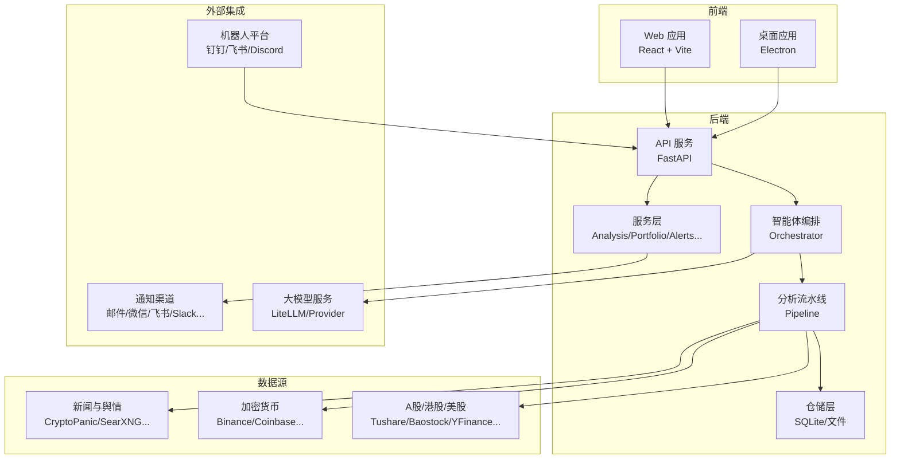
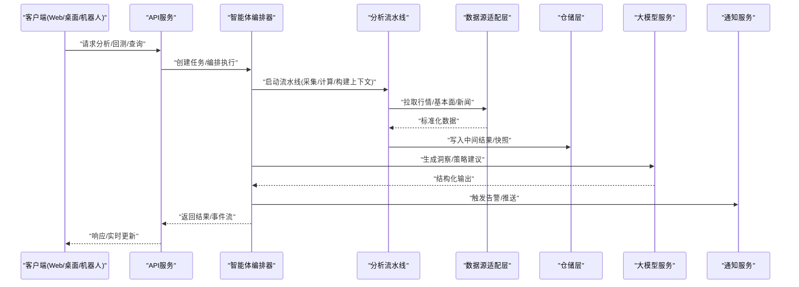
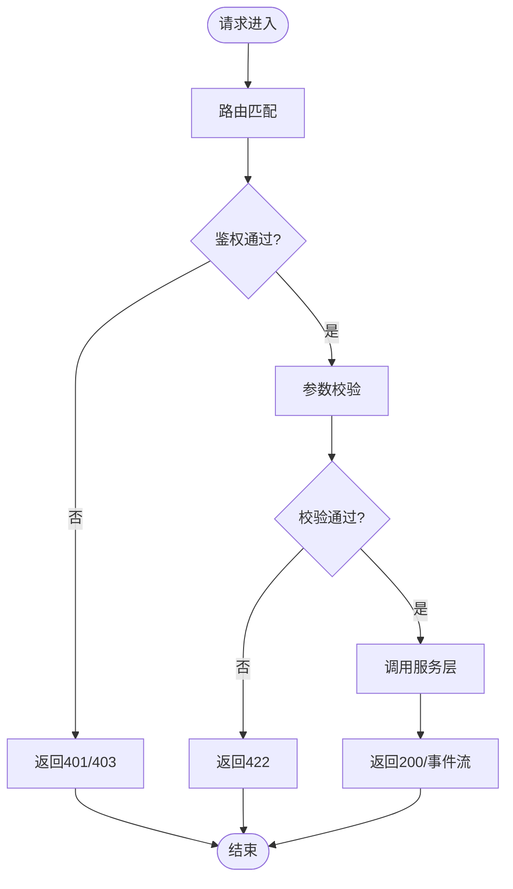
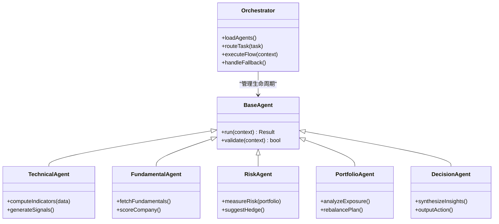
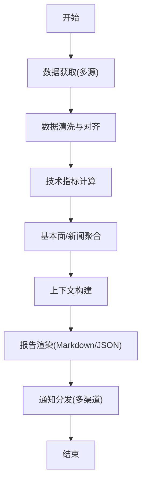
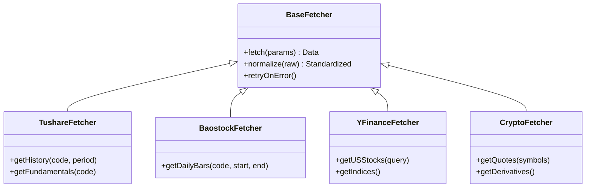
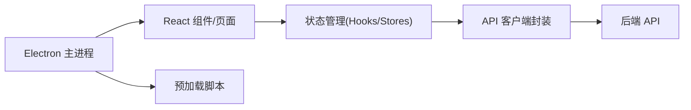
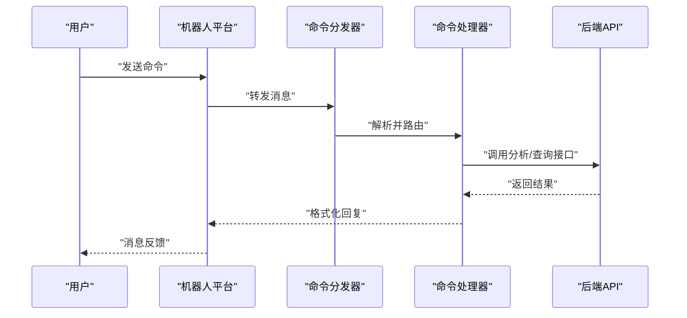
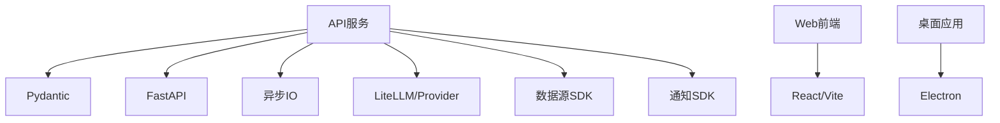

# 项目概览

<cite>
**本文引用的文件**   
- [README.md](file://README.md)
- [main.py](file://main.py)
- [server.py](file://server.py)
- [webui.py](file://webui.py)
- [pyproject.toml](file://pyproject.toml)
- [requirements.txt](file://requirements.txt)
- [api/app.py](file://api/app.py)
- [api/v1/router.py](file://api/v1/router.py)
- [src/agent/orchestrator.py](file://src/agent/orchestrator.py)
- [src/core/pipeline.py](file://src/core/pipeline.py)
- [data_provider/base.py](file://data_provider/base.py)
- [docker/Dockerfile](file://docker/Dockerfile)
- [docker/docker-compose.yml](file://docker/docker-compose.yml)
- [apps/dsa-web/package.json](file://apps/dsa-web/package.json)
- [apps/dsa-desktop/package.json](file://apps/dsa-desktop/package.json)
</cite>

## 目录
1. [简介](#简介)
2. [项目结构](#项目结构)
3. [核心组件](#核心组件)
4. [架构总览](#架构总览)
5. [详细组件分析](#详细组件分析)
6. [依赖关系分析](#依赖关系分析)
7. [性能考量](#性能考量)
8. [故障排查指南](#故障排查指南)
9. [结论](#结论)
10. [附录](#附录)

## 简介
本项目是一个“每日股票分析系统”，面向个人与机构投资者，提供自动化市场分析、智能决策支持与投资组合管理的一体化能力。系统通过多数据源接入（A股、港股、美股、加密货币等），结合AI智能体与策略引擎，实现实时行情解析、历史回测、信号生成与通知推送，并以Web与桌面客户端呈现结果，支持多渠道机器人交互。

核心价值主张：
- 自动化市场分析：定时采集、清洗、指标计算与上下文构建，输出结构化报告与可视化图表。
- 智能决策支持：基于多智能体协作（技术面、基本面、风险、组合、决策）生成可解释的决策信号。
- 投资组合管理：持仓导入、风险度量、预警与调仓建议，联动通知渠道。
- 多端体验：Web前端、Electron桌面应用、多平台机器人（钉钉、飞书、Discord等）。

[本节不直接分析具体文件]

## 项目结构
仓库采用前后端分离与模块化设计：
- api：后端API服务（FastAPI），按v1版本划分路由与Schema。
- src：核心业务逻辑（Agent编排、Pipeline流水线、服务层、存储、工具等）。
- data_provider：多数据源适配器（A股、港股、美股、加密资产等）。
- apps：前端Web与桌面客户端。
- bot：多平台机器人命令与调度。
- strategies：策略配置（YAML）。
- docker：容器化部署。
- scripts：构建与运维脚本。
- tests：单元测试与集成测试。

**图示来源** 
- [api/app.py](file://api/app.py)
- [api/v1/router.py](file://api/v1/router.py)
- [src/agent/orchestrator.py](file://src/agent/orchestrator.py)
- [src/core/pipeline.py](file://src/core/pipeline.py)
- [data_provider/base.py](file://data_provider/base.py)

**章节来源**
- [README.md](file://README.md)
- [pyproject.toml](file://pyproject.toml)
- [requirements.txt](file://requirements.txt)

## 核心组件
- API网关与路由：统一REST接口，鉴权、错误处理、限流与SSE事件流。
- 智能体编排器：协调技术面、基本面、风险、组合与决策智能体，驱动任务执行与上下文组装。
- 分析流水线：数据采集→清洗→指标计算→上下文构建→报告渲染→通知分发。
- 数据源适配层：抽象统一的Fetch接口，支持多市场与多提供商切换。
- 服务层：分析、回测、组合、告警、历史、系统配置等业务服务。
- 存储层：结构化数据持久化（SQLite/文件）、索引与缓存。
- 前端与桌面：React Web界面与Electron桌面应用，提供交互式分析与设置。
- 机器人：跨平台命令分发，支持聊天式分析与批量任务。

**章节来源**
- [api/app.py](file://api/app.py)
- [api/v1/router.py](file://api/v1/router.py)
- [src/agent/orchestrator.py](file://src/agent/orchestrator.py)
- [src/core/pipeline.py](file://src/core/pipeline.py)
- [data_provider/base.py](file://data_provider/base.py)

## 架构总览
系统采用分层+插件化架构：
- 表现层：Web/桌面/机器人，统一通过API访问。
- 服务层：领域服务聚合调用，封装业务规则。
- 编排层：智能体与流水线协同，驱动端到端分析流程。
- 数据层：多数据源适配器与仓储，屏蔽差异。
- 基础设施：配置管理、日志、监控、消息通道与大模型适配。

**图示来源** 
- [api/app.py](file://api/app.py)
- [src/agent/orchestrator.py](file://src/agent/orchestrator.py)
- [src/core/pipeline.py](file://src/core/pipeline.py)
- [data_provider/base.py](file://data_provider/base.py)

## 详细组件分析

### API与服务入口
- FastAPI应用初始化、路由挂载、中间件（鉴权、错误处理）、健康检查与SSE事件流。
- v1路由按功能域拆分（stocks、analysis、backtest、portfolio、alerts、decision_signals、history、usage、system_config等）。
- 依赖注入与统一错误响应格式。

**图示来源** 
- [api/app.py](file://api/app.py)
- [api/v1/router.py](file://api/v1/router.py)

**章节来源**
- [api/app.py](file://api/app.py)
- [api/v1/router.py](file://api/v1/router.py)

### 智能体编排器
- 负责加载与注册不同智能体（技术面、基本面、风险、组合、决策），根据任务类型选择路径。
- 维护会话上下文与记忆，协调工具调用与LLM交互。
- 支持失败回退与重试机制，保证鲁棒性。

**图示来源** 
- [src/agent/orchestrator.py](file://src/agent/orchestrator.py)

**章节来源**
- [src/agent/orchestrator.py](file://src/agent/orchestrator.py)

### 分析流水线
- 定义阶段：数据获取→清洗→指标计算→上下文构建→报告渲染→通知分发。
- 支持并行与串行阶段，具备断点续跑与快照恢复。
- 与仓储层交互，持久化中间状态，便于回溯与调试。

**图示来源** 
- [src/core/pipeline.py](file://src/core/pipeline.py)

**章节来源**
- [src/core/pipeline.py](file://src/core/pipeline.py)

### 数据源适配层
- 统一抽象Fetch接口，屏蔽各提供商差异（认证、限频、字段映射）。
- 支持A股、港股、美股指数与个股、加密货币及其衍生品、宏观数据。
- 提供基础适配器与具体实现，便于扩展新数据源。

**图示来源** 
- [data_provider/base.py](file://data_provider/base.py)

**章节来源**
- [data_provider/base.py](file://data_provider/base.py)

### 前端与桌面应用
- Web应用：React + Vite + TypeScript，模块化组件与页面，状态管理与API封装。
- 桌面应用：Electron打包，本地运行与自动更新，内置加载页与预加载脚本。
- 提供设置面板、图表展示、报告查看、任务流可视化与国际化。

**图示来源** 
- [apps/dsa-web/package.json](file://apps/dsa-web/package.json)
- [apps/dsa-desktop/package.json](file://apps/dsa-desktop/package.json)

**章节来源**
- [apps/dsa-web/package.json](file://apps/dsa-web/package.json)
- [apps/dsa-desktop/package.json](file://apps/dsa-desktop/package.json)

### 机器人平台
- 命令分发器统一解析用户指令，路由到对应处理器（分析、研究、历史、策略等）。
- 支持多平台（钉钉、飞书、Discord），提供流式与回调模式。
- 与后端API或本地服务集成，实现聊天式分析体验。

**图示来源** 
- [bot/dispatcher.py](file://bot/dispatcher.py)
- [bot/handler.py](file://bot/handler.py)

**章节来源**
- [bot/dispatcher.py](file://bot/dispatcher.py)
- [bot/handler.py](file://bot/handler.py)

## 依赖关系分析
- 后端依赖：FastAPI、Pydantic、SQLAlchemy/SQLite、异步IO、消息队列（可选）、通知SDK。
- AI依赖：LiteLLM或Provider SDK，支持多模型与计费追踪。
- 数据源依赖：Tushare、Baostock、YFinance、加密交易所SDK等。
- 前端依赖：React、TypeScript、Vite、Tailwind、图表库。
- 桌面依赖：Electron、打包工具。

**图示来源** 
- [pyproject.toml](file://pyproject.toml)
- [requirements.txt](file://requirements.txt)
- [apps/dsa-web/package.json](file://apps/dsa-web/package.json)
- [apps/dsa-desktop/package.json](file://apps/dsa-desktop/package.json)

**章节来源**
- [pyproject.toml](file://pyproject.toml)
- [requirements.txt](file://requirements.txt)

## 性能考量
- 并发与异步：API与流水线使用异步IO提升吞吐；数据抓取与指标计算可并行。
- 缓存与快照：中间结果持久化，支持断点续跑与快速重放。
- 资源隔离：智能体与流水线阶段解耦，避免单点阻塞。
- 限流与降级：数据源限频保护，关键链路失败回退与重试。
- 前端优化：按需加载、虚拟列表、增量更新与SSE实时推送。

[本节为通用指导，不直接分析具体文件]

## 故障排查指南
- 健康检查：通过健康端点确认服务状态与依赖可用性。
- 日志与追踪：启用结构化日志与Provider调用追踪，定位LLM与数据源问题。
- 错误处理：统一错误码与消息，前端友好提示；记录堆栈与上下文。
- 数据一致性：校验字段映射与时间对齐，检查缺失与异常值。
- 通知与机器人：验证渠道配置与网络连通性，测试消息模板。

**章节来源**
- [api/app.py](file://api/app.py)
- [src/agent/provider_trace.py](file://src/agent/provider_trace.py)

## 结论
本系统以“数据→智能→决策→执行”为主线，将多源数据、AI智能体与策略引擎深度融合，提供从分析到决策的全链路能力。通过模块化与插件化设计，易于扩展新数据源、智能体与通知渠道，满足不同投资场景需求。配合Web与桌面客户端及多平台机器人，形成完整的投研与交易辅助生态。

[本节为总结性内容，不直接分析具体文件]

## 附录

### 技术栈介绍
- 后端：Python、FastAPI、Pydantic、异步IO、SQLite/文件存储、LiteLLM。
- 前端：React、TypeScript、Vite、Tailwind、图表库。
- 桌面：Electron、打包与更新。
- 数据源：Tushare、Baostock、YFinance、加密交易所SDK。
- 通知：邮件、微信、飞书、Slack、Telegram等。

**章节来源**
- [pyproject.toml](file://pyproject.toml)
- [requirements.txt](file://requirements.txt)
- [apps/dsa-web/package.json](file://apps/dsa-web/package.json)
- [apps/dsa-desktop/package.json](file://apps/dsa-desktop/package.json)

### 系统要求
- Python版本与环境依赖（见requirements/pyproject）。
- Node.js与npm/yarn用于前端构建。
- Docker与docker-compose用于容器化部署。
- 环境变量与密钥管理（数据源API Key、LLM Provider、通知渠道）。

**章节来源**
- [requirements.txt](file://requirements.txt)
- [pyproject.toml](file://pyproject.toml)
- [docker/Dockerfile](file://docker/Dockerfile)
- [docker/docker-compose.yml](file://docker/docker-compose.yml)

### 部署概述
- 本地开发：安装依赖，配置环境变量，启动后端与前端。
- 容器化：使用Docker镜像与Compose编排，一键拉起服务。
- 生产部署：反向代理、负载均衡、数据库持久化、日志收集与监控。

**章节来源**
- [docker/Dockerfile](file://docker/Dockerfile)
- [docker/docker-compose.yml](file://docker/docker-compose.yml)